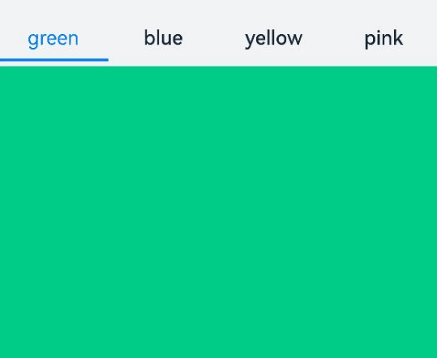
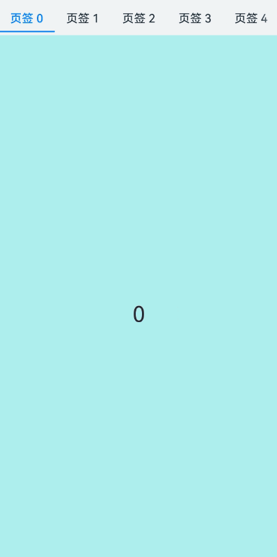
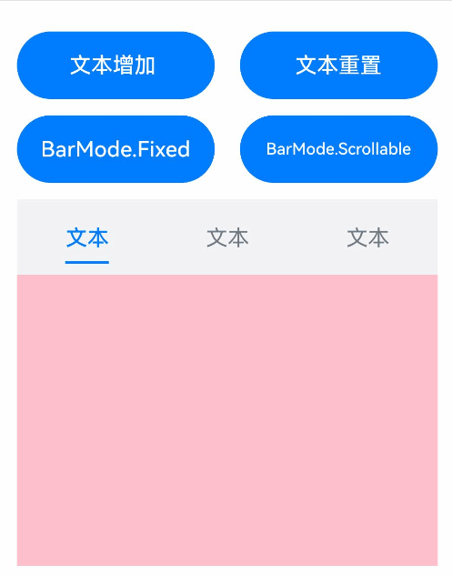

# Tabs

<!--Del-->
> **Note:**
>
> Currently in the beta phase.
<!--DelEnd-->

A container component for switching content views through tabs, where each tab corresponds to a content view.

## Import Module

```cangjie
import kit.ArkUI.*
```

## Child Components

Custom components are not supported as child components. Only [TabContent](./cj-navigation-switching-tabcontent.md) child components are allowed, along with rendering control types [if/else](../../arkui-cj/rendering_control/cj-rendering-control-ifelse.md) and [ForEach](cj-state-rendering-foreach.md). Note that if/else and ForEach can only contain TabContent and not custom components.

> **Note:**
>
> - When the visibility property of a Tabs child component is set to None or Hidden, the corresponding child component will not be displayed but will still occupy space within the viewport.

## Creating the Component

### init(?BarPosition, ?TabsController, ?Int32, () -> Unit)

```cangjie
public init(
    barPosition!: ?BarPosition = None,
    controller!: ?TabsController = None,
    index!: ?Int32 = None,
    child!: () -> Unit = {=>}
)
```

**Function:** Creates a Tabs container.

**System Capability:** SystemCapability.ArkUI.ArkUI.Full

**Since:** 22

**Parameters:**

| Parameter | Type | Required | Default | Description |
|:---|:---|:---|:---|:---|
| barPosition | ?[BarPosition](./cj-common-types.md#enum-barposition) | No | None | **Named parameter.** Sets the position of the Tabs bar.<br> Initial value: BarPosition.Start |
| controller | ?[TabsController](#class-tabscontroller) | No | None | **Named parameter.** Sets the Tabs controller.<br> Initial value: TabsController() |
| index | ?Int32 | No | None | **Named parameter.** Sets the index of the currently displayed tab.<br> Initial value: 0 <br> **Note:**<br> Values less than 0 will default to the initial value. Valid range: [0, number of TabContent child nodes - 1]. Directly modifying the index to switch tabs will not trigger the transition animation. Using TabController's changeIndex will enable the transition animation by default, which can be disabled by setting animationDuration to 0. |
| child | () -> Unit | No | {=>} | **Named parameter.** Declares the child components within the container. |

## Common Attributes/Events

Common Attributes: All supported.

Common Events: All supported.

## Component Attributes

### func animationDuration(?Float32)

```cangjie
public func animationDuration(value: ?Float32): This
```

**Function:** Sets the animation duration for Tabs.

**System Capability:** SystemCapability.ArkUI.ArkUI.Full

**Since:** 22

**Parameters:**

| Parameter | Type | Required | Default | Description |
|:---|:---|:---|:---|:---|
| value | ?Float32 | Yes | - | Animation duration in milliseconds. Initial value: -1.0. |

### func barHeight(?Length)

```cangjie
public func barHeight(value: ?Length): This
```

**Function:** Sets the height of the Tabs bar.

**System Capability:** SystemCapability.ArkUI.ArkUI.Full

**Since:** 22

**Parameters:**

| Parameter | Type | Required | Default | Description |
|:---|:---|:---|:---|:---|
| value | ?[Length](./cj-common-types.md#interface-length) | Yes | - | Height of the Tabs bar. When the bar is horizontal, this parameter represents its height; when vertical, it represents its width. |

### func barMode(?BarMode)

```cangjie
public func barMode(value: ?BarMode): This
```

**Function:** Sets the layout mode of the Tabs bar.

**System Capability:** SystemCapability.ArkUI.ArkUI.Full

**Since:** 22

**Parameters:**

| Parameter | Type | Required | Default | Description |
|:---|:---|:---|:---|:---|
| value | ?[BarMode](./cj-common-types.md#enum-barmode) | Yes | - | Layout mode of the Tabs bar. Initial value: BarMode.Fixed. |

### func barWidth(?Length)

```cangjie
public func barWidth(value: ?Length): This
```

**Function:** Sets the width of the Tabs bar.

**System Capability:** SystemCapability.ArkUI.ArkUI.Full

**Since:** 22

**Parameters:**

| Parameter | Type | Required | Default | Description |
|:---|:---|:---|:---|:---|
| value | ?[Length](./cj-common-types.md#interface-length) | Yes | - | Width of the Tabs bar. When the bar is horizontal, this parameter represents its width; when vertical, it represents its height. |

### func scrollable(?Bool)

```cangjie
public func scrollable(value: ?Bool): This
```

**Function:** Sets whether the Tabs are scrollable.

**System Capability:** SystemCapability.ArkUI.ArkUI.Full

**Since:** 22

**Parameters:**

| Parameter | Type | Required | Default | Description |
|:---|:---|:---|:---|:---|
| value | ?Bool | Yes | - | Whether scrolling is enabled. Initial value: true. |

### func vertical(?Bool)

```cangjie
public func vertical(value: ?Bool): This
```

**Function:** Sets the orientation of the Tabs bar.

**System Capability:** SystemCapability.ArkUI.ArkUI.Full

**Since:** 22

**Parameters:**

| Parameter | Type | Required | Default | Description |
|:---|:---|:---|:---|:---|
| value | ?Bool | Yes | - | Whether the Tabs bar is vertically oriented. Initial value: false. |

## Component Events

### func onChange(?Callback\<Int32, Unit>)

```cangjie
public func onChange(event: ?Callback<Int32, Unit>): This
```

**Function:** Triggered when switching tabs.

**System Capability:** SystemCapability.ArkUI.ArkUI.Full

**Since:** 22

**Parameters:**

| Parameter | Type | Required | Default | Description |
|:---|:---|:---|:---|:---|
| event | ?[Callback](./cj-common-types.md#type-callbackt-v)\<Int32, Unit> | Yes | - | Callback function triggered when the tab index changes. Initial value: { _ => }. |

## Basic Type Definitions

### class TabsController

```cangjie
public class TabsController {
    public init()
}
```

**Function:** Tabs controller.

**System Capability:** SystemCapability.ArkUI.ArkUI.Full

**Since:** 22

#### init()

```cangjie
public init()
```

**Function:** Constructs a Tabs controller.

**System Capability:** SystemCapability.ArkUI.ArkUI.Full

**Since:** 22

#### func changeIndex(?Int32)

```cangjie
public func changeIndex(value: ?Int32): Unit
```

**Function:** Switches to the tab at the specified index.

**System Capability:** SystemCapability.ArkUI.ArkUI.Full

**Since:** 22

**Parameters:**

| Parameter | Type | Required | Default | Description |
|:---|:---|:---|:---|:---|
| value | ?Int32 | Yes | - | Index of the tab to switch to. Initial value: 0. |

## Example Code

### Example 1 (Custom Tab Switching Synchronization)

This example demonstrates custom synchronization between tabBar and TabContent during switching using onChange.

<!-- run -->

```cangjie
package ohos_app_cangjie_entry

import kit.ArkUI.*
import std.collection.*
import ohos.arkui.state_macro_manage.*

@Entry
@Component
class EntryView {
    @State var fontColor: UInt32 = 0x182431
    @State var selectedFontColor: UInt32 = 0x007DFF
    @State var currentIndex: Int32 = 0
    @State var selectedIndex: Int32 = 0
    var controller: TabsController = TabsController()

    func getFontColor(index: Int32): UInt32 {
        if (this.selectedIndex == index) {
            return this.selectedFontColor
        }
        return this.fontColor
    }

    func getFontWeight(index: Int32): FontWeight {
        if (this.selectedIndex == index) {
            return FontWeight.W400
        }
        return FontWeight.W500
    }

    func getOpacity(index: Int32): Float64 {
        if (this.selectedIndex == index) {
            return Float64(1)
        }
        return Float64(0)
    }

    @Builder
    func tabBuilder(index: Int32, name: String) {
        Column() {
            Text(name)
            .fontColor(this.getFontColor(index))
            .fontSize(16)
            .fontWeight(this.getFontWeight(index))
            .lineHeight(22)
            .margin(top: 17, bottom: 7)
            Divider()
            .strokeWidth(2)
            .color(0x007DFF)
            .opacity(this.getOpacity(index))
        }.width(100.percent)
    }

    func build() {
        Column() {
            Tabs(barPosition: BarPosition.Start, controller: this.controller, index: this.currentIndex) {
                TabContent() {
                    Column().width(100.percent).height(100.percent).backgroundColor(0x00CB87)
                }.tabBar({=>bind(this.tabBuilder, this)(0, "green")})

                TabContent() {
                    Column().width(100.percent).height(100.percent).backgroundColor(0x007DFF)
                }.tabBar({=>bind(this.tabBuilder, this)(1,"blue")})

                TabContent() {
                    Column().width(100.percent).height(100.percent).backgroundColor(0xFFBF00)
                }.tabBar({=>bind(this.tabBuilder, this)(2,"yellow")})

                TabContent() {
                    Column().width(100.percent).height(100.percent).backgroundColor(0xE67C92)
                }.tabBar({=>bind(this.tabBuilder, this)(3, "pink")})
              }
            .vertical(false)
            .barMode(BarMode.Fixed)
            .barWidth(360)
            .barHeight(56)
            .animationDuration(400.0)
            .onChange({index: Int32 =>
                // currentIndex controls the displayed tab in TabContent
                this.currentIndex = index
                // selectedIndex controls the color toggle of Image and Text within the custom TabBar.
                this.selectedIndex = index
            })
            .width(360)
            .height(296)
            .margin(top: 52)
            .backgroundColor(0xF1F3F5)

        }.width(100.percent)
    }
}
```



### Example 2 (Lazy Loading and Release of Pages)

This example demonstrates lazy loading and release of pages using custom TabBar with Swiper and LazyForEach.

<!-- run -->

```cangjie
package ohos_app_cangjie_entry

import kit.ArkUI.*
import ohos.hilog.*
import std.collection.*
import ohos.arkui.state_macro_manage.*

class MyDataSource <: IDataSource<String> {
  public MyDataSource(let list: ArrayList<String> ) {}

  public func totalCount(): Int64 {
    return this.list.size
  }

  public func getData(index: Int64): String {
    return this.list[index]
  }

  public func registerDataChangeListener(listener: DataChangeListener): Unit {
  }

  public func unregisterDataChangeListener(listener: DataChangeListener): Unit {
  }
}

@Entry
@Component
class EntryView {
    @State var fontColor: Color = Color(0x182431)
    @State var selectedFontColor: Color = Color(0x007DFF)
    @State var currentIndex: Int32 = 0
    var list: ArrayList<String> = ArrayList<String>()
    var tabsController: TabsController = TabsController()
    var swiperController: SwiperController = SwiperController()
    var swiperData: MyDataSource = MyDataSource(ArrayList<String>())

    protected override func aboutToAppear() {
        for (i in 0..9) {
          this.list.add("${i}");
        }
        this.swiperData = MyDataSource(this.list)
    }

    @Builder
    func tabBuilder(index: Int32, name: String) {
        Column() {
            Text(name)
            .fontColor(if(this.currentIndex == index) {this.selectedFontColor} else {this.fontColor})
            .fontSize(16)
            .fontWeight(if(this.currentIndex == index) {FontWeight.W500} else {FontWeight.W400})
            .lineHeight(22)
            .margin(top: 17, bottom: 7)

            Divider()
            .strokeWidth(2)
            .color(0x007DFF)
            .opacity(if(this.currentIndex == index) {1.0} else {0.0})
        }.width(20.percent)
    }

    func build() {
        Column() {
            Tabs(barPosition: BarPosition.Start, controller: this.tabsController) {
                ForEach(this.list, itemGeneratorFunc:{item: String, index: Int64 =>
                    TabContent(){}.tabBar({=>bind(this.tabBuilder, this)(Int32(index), 'Tab ${this.list[index]}')})
                })
            }
            .barMode(BarMode.Scrollable)
            .backgroundColor(0xF1F3F5)
            .height(56)
            .width(100.percent)

            Swiper(controller: this.swiperController) {
                LazyForEach(this.swiperData, itemGeneratorFunc: {item: String, idx: Int64 =>
                    Text(item)
                    .onAppear({=>
                      Hilog.info(0, "AppLogCj", 'onAppear ' + item)
                    })
                    .onDisAppear({=>
                      Hilog.info(0, "AppLogCj", 'onDisAppear ' + item)
                    })
                    .width(100.percent)
                    .height(100.percent)
                    .backgroundColor(0xAFEEEE)
                    .textAlign(TextAlign.Center)
                    .fontSize(30)
                })
            }
            .loop(false)
            .onChange({index: Int32 =>
                this.currentIndex = index
                this.tabsController.changeIndex(index)
            })
        }
    }
}
```

### Example 3 (Setting TabBar Layout Mode)

This example demonstrates two layout modes for tabs using `barMode`: evenly distributed layout and actual length layout. It also shows the scrollable effect when the total length of tab layouts exceeds the TabBar's total length.

<!-- run -->

```cangjie
package ohos_app_cangjie_entry

import kit.ArkUI.*
import std.collection.*
import ohos.arkui.state_macro_manage.*

@Entry
@Component
class EntryView{
    @State var text: String = "Text"
    @State var barMode: BarMode = BarMode.Fixed

    func build(){
        Column(){
            Row(){
                Button("Add Text")
                .width(47.percent)
                .height(50)
                .onClick({event => this.text += "Text"})
                .margin(right: 6.percent, bottom: 12)

                Button("Reset Text")
                .width(47.percent)
                .height(50)
                .onClick({event => this.text = "Text"})
                .margin(bottom: 12)
            }

            Row(){
                Button("BarMode.Fixed")
                .width(47.percent)
                .height(50)
                .onClick({event => this.barMode = BarMode.Fixed})
                .margin(right: 6.percent, bottom: 12)

                Button("BarMode.Scrollable")
                .width(47.percent)
                .height(50)
                .onClick({event => this.barMode = BarMode.Scrollable})
                .margin(bottom: 12)
            }
            Tabs(){
                TabContent(){
                    Column().width(100.percent).height(100.percent).backgroundColor(0xFEC0CD)
                }.tabBar(this.text)

                TabContent(){
                    Column().width(100.percent).height(100.percent).backgroundColor(Color.Green)
                }.tabBar(this.text)

                TabContent(){
                    Column().width(100.percent).height(100.percent).backgroundColor(Color.Blue)
                }.tabBar(this.text)
            }
            .height(60.percent)
            .backgroundColor(0xf1f3f5)
            .barMode(this.barMode)
        }
        .width(100.percent)
        .height(500)
        .padding(24)
    }
}
```

