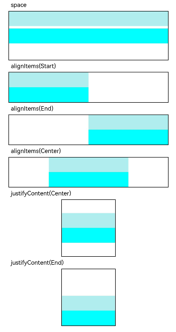

# Column

<!--Del-->
> **Note:**
>
> Currently in the beta phase.
<!--DelEnd-->

A container that arranges its children vertically.

## Import Module

```cangjie
import kit.ArkUI.*
```

## Child Components

Can contain child components.

## Creating the Component

### init(?Length, () -> Unit)

```cangjie
public init(space!: ?Length = None, child!: () -> Unit = {=>})
```

**Function:** Creates a Column container with vertical spacing between child elements set by `space` parameter, which can contain child components.

**System Capability:** SystemCapability.ArkUI.ArkUI.Full

**Since:** 22

**Parameters:**

| Parameter | Type | Required | Default | Description |
|:---|:---|:---|:---|:---|
| space | ?[Length](./cj-common-types.md#interface-length) | No | None | **Named parameter.** Vertical spacing between child elements in the column layout. Initial value: 0.vp<br>Does not take effect when space is negative or when [justifyContent](#func-justifycontentflexalign) is set to FlexAlign.SpaceBetween, FlexAlign.SpaceAround, or FlexAlign.SpaceEvenly. |
| child | () -> Unit | No | { => } | Child components of the Column container |

## Common Attributes/Common Events

Common Attributes: All supported.

Common Events: All supported.

## Component Attributes

### func alignItems(?HorizontalAlign)

```cangjie
public func alignItems(value: ?HorizontalAlign): This
```

**Function:** Sets the horizontal alignment of child components.

**System Capability:** SystemCapability.ArkUI.ArkUI.Full

**Since:** 22

**Parameters:**

| Parameter | Type | Required | Default | Description |
|:---|:---|:---|:---|:---|
| value | ?[HorizontalAlign](./cj-common-types.md#enum-horizontalalign) | Yes | - | Horizontal alignment format for child components. Initial value: HorizontalAlign.Center |

### func justifyContent(?FlexAlign)

```cangjie
public func justifyContent(value: ?FlexAlign): This
```

**Function:** Sets the vertical alignment of child components.

**System Capability:** SystemCapability.ArkUI.ArkUI.Full

**Since:** 22

**Parameters:**

| Parameter | Type | Required | Default | Description |
|:---|:---|:---|:---|:---|
| value | ?[FlexAlign](./cj-common-types.md#enum-flexalign) | Yes | - | Vertical alignment format for child components. Initial value: FlexAlign.Start |

## Example Code

<!-- run -->

```cangjie
package ohos_app_cangjie_entry
import kit.ArkUI.*
import ohos.arkui.state_macro_manage.*
import std.collection.*

@Entry
@Component
class EntryView {
    func build() {
        Column {
            Text("space")
                .fontSize(9)
                .fontColor(0xCCCCCC)
                .width(90.percent)
            Column(space: 5) {
                Column()
                .width(100.percent)
                .height(30)
                .backgroundColor(0xAFEEEE)
                Column()
                .width(100.percent)
                .height(30)
                .backgroundColor(0x00FFFF)
            }
            .width(90.percent)
            .height(100)
            .border(width: 1.vp)

            Text("alignItems(Start)")
                .fontSize(9)
                .fontColor(0xCCCCCC)
                .width(90.percent)
            Column {
                Column()
                    .width(50.percent)
                    .height(30)
                    .backgroundColor(0xAFEEEE)
                Column()
                    .width(50.percent)
                    .height(30)
                    .backgroundColor(0x00FFFF)
            }
            .alignItems(HorizontalAlign.Start)
            .width(90.percent)
            .border(width: 1.vp)

            Text("alignItems(End)")
                .fontSize(9)
                .fontColor(0xCCCCCC)
                .width(90.percent)
            Column {
                Column()
                    .width(50.percent)
                    .height(30)
                    .backgroundColor(0xAFEEEE)
                Column()
                    .width(50.percent)
                    .height(30)
                    .backgroundColor(0x00FFFF)
            }
                .alignItems(HorizontalAlign.End)
                .width(90.percent)
                .border(width: 1.vp)

            Text("justifyContent(Center)")
                .fontSize(9)
                .fontColor(0xCCCCCC)
                .width(90.percent)
            Column {
                Column()
                    .width(30.percent)
                    .height(30)
                    .backgroundColor(0xAFEEEE)
                Column()
                    .width(30.percent)
                    .height(30)
                    .backgroundColor(0x00FFFF)
            }
            .height(15.percent)
            .border(width: 1.vp)
            .justifyContent(FlexAlign.Center)

            Text("justifyContent(End)")
                .fontSize(9)
                .fontColor(0xCCCCCC)
                .width(90.percent)
            Column {
                Column()
                .width(30.percent)
                .height(30)
                .backgroundColor(0xAFEEEE)
                Column()
                .width(30.percent)
                .height(30)
                .backgroundColor(0x00FFFF)
            }
            .height(15.percent)
            .border(width: 1.vp)
            .justifyContent(FlexAlign.End)
        }
        .width(100.percent)
        .padding(top: 5)
    }
    }
```

