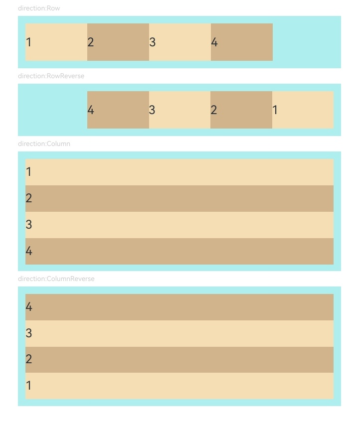
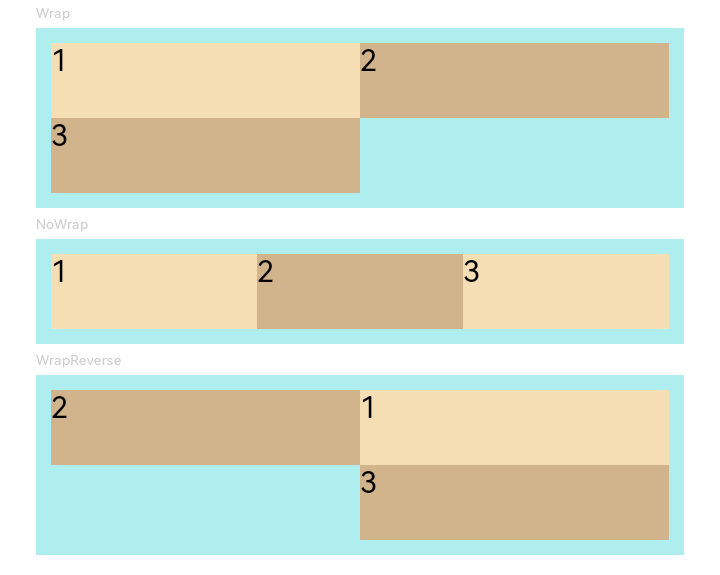
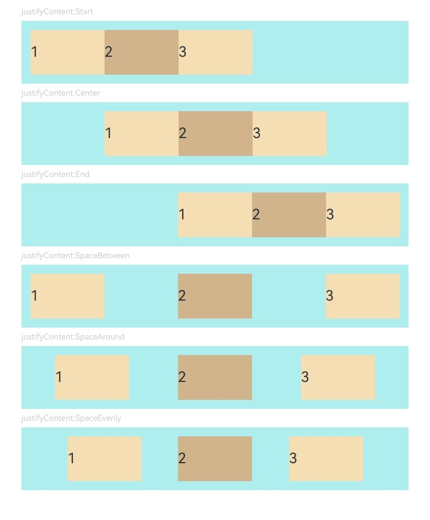
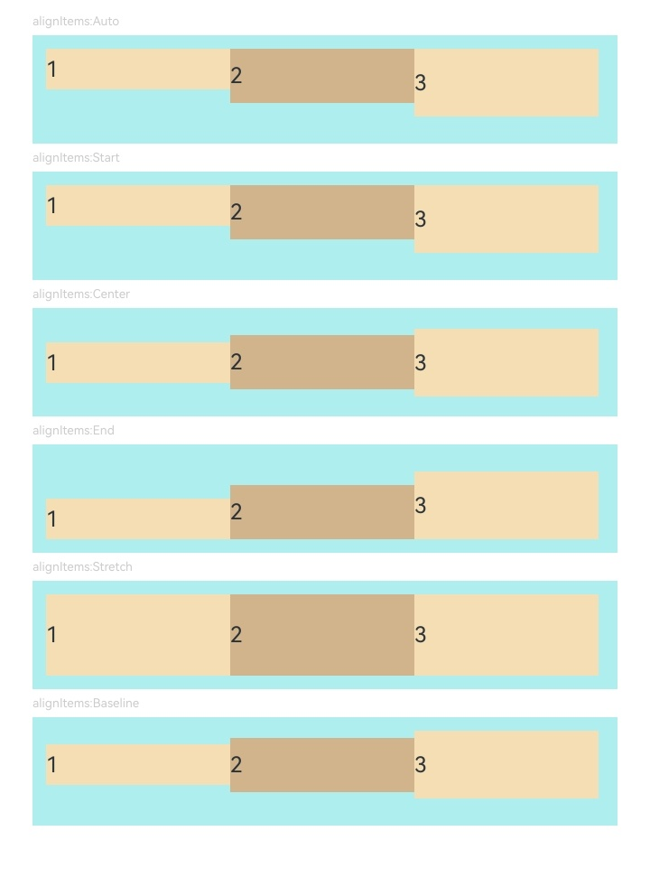
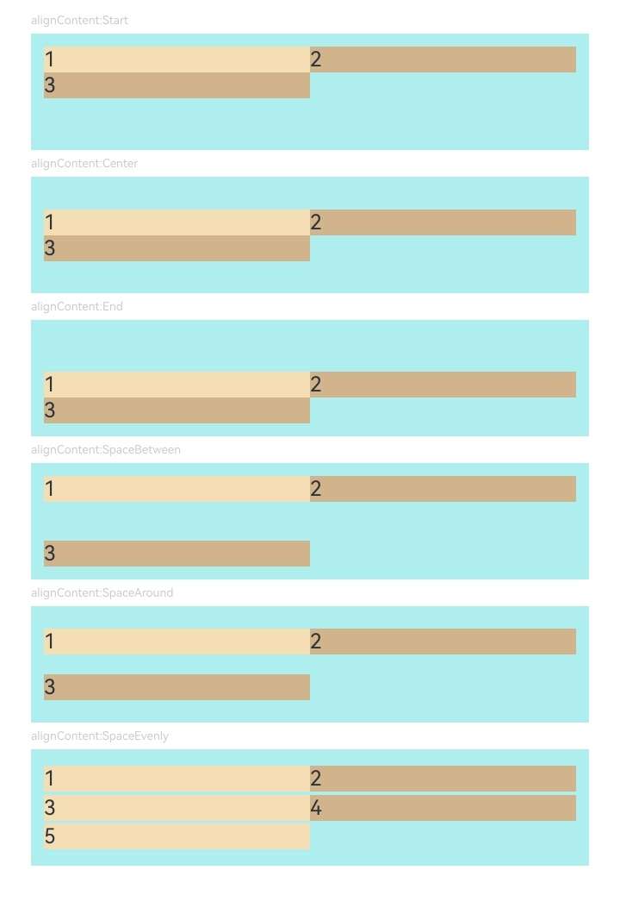

# Flex  

Flex is a container component that lays out child components in a flexible manner, providing a more efficient way to arrange, align, and distribute remaining space among child elements within the container.  

For detailed guidelines, refer to [Flex Layout](../../../en/application-dev/arkui-cj/cj-layout-development-flex-layout.md).  

> **Note:**  
>  
> - The Flex component undergoes a secondary layout process during rendering. Therefore, in scenarios with strict performance requirements, it is recommended to use [Column](cj-row-column-stack-column.md) or [Row](cj-row-column-stack-row.md) instead.  
> - When the main axis of the Flex component is not explicitly set, it expands to fill the parent container. In contrast, the main axis of [Column](cj-row-column-stack-column.md) and [Row](cj-row-column-stack-row.md) components defaults to the size of their child nodes when not set.  
> - The main axis length can be set to `auto` to enable Flex to adapt to child component layouts. During adaptation, the Flex length is constrained by the `constraintSize` property and the parent container's maximum/minimum length, with the `constraintSize` property taking higher priority.  

## Import Module  

```cangjie  
import kit.ArkUI.*  
```  

## Child Components  

Can contain child components.  

## Creating the Component  

### init(FlexDirection, FlexWrap, FlexAlign, ItemAlign, FlexAlign, () -> Unit)  

```cangjie  
public init(direction!: FlexDirection = FlexDirection.Row, wrap!: FlexWrap = FlexWrap.NoWrap,  
    justifyContent!: FlexAlign = FlexAlign.Start, alignItems!: ItemAlign = ItemAlign.Start,  
    alignContent!: FlexAlign = FlexAlign.Start, child!: () -> Unit = {=>})  
```  

**Function:** Creates a Flex container.  

**System Capability:** SystemCapability.ArkUI.ArkUI.Full  

**Since Version:** 21  

**Parameters:**  

| Parameter Name | Type | Required | Default Value | Description |  
|:---|:---|:---|:---|:---|  
| direction | [FlexDirection](cj-common-types.md#enum-flexdirection) | No | FlexDirection.Row | **Named parameter.** The direction in which child components are arranged along the Flex container's main axis. |  
| wrap | [FlexWrap](cj-common-types.md#enum-flexwrap) | No | FlexWrap.NoWrap | **Named parameter.** Whether the Flex container arranges child components in a single row/column or multiple rows/columns. |  
| justifyContent | [FlexAlign](cj-common-types.md#enum-flexalign) | No | FlexAlign.Start | **Named parameter.** The alignment format of all child components along the Flex container's main axis. |  
| alignItems | [ItemAlign](cj-common-types.md#enum-itemalign) | No | ItemAlign.Start | **Named parameter.** The alignment format of all child components along the Flex container's cross axis. |  
| alignContent | [FlexAlign](cj-common-types.md#enum-flexalign) | No | FlexAlign.Start | **Named parameter.** The alignment of multiple lines when extra space exists on the cross axis. Only takes effect when `wrap` is `Wrap` or `WrapReverse`. |  
| child | () -> Unit | No | {=>} | **Named parameter.** Declares the child components within the container. |  

## Common Attributes/Common Events  

**Common Attributes:** All are supported except text styles. For container components with their own `alignItems` property, the common `align` attribute does not take effect.  

**Common Events:** All are supported.  

## Example Code  

### Example 1 (Child Component Arrangement Direction)  

This example demonstrates different child component arrangement directions by setting `direction`.  

<!-- run -->  

```cangjie  
package ohos_app_cangjie_entry  
import kit.ArkUI.*  
import ohos.arkui.state_macro_manage.*  
import std.collection.*  

@Entry  
@Component  
class EntryView {  
    func build() {  
        Column {  
            Column(space: 5) {  
                Text("direction:Row")  
                .fontSize(9)  
                .fontColor(0xCCCCCC)  
                .width(90.percent)  

                // Child components arranged in a row along the main axis  
                Flex(direction: FlexDirection.Row) {  
                    Text("1")  
                    .width(20.percent)  
                    .height(50)  
                    .backgroundColor(0xF5DEB3)  
                    Text("2")  
                    .width(20.percent)  
                    .height(50)  
                    .backgroundColor(0xD2B48C)  
                    Text("3")  
                    .width(20.percent)  
                    .height(50)  
                    .backgroundColor(0xF5DEB3)  
                    Text("4")  
                    .width(20.percent)  
                    .height(50)  
                    .backgroundColor(0xD2B48C)  
                }  
                .height(70)  
                .width(90.percent)  
                .padding(10)  
                .backgroundColor(0xAFEEEE)  

                Text("direction:RowReverse")  
                .fontSize(9)  
                .fontColor(0xCCCCCC)  
                .width(90.percent)  
                // Child components arranged in a reverse row along the main axis  
                Flex(direction: FlexDirection.RowReverse) {  
                    Text("1")  
                    .width(20.percent)  
                    .height(50)  
                    .backgroundColor(0xF5DEB3)  
                    Text("2")  
                    .width(20.percent)  
                    .height(50)  
                    .backgroundColor(0xD2B48C)  
                    Text("3")  
                    .width(20.percent)  
                    .height(50)  
                    .backgroundColor(0xF5DEB3)  
                    Text("4")  
                    .width(20.percent)  
                    .height(50)  
                    .backgroundColor(0xD2B48C)  
                }  
                .height(70)  
                .width(90.percent)  
                .padding(10)  
                .backgroundColor(0xAFEEEE)  

                Text("direction:Column")  
                .fontSize(9)  
                .fontColor(0xCCCCCC)  
                .width(90.percent)  
                // Child components arranged in a column along the main axis  
                Flex(direction: FlexDirection.Column) {  
                    Text("1")  
                    .width(100.percent)  
                    .height(50)  
                    .backgroundColor(0xF5DEB3)  
                    Text("2")  
                    .width(100.percent)  
                    .height(50)  
                    .backgroundColor(0xD2B48C)  
                    Text("3")  
                    .width(100.percent)  
                    .height(50)  
                    .backgroundColor(0xF5DEB3)  
                    Text("4")  
                    .width(100.percent)  
                    .height(50)  
                    .backgroundColor(0xD2B48C)  
                }  
                .width(90.percent)  
                .height(160)  
                .padding(10)  
                .backgroundColor(0xAFEEEE)  
                Text("direction:ColumnReverse")  
                .fontSize(9)  
                .fontColor(0xCCCCCC)  
                .width(90.percent)  
                // Child components arranged in a reverse column along the main axis  
                Flex(direction: FlexDirection.ColumnReverse) {  
                    Text("1")  
                    .width(100.percent)  
                    .height(50)  
                    .backgroundColor(0xF5DEB3)  
                    Text("2")  
                    .width(100.percent)  
                    .height(50)  
                    .backgroundColor(0xD2B48C)  
                    Text("3")  
                    .width(100.percent)  
                    .height(50)  
                    .backgroundColor(0xF5DEB3)  
                    Text("4")  
                    .width(100.percent)  
                    .height(50)  
                    .backgroundColor(0xD2B48C)  
                }  
                .width(90.percent)  
                .height(160)  
                .padding(10)  
                .backgroundColor(0xAFEEEE)  
            }  
            .width(100.percent)  
            .margin(top: 5)  
        }  
        .width(100.percent)  
    }  
}  
```  

  

### Example 2 (Single/Multi-line Child Component Arrangement)  

This example demonstrates single-line or multi-line child component arrangements by setting `wrap`.  

<!-- run -->  

```cangjie  
package ohos_app_cangjie_entry  
import kit.ArkUI.*  
import ohos.arkui.state_macro_manage.*  

@Entry  
@Component  
class EntryView {  
    func build() {  
        Column {  
            Column(space: 5) {  
                Text("Wrap")  
                .fontSize(9)  
                .fontColor(0xCCCCCC)  
                .width(90.percent)  
                Flex(wrap: FlexWrap.Wrap) {  
                    Text("1")  
                    .width(50.percent)  
                    .height(50)  
                    .backgroundColor(0xF5DEB3)  
                    Text("2")  
                    .width(50.percent)  
                    .height(50)  
                    .backgroundColor(0xD2B48C)  
                    Text("3")  
                    .width(50.percent)  
                    .height(50)  
                    .backgroundColor(0xD2B48C)  
                }  
                .width(90.percent)  
                .padding(10)  
                .backgroundColor(0xAFEEEE)  

                Text("NoWrap")  
                .fontSize(9)  
                .fontColor(0xCCCCCC)  
                .width(90.percent)  
                Flex(wrap: FlexWrap.NoWrap) {  
                    Text("1")  
                    .width(50.percent)  
                    .height(50)  
                    .backgroundColor(0xF5DEB3)  
                    Text("2")  
                    .width(50.percent)  
                    .height(50)  
                    .backgroundColor(0xD2B48C)  
                    Text("3")  
                    .width(50.percent)  
                    .height(50)  
                    .backgroundColor(0xF5DEB3)  
                }  
                .width(90.percent)  
                .padding(10)  
                .backgroundColor(0xAFEEEE)  

                Text("WrapReverse")  
                .fontSize(9)  
                .fontColor(0xCCCCCC)  
                .width(90.percent)  
                Flex(wrap: FlexWrap.WrapReverse, direction:FlexDirection.Row) {  
                    Text("1")  
                    .width(50.percent)  
                    .height(50)  
                    .backgroundColor(0xF5DEB3)  
                    Text("2")  
                    .width(50.percent)  
                    .height(50)  
                    .backgroundColor(0xD2B48C)  
                    Text("3")  
                    .width(50.percent)  
                    .height(50)  
                    .backgroundColor(0xD2B48C)  
                }  
                .width(90.percent)  
                .height(120)  
                .padding(10)  
                .backgroundColor(0xAFEEEE)  
            }  
            .width(100.percent)  
            .margin(top: 5)  
        }  
        .width(100.percent)  
    }  
}  
```  

  

### Example 3 (Child Component Alignment on the Main Axis)  

This example demonstrates different child component alignment effects on the main axis by setting `justifyContent`.  

<!-- run -->  

```cangjie  
package ohos_app_cangjie_entry  
import kit.ArkUI.*  
import ohos.arkui.state_macro_manage.*  
import std.collection.*  

@Component  
class JustifyContentFlex{  
    // Initialize alignment: Child components aligned to the start of the main axis  
    var justifyContent :  FlexAlign  = FlexAlign.Start  

    func build(){  
        Flex(justifyContent:this.justifyContent){  
            Text('1').width(20.percent).height(50).backgroundColor(0xF5DEB3)  
            Text('2').width(20.percent).height(50).backgroundColor(0xD2B48C)  
            Text('3').width(20.percent).height(50).backgroundColor(0xF5DEB3)  
        }  
        .width(90.percent)  
        .padding(10)  
        .backgroundColor(0xAFEEEE)  
    }  
}  

@Entry  
@Component  
class EntryView {  
    func build() {  
        Column {  
            Column(space: 5) {  
                Text('justifyContent:Start').fontSize(9).fontColor(0xCCCCCC).width(90.percent)  
                JustifyContentFlex() // Child components aligned to the start of the main axis  
                Text('justifyContent:Center').fontSize(9).fontColor(0xCCCCCC).width(90.percent)  
                JustifyContentFlex(justifyContent:FlexAlign.Center) // Child components centered on the main axis  
                Text('justifyContent:End').fontSize(9).fontColor(0xCCCCCC).width(90.percent)  
                JustifyContentFlex(justifyContent:FlexAlign.End) // Child components aligned to the end of the main axis  
                Text('justifyContent:SpaceBetween').fontSize(9).fontColor(0xCCCCCC).width(90.percent)  
                // Child components evenly distributed along the main axis, with the first aligned to the start and the last to the end.  
                JustifyContentFlex(justifyContent:FlexAlign.SpaceBetween)  
                Text('justifyContent:SpaceAround').fontSize(9).fontColor(0xCCCCCC).width(90.percent)  
                // Child components evenly distributed along the main axis, with equal space around them.  
                JustifyContentFlex(justifyContent:FlexAlign.SpaceAround)  
                Text('justifyContent:SpaceEvenly').fontSize(9).fontColor(0xCCCCCC).width(90.percent)  
                // Child components evenly distributed along the main axis, with equal space between them and the container edges.  
                JustifyContentFlex(justifyContent:FlexAlign.SpaceEvenly)  
            }  
            .width(100.percent)  
            .margin(top: 5)  
        }  
        .width(100.percent)  
    }  
}  
```  

  

### Example 4 (Child Component Alignment on the Cross Axis)  

This example demonstrates different child component alignment effects on the cross axis by setting `alignItems`.  

<!-- run -->  

```cangjie  
package ohos_app_cangjie_entry  
import kit.ArkUI.*  
import ohos.arkui.state_macro_manage.*  
import std.collection.*  

@Component  
class AlignItemsFlex{  
    // Initialize alignment: Child components aligned to the start of the cross axis  
    var alignItems :  ItemAlign  = ItemAlign.Auto  

    func build(){  
        Flex(alignItems:this.alignItems){  
            Text('1').width(33.percent).height(30).backgroundColor(0xF5DEB3)  
            Text('2').width(33.percent).height(40).backgroundColor(0xD2B48C)  
            Text('3').width(33.percent).height(50).backgroundColor(0xF5DEB3)  
        }  
        .width(90.percent)  
        .height(80)  
        .padding(10)  
        .backgroundColor(0xAFEEEE)  
    }  
}  

@Entry  
@Component  
class EntryView {  
    func build() {  
        Column {  
            Column(space: 5) {  
                Text('alignItems:Auto').fontSize(9).fontColor(0xCCCCCC).width(90.percent)  
                // Child components aligned to the start of the cross axis  
                AlignItemsFlex()  
                Text('alignItems:Start').fontSize(9).fontColor(0xCCCCCC).width(90.percent)  
                // Child components aligned to the start of the cross axis  
                AlignItemsFlex(alignItems:ItemAlign.Start)  
                Text('alignItems:Center').fontSize(9).fontColor(0xCCCCCC).width(90.percent)  
                // Child components centered on the cross axis  
                AlignItemsFlex(alignItems:ItemAlign.Center)  
                Text('alignItems:End').fontSize(9).fontColor(0xCCCCCC).width(90.percent)  
                // Child components aligned to the end of the cross axis  
                AlignItemsFlex(alignItems:ItemAlign.End)  
                Text('alignItems:Stretch').fontSize(9).fontColor(0xCCCCCC).width(90.percent)  
                // Child components stretched to fill the cross axis  
                AlignItemsFlex(alignItems:ItemAlign.Stretch)  
                Text('alignItems:Baseline').fontSize(9).fontColor(0xCCCCCC).width(90.percent)  
                // Child components aligned to the text baseline on the cross axis  
                AlignItemsFlex(alignItems:ItemAlign.Baseline)  
            }  
            .width(100.percent)  
            .margin(top: 5)  
        }  
        .width(100.percent)  
    }  
}  
```  

### Example 5 (Alignment Methods for Multi-line Content)

This example demonstrates different alignment effects for multi-line content by setting `alignContent`.

<!-- run -->

```cangjie
package ohos_app_cangjie_entry
import kit.ArkUI.*
import ohos.arkui.state_macro_manage.*
import std.collection.*

@Component
class AlignContentFlex{
    // Initialize alignment: child components aligned to the start in multi-line layout
    var alignContent :  FlexAlign  = FlexAlign.Start

    func build(){
        Flex(wrap: FlexWrap.Wrap, alignContent:this.alignContent){
            Text('1').width(50.percent).height(20).backgroundColor(0xF5DEB3)
            Text('2').width(50.percent).height(20).backgroundColor(0xD2B48C)
            Text('3').width(50.percent).height(20).backgroundColor(0xD2B48C)
        }
        .width(90.percent)
        .height(90)
        .padding(10)
        .backgroundColor(0xAFEEEE)
    }
}

@Entry
@Component
class EntryView {
    func build() {
        Column {
            Column(space: 5) {
                Text('alignContent:Start').fontSize(9).fontColor(0xCCCCCC).width(90.percent)
                // Child components aligned to the start in multi-line layout
                AlignContentFlex()
                Text('alignContent:Center').fontSize(9).fontColor(0xCCCCCC).width(90.percent)
                // Child components center-aligned in multi-line layout
                AlignContentFlex(alignContent:FlexAlign.Center)
                Text('alignContent:End').fontSize(9).fontColor(0xCCCCCC).width(90.percent)
                // Child components aligned to the end in multi-line layout
                AlignContentFlex(alignContent:FlexAlign.End)
                Text('alignContent:SpaceBetween').fontSize(9).fontColor(0xCCCCCC).width(90.percent)
                // First line of child components aligned to the start and last line aligned to the end in multi-line layout
                AlignContentFlex(alignContent:FlexAlign.SpaceBetween)
                Text('alignContent:SpaceAround').fontSize(9).fontColor(0xCCCCCC).width(90.percent)
                // Distance from first line to start and last line to end is half of the spacing between adjacent lines in multi-line layout
                AlignContentFlex(alignContent:FlexAlign.SpaceAround)
                Text('alignContent:SpaceEvenly').fontSize(9).fontColor(0xCCCCCC).width(90.percent)
                // Equal spacing between adjacent lines, first line to start, and last line to end in multi-line layout
                Flex(wrap: FlexWrap.Wrap, alignContent:FlexAlign.SpaceEvenly){
                    Text('1').width(50.percent).height(20).backgroundColor(0xF5DEB3)
                    Text('2').width(50.percent).height(20).backgroundColor(0xD2B48C)
                    Text('3').width(50.percent).height(20).backgroundColor(0xF5DEB3)
                    Text('4').width(50.percent).height(20).backgroundColor(0xD2B48C)
                    Text('5').width(50.percent).height(20).backgroundColor(0xF5DEB3)
                }
                .width(90.percent)
                .height(90)
                .padding(10)
                .backgroundColor(0xAFEEEE)
            }
            .width(100.percent)
            .margin(top: 5)
        }
        .width(100.percent)
    }
}
```

