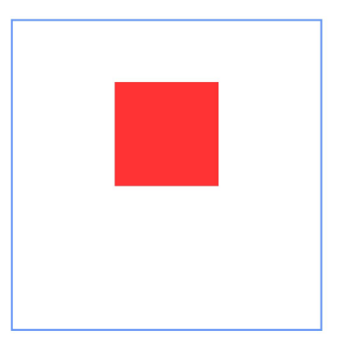
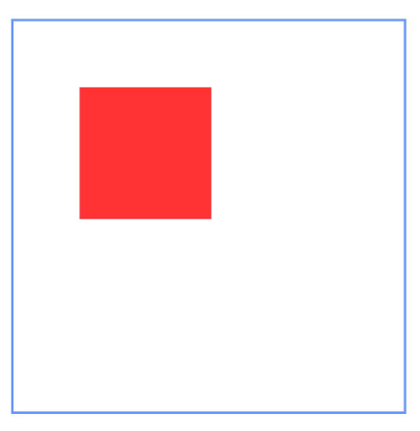
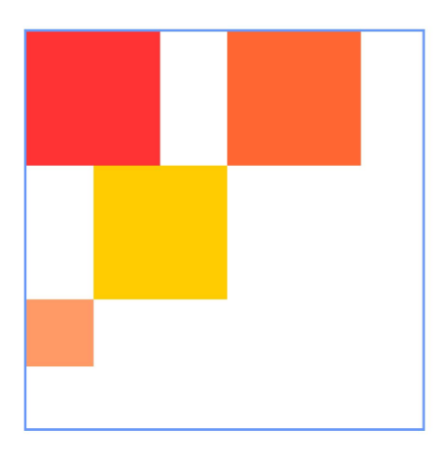

# RelativeContainer

A relative layout component used for aligning elements in complex scenarios.

> **Note:**
>
> The `margin` property of child components within a relative layout container differs from the general [margin](cj-universal-attribute-size.md#func-marginlength) attribute. Here, it represents the distance to the anchor point in that direction. If no anchor point exists in a given direction, the margin in that direction will not take effect.

## Import Module

```cangjie
import kit.ArkUI.*
```

## Child Components

Supports multiple child components.

## Creating the Component

### init(() -> Unit)

```cangjie
public init(child!: () -> Unit = {=>})
```

**Function:** Creates a RelativeContainer component.

**System Capability:** SystemCapability.ArkUI.ArkUI.Full

**Since:** 22

**Parameters:**

| Parameter | Type | Required | Default Value | Description |
|:---|:---|:---|:---|:---|
| child | () -> Unit | No | {=>} | **Named parameter.** Declares the container's child components. |

## Universal Attributes/Events

Universal attributes: All supported.

Universal events: All supported.

## Component Attributes

### func barrier(?Array\<BarrierStyle>)

```cangjie
public func barrier(value: ?Array<BarrierStyle>): This
```

**Function:** Sets barriers within the RelativeContainer. Each item in the Array represents a single barrier.

**System Capability:** SystemCapability.ArkUI.ArkUI.Full

**Since:** 22

**Parameters:**

| Parameter | Type | Required | Default Value | Description |
|:---|:---|:---|:---|:---|
| value | ?Array\<[BarrierStyle](#class-barrierstyle)> | Yes | - | Barriers within the RelativeContainer. Initial value: []. |

### func guideLine(?Array\<GuideLineStyle>)

```cangjie
public func guideLine(value: ?Array<GuideLineStyle>): This
```

**Function:** Sets guidelines within the RelativeContainer. Each item in the Array represents a single guideline.

**System Capability:** SystemCapability.ArkUI.ArkUI.Full

**Since:** 22

**Parameters:**

| Parameter | Type | Required | Default Value | Description |
|:---|:---|:---|:---|:---|
| value | ?Array\<[GuideLineStyle](#class-guidelinestyle)> | Yes | - | Guidelines within the RelativeContainer. Initial value: []. |

## Basic Type Definitions

### class BarrierStyle

```cangjie
public class BarrierStyle {
    public var id: ?String
    public var direction: ?BarrierDirection
    public var referencedId: ?Array<String>
    public init(id: ?String, direction: ?BarrierDirection, referencedId: ?Array<String>)
}
```

**Function:** Barrier parameter, used to define a barrier's ID, direction, and the components it depends on.

**System Capability:** SystemCapability.ArkUI.ArkUI.Full

**Since:** 22

#### var id

```cangjie
public var id: ?String
```

**Function:** The barrier's ID, which must be unique and cannot duplicate any component names within the container.

**Type:** ?String

**Read/Write:** Read-Write

**System Capability:** SystemCapability.ArkUI.ArkUI.Full

**Since:** 22

#### var direction

```cangjie
public var direction: ?BarrierDirection
```

**Function:** Specifies the barrier's direction. Vertical barriers (Top, Bottom) can only serve as horizontal anchor points for components (value is 0 when used as vertical anchor points). Horizontal barriers (Left, Right) can only serve as vertical anchor points for components (value is 0 when used as horizontal anchor points).

**Type:** ?[BarrierDirection](./cj-common-types.md#enum-barrierdirection)

**Read/Write:** Read-Write

**System Capability:** SystemCapability.ArkUI.ArkUI.Full

**Since:** 22

#### var referencedId

```cangjie
public var referencedId: ?Array<String>
```

**Function:** Specifies the components the barrier depends on.

**Type:** ?Array\<String>

**Read/Write:** Read-Write

**System Capability:** SystemCapability.ArkUI.ArkUI.Full

**Since:** 22

#### init(?String, ?BarrierDirection, ?Array\<String>)

```cangjie
public init(id: ?String, direction: ?BarrierDirection, referencedId: ?Array<String>)
```

**Function:** Creates a BarrierStyle object.

**System Capability:** SystemCapability.ArkUI.ArkUI.Full

**Since:** 22

**Parameters:**

| Parameter | Type | Required | Default Value | Description |
|:---|:---|:---|:---|:---|
| id | ?String | Yes | - | The barrier's ID, which must be unique and cannot duplicate any component names within the container. Initial value: "". |
| direction | ?[BarrierDirection](./cj-common-types.md#enum-barrierdirection) | Yes | - | Specifies the barrier's direction. Vertical barriers (TOP, BOTTOM) can only serve as horizontal anchor points (value is 0 when used as vertical anchor points). Horizontal barriers (LEFT, RIGHT) can only serve as vertical anchor points (value is 0 when used as horizontal anchor points). Initial value: BarrierDirection.LEFT. |
| referencedId | ?Array\<String> | Yes | - | Specifies the components the barrier depends on. Initial value: []. |

### class GuideLinePosition

```cangjie
public class GuideLinePosition {
    public var start: ?Length
    public var end: ?Length
    public init(start!: ?Length = None, end!: ?Length = None)
}
```

**Function:** Guideline position parameter, used to define a guideline's position.

**System Capability:** SystemCapability.ArkUI.ArkUI.Full

**Since:** 22

#### var start

```cangjie
public var start: ?Length
```

**Function:** The distance from the guideline to the container's left or top edge.

**Type:** ?[Length](./cj-common-types.md#interface-length)

**Read/Write:** Read-Write

**System Capability:** SystemCapability.ArkUI.ArkUI.Full

**Since:** 22

#### var end

```cangjie
public var end: ?Length
```

**Function:** The distance from the guideline to the container's right or bottom edge.

**Type:** ?[Length](./cj-common-types.md#interface-length)

**Read/Write:** Read-Write

**System Capability:** SystemCapability.ArkUI.ArkUI.Full

**Since:** 22

#### init(?Length, ?Length)

```cangjie
public init(start!: ?Length = None, end!: ?Length = None)
```

**Function:** Creates a GuideLinePosition object.

**System Capability:** SystemCapability.ArkUI.ArkUI.Full

**Since:** 22

**Parameters:**

| Parameter | Type | Required | Default Value | Description |
|:---|:---|:---|:---|:---|
| start | ?[Length](./cj-common-types.md#interface-length) | No | None | **Named parameter.** The distance from the guideline to the container's left or top edge. |
| end | ?[Length](./cj-common-types.md#interface-length) | No | None | **Named parameter.** The distance from the guideline to the container's right or bottom edge. |

### class GuideLineStyle

```cangjie
public class GuideLineStyle {
    public var id: ?String
    public var direction: ?Axis
    public var position: ?GuideLinePosition
    public init(id: ?String, direction: ?Axis, position: ?GuideLinePosition)
}
```

**Function:** Guideline parameter, used to define a guideline's ID, direction, and position.

**System Capability:** SystemCapability.ArkUI.ArkUI.Full

**Since:** 22

#### var id

```cangjie
public var id: ?String
```

**Function:** The guideline's ID, which must be unique and cannot duplicate any component names within the container.

**Type:** ?String

**Read/Write:** Read-Write

**System Capability:** SystemCapability.ArkUI.ArkUI.Full

**Since:** 22

#### var direction

```cangjie
public var direction: ?Axis
```

**Function:** Specifies the guideline's direction. Vertical guidelines can only serve as horizontal anchor points for components (value is 0 when used as vertical anchor points). Horizontal guidelines can only serve as vertical anchor points for components (value is 0 when used as horizontal anchor points).

**Type:** ?[Axis](./cj-common-types.md#enum-axis)

**Read/Write:** Read-Write

**System Capability:** SystemCapability.ArkUI.ArkUI.Full

**Since:** 22

#### var position

```cangjie
public var position: ?GuideLinePosition
```

**Function:** Specifies the guideline's position. If undeclared or declared with an invalid value (e.g., undefined), the guideline's position defaults to start: 0. Either `start` or `end` declaration can be used. If both are declared, only `start` takes effect. If the container's size in a direction is declared as "auto", guidelines in that direction can only use `start` declaration (percentage values are not allowed).

**Type:** ?[GuideLinePosition](./cj-common-types.md#enum-guidelineposition)

**Read/Write:** Read-Write

**System Capability:** SystemCapability.ArkUI.ArkUI.Full

**Since:** 22

#### init(?String, ?Axis, ?GuideLinePosition)

```cangjie
public init(id: ?String, direction: ?Axis, position: ?GuideLinePosition)
```

**Function:** Creates a GuideLineStyle object.

**System Capability:** SystemCapability.ArkUI.ArkUI.Full

**Since:** 22

**Parameters:**

| Parameter | Type | Required | Default Value | Description |
|:---|:---|:---|:---|:---|
| id | ?String | Yes | - | The guideline's ID, which must be unique and cannot duplicate any component names within the container. Initial value: "". |
| direction | ?[Axis](cj-common-types.md#enum-axis) | Yes | - | Specifies the guideline's direction. Vertical guidelines can only serve as horizontal anchor points (value is 0 when used as vertical anchor points). Horizontal guidelines can only serve as vertical anchor points (value is 0 when used as horizontal anchor points). Initial value: Axis.Vertical. |
| position | ?[GuideLinePosition](#class-guidelineposition) | Yes | - | Specifies the guideline's position. If undeclared or declared with an invalid value, the initial position is start: 0. Either `start` or `end` declaration can be used. If both are declared, only `start` takes effect. Initial value: {start: 0}. |

## Example Code

### Example 1 (Layout Using Container and Child Components as Anchor Points)

This example demonstrates layout functionality using the `alignRules` interface with the container and its child components as anchor points.

<!-- run -->

```cangjie
package ohos_app_cangjie_entry
import kit.ArkUI.*
import ohos.arkui.state_macro_manage.*
import std.collection.*

@Entry
@Component
class EntryView {
    func build() {
        Row() {
            RelativeContainer() {
                Row().width(100).height(100)
                .backgroundColor(0xff3333)
                .alignRules(
                    AlignRuleOption(
                        top: VerticalAlignParam("__container__", VerticalAlign.Top),
                        left: HorizontalAlignParam("__container__", HorizontalAlign.Start)
                    )
                ).id("row1")
                Row().width(100).height(100)
                .backgroundColor(0xFFCC00)
                .alignRules(
                    AlignRuleOption(
                        top: VerticalAlignParam("__container__", VerticalAlign.Top),
                        right: HorizontalAlignParam("__container__", HorizontalAlign.End)
                    )
                ).id("row2")
                Row().height(100)
                .backgroundColor(0xFF6633)
                .alignRules(
                    AlignRuleOption(
                        top: VerticalAlignParam("row1", VerticalAlign.Bottom),
                        left: HorizontalAlignParam("row1", HorizontalAlign.End),
                        right: HorizontalAlignParam("row2", HorizontalAlign.Start)
                    )
                ).id("row3")
                Row()
                .backgroundColor(0xFF9966)
                .alignRules(
                    AlignRuleOption(
                        top: VerticalAlignParam("row3", VerticalAlign.Bottom),
                        bottom: VerticalAlignParam("__container__", VerticalAlign.Bottom),
                        left: HorizontalAlignParam("__container__", HorizontalAlign.Start),
                        right: HorizontalAlignParam("row1",  HorizontalAlign.End)
                    )
                ).id("row4")
                Row()
                .backgroundColor(0xff3333)
                .alignRules(
                    AlignRuleOption(
                        top: VerticalAlignParam("row3", VerticalAlign.Bottom),
                        bottom: VerticalAlignParam("__container__", VerticalAlign.Bottom),
                        left: HorizontalAlignParam("row2", HorizontalAlign.Start),
                        right: HorizontalAlignParam("__container__",  HorizontalAlign.End)
                    )
                ).id("row5")
            }
            .width(300).height(300)
            .margin(left: 50.vp)
            .border(width: 2.vp, color: Color(0x6699ff))
        }.height(100.percent)
    }
}
```


### Example 2 (Setting Margins for Child Components)

This example demonstrates how to set margins for child components within the container.

<!-- run -->

```cangjie
package ohos_app_cangjie_entry
import kit.ArkUI.*
import ohos.arkui.state_macro_manage.*
import std.collection.*

@Entry
@Component
class EntryView {
    func build() {
        Row() {
            RelativeContainer() {
                Row().width(100).height(100)
                .backgroundColor(0xff3333)
                .alignRules(
                    AlignRuleOption(
                        top: VerticalAlignParam("__container__", VerticalAlign.Top),
                        left: HorizontalAlignParam("__container__", HorizontalAlign.Start)
                    )
                ).id("row1")
                .margin(10)
                Row().width(100).height(100)
                .backgroundColor(0xFFCC00)
                .alignRules(
                    AlignRuleOption(
                        top: VerticalAlignParam("row1", VerticalAlign.Top),
                        left: HorizontalAlignParam("row1", HorizontalAlign.End)
                    )
                ).id("row2")
                Row().height(100).width(100)
                .backgroundColor(0xFF6633)
                .alignRules(
                    AlignRuleOption(
                        top: VerticalAlignParam("row1", VerticalAlign.Bottom),
                        left: HorizontalAlignParam("row1", HorizontalAlign.Start)
                    )
                ).id("row3")
                Row().width(100).height(100)
                .backgroundColor(0xFF9966)
                .alignRules(
                    AlignRuleOption(
                        top: VerticalAlignParam("row2", VerticalAlign.Bottom),
                        left: HorizontalAlignParam("row3", HorizontalAlign.End),
                    )
                ).id("row4")
                .margin(10)
            }
            .width(300).height(300)
            .margin(left: 50.vp)
            .border(width: 2.vp, color: Color(0x6699ff))
        }.height(100.percent)
    }
}
```

### Example 3 (Setting Offset)

This example demonstrates how to achieve vertical offset between two anchor points for child components using [bias](cj-universal-attribute-location.md#class-bias).

<!-- run -->

```cangjie
package ohos_app_cangjie_entry
import kit.ArkUI.*
import ohos.arkui.state_macro_manage.*
import std.collection.*

@Entry
@Component
class EntryView {
    func build() {
        Row() {
            RelativeContainer() {
                Row().width(100).height(100).backgroundColor(0xff3333).alignRules(
                    AlignRuleOption(
                        top: VerticalAlignParam("__container__", VerticalAlign.Top),
                        bottom: VerticalAlignParam("__container__", VerticalAlign.Bottom),
                        left: HorizontalAlignParam("__container__", HorizontalAlign.Start),
                        right: HorizontalAlignParam("__container__", HorizontalAlign.End),
                        bias: Bias(vertical: 0.3)
                    )
                ).id("row1")
            }
            .width(300).height(300)
            .margin(left: 50.vp)
            .border(width: 2.vp, color: Color(0x6699ff))
        }.height(100.percent)
    }
}
```



### Example 4 (Setting Guidelines)

This example demonstrates how the relative layout component uses the [guideLine](#func-guidelinearrayguidelinestyle) interface to set guidelines, allowing child components to use them as anchor points.

<!-- run -->

```cangjie
package ohos_app_cangjie_entry
import kit.ArkUI.*
import ohos.arkui.state_macro_manage.*
import std.collection.*

@Entry
@Component
class EntryView {
    func build() {
        Row() {
            RelativeContainer() {
                Row().width(100).height(100).backgroundColor(0xff3333).alignRules(
                    AlignRuleOption(
                        top: VerticalAlignParam("guideline2", VerticalAlign.Top),
                        left: HorizontalAlignParam("guideline1", HorizontalAlign.End),
                    )
                ).id("row1")
            }.width(300).height(300).margin(left: 50.vp).border(width: 2.vp, color: Color(0x6699ff))
            .guideLine(
                [GuideLineStyle("guideline1", Axis.Vertical, GuideLinePosition(start: 50.vp)),
                GuideLineStyle("guideline2", Axis.Horizontal, GuideLinePosition(start: 50.vp))])
        }.height(100.percent)
    }
}
```



### Example 5 (Setting Barriers)

This example demonstrates how the relative layout component uses the [barrier](#func-barrierarraybarrierstyle) interface to set barriers, allowing child components to use them as anchor points.

<!-- run -->

```cangjie
package ohos_app_cangjie_entry
import kit.ArkUI.*
import ohos.arkui.state_macro_manage.*
import std.collection.*

@Entry
@Component
class EntryView {
    func build() {
        Row() {
            RelativeContainer() {
                Row().width(100).height(100)
                .backgroundColor(0xff3333)
                .id("row1")

                Row().width(100).height(100)
                .backgroundColor(0xFFCC00)
                .alignRules(
                    AlignRuleOption(
                        top: VerticalAlignParam("row1", VerticalAlign.Bottom),
                        middle: HorizontalAlignParam("row1", HorizontalAlign.End)
                    )
                ).id("row2")

                Row().height(100).width(100)
                .backgroundColor(0xFF6633)
                .alignRules(
                    AlignRuleOption(
                        top: VerticalAlignParam("row1", VerticalAlign.Top),
                        left: HorizontalAlignParam("barrier1", HorizontalAlign.End)
                    )
                ).id("row3")

                Row().width(50).height(50)
                .backgroundColor(0xFF9966)
                .alignRules(
                    AlignRuleOption(
                        top: VerticalAlignParam("barrier2", VerticalAlign.Bottom),
                        left: HorizontalAlignParam("row1", HorizontalAlign.Start),
                    )
                ).id("row4")
            }.width(300).height(300)
            .margin(left: 50.vp)
            .border(width: 2.vp, color: Color(0x6699ff))
            .barrier(
                [BarrierStyle("barrier1", BarrierDirection.Right, ["row1", "row2"]),
                BarrierStyle("barrier2", BarrierDirection.Bottom, ["row1", "row2"])])
        }.height(100.percent)
    }
}
```

