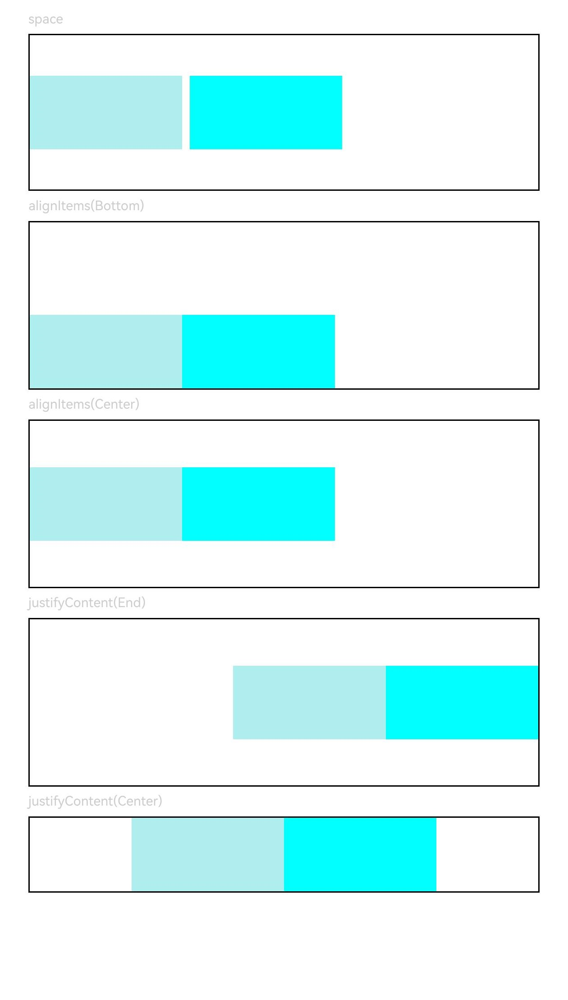

# Row

<!--Del-->
> **Note:**
>
> Currently in the beta phase.
<!--DelEnd-->

A container that arranges its children horizontally.

## Import Module

```cangjie
import kit.ArkUI.*
```

## Child Components

Can contain child components.

## Creating the Component

### init(?Length, () -> Unit)

```cangjie
public init(space!: ?Length = None, child!: () -> Unit = {=>})
```

**Function:** Creates a Row container with horizontal spacing between elements set to `space`.

**System Capability:** SystemCapability.ArkUI.ArkUI.Full

**Since:** 22

**Parameters:**

| Parameter | Type | Required | Default | Description |
|:---|:---|:---|:---|:---|
| space | ?[Length](./cj-common-types.md#interface-length) | No | None | **Named parameter.** Horizontal spacing between elements. Does not take effect when `space` is negative or when `justifyContent` is set to `FlexAlign.SpaceBetween`, `FlexAlign.SpaceAround`, or `FlexAlign.SpaceEvenly`. Initial value: 0, unit: vp. |
| child | () -> Unit | No | {=>} | **Named parameter.** Child components within the container. |

## Common Attributes/Common Events

Common attributes: All supported.

Common events: All supported.

## Component Attributes

### func alignItems(?VerticalAlign)

```cangjie
public func alignItems(value: ?VerticalAlign): This
```

**Function:** Sets the vertical alignment format for child components.

**System Capability:** SystemCapability.ArkUI.ArkUI.Full

**Since:** 22

**Parameters:**

| Parameter | Type | Required | Default | Description |
|:---|:---|:---|:---|:---|
| value | ?[VerticalAlign](./cj-common-types.md#enum-verticalalign) | Yes | - | Vertical alignment format for child components. Initial value: `VerticalAlign.Center`. |

### func justifyContent(?FlexAlign)

```cangjie
public func justifyContent(value: ?FlexAlign): This
```

**Function:** Sets the horizontal alignment format for child components.

**System Capability:** SystemCapability.ArkUI.ArkUI.Full

**Since:** 22

**Parameters:**

| Parameter | Type | Required | Default | Description |
|:---|:---|:---|:---|:---|
| value | ?[FlexAlign](./cj-common-types.md#enum-flexalign) | Yes | - | Horizontal alignment format for child components. Initial value: `FlexAlign.Start`. |

> **Note:**
>
> In Row layout, if child components do not set [flexShrink](cj-universal-attribute-flexlayout.md#func-flexshrinkfloat64), they will not be compressed by default, meaning the cumulative size of all child components along the main axis may exceed the container's main axis size.

## Example Code

This example demonstrates the usage of Row's `alignItems` and `justifyContent` attributes.

<!-- run -->

```cangjie
package ohos_app_cangjie_entry
import kit.ArkUI.*
import ohos.arkui.state_macro_manage.*

@Entry
@Component
class EntryView {
    func build() {
            Column(space: 5) {
            // Set horizontal spacing between child components to 5
                Text("space")
                .fontSize(9)
                .fontColor(0xCCCCCC)
                .width(90.percent)
                Row(space: 5) {
                    Row()
                    .width(30.percent)
                    .height(50)
                    .backgroundColor(0xAFEEEE)
                    Row()
                    .width(30.percent)
                    .height(50)
                    .backgroundColor(0x00FFFF)
                }
                .width(90.percent)
                .height(107)
                .border(width: 1.vp)

                // Set vertical alignment for child elements
                Text("alignItems(Bottom)")
                .fontSize(9)
                .fontColor(0xCCCCCC)
                .width(90.percent)
                Row() {
                    Row()
                    .width(30.percent)
                    .height(50)
                    .backgroundColor(0xAFEEEE)
                    Row()
                    .width(30.percent)
                    .height(50)
                    .backgroundColor(0x00FFFF)
                }
                .alignItems(VerticalAlign.Bottom)
                .width(90.percent)
                .height(15.percent)
                .border(width: 1.vp)

                Text("alignItems(Center)")
                .fontSize(9)
                .fontColor(0xCCCCCC)
                .width(90.percent)
                Row() {
                    Row()
                    .width(30.percent)
                    .height(50)
                    .backgroundColor(0xAFEEEE)
                    Row()
                    .width(30.percent)
                    .height(50)
                    .backgroundColor(0x00FFFF)
                }
                .alignItems(VerticalAlign.Center)
                .width(90.percent)
                .height(15.percent)
                .border(width: 1.vp)

              // Set horizontal alignment for child elements
                Text("justifyContent(End)")
                .fontSize(9)
                .fontColor(0xCCCCCC)
                .width(90.percent)
                Row() {
                    Row()
                    .width(30.percent)
                    .height(50)
                    .backgroundColor(0xAFEEEE)
                    Row()
                    .width(30.percent)
                    .height(50)
                    .backgroundColor(0x00FFFF)
                }
                .height(15.percent)
                .width(90.percent)
                .border(width: 1.vp)
                .justifyContent(FlexAlign.End)

                Text("justifyContent(Center)")
                .fontSize(9)
                .fontColor(0xCCCCCC)
                .width(90.percent)
                Row() {
                    Row()
                    .width(30.percent)
                    .height(50)
                    .backgroundColor(0xAFEEEE)
                    Row()
                    .width(30.percent)
                    .height(50)
                    .backgroundColor(0x00FFFF)
                }
                .width(90.percent)
                .border(width: 1.vp)
                .justifyContent(FlexAlign.Center)
            }
            .width(100.percent)
            .padding(top: 5)
        }
}
```

