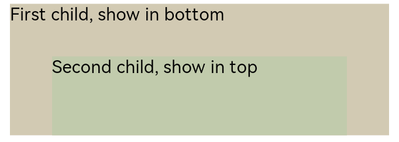

# Stack

A stacking container where child components are sequentially pushed onto the stack, with each subsequent child component overlaying the previous one.

## Import Module

```cangjie
import kit.ArkUI.*
```

## Child Components

Can contain child components.

## Creating the Component

### init(?Alignment, () -> Unit)

```cangjie
public init(alignContent!: ?Alignment = None, child!: () -> Unit = {=>})
```

**Function:** Creates a Stack container containing child components.

**System Capability:** SystemCapability.ArkUI.ArkUI.Full

**Since:** 22

**Parameters:**

| Parameter Name | Type | Required | Default Value | Description |
|:---|:---|:---|:---|:---|
| alignContent | ?[Alignment](./cj-common-types.md#enum-alignment) | No | None | **Named parameter.** Sets the alignment of child components within the container.<br>Initial value: Alignment.Center. |
| child | () -> Unit | No | {=>} | **Named parameter.** Declares the child components within the container. |

## Universal Attributes/Events

Universal attributes: All supported.

Universal events: All supported.

## Component Attributes

### func alignContent(?Alignment)

```cangjie
public func alignContent(value: ?Alignment): This
```

**Function:** Sets the alignment of all child components within the container. If this attribute is set simultaneously with the [universal attribute align](./cj-universal-attribute-layoutconstraints#func-alignalignment), the latter setting takes effect.

**System Capability:** SystemCapability.ArkUI.ArkUI.Full

**Since:** 22

**Parameters:**

| Parameter Name | Type | Required | Default Value | Description |
|:---|:---|:---|:---|:---|
| value | ?[Alignment](./cj-common-types.md#enum-alignment) | Yes | - | The alignment of all child components within the container.<br>Initial value: Alignment.Center. |

## Example Code

Display effect of child components when Stack's alignContent is set to Alignment.Bottom.

<!-- run -->

```cangjie
package ohos_app_cangjie_entry

import kit.ArkUI.*
import ohos.arkui.state_macro_manage.*

@Entry
@Component
class EntryView {
    func build() {
        Stack(alignContent: Alignment.Bottom) {
            Text("First child, show in bottom")
                .width(90.percent)
                .height(100.percent)
                .backgroundColor(0xd2cab3)
                .align(Alignment.Top)
            Text("Second child, show in top")
                .width(70.percent)
                .height(60.percent)
                .backgroundColor(0xc1cbac)
                .align(Alignment.Top)
        }
            .width(100.percent)
            .height(150)
            .margin(top: 5)
    }
}
```

