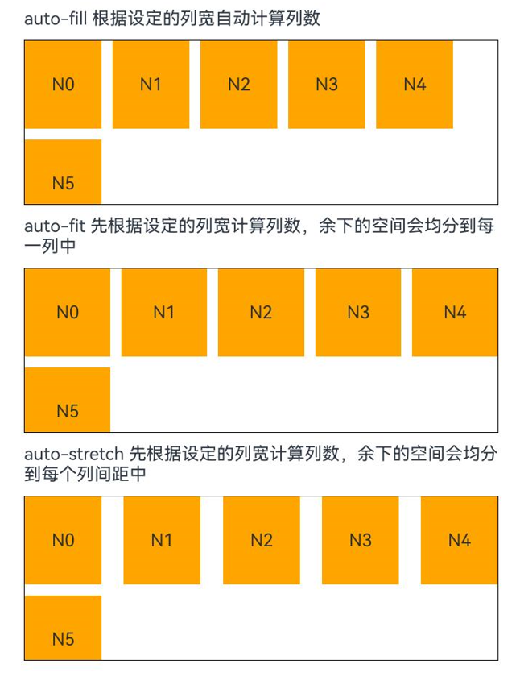

# Grid

A grid container composed of cells divided by "rows" and "columns", enabling diverse layouts by specifying the cells where "items" are placed.

## Import Module

```cangjie
import kit.ArkUI.*
```

## Child Components

Only supports [GridItem](cj-scroll-swipe-griditem.md) child components, including rendering control types ([if/else](../../arkui-cj/rendering_control/cj-rendering-control-ifelse.md), [ForEach](../../arkui-cj/rendering_control/cj-rendering-control-foreach.md), [LazyForEach](cj-state-rendering-lazyforeach.md)).

> **Note:**
>
> - Index calculation rules for Grid child components:
>   - Increments sequentially according to the order of child components.
>   - In if/else statements, only child components within the condition-true branch participate in index calculation; those in the false branch are excluded.
>   - In ForEach/LazyForEach statements, all expanded child nodes are included in index calculation.
>   - When [if/else](../../arkui-cj/rendering_control/cj-rendering-control-ifelse.md), [ForEach](../../arkui-cj/rendering_control/cj-rendering-control-foreach.md), or [LazyForEach](cj-state-rendering-lazyforeach.md) changes, child node indices will be updated.
>   - Child components with visibility set to Hidden or None still participate in index calculation.
>   - Child components with visibility set to None are not displayed but still occupy their corresponding grid cells.
>   - When a child component's position property is set, it occupies its grid cell while being displayed at an offset position relative to the Grid's top-left corner. Such components do not scroll with their grid cells and disappear when the grid cell scrolls out of the Grid's display area.
>   - When gaps exist between Grid child components, the display area will attempt to fill them during scrolling, potentially causing GridItem positions to change relative to each other.

## Creating Components

### init(?Scroller, () -> Unit)

```cangjie
public init(scroller!: ?Scroller = Option.None, child!: () -> Unit = {=>})
```

**Function:** Creates a grid container with scroll controller and child components.

**System Capability:** SystemCapability.ArkUI.ArkUI.Full

**Since:** 22

**Parameters:**

| Parameter | Type | Required | Default | Description |
|:---|:---|:---|:---|:---|
| scroller | ?[Scroller](./cj-scroll-swipe-scroll.md#class-scroller) | No | Option.None | **Named parameter.** Controller for scrollable components, bound to the scrollable component.<br> **Note:** <br>Cannot share the same scroll controller with other scrollable components like [List](cj-scroll-swipe-list.md), [Grid](cj-scroll-swipe-grid.md), or [Scroll](cj-scroll-swipe-scroll.md). |
| child | () -> Unit | No | {=>} | **Named parameter.** Child components of the grid container. |

## Common Attributes/Events

Common Attributes: Supports [Scroll Component Common Attributes](./cj-scroll-swipe-common.md#component-attributes) in addition to general attributes.

Common Events: Supports [Scroll Component Common Events](./cj-scroll-swipe-common.md#component-events) in addition to general events.

## Component Attributes

### func cachedCount(?Int32)

```cangjie
public func cachedCount(value: ?Int32): This
```

**Function:** Sets the number of preloaded GridItems, effective only in [LazyForEach](cj-state-rendering-lazyforeach.md).

After setting the cache, GridItems equal to `cachedCount * number of columns` will be cached above and below the Grid's display area.

[LazyForEach](cj-state-rendering-lazyforeach.md) GridItems outside the display and cache range will be released.

**System Capability:** SystemCapability.ArkUI.ArkUI.Full

**Since:** 22

**Parameters:**

| Parameter | Type | Required | Default | Description |
|:---|:---|:---|:---|:---|
| value | ?Int32 | Yes | - | Number of preloaded GridItems. Initial value: 1 |

### func cachedCount(?Int32, ?Bool)

```cangjie
public func cachedCount(count: ?Int32, show: ?Bool): This
```

**Function:** Sets the number of preloaded GridItems and configures whether to display preloaded nodes.

After setting the cache, GridItems equal to `cachedCount * number of columns` will be cached above and below the Grid's display area. Combined with [Clip](./cj-universal-attribute-shapclip.md#func-clip) or [Content Clip](./cj-universal-attribute-shapclip.md#func-clip) attributes, preloaded nodes can be displayed.

**System Capability:** SystemCapability.ArkUI.ArkUI.Full

**Since:** 22

**Parameters:**

| Parameter | Type | Required | Default | Description |
|:---|:---|:---|:---|:---|
| count | ?Int32 | Yes | - | Number of preloaded GridItems. Initial value: 1 |
| show | ?Bool | Yes | - | Whether preloaded GridItems should be displayed. Initial value: false |

### func columnsGap(?Length)

```cangjie
public func columnsGap(value: ?Length): This
```

**Function:** Sets the gap between columns.

**System Capability:** SystemCapability.ArkUI.ArkUI.Full

**Since:** 22

**Parameters:**

| Parameter | Type | Required | Default | Description |
|:---|:---|:---|:---|:---|
| value | ?[Length](./cj-common-types.md#interface-length) | Yes | - | Gap between columns. Initial value: 0.vp |

### func columnsTemplate(?String)

```cangjie
public func columnsTemplate(value: ?String): This
```

**Function:** Sets the number of columns, fixed column width, or minimum column width for the current grid layout. Defaults to 1 column if not set.

For example, '1fr 1fr 2fr' divides the parent component into 3 columns, allocating 1/4, 1/4, and 2/4 of the parent's width respectively.

- `columnsTemplate('repeat(auto-fit, track-size)')` sets the minimum column width to `track-size`, automatically calculating the number of columns and actual column width.
- `columnsTemplate('repeat(auto-fill, track-size)')` sets the fixed column width to `track-size`, automatically calculating the number of columns.
- `columnsTemplate('repeat(auto-stretch, track-size)')` sets the fixed column width to `track-size`, using `columnsGap` as the minimum column spacing, and automatically calculates the number of columns and actual column spacing.

Here, `repeat`, `auto-fit`, `auto-fill`, and `auto-stretch` are keywords. `track-size` represents column width, supporting units like px, vp, %, or valid numbers (default unit: vp). At least one valid column width must be specified.

> **Note:**
> - `auto-stretch` mode only supports a single valid `track-size` value, and `track-size` cannot use %.
> - Setting '0fr' makes the column width 0, hiding GridItems. Other invalid values default to 1 column.
> - When setting a track-size with a unit, it needs to follow the format of number + unit, such as '16vp' or '20%', which is different from the format used for Length type.

**System Capability:** SystemCapability.ArkUI.ArkUI.Full

**Since:** 22

**Parameters:**

| Parameter | Type | Required | Default | Description |
|:---|:---|:---|:---|:---|
| value | ?String | Yes | - | Number of columns or minimum column width for the grid layout. Initial value: "1fr" |

### func rowsGap(?Length)

```cangjie
public func rowsGap(value: ?Length): This
```

**Function:** Sets the gap between rows.

**System Capability:** SystemCapability.ArkUI.ArkUI.Full

**Since:** 22

**Parameters:**

| Parameter | Type | Required | Default | Description |
|:---|:---|:---|:---|:---|
| value | ?[Length](./cj-common-types.md#interface-length) | Yes | - | Gap between rows. Initial value: 0.vp |

### func rowsTemplate(?String)

```cangjie
public func rowsTemplate(value: ?String): This
```

**Function:** Sets the number of rows, fixed row height, or minimum row height for the current grid layout. Defaults to 1 row if not set.

For example, '1fr 1fr 2fr' divides the parent component into 3 rows, allocating 1/4, 1/4, and 2/4 of the parent's height respectively.

- `rowsTemplate('repeat(auto-fit, track-size)')` sets the minimum row height to `track-size`, automatically calculating the number of rows and actual row height.
- `rowsTemplate('repeat(auto-fill, track-size)')` sets the fixed row height to `track-size`, automatically calculating the number of rows.
- `rowsTemplate('repeat(auto-stretch, track-size)')` sets the fixed row height to `track-size`, using `rowsGap` as the minimum row spacing, and automatically calculates the number of rows and actual row spacing.

Here, `repeat`, `auto-fit`, `auto-fill`, and `auto-stretch` are keywords. `track-size` represents row height, supporting units like px, vp, %, or valid numbers (default unit: vp). At least one valid row height must be specified.

> **Note:**
> - `auto-stretch` mode only supports a single valid `track-size` value, and `track-size` cannot use %.
> - Setting '0fr' makes the row height 0, hiding GridItems. Other invalid values default to 1 row.
> - When setting a track-size with a unit, it needs to follow the format of number + unit, such as '16vp' or '20%', which is different from the format used for Length type.

Grid components can be categorized into three layout modes based on `rowsTemplate` and `columnsTemplate` settings:

1. Both `rowsTemplate` and `columnsTemplate` are set:
   - Grid displays only fixed rows and columns; other elements are hidden, and Grid cannot scroll.
   - If Grid's width/height is unset, it defaults to the parent component's size.
   - Grid cell sizes are allocated proportionally after subtracting all row/column gaps from the Grid's content area.
   - GridItems fill their grid cells by default.

2. Only one of `rowsTemplate` or `columnsTemplate` is set:
   - Elements are arranged along the set direction. When exceeding the display area, Grid becomes scrollable.
     - If `columnsTemplate` is set, scrolling is vertical (main axis: vertical, cross axis: horizontal).
     - If `rowsTemplate` is set, scrolling is horizontal (main axis: horizontal, cross axis: vertical).
   - Cross-axis cell sizes are allocated proportionally after subtracting gaps from the Grid's cross-axis content area.
   - Main-axis cell sizes adopt the maximum height among all GridItems in the current cross-axis row.

3. Neither `rowsTemplate` nor `columnsTemplate` is set:
   - The number of rows is determined by Grid height, first element height, and `rowsGap`. Elements beyond the row/column capacity are hidden and cannot be scrolled into view.
   - Only these attributes take effect: `columnsGap`, `rowsGap`.
   - If no GridItems exist, Grid's width/height is 0.

**System Capability:** SystemCapability.ArkUI.ArkUI.Full

**Since:** 22

**Parameters:**

| Parameter | Type | Required | Default | Description |
|:---|:---|:---|:---|:---|
| value | ?String | Yes | - | Number of rows or minimum row height for the grid layout. Initial value: "1fr" |

## Example Code

### Example 1 (Adaptive Column Count)

Demonstrates usage of `auto-fill`, `auto-fit`, and `auto-stretch` in [columnsTemplate](#func-columnstemplatestring).

<!-- run -->

```cangjie
package ohos_app_cangjie_entry

import ohos.arkui.state_macro_manage.Entry
import ohos.arkui.state_macro_manage.Component
import ohos.arkui.state_macro_manage.State
import ohos.arkui.state_macro_manage.r
import ohos.base.*
import ohos.arkui.component.*
import ohos.arkui.state_management.*
import ohos.arkui.state_macro_manage.*
import std.collection.{ArrayList, HashMap}

@Entry
@Component
class EntryView {
    var data: Array<Int64> = [0, 1, 2, 3, 4, 5]
    var data1: Array<Int64> = [0, 1, 2, 3, 4, 5]
    var data2: Array<Int64> = [0, 1, 2, 3, 4, 5]

    func build() {
        Column(space: 10) {
            Text("auto-fill: Automatically calculates columns based on set column width").width(90.percent)
            Grid() {
                ForEach(
                    this.data,
                    itemGeneratorFunc: {
                        item: Int64, idx: Int64 => GridItem() {
                            Text("N ${item}").height(80)
                        }.backgroundColor(Color.Gray)
                    }
                )
            }
                .width(90.percent)
                .border(width: 1.vp, color: Color.Black)
                .columnsTemplate("repeat(auto-fill, 70)")
                .columnsGap(10)
                .rowsGap(10)
                .height(150)

            Text("auto-fit: Calculates columns first, then evenly distributes remaining space").width(90.percent)
            Grid() {
                ForEach(
                    this.data1,
                    itemGeneratorFunc: {
                        item: Int64, idx: Int64 => GridItem() {
                            Text("N ${item}").height(80)
                        }.backgroundColor(Color.Gray)
                    }
                )
            }
                .width(90.percent)
                .border(width: 1.vp, color: Color.Black)
                .columnsTemplate("repeat(auto-fit, 70)")
                .columnsGap(10)
                .rowsGap(10)
                .height(150)

            Text("auto-stretch: Calculates columns first, then evenly distributes remaining space to gaps").width(90.percent)
            Grid() {
                ForEach(
                    this.data2,
                    itemGeneratorFunc: {
                        item: Int64, idx: Int64 => GridItem() {
                            Text("N ${item}").height(80)
                        }.backgroundColor(Color.Gray)
                    }
                )
            }
                .width(90.percent)
                .border(width: 1.vp, color: Color.Black)
                .columnsTemplate('repeat(auto-stretch, 70)')
                .columnsGap(10)
                .rowsGap(10)
                .height(150)
        }.width(100.percent).height(100.percent)
    }
}
```

