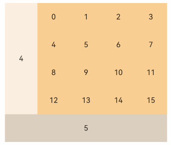

# GridItem

A single item container within a grid container.

> **NOTE:**
>
> - Only supported as a child component of the [Grid](./cj-scroll-swipe-grid.md) component.
> - When GridItem is used with [LazyForEach](cj-state-rendering-lazyforeach.md), GridItem's child components are created when the GridItem is created. When used with [if/else](../../../en/application-dev/arkui-cj/rendering_control/cj-rendering-control-ifelse.md), [ForEach](../../../en/application-dev/arkui-cj/rendering_control/cj-rendering-control-foreach.md), or when the parent component is Grid, GridItem's child components are created during GridItem layout.

## Import Module

```cangjie
import kit.ArkUI.*
```

## Child Components

Can contain a single child component.

## Creating the Component

### init()

```cangjie
public init()
```

**Function:** Creates a single item component within a grid container.

**System Capability:** SystemCapability.ArkUI.ArkUI.Full

**Since:** 21

### init(() -> Unit)

```cangjie
public init(child: () -> Unit)
```

**Function:** Creates a single item component within a grid container that can contain child components.

**System Capability:** SystemCapability.ArkUI.ArkUI.Full

**Since:** 21

**Parameters:**

| Name | Type | Required | Default | Description |
|:---|:---|:---|:---|:---|
| child | ()->Unit | Yes | - | The child component of the GridItem container. |

## Common Attributes/Common Events

Common Attributes: All supported.

Common Events: All supported.

## Component Attributes

### func columnEnd(Int32)

```cangjie
public func columnEnd(value: Int32): This
```

**Function:** Sets the ending column number of the current element.

**System Capability:** SystemCapability.ArkUI.ArkUI.Full

**Since:** 21

**Parameters:**

| Name | Type | Required | Default | Description |
|:---|:---|:---|:---|:---|
| value | Int32 | Yes | - | The ending column number of the current element, used in conjunction with columnStart. For scenarios requiring specification of GridItem's starting row/column numbers and occupied rows/columns, it is recommended to use [Grid's layoutOptions parameter](./cj-scroll-swipe-grid.md#class-gridlayoutoptions).<br/>Valid range: [0, total columns - 1]. |

### func columnStart(Int32)

```cangjie
public func columnStart(value: Int32): This
```

**Function:** Sets the starting column number of the current element.

**System Capability:** SystemCapability.ArkUI.ArkUI.Full

**Since:** 21

**Parameters:**

| Name | Type | Required | Default | Description |
|:---|:---|:---|:---|:---|
| value | Int32 | Yes | - | The starting column number of the current element, used in conjunction with columnEnd. For scenarios requiring specification of GridItem's starting row/column numbers and occupied rows/columns, it is recommended to use [Grid's layoutOptions parameter](./cj-scroll-swipe-grid.md#class-gridlayoutoptions).<br/>Valid range: [0, total columns - 1] |

### func rowEnd(Int32)

```cangjie
public func rowEnd(rowEnd: Int32): This
```

**Function:** Sets the ending row number of the current element.

**System Capability:** SystemCapability.ArkUI.ArkUI.Full

**Since:** 21

**Parameters:**

| Name | Type | Required | Default | Description |
|:---|:---|:---|:---|:---|
| rowEnd | Int32 | Yes | - | The ending row number of the current element, used in conjunction with rowStart. For scenarios requiring specification of GridItem's starting row/column numbers and occupied rows/columns, it is recommended to use [Grid's layoutOptions parameter](./cj-scroll-swipe-grid.md#class-gridlayoutoptions).<br/>Valid range: [0, total rows - 1] |

### func rowStart(Int32)

```cangjie
public func rowStart(rowStart: Int32): This
```

**Function:** Sets the starting row number of the current element.

**System Capability:** SystemCapability.ArkUI.ArkUI.Full

**Since:** 21

**Parameters:**

| Name | Type | Required | Default | Description |
|:---|:---|:---|:---|:---|
| rowStart | Int32 | Yes | - | The starting row number of the current element, used in conjunction with rowEnd. For scenarios requiring specification of GridItem's starting row/column numbers and occupied rows/columns, it is recommended to use [Grid's layoutOptions parameter](./cj-scroll-swipe-grid.md#class-gridlayoutoptions).<br/>Valid range: [0, total rows - 1] |

## Example Code

### Example 1 (Setting GridItem Position)

GridItem sets its position by configuring appropriate ColumnStart, ColumnEnd, RowStart, and RowEnd attributes. For scenarios requiring specification of GridItem's starting row/column numbers and occupied rows/columns, it is recommended to use [Grid's layoutOptions parameter](./cj-scroll-swipe-grid.md#class-gridlayoutoptions).

<!-- run -->

```cangjie
package ohos_app_cangjie_entry

import kit.ArkUI.*
import ohos.arkui.state_macro_manage.*
import std.collection.{ArrayList, HashMap}

@Entry
@Component
class EntryView {
    let scroller = Scroller()
    @State
    var numbers: ArrayList<String> = ArrayList(["0", "1", "2", "3", "4", "5", "6", "7", "8", "9", "10", "11", "12", "13",
        "14", "15"])

    func build() {
        Column() {
            Grid {
                // Set the starting row number to 1 and ending row number to 4 for the current GridItem component
                GridItem {
                    Text("4")
                        .fontSize(16)
                        .backgroundColor(0xFAEEE0)
                        .width(100.percent)
                        .height(100.percent)
                        .textAlign(TextAlign.Center)
                        .id("gridItem1")
                }.rowStart(1).rowEnd(4)

                // Render GridItems in a loop, labeled 0-15
                ForEach(
                    this.numbers,
                    itemGeneratorFunc: {
                        num: String, idx: Int64 => GridItem {
                            Text(num)
                                .fontSize(16)
                                .backgroundColor(0xF9CF93)
                                .width(100.percent)
                                .height(100.percent)
                                .textAlign(TextAlign.Center)
                        }
                    }
                )
                // Set the starting column number to 1 and ending column number to 5 for the current GridItem component
                GridItem {
                    Text("5")
                        .fontSize(16)
                        .backgroundColor(0xDBD0C0)
                        .width(100.percent)
                        .height(100.percent)
                        .textAlign(TextAlign.Center)
                        .id("gridItem2")
                }.columnStart(1).columnEnd(5)
            }
                .columnsTemplate("1fr 1fr 1fr 1fr 1fr")
                .rowsTemplate("1fr 1fr 1fr 1fr 1fr")
                .width(90.percent)
                .backgroundColor(0xFAEEE0)
                .height(300)
        }.width(100.percent).margin(top: 5)
    }
}
```

