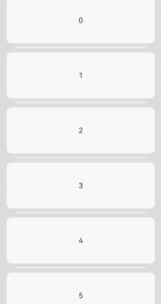
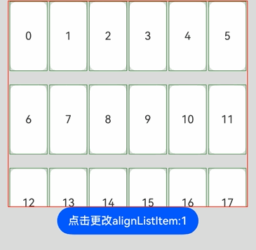
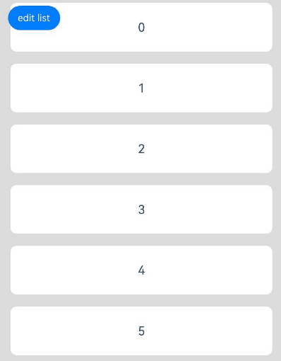
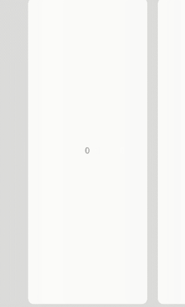

# List

A container component that contains a series of list items with the same width. Suitable for presenting homogeneous data in continuous, multi-line formats, such as images and text.

## Import Module

```cangjie
import kit.ArkUI.*
```

## Child Components

Only supports [ListItem](./cj-scroll-swipe-listitem.md) and [ListItemGroup](./cj-scroll-swipe-listgroup.md) child components. Supports rendering control types ([if/else](../../arkui-cj/rendering_control/cj-rendering-control-ifelse.md), [ForEach](../../arkui-cj/rendering_control/cj-rendering-control-foreach.md), [LazyForEach](./cj-state-rendering-lazyforeach.md)).

> **Note:**
>
> Index calculation rules for List child components:
>
> * Increments sequentially in the order of child components.
> * In if/else statements, only child components within the branch where the condition is true participate in index calculation; those in the false branch are excluded.
> * In ForEach/LazyForEach statements, all expanded child nodes are included in index calculation.
> * When [if/else](../../arkui-cj/rendering_control/cj-rendering-control-ifelse.md), [ForEach](../../arkui-cj/rendering_control/cj-rendering-control-foreach.md), or [LazyForEach](./cj-state-rendering-lazyforeach.md) changes, child node indices are updated.
> * ListItemGroup is treated as a single unit for index calculation, and its internal ListItems are excluded.
> * Child components with visibility set to Hidden or None are still included in index calculation.

## Creating the Component

### init(?Int64, ?Int32, ?Scroller, () -> Unit)

```cangjie
public init(
    space!: ?Int64 = None,
    initialIndex!: ?Int32 = None,
    scroller!: ?Scroller = Option<Scroller>.None,
    child!: () -> Unit
)
```

**Function:** Creates a List container that can hold child components.

**System Capability:** SystemCapability.ArkUI.ArkUI.Full

**Since Version:** 22

**Parameters:**

| Parameter Name | Type | Required | Default Value | Description |
|:---|:---|:---|:---|:---|
| space | ?Int64 | No | None | **Named parameter.** Spacing between child components along the main axis. |
| initialIndex | ?Int32 | No | None | **Named parameter.** Sets the initial item displayed at the viewport's starting position when the List first loads. If the value exceeds the index of the last item, it is ignored. |
| scroller | ?[Scroller](cj-scroll-swipe-scroll.md#class-scroller) | No | Option\<Scroller>.None | **Named parameter.** Controller for scrollable components, used to bind with scrollable components. |
| child | () -> Unit | Yes | - | **Named parameter.** Declares the List child components within the container. |

## Common Attributes/Events

Common Attributes: Supports [Common Attributes of Scrollable Components](./cj-scroll-swipe-common.md#component-attributes) in addition to general attributes.

Common Events: Supports [Common Events of Scrollable Components](./cj-scroll-swipe-common.md#component-events) in addition to general events.

## Component Attributes

### func alignListItem(?ListItemAlign)

```cangjie
public func alignListItem(value: ?ListItemAlign): This
```

**Function:** Sets the layout alignment of ListItems along the cross axis when the List's cross-axis width exceeds `ListItem's cross-axis width * lanes`.

**System Capability:** SystemCapability.ArkUI.ArkUI.Full

**Since Version:** 22

**Parameters:**

| Parameter Name | Type | Required | Default Value | Description |
|:---|:---|:---|:---|:---|
| value | ?[ListItemAlign](./cj-common-types.md#enum-listitemalign) | Yes | - | Cross-axis layout alignment. Initial value: ListItemAlign.Start. |

### func cachedCount(?Int32)

```cangjie
public func cachedCount(value: ?Int32): This
```

**Function:** Sets the number of ListItems/ListItemGroups to preload. In lazy-loading scenarios, only `cachedCount` items outside the display area are preloaded. In non-lazy-loading scenarios, all items are loaded. Both scenarios only lay out items within the display area plus `cachedCount` items outside.

After setting `cachedCount`, ListItems outside the display area are preloaded and laid out in both upward and downward directions. When counting ListItem rows, ListItems within ListItemGroups are included. If a ListItemGroup contains no ListItems, the entire group counts as one row.

When LazyForEach is nested under List and ListItemGroup is nested under LazyForEach, LazyForEach creates `cachedCount` ListItemGroups outside the display area in both upward and downward directions.

**System Capability:** SystemCapability.ArkUI.ArkUI.Full

**Since Version:** 22

**Parameters:**

| Parameter Name | Type | Required | Default Value | Description |
|:---|:---|:---|:---|:---|
| value | ?Int32 | Yes | - | Number of ListItems/ListItemGroups to preload. Initial value: 1. |

### func chainAnimation(?Bool)

```cangjie
public func chainAnimation(value: ?Bool): This
```

**Function:** Enables or disables chain animation. Chain animation provides a visual "chaining" effect when scrolling or dragging to the top/bottom boundaries.

**System Capability:** SystemCapability.ArkUI.ArkUI.Full

**Since Version:** 22

**Parameters:**

| Parameter Name | Type | Required | Default Value | Description |
|:---|:---|:---|:---|:---|
| value | ?Bool | Yes | - | Whether to enable chain animation. Initial value: false. |

### func divider(Option\<ListDividerOptions>)

```cangjie
public func divider(value: Option<ListDividerOptions>): This
```

**Function:** Sets the divider style between list items. No dividers are shown by default.

**System Capability:** SystemCapability.ArkUI.ArkUI.Full

**Since Version:** 22

**Parameters:**

| Parameter Name | Type | Required | Default Value | Description |
|:---|:---|:---|:---|:---|
| value | Option\<[ListDividerOptions](./cj-scroll-swipe-listgroup.md#class-listdivideroptions)> | Yes | - | Divider style configuration. |

### func edgeEffect(?EdgeEffect)

```cangjie
public func edgeEffect(value: ?EdgeEffect): This
```

**Function:** Sets the edge effect when scrolling to boundaries.

**System Capability:** SystemCapability.ArkUI.ArkUI.Full

**Since Version:** 22

**Parameters:**

| Parameter Name | Type | Required | Default Value | Description |
|:---|:---|:---|:---|:---|
| value | ?[EdgeEffect](./cj-common-types.md#enum-edgeeffect) | Yes | - | Edge effect type. Initial value: EdgeEffect.Spring. |

### func lanes(?Int32)

```cangjie
public func lanes(value: ?Int32): This
```

**Function:** Sets the number of columns or rows in the list.

**System Capability:** SystemCapability.ArkUI.ArkUI.Full

**Since Version:** 22

**Parameters:**

| Parameter Name | Type | Required | Default Value | Description |
|:---|:---|:---|:---|:---|
| value | ?Int32 | Yes | - | Number of columns or rows. Initial value: 1. |

### func lanes(?Length, ?Length)

```cangjie
public func lanes(minLength!: ?Length, maxLength!: ?Length): This
```

**Function:** Sets the number of columns or rows in the list.

**System Capability:** SystemCapability.ArkUI.ArkUI.Full

**Since Version:** 22

**Parameters:**

| Parameter Name | Type | Required | Default Value | Description |
|:---|:---|:---|:---|:---|
| minLength | ?[Length](./cj-common-types.md#interface-length) | Yes | - | **Named parameter.** Minimum length of columns or rows. Initial value: (-1.0).vp. |
| maxLength | ?[Length](./cj-common-types.md#interface-length) | Yes | - | **Named parameter.** Maximum length of columns or rows. Initial value: (-1.0).vp. |

### func listDirection(?Axis)

```cangjie
public func listDirection(value: ?Axis): This
```

**Function:** Sets the direction in which list items are arranged.

**System Capability:** SystemCapability.ArkUI.ArkUI.Full

**Since Version:** 22

**Parameters:**

| Parameter Name | Type | Required | Default Value | Description |
|:---|:---|:---|:---|:---|
| value | ?[Axis](./cj-common-types.md#enum-axis) | Yes | - | List item arrangement direction. Initial value: Axis.Vertical. |

### func multiSelectable(?Bool)

```cangjie
public func multiSelectable(value: ?Bool): This
```

**Function:** Enables or disables multi-selection.

**System Capability:** SystemCapability.ArkUI.ArkUI.Full

**Since Version:** 22

**Parameters:**

| Parameter Name | Type | Required | Default Value | Description |
|:---|:---|:---|:---|:---|
| value | ?Bool | Yes | - | Whether to enable multi-selection. Initial value: false. |

### func sticky(?StickyStyle)

```cangjie
public func sticky(value: ?StickyStyle): This
```

**Function:** Sets whether to pin ListItemGroup headers to the top or footers to the bottom.

**System Capability:** SystemCapability.ArkUI.ArkUI.Full

**Since Version:** 22

**Parameters:**

| Parameter Name | Type | Required | Default Value | Description |
|:---|:---|:---|:---|:---|
| value | ?[StickyStyle](./cj-common-types.md#enum-stickystyle) | Yes | - | Sticky style. Initial value: StickyStyle.None. |

## Component Events

### func onScrollFrameBegin(?(Float64, ScrollState) -> onScrollFrameBeginHandleResult)

```cangjie
public func onScrollFrameBegin(event: ?(Float64, ScrollState) -> onScrollFrameBeginHandleResult): This
```

**Function:** Triggered at the start of each scroll frame.

**System Capability:** SystemCapability.ArkUI.ArkUI.Full

**Since Version:** 22

**Parameters:**

| Parameter Name | Type | Required | Default Value | Description |
|:---|:---|:---|:---|:---|
| event | ?(Float64, [ScrollState](./cj-common-types.md#enum-scrollstate)) -> [OnScrollFrameBeginHandlerResult](#class-onscrollframebeginhandlerresult) | Yes | - | Scroll frame start event callback. Initial value: `{ _, _ => onScrollFrameBeginHandleResult(offsetRemain: 0.0) }`. |

### func onScrollIndex(?(Int32, Int32, Int32) -> Unit)

```cangjie
public func onScrollIndex(event: ?(Int32, Int32, Int32) -> Unit): This
```

**Function:** Triggered when child components enter or leave the list display area.

**System Capability:** SystemCapability.ArkUI.ArkUI.Full

**Since Version:** 22

**Parameters:**

| Parameter Name | Type | Required | Default Value | Description |
|:---|:---|:---|:---|:---|
| event | ?(Int32, Int32, Int32) -> Unit | Yes | - | Scroll index event callback. Initial value: `{ _, _, _ => }`. |

## Basic Type Definitions

### class OnScrollFrameBeginHandlerResult

```cangjie
public class OnScrollFrameBeginHandlerResult {
    public var offsetRemain: ?Float64
    public init(offsetRemain!: ?Float64)
}
```

**Function:** Result of scroll frame start handling.

**System Capability:** SystemCapability.ArkUI.ArkUI.Full

**Since Version:** 22

#### var offsetRemain

```cangjie
public var offsetRemain: ?Float64
```

**Function:** Remaining offset.

**Type:** ?Float64

**Read/Write:** Read-Write

**System Capability:** SystemCapability.ArkUI.ArkUI.Full

**Since Version:** 22

#### init(?Float64)

```cangjie
public init(offsetRemain!: ?Float64)
```

**Function:** Creates an `onScrollFrameBeginHandleResult` object.

**System Capability:** SystemCapability.ArkUI.ArkUI.Full

**Since Version:** 22

**Parameters:**

| Parameter Name | Type | Required | Default Value | Description |
|:---|:---|:---|:---|:---|
| offsetRemain | ?Float64 | Yes | - | **Named parameter.** Remaining offset. Initial value: 0.0. |

## Example Code

### Example 1 (Adding Scroll Events)

This example demonstrates setting up a vertical list and logging indices when the display area changes.

<!-- run -->

```cangjie
package ohos_app_cangjie_entry
import kit.ArkUI.*
import ohos.arkui.state_macro_manage.*
import ohos.hi_trace_meter.*
import ohos.hiviewdfx.hi_app_event.*
import ohos.hilog.*

func loggerInfo(str: String) {
    Hilog.info(0, "CangjieTest", str)
}

@Entry
@Component
class EntryView {
    let arr =[0, 1, 2, 3, 4, 5, 6, 7, 8, 9]
    func build() {
        Stack(alignContent: Alignment.TopStart){
            Column() {
                List( space: 20, initialIndex: 0 ) {
                    ForEach(this.arr, itemGeneratorFunc: {item:Int64,_:Int64 =>
                            ListItem() {
                                Text("${item}")
                                .width(100.percent).height(100).fontSize(16)
                                .textAlign(TextAlign.Center).borderRadius(10).backgroundColor(0xFFFFFF)
                            }
                            })
                }.id("list")
                .listDirection(Axis.Vertical) // Arrangement direction
                .scrollBar(BarState.Off)
                //.friction(0.6)
                .divider(ListDividerOptions(strokeWidth: 2.px, color: Color(0xFFFFFF), startMargin: 20.px, endMargin: 20.px)) // Divider between rows
                .edgeEffect(EdgeEffect.Spring) // Edge effect set to Spring
                .onScrollIndex({firstIndex: Int32, lastIndex: Int32, middleIndex: Int32 =>
                        loggerInfo("first" + firstIndex.toString())
                        loggerInfo("last" + lastIndex.toString())
                        loggerInfo("middle" + middleIndex.toString())
                      })
                .width(90.percent)
                }
            .width(100.percent)
            .height(100.percent)
            .backgroundColor(0xDCDCDC)
            .padding(top: 5.px )
        }
    }
}
```



### Example 2 (Setting Child Element Alignment)

This example demonstrates the alignment effects of List child components along the cross axis under different `ListItemAlign` enum values.

<!-- run -->

```cangjie
package ohos_app_cangjie_entry
import kit.ArkUI.*
import ohos.arkui.state_macro_manage.*

@Entry
@Component
class EntryView {
    let arr: Array<String> = ["0", "1", "2", "3", "4", "5", "6", "7", "8", "9", "10", "11", "12", "13", "14", "15",
        "16", "17", "18", "19"]
    @State var alignListItem: ListItemAlign = ListItemAlign.Start

    func build() {
        Column() {
            List(space: 20, initialIndex: 0) {
                ForEach(
                    this.arr,
                    itemGeneratorFunc: {
                        item: String, _: Int64 => ListItem() {
                            Text("${item}")
                            .width(100.percent)
                            .height(100)
                            .fontSize(16)
                            .textAlign(TextAlign.Center)
                            .borderRadius(10).backgroundColor(0xFFFFFF)
                        }.border(width: 2.px, color: Color.Green).width(55)
                    }
                )
            }
            .height(300)
            .width(90.percent)
            .border(width: 3.px, color: Color.Red)
            .lanes(6)
            .alignListItem(
                this.alignListItem)
            .scrollBar(BarState.Off)
            Button("Click to change alignListItem").onClick(
                {
                 evt => match (this.alignListItem) {
                    case ListItemAlign.Start =>
                        this.alignListItem = ListItemAlign.Center
                    case ListItemAlign.Center =>
                        this.alignListItem = ListItemAlign.End
                    case ListItemAlign.End =>
                        this.alignListItem = ListItemAlign.Start
                    case _ => return
                }
            })
        }.width(100.percent).height(100.percent).backgroundColor(0xDCDCDC).padding(top: 5.px)
    }
}
```

### Example 3 (Setting Edit Mode)

This example demonstrates how to set whether the current List component is in editable mode.

<!-- run -->

```cangjie
package ohos_app_cangjie_entry
import kit.ArkUI.*
import ohos.arkui.state_macro_manage.*

@Entry
@Component
class EntryView {
  @State var arr:ObservedArrayList<Int64> = ObservedArrayList<Int64>([0, 1, 2, 3, 4, 5, 6, 7, 8, 9])
  @State var editFlag: Bool = false

  func build() {
    Stack(alignContent: Alignment.TopStart ) {
      Column() {
        List(space: 20, initialIndex: 0 ) {
          ForEach(this.arr, itemGeneratorFunc:{item: Int64,index: Int64  =>
            ListItem() {
              Flex(direction:FlexDirection.Row, alignItems:ItemAlign.Center) {
                Text("${item}" )
                  .width(100.percent)
                  .height(80)
                  .fontSize(20)
                  .textAlign(TextAlign.Center)
                  .borderRadius(10)
                  .backgroundColor(0xFFFFFF)
                  .flexShrink(1)
                if (this.editFlag) {
                  Button() {
                    Text("delete").fontSize(16)
                  }.width(30.percent).height(40)
                  .onClick({event =>
                    if (index >=0 && index<this.arr.size) {
                      //BaseLog.info( "${this.arr[index]}Delete")
                      this.arr.remove(index)
                      //Hilog.info(0, "AppLogCj", this.arr.size.toString())
                      this.editFlag = false
                   }
                  }).stateEffect(true)
                }
              }
            }
          })
        }.width(90.percent)
        .scrollBar(BarState.Off)
      }.width(100.percent)

      Button("edit list")
        .onClick({event=>
          this.editFlag = !this.editFlag
        }).margin(top: 5, left: 20 )
    }.width(100.percent).height(100.percent).backgroundColor(0xDCDCDC).padding(top: 5)
  }
}
```



### Example 4 (Setting Alignment Limits)

This example demonstrates the implementation effect of setting center alignment limits for the List component.

<!-- run -->

```cangjie
package ohos_app_cangjie_entry
import kit.ArkUI.*
import ohos.arkui.state_macro_manage.*
import std.collection.ArrayList

@Entry
@Component
class EntryView {
   let arr: ArrayList<Int64> =  ArrayList<Int64>([0,1,2,3,4,5,6,7,8,9,10,11,12,13,14,15,16,17,18,19])
   let scrollerForList = Scroller()

  func build() {
    Column() {
      Row() {
        List(space: 20, initialIndex: 3, scroller: this.scrollerForList ) {
          ForEach(this.arr, itemGeneratorFunc:{item:Int64,_:Int64=>
            ListItem() {
              Text("${item}")
                .width(100.percent).height(100).fontSize(16)
                .textAlign(TextAlign.Center)
            }
            .borderRadius(10).backgroundColor(0xFFFFFF)
            .width(60.percent)
            .height(80.percent)
          } )
        }
        .chainAnimation(true)
        .edgeEffect(EdgeEffect.Spring)
        .listDirection(Axis.Horizontal)
        .height(100.percent)
        .width(100.percent)
        .borderRadius(10.px)
        .backgroundColor(0xDCDCDC)
      }
      .width(100.percent)
      .height(100.percent)
      .backgroundColor(0xDCDCDC)
      .padding(top: 10.px )
    }
  }
}
```

