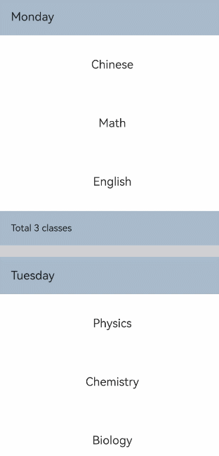

# ListItemGroup

This component is used to display grouped list items. By default, it fills the width of the [List](cj-scroll-swipe-list.md) component and must be used in conjunction with the List component.

> **Note:**
>
> - The parent component of this component can only be [List](cj-scroll-swipe-list.md).
> - The ListItemGroup component does not support setting the [universal attribute aspectRatio](cj-universal-attribute-size.md#func-aspectratiofloat64).
> - When the listDirection property of the parent List component is set to Axis.Vertical, setting the [universal attribute height](cj-universal-attribute-size.md#func-heightlength) property will not take effect. The height of the ListItemGroup is the sum of the header height, footer height, and the total height of all ListItems after layout.
> - When the listDirection property of the parent List component is set to Axis.Horizontal, setting the [universal attribute width](cj-universal-attribute-size.md#func-widthoptionlength) property will not take effect. The width of the ListItemGroup is the sum of the header width, footer width, and the total width of all ListItems after layout.
> - The ListItem components inside the current ListItemGroup do not support editing or dragging, meaning the editable property of the ListItem component will not take effect.
> - Using the direction property to set the layout direction in ListItemGroup will not take effect. The layout direction of the ListItemGroup component follows the layout direction of its parent List component.

## Import Module

```cangjie
import kit.ArkUI.*
```

## Child Components

Includes [ListItem](./cj-scroll-swipe-listitem.md) child components.

## Creating the Component

### init(?CustomBuilder, ?CustomBuilder, ?Length, ?ListItemGroupStyle, () -> Unit)

```cangjie
public init(
    header!: ?CustomBuilder = None,
    footer!: ?CustomBuilder = None,
    space!: ?Length = None,
    style!: ?ListItemGroupStyle = Option.None,
    child!: () -> Unit
)
```

**Function:** Creates a ListItemGroup component.

**System Capability:** SystemCapability.ArkUI.ArkUI.Full

**Initial Version:** 22

**Parameters:**

| Parameter | Type              | Required | Default Value | Description                                                                                                                                                                                                                                                                                                                                                                                                                                   |
|:--------- |:----------------- |:-------- |:------------- |:-------------------------------------------------------------------------------------------------------------------------------------------------------------------------------------------------------------------------------------------------------------------------------------------------------------------------------------------------------------------------------------------------------------------------------------------- |
| header    | ?[CustomBuilder](./cj-common-types.md#type-custombuilder)  | No       | None         | **Named parameter.** Sets the header component of the ListItemGroup.                                                                                                                                                                                                                                                                                                                                                                       |
| footer    | ?[CustomBuilder](./cj-common-types.md#type-custombuilder)  | No       | None         | **Named parameter.** Sets the footer component of the ListItemGroup.                                                                                                                                                                                                                                                                                                                                                                       |
| space     | ?[Length](./cj-common-types.md#interface-length)         | No       | None         | **Named parameter.** The spacing between list items. Only applies between ListItem and ListItem, not between header and ListItem or footer and ListItem.                                                                                                                                                                                                                                                                                  |
| style     | ?[ListItemGroupStyle](#enum-listitemgroupstyle) | No       | Option.None  | **Named parameter.** Sets the card style of the List component.                                                                                                                                                                                                                                                                                                                                                                            |
| child     | ()->Unit        | Yes      | -            | Declares the child components of the container.                                                                                                                                                                                                                                                                                                                                                                                           |

## Universal Attributes/Events

Universal Attributes: All supported.

> **Note:**
>
> Does not support [setting the universal attribute aspectRatio](./cj-universal-attribute-size.md#func-aspectratiofloat64).

Universal Events: All supported.

## Component Attributes

### func divider(Option\<ListDividerOptions>)

```cangjie
public func divider(value: Option<ListDividerOptions>): This
```

**Function:** Set the ListItem divider style. By default, there is no divider. strokeWidth, startMargin and endMargin do not support setting percentages.

**System Capability:** SystemCapability.ArkUI.ArkUI.Full

**Initial Version:** 22

**Parameters:**

|Parameter|Type|Required|Default|Description|
|:---|:---|:---|:---|:---|
|value|Option<[ListDividerOptions](#class-listdivideroptions)>|Yes|None|ListItem divider line style. When set to Option.None, it indicates no divider.|

## Basic Type Definitions

### class ListDividerOptions

```cangjie
public class ListDividerOptions {
    public var strokeWidth: ?Length
    public var color: ?ResourceColor
    public var startMargin: ?Length
    public var endMargin: ?Length
    public init(
        strokeWidth!: ?Length,
        color!: ?ResourceColor = None,
        startMargin!: ?Length = None,
        endMargin!: ?Length = None
    )
}
```

**Function:** The divider style for ListItem.

**System Capability:** SystemCapability.ArkUI.ArkUI.Full

**Initial Version:** 22

#### var color

```cangjie
public var color: ?ResourceColor
```

**Function:** Sets the color of the divider.

**Type:** ?[ResourceColor](./cj-common-types.md#interface-resourcecolor)

**Read/Write Capability:** Readable and Writable

**System Capability:** SystemCapability.ArkUI.ArkUI.Full

**Initial Version:** 22

#### var endMargin

```cangjie
public var endMargin: ?Length
```

**Function:** Sets the distance from the divider to the end edge of the list side.

**Type:** ?[Length](./cj-common-types.md#interface-length)

**Read/Write Capability:** Readable and Writable

**System Capability:** SystemCapability.ArkUI.ArkUI.Full

**Initial Version:** 22

#### var startMargin

```cangjie
public var startMargin: ?Length
```

**Function:** Sets the distance from the divider to the start edge of the list side.

**Type:** ?[Length](./cj-common-types.md#interface-length)

**Read/Write Capability:** Readable and Writable

**System Capability:** SystemCapability.ArkUI.ArkUI.Full

**Initial Version:** 22

#### var strokeWidth

```cangjie
public var strokeWidth: ?Length
```

**Function:** Sets the line width of the divider.

**Type:** ?[Length](./cj-common-types.md#interface-length)

**Read/Write Capability:** Readable and Writable

**System Capability:** SystemCapability.ArkUI.ArkUI.Full

**Initial Version:** 22

#### init(?Length, ?ResourceColor, ?Length, ?Length)

```cangjie
public init(
    strokeWidth!: ?Length,
    color!: ?ResourceColor = None,
    startMargin!: ?Length = None,
    endMargin!: ?Length = None
)
```

**Function:** Constructs the divider style for ListItem.

**System Capability:** SystemCapability.ArkUI.ArkUI.Full

**Initial Version:** 22

**Parameters:**

| Parameter    | Type            | Required | Default Value | Description               |
|:------------ |:--------------- |:-------- |:------------- |:------------------------ |
| strokeWidth  | ?[Length](./cj-common-types.md#interface-length)       | Yes      | -             | The line width of the divider.          |
| color        | ?[ResourceColor](./cj-common-types.md#interface-resourcecolor) | No       | None          | The color of the divider.          |
| startMargin  | ?[Length](./cj-common-types.md#interface-length)       | No       | None          | The distance from the divider to the start edge of the list side. |
| endMargin    | ?[Length](./cj-common-types.md#interface-length)       | No       | None          | The distance from the divider to the end edge of the list side. |

### enum ListItemGroupStyle

```cangjie
public enum ListItemGroupStyle <: Equatable<ListItemGroupStyle> {
    | None
    | Card
    | ...
}
```

**Function:** Sets the card style of the List component.

**System Capability:** SystemCapability.ArkUI.ArkUI.Full

**Initial Version:** 22

**Parent Type:** Equatable\<[ListItemGroupStyle](#enum-listitemgroupstyle)>

#### Card

```cangjie
Card
```

**Function:** Displays the default card style.

**System Capability:** SystemCapability.ArkUI.ArkUI.Full

**Initial Version:** 22

#### None

```cangjie
None
```

**Function:** No style.

**System Capability:** SystemCapability.ArkUI.ArkUI.Full

**Initial Version:** 22

#### operator func !=(ListItemGroupStyle)

```cangjie
public operator func !=(other: ListItemGroupStyle): Bool
```

**Function:** Compares whether two enum values are not equal.

**Parameters:**

| Parameter | Type | Required | Default Value | Description |
|:--------- |:---- |:-------- |:------------- |:----------- |
| other     | [ListItemGroupStyle](#enum-listitemgroupstyle) | Yes      | -             | The other enum value to compare. |

**Return Value:**

| Type | Description |
|:----- |:----------- |
| Bool  | Returns true if the two enum values are not equal, otherwise returns false. |

#### operator func ==(ListItemGroupStyle)

```cangjie
public operator func ==(other: ListItemGroupStyle): Bool
```

**Function:** Compares whether two enum values are equal.

**Parameters:**

| Parameter | Type | Required | Default Value | Description |
|:--------- |:---- |:-------- |:------------- |:----------- |
| other     | [ListItemGroupStyle](#enum-listitemgroupstyle) | Yes      | -             | The other enum value to compare. |

**Return Value:**

| Type | Description |
|:----- |:----------- |
| Bool  | Returns true if the two enum values are equal, otherwise returns false. |

## Example Code

### Example 1 (Setting Sticky Header/Footer)

This example achieves the effect of a sticky header and footer using the stick property.

<!-- run -->

```cangjie
package ohos_app_cangjie_entry
import kit.ArkUI.*
import ohos.arkui.state_macro_manage.*

class TimeTable {
  let title: String
  let projects: Array<String>

    public init(title:String,projects: Array<String>){
        this.title = title
        this.projects = projects
    }
}

@Entry
@Component

class EntryView {
     let timeTable = [
        TimeTable("Monday", ["Chinese", "Math", "English"]),
        TimeTable("Tuesday", ["Physics", "Chemistry", "Biology"]),
        TimeTable("Wednesday", ["History", "Geography", "Politics"]),
        TimeTable("Thursday", ["Art", "Music", "PE"])]

      @Builder func itemHead(text:String) {
        Text(text)
        .fontSize(20)
        .backgroundColor(0xAABBCC)
        .width(100.percent)
        .padding(10)
    }

    @Builder func itemFoot(num:Int64) {
        Text("Total ${num} classes")
        .fontSize(16)
        .backgroundColor(0xAABBCC)
        .width(100.percent)
        .padding(5)
  }

    func build() {
        Column() {
            List(space: 20) {
                ForEach(this.timeTable, itemGeneratorFunc: {item:TimeTable ,_:Int64 =>
                        ListItemGroup(header:{=>bind(this.itemHead,this)(item.title)},footer:{=>bind(this.itemFoot,this)(item.projects.size)}){
                            ForEach(item.projects,itemGeneratorFunc: {project:String,_:Int64=>
                                    ListItem(){
                                        Text(project)
                                        .width(100.percent)
                                        .height(100)
                                        .fontSize(20)
                                        .textAlign(TextAlign.Center)
                                        .backgroundColor(0xFFFFFF)
                                    }})
                        }
                        })
             }
        }
        .height(800.vp)
        .backgroundColor(Color(0XD3D3D3))
    }
}
```

