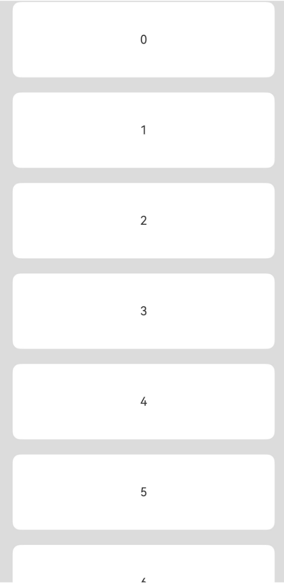

# ListItem

Used to display specific items in a list, must be used in conjunction with List.

## Import Module

```cangjie
import kit.ArkUI.*
```

## Child Components

Can contain a single child component.

## Creating the Component

### init(() -> Unit)

```cangjie
public init(child: () -> Unit)
```

**Function:** Creates a ListItem component.

**System Capability:** SystemCapability.ArkUI.ArkUI.Full

**Since:** 22

**Parameters:**

| Parameter | Type | Required | Default | Description |
|:---|:---|:---|:---|:---|
| child | () -> Unit | Yes | - | The child component of ListItem within the container. |

## Common Attributes/Common Events

Common Attributes: All supported.

Common Events: All supported.

## Component Attributes

### func selectable(?Bool)

```cangjie
public func selectable(value: ?Bool): This
```

**Function:** Sets whether the current ListItem element is selectable.

**System Capability:** SystemCapability.ArkUI.ArkUI.Full

**Since:** 22

**Parameters:**

| Parameter | Type | Required | Default | Description |
|:---|:---|:---|:---|:---|
| value | ?Bool | Yes | - | Whether the ListItem element is selectable.<br>Initial value: true. |

### func swipeAction(?CustomBuilder, ?CustomBuilder, ?SwipeEdgeEffect, ?(Float64) -> Unit)

```cangjie
public func swipeAction(
    start!: ?CustomBuilder = None,
    end!: ?CustomBuilder = None,
    edgeEffect!: ?SwipeEdgeEffect = Option.None,
    onOffsetChange!: ?(Float64) -> Unit = None
): This
```

**Function:** Used to set the swipe-out component for ListItem.

**System Capability:** SystemCapability.ArkUI.ArkUI.Full

**Since:** 22

**Parameters:**

| Parameter | Type | Required | Default | Description |
|:---|:---|:---|:---|:---|
| start | ?[CustomBuilder](./cj-common-types.md#type-custombuilder) | No | None | **Named parameter.** The component on the left side of the item when ListItem is swiped right (for vertical List layout) or the component above the item when ListItem is swiped down (for horizontal List layout).<br>Initial value: {=>}. |
| end | ?[CustomBuilder](./cj-common-types.md#type-custombuilder) | No | None | **Named parameter.** The component on the right side of the item when ListItem is swiped left (for vertical List layout) or the component below the item when ListItem is swiped up (for horizontal List layout).<br>Initial value: {=>}. |
| edgeEffect | ?[SwipeEdgeEffect](./cj-common-types.md#enum-swipeedgeeffect) | No | Option.None | **Named parameter.** The swipe effect.<br>Initial value: SwipeEdgeEffect.Spring. |
| onOffsetChange | ?(Float64) -> Unit | No | None | **Named parameter.** Called when the swipe operation offset changes.<br>Initial value: {_: Float64 =>}. |

## Component Events

### func onSelect(?(Bool) -> Unit)

```cangjie
public func onSelect(event: ?(Bool) -> Unit): This
```

**Function:** Triggered when the selection state of the ListItem element changes.

**System Capability:** SystemCapability.ArkUI.ArkUI.Full

**Since:** 22

**Parameters:**

| Parameter | Type | Required | Default | Description |
|:---|:---|:---|:---|:---|
| event | ?(Bool) -> Unit | Yes | - | Callback function when the selection state changes.<br>Initial value: { res: Bool => }. |

## Example Code

This example demonstrates the basic usage of creating a ListItem.

<!-- run -->

```cangjie
package ohos_app_cangjie_entry
import kit.ArkUI.*
import ohos.arkui.state_macro_manage.*

@Entry
@Component
class EntryView {
    let arr = [0, 1, 2, 3, 4, 5, 6, 7, 8, 9]
    func build() {
        Column() {
            List(space: 20, initialIndex: 0) {
                ForEach(this.arr,itemGeneratorFunc: {item: Int64, _: Int64 => ListItem() {
                            Text("${item}")
                            .width(100.percent)
                            .height(100)
                            .fontSize(16)
                            .textAlign(TextAlign.Center)
                            .borderRadius(10)
                            .backgroundColor(0xFFFFFF)
                        }
                    }
                )
            }
            .scrollBar(BarState.Off)
            .width(90.percent)
        }
        .width(100.percent)
        .height(100.percent)
        .backgroundColor(0xDCDCDC)
        .padding(top: 5.px)
    }
}
```

