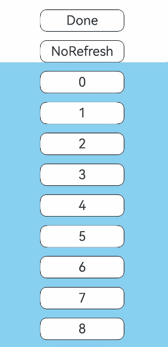

# Refresh

A container component that enables pull-to-refresh operations and displays refresh animations.

## Import Module

```cangjie
import kit.ArkUI.*
```

## Child Components

Supports a single child component.

## Creating the Component

### init(RefreshOptions, () -> Unit)

```cangjie
public init(value: RefreshOptions, child: () -> Unit)
```

**Function:** Creates a refresh component.

**System Capability:** SystemCapability.ArkUI.ArkUI.Full

**Since:** 21

**Parameters:**

| Parameter | Type | Required | Default | Description |
|:---|:---|:---|:---|:---|
| value | [RefreshOptions](#class-refreshoptions) | Yes | - | Sets parameters for component refresh behavior. |
| child | ()->Unit | Yes | - | Declares the container's child component. |

## Common Attributes/Common Events

Common attributes: All supported.

Common events: All supported.

## Component Events

### func onRefreshing(() -> Unit)

```cangjie
public func onRefreshing(callback: () -> Unit): This
```

**Function:** Triggers callback when entering refresh state.

**System Capability:** SystemCapability.ArkUI.ArkUI.Full

**Since:** 21

**Parameters:**

| Parameter | Type | Required | Default | Description |
|:---|:---|:---|:---|:---|
| callback | ()->Unit | Yes | - | Callback triggered when entering refresh state. |

### func onStateChange((RefreshStatus) -> Unit)

```cangjie
public func onStateChange(callback: (RefreshStatus) -> Unit): This
```

**Function:** Sets callback to be triggered when refresh state changes.

**System Capability:** SystemCapability.ArkUI.ArkUI.Full

**Since:** 21

**Parameters:**

| Parameter | Type | Required | Default | Description |
|:---|:---|:---|:---|:---|
| callback | ([RefreshStatus](./cj-common-types.md#enum-refreshstatus))->Unit | Yes | - | Refresh state. |

## Basic Type Definitions

### class RefreshOptions

```cangjie
public class RefreshOptions {
    public var refreshing: Bool
    public var changeEvent:(Bool) -> Unit
    public init(refreshing!: Bool)
    public init(refreshing!: (Bool, (Bool) -> Unit))
}
```

**Function:** Used to configure Refresh component parameters.

**System Capability:** SystemCapability.ArkUI.ArkUI.Full

**Since:** 21

#### var changeEvent

```cangjie
public var changeEvent:(Bool) -> Unit
```

**Function:** Used with @Binder macro for two-way binding of refreshing property.

**Type:** (Bool)->Unit

**Read-Write Access:** Read-Write

**System Capability:** SystemCapability.ArkUI.ArkUI.Full

**Since:** 21

#### var refreshing

```cangjie
public var refreshing: Bool
```

**Function:** Indicates whether the component is currently refreshing.

**Type:** Bool

**Read-Write Access:** Read-Write

**System Capability:** SystemCapability.ArkUI.ArkUI.Full

**Since:** 21

#### init(Bool)

```cangjie
public init(refreshing!: Bool)
```

**Function:** Creates a RefreshOptions object.

**System Capability:** SystemCapability.ArkUI.ArkUI.Full

**Since:** 21

**Parameters:**

| Parameter | Type | Required | Default | Description |
|:---|:---|:---|:---|:---|
| refreshing | Bool | Yes | - | **Named parameter.** Indicates whether the refresh component is currently refreshing. |

#### init((Bool,(Bool) -> Unit))

```cangjie
public init(refreshing!: (Bool, (Bool) -> Unit))
```

**Function:** Creates a RefreshOptions object based on refresh state.

**System Capability:** SystemCapability.ArkUI.ArkUI.Full

**Since:** 21

**Parameters:**

| Parameter | Type | Required | Default | Description |
|:---|:---|:---|:---|:---|
| refreshing | (Bool,(Bool)->Unit) | Yes | - | **Named parameter.** Indicates whether the refresh component is currently refreshing. |

## Example Code

### Example 1 (Default Refresh Style)

The refresh area uses the default refresh style.

<!-- run -->

```cangjie
package ohos_app_cangjie_entry

import kit.ArkUI.*
import ohos.arkui.state_macro_manage.*
import std.collection.*
import std.time.*
import std.sync.*

class MyDataSource <: IDataSource<Int64> {
    public MyDataSource(let data_: ArrayList<Int64>) {}
    public var listenerOp: Option<DataChangeListener> = None
    public func getData(index: Int64): Int64 {
        return data_[index]
    }

    public func onRegisterDataChangeListener(listener: DataChangeListener): Unit {
        listenerOp = listener
    }

    public func onUnregisterDataChangeListener(listener: DataChangeListener): Unit {
        listenerOp = None
    }

    public func totalCount(): Int64 {
        return data_.size
    }
}

@Entry
@Component
class EntryView {
    @State
    var isRefreshing: Bool = false
    let myDataSource: MyDataSource = MyDataSource(ArrayList<Int64>(10, {i => i}))
    @State
    var status: String = "Inactive"
    @State
    var onRefreshStatus: String = "noRefresh"
    @State
    var ratio: Float64 = 1.0
    @State
    var maxRefreshingHeight: Float64 = 100.0

    func build() {
        Column() {
            Text(status)
                .size(width: 50.percent, height: 50.vp)
                .borderWidth(1)
                .borderColor(Color.Black)
                .backgroundColor(0xFFFFFF)
                .borderRadius(15)
                .textAlign(TextAlign.Center)
                .fontSize(30)
                .margin(top: 20.vp)
                .id("StatusText")
            Text(onRefreshStatus)
                .size(width: 50.percent, height: 50.vp)
                .borderWidth(1)
                .borderColor(Color.Black)
                .backgroundColor(0xFFFFFF)
                .borderRadius(15)
                .textAlign(TextAlign.Center)
                .fontSize(30)
                .margin(top: 20.vp)
                .id("OnRefreshText")

            Refresh(RefreshOptions(refreshing: @Binder(isRefreshing))) {
                Column {
                    LazyForEach(
                        myDataSource,
                        itemGeneratorFunc: {
                            element: Int64, index: Int64 => Text(element.toString())
                                .size(width: 50.percent, height: 50.vp)
                                .borderWidth(1)
                                .borderColor(Color.Black)
                                .backgroundColor(0xFFFFFF)
                                .borderRadius(15)
                                .textAlign(TextAlign.Center)
                                .fontSize(30)
                                .margin(top: 20.vp)
                        }
                    )
                }.width(100.percent).backgroundColor(0x89CFF0)
            }
                .width(100.percent)
                .height(100.percent)
                .id("refresh")
                .onRefreshing(
                    {
                        =>
                        onRefreshStatus = "Refresh"
                        Timer.once(2000 * Duration.millisecond) {
                            => launch {
                                this.isRefreshing = false
                                onRefreshStatus = "NoRefresh"
                            }
                        }
                    }
                )
                .onStateChange({
                    refreshStatus: RefreshStatus =>
                        var status = match (refreshStatus) {
                            case Inactive => "Inactive"
                            case Drag => "Drag"
                            case OverDrag => "OverDrag"
                            case Refresh => "Refresh"
                            case Done => "Done"
                            case _ => ""
                        }
                })
                .backgroundColor(0x89CFF0)
            }

    }
}
```

