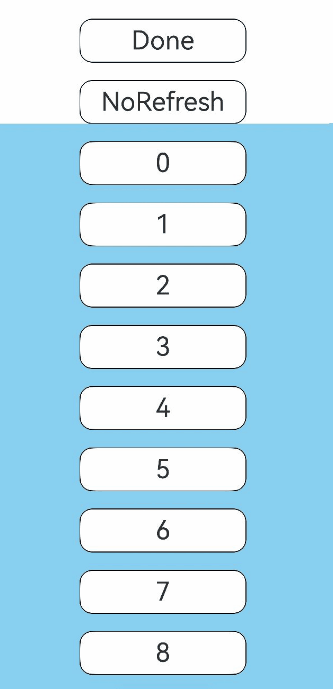

# Refresh

A container component that enables pull-to-refresh operations and displays refresh animations.

## Import Module

```cangjie
import kit.ArkUI.*
```

## Child Components

Supports a single child component.

## Creating the Component

### init(?RefreshOptions, () -> Unit)

```cangjie
public init(value: ?RefreshOptions, child: () -> Unit)
```

**Function:** Creates a Refresh component.

**System Capability:** SystemCapability.ArkUI.ArkUI.Full

**Since:** 22

**Parameters:**

| Parameter | Type | Required | Default | Description |
|:---|:---|:---|:---|:---|
| value | ?[RefreshOptions](#class-refreshoptions) | Yes | - | Sets parameters for component refresh behavior. |
| child | () -> Unit | Yes | - | Declares the container's child component. |

## Common Attributes/Common Events

Common Attributes: All supported.

Common Events: All supported.

## Component Events

### func onStateChange(?(RefreshStatus) -> Unit)

```cangjie
public func onStateChange(callback: ?(RefreshStatus) -> Unit): This
```

**Function:** Sets a callback triggered when refresh state changes.

**System Capability:** SystemCapability.ArkUI.ArkUI.Full

**Since:** 22

**Parameters:**

| Parameter | Type | Required | Default | Description |
|:---|:---|:---|:---|:---|
| callback | ?([RefreshStatus](./cj-common-types.md#enum-refreshstatus))-> Unit | Yes | - | Refresh state.<br>Initial value: {res: RefreshStatus =>}. |

### func onRefreshing(?() -> Unit)

```cangjie
public func onRefreshing(callback: ?() -> Unit): This
```

**Function:** Triggers callback when entering refresh state.

**System Capability:** SystemCapability.ArkUI.ArkUI.Full

**Since:** 22

**Parameters:**

| Parameter | Type | Required | Default | Description |
|:---|:---|:---|:---|:---|
| callback | ?()->Unit | Yes | - | Callback triggered when entering refresh state.<br>Initial value: {=>}. |

## Basic Type Definitions

### class RefreshOptions

```cangjie
public class RefreshOptions {
    public var refreshing: ?Bool
    public var changeEvent: ?(Bool) -> Unit
    public init(refreshing!: ?Bool)
    public init(refreshing!: ?Bindable<Bool>)
}
```

**Function:** Configures parameters for the Refresh component.

**System Capability:** SystemCapability.ArkUI.ArkUI.Full

**Since:** 22

#### var refreshing

```cangjie
public var refreshing: ?Bool
```

**Function:** Indicates whether the component is currently refreshing.

**Type:** ?Bool

**Read/Write:** Readable and Writable

**System Capability:** SystemCapability.ArkUI.ArkUI.Full

**Since:** 22

#### var changeEvent

```cangjie
public var changeEvent: ?(Bool) -> Unit
```

**Function:** Used with the @Binder macro for two-way binding of the refreshing property.

**Type:** ?(Bool) -> Unit

**Read/Write:** Readable and Writable

**System Capability:** SystemCapability.ArkUI.ArkUI.Full

**Since:** 22

#### init(?Bool)

```cangjie
public init(refreshing!: ?Bool)
```

**Function:** Creates a RefreshOptions object.

**System Capability:** SystemCapability.ArkUI.ArkUI.Full

**Since:** 22

**Parameters:**

| Parameter | Type | Required | Default | Description |
|:---|:---|:---|:---|:---|
| refreshing | ?Bool | Yes | - | **Named parameter.** Indicates whether the refresh component is currently refreshing. |

#### init(?Bindable\<Bool>)

```cangjie
public init(refreshing!: ?Bindable<Bool>)
```

**Function:** Creates a RefreshOptions object based on refresh state.

**System Capability:** SystemCapability.ArkUI.ArkUI.Full

**Since:** 22

**Parameters:**

| Parameter | Type | Required | Default | Description |
|:---|:---|:---|:---|:---|
| refreshing | ?[Bindable](./cj-common-types.md#class-bindablet)\<Bool> | No | - | **Named parameter.** Indicates whether the refresh component is currently refreshing. |

## Example Code

### Example 1 (Default Refresh Style)

The refresh area uses the default refresh style.

<!-- run -->

```cangjie
package ohos_app_cangjie_entry

import kit.ArkUI.*
import ohos.arkui.state_macro_manage.*
import std.collection.*
import std.time.*
import std.sync.*

class MyDataSource <: IDataSource<Int64> {
    public MyDataSource(let data_: ArrayList<Int64>) {}
    public var listenerOp: Option<DataChangeListener> = None
    public func getData(index: Int64): Int64 {
        return data_[index]
    }

    public func registerDataChangeListener(listener: DataChangeListener): Unit {
        listenerOp = listener
    }

    public func unregisterDataChangeListener(listener: DataChangeListener): Unit {
        listenerOp = None
    }
    
    public func refresh(): Unit {
        data_.clear()
        let now = Date.now()
        for (_, index) in data_.indices() {
            data_.insertAt(0, now + index)
        }
        match (listenerOp) {
            case Some(listener) => listener.onDataReloaded()
            case None => ()
        }
    }
}

@Entry
@Component
class EntryView {
    @State @Bind var refreshing: Bool = false
    let data_ = ArrayList<Int64>()
    let dataSrc: MyDataSource
    
    public init() {
        for (index in 0..10) {
            data_.pushBack(Date.now() + index)
        }
        dataSrc = MyDataSource(data_)
    }
    
    func build() {
        Column() {
            Refresh(value: RefreshOptions(refreshing: $refreshing), {
                Scroll() {
                    LazyForEach(this.dataSrc, itemGeneratorFunc: {item: Int64, _: Int64 =>
                        Column() {
                            Text("${Date(item).toLocaleString()}")
                                .fontSize(20)
                                .width(100.percent)
                                .height(50)
                                .textAlign(TextAlign.Center)
                        }
                        .backgroundColor(0xFFFFFF)
                        .margin(5)
                        .borderRadius(5)
                    })
                }
                .edgeEffect(EdgeEffect.Spring)
            })
            .onRefreshing({=>
                TaskRunner.delay({=>
                    this.dataSrc.refresh()
                    this.refreshing = false
                }, 2000)
            })
        }
        .padding(10)
        .backgroundColor(0xDCDCDC)
    }
}
```

