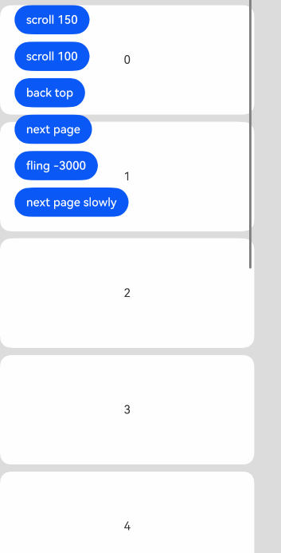
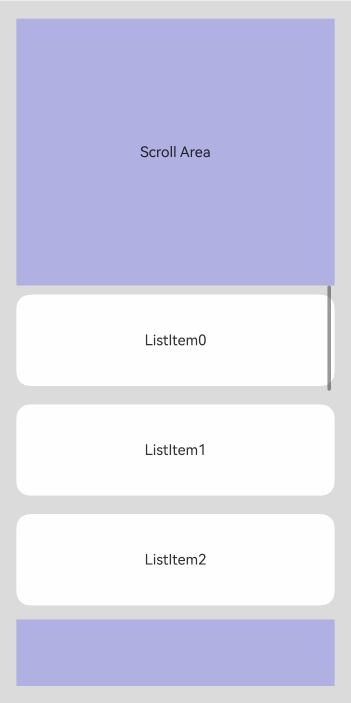
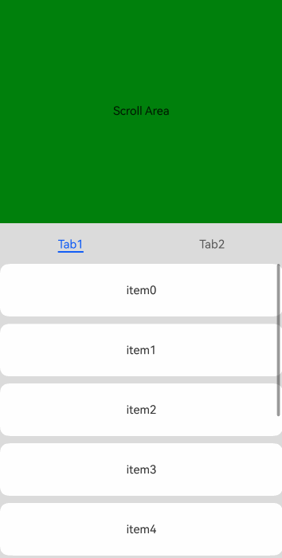
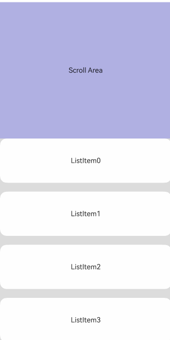
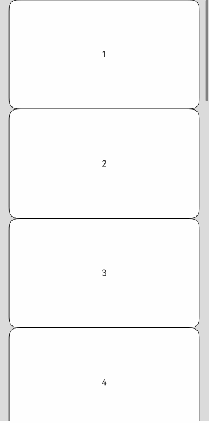
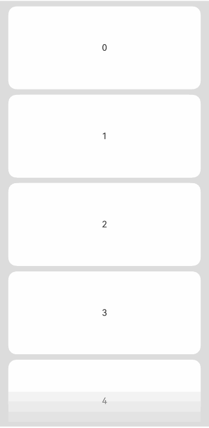

# Scroll

A scrollable container component that allows content to scroll when the layout size of child components exceeds the parent component's dimensions.

> **Note:**
>
> - When this component nests a List child component for scrolling, if the List does not specify width and height, it will load all content by default. For performance-sensitive scenarios, it is recommended to specify the List's width and height.
> - Scrolling occurs only when the main axis size is smaller than the content size.
> - The default value of the [clip](./cj-universal-attribute-shapclip.md#func-clipbool) universal attribute for the Scroll component is true.

## Import Module

```cangjie
import kit.ArkUI.*
```

## Child Components

Supports a single child component.

## Creating the Component

### init()

```cangjie
public init()
```

**Function:** Creates a Scroll container.

**System Capability:** SystemCapability.ArkUI.ArkUI.Full

**Since:** 22

### init(() -> Unit)

```cangjie
public init(child: () -> Unit)
```

**Function:** Creates a Scroll container with a child component.

**System Capability:** SystemCapability.ArkUI.ArkUI.Full

**Since:** 22

**Parameters:**

| Parameter | Type | Required | Default | Description |
|:---|:---|:---|:---|:---|
| child | () -> Unit | Yes | - | Declares the child component within the container. |

### init(?Scroller, () -> Unit)

```cangjie
public init(scroller: ?Scroller, child: () -> Unit)
```

**Function:** Creates a Scroll container with a child component and binds a scrollbar controller.

**System Capability:** SystemCapability.ArkUI.ArkUI.Full

**Since:** 22

**Parameters:**

| Parameter | Type | Required | Default | Description |
|:---|:---|:---|:---|:---|
| scroller | ?[Scroller](./cj-scroll-swipe-scroll.md#class-scroller) | Yes | - | The scrollbar controller. Initial value: Scroller(). |
| child | () -> Unit | Yes | - | Declares the child component within the container. |

## Universal Attributes/Events

Universal Attributes: In addition to supporting universal attributes, it also supports [Scroll Component Universal Attributes](./cj-scroll-swipe-common.md#component-attributes).

Universal Events: In addition to supporting universal events, it also supports [Scroll Component Universal Events](./cj-scroll-swipe-common.md#component-events).

> **Note:**
>
> The [onWillScroll](./cj-scroll-swipe-common.md#func-onwillscrolloptionfloat64scrollstatescrollsource---unit) and [onDidScroll](./cj-scroll-swipe-common.md#func-ondidscrollonscrollcallback) events from the Scroll Component Universal Events are not supported.

## Component Attributes

### func scrollable(?ScrollDirection)

```cangjie
public func scrollable(scrollDirection: ?ScrollDirection): This
```

**Function:** Sets the scrolling direction.

**System Capability:** SystemCapability.ArkUI.ArkUI.Full

**Since:** 22

**Parameters:**

| Parameter | Type | Required | Default | Description |
|:---|:---|:---|:---|:---|
| scrollDirection | ?[ScrollDirection](./cj-common-types.md#enum-scrolldirection) | Yes | - | The scrolling direction. Initial value: ScrollDirection.Vertical. |

## Component Events

### func onWillScroll(?(Float64, Float64, ScrollState, ScrollSource) -> OffsetResult)

```cangjie
public func onWillScroll(handler: ?(Float64, Float64, ScrollState, ScrollSource) -> OffsetResult): This
```

**Function:** A scroll event callback triggered before Scroll begins scrolling.

The callback returns the offset to be scrolled in the current frame, the current scroll state, and the scroll operation source. The offset returned by the callback is the calculated value to be scrolled, not the final actual scroll offset. The return value of this callback can specify the offset to be scrolled.

Conditions for triggering this event:

1. Triggered when the scroll component initiates scrolling, including keyboard/mouse operations and other input settings that trigger scrolling.

2. Triggered when calling the scroll controller API.

3. Triggered during overscroll rebound.

**System Capability:** SystemCapability.ArkUI.ArkUI.Full

**Since:** 22

**Parameters:**

| Parameter | Type | Required | Default | Description |
|:---|:---|:---|:---|:---|
| handler | ?(Float64, Float64, [ScrollState](./cj-common-types.md#enum-scrollstate), [ScrollSource](./cj-common-types.md#enum-scrollsource)) -> [OffsetResult](#class-offsetresult) | Yes | - | The callback function triggered before Scroll begins scrolling. Parameter 1: The horizontal offset per frame during scrolling. Positive when scrolling left, negative when scrolling right. Unit: vp. Parameter 2: The vertical offset per frame during scrolling. Positive when scrolling up, negative when scrolling down. Unit: vp. Parameter 3: The current scroll state. Parameter 4: The source of the current scroll operation. Return value: The scroll offset object. Returns OffsetResult to scroll according to the developer-specified offset. Initial value: { _, _, _, _ => OffsetResult(0.0, 0.0)}. |

### func onWillScroll(?(Float64, Float64, ScrollState, ScrollSource) -> Unit)

```cangjie
public func onWillScroll(handler: ?(Float64, Float64, ScrollState, ScrollSource) -> Unit): This
```

**Function:** A scroll event callback triggered before Scroll begins scrolling.

The callback returns the offset to be scrolled in the current frame, the current scroll state, and the scroll operation source. The offset returned by the callback is the calculated value to be scrolled, not the final actual scroll offset. The return value of this callback can specify the offset to be scrolled.

Conditions for triggering this event:

1. Triggered when the scroll component initiates scrolling, including keyboard/mouse operations and other input settings that trigger scrolling.

2. Triggered when calling the scroll controller API.

3. Triggered during overscroll rebound.

**System Capability:** SystemCapability.ArkUI.ArkUI.Full

**Since:** 22

**Parameters:**

| Parameter | Type | Required | Default | Description |
|:---|:---|:---|:---|:---|
| handler | ?(Float64, Float64, [ScrollState](./cj-common-types.md#enum-scrollstate), [ScrollSource](./cj-common-types.md#enum-scrollsource)) -> Unit | Yes | - | The callback function triggered before Scroll begins scrolling. Parameter 1: The horizontal offset per frame during scrolling. Positive when scrolling left, negative when scrolling right. Unit: vp. Parameter 2: The vertical offset per frame during scrolling. Positive when scrolling up, negative when scrolling down. Unit: vp. Parameter 3: The current scroll state. Parameter 4: The source of the current scroll operation. Initial value: { _, _, _, _ => }. |

### func onDidScroll(?ScrollOnScrollCallback)

```cangjie
public func onDidScroll(callback: ?ScrollOnScrollCallback): This
```

**Function:** A scroll event callback triggered during Scroll scrolling.

Returns the offset scrolled in the current frame and the current scroll state.

Conditions for triggering this event:

1. Triggered when the scroll component initiates scrolling, including keyboard/mouse operations and other input settings that trigger scrolling.

2. Triggered when calling the scroll controller API.

3. Triggered during overscroll rebound.

**System Capability:** SystemCapability.ArkUI.ArkUI.Full

**Since:** 22

**Parameters:**

| Parameter | Type | Required | Default | Description |
|:---|:---|:---|:---|:---|
| callback | ?[ScrollOnScrollCallback](#type-scrollonscrollcallback) | Yes | - | The callback function triggered during Scroll scrolling. Parameter 1: The horizontal offset per frame during scrolling. Positive when scrolling left, negative when scrolling right. Unit: vp. Parameter 2: The vertical offset per frame during scrolling. Positive when scrolling up, negative when scrolling down. Unit: vp. Parameter 3: The current scroll state. Initial value: { _, _, _ => }. |

### func onScrollFrameBegin(?OnScrollFrameBeginCallback)

```cangjie
public func onScrollFrameBegin(event: ?OnScrollFrameBeginCallback): This
```

**Function:** Triggered at the beginning of each frame's scroll. The event parameters include the impending scroll amount. The event handler can calculate the actual required scroll amount based on the application scenario and return it as the handler's return value. Scroll will proceed according to the returned actual scroll amount.

Supports negative values for offsetRemain.

If implementing nested container scrolling via the onScrollFrameBegin event and scrollBy method, set the EdgeEffect of the child scroll node to None. For example, when Scroll nests a List for scrolling, the List component's edgeEffect attribute must be set to EdgeEffect.None.

Conditions for triggering this event:

1. Triggered when the scroll component initiates scrolling, including keyboard/mouse operations and other input settings that trigger scrolling.

2. Not triggered when calling the controller interface.

3. Not triggered during overscroll rebound.

4. Not triggered when dragging the scrollbar.

**System Capability:** SystemCapability.ArkUI.ArkUI.Full

**Since:** 22

**Parameters:**

| Parameter | Type | Required | Default | Description |
|:---|:---|:---|:---|:---|
| event | ?[OnScrollFrameBeginCallback](#type-onscrollframebegincallback) | Yes | - | The callback function triggered at the beginning of each frame's scroll. Parameter 1: The impending scroll amount, in vp. Parameter 2: The current scroll state. Initial value: { _, _ => 0.0 }. |

### func onScrollEdge(?OnScrollEdgeCallback)

```cangjie
public func onScrollEdge(event: ?OnScrollEdgeCallback): This
```

**Function:** Triggered when scrolling reaches the edge.

Conditions for triggering this event:

1. Triggered when the scroll component reaches the edge, including keyboard/mouse operations and other input settings that trigger scrolling.

2. Triggered when calling the scroll controller API.

3. Triggered during overscroll rebound.

**System Capability:** SystemCapability.ArkUI.ArkUI.Full

**Since:** 22

**Parameters:**

| Parameter | Type | Required | Default | Description |
|:---|:---|:---|:---|:---|
| event | ?[OnScrollEdgeCallback](#type-onscrolledgecallback) | Yes | - | The callback function triggered when scrolling reaches the edge. Parameter: The edge position reached. Initial value: { _ => 0.0 }. |

## Basic Type Definitions

### class ScrollResult

```cangjie
public class ScrollResult {
    public var offsetRemain: Float64
    public init(offsetRemain!: Float64)
}
```

**Function:** Represents the scroll value generated by a scroll operation.

**System Capability:** SystemCapability.ArkUI.ArkUI.Full

**Since:** 22

#### var offsetRemain

```cangjie
public var offsetRemain: Float64
```

**Function:** The remaining scroll offset value.

**Type:** Float64

**Read/Write:** Read-Write

**System Capability:** SystemCapability.ArkUI.ArkUI.Full

**Since:** 22

#### init(Float64)

```cangjie
public init(offsetRemain!: Float64)
```

**Function:** Constructs a scroll result.

**System Capability:** SystemCapability.ArkUI.ArkUI.Full

**Since:** 22

**Parameters:**

| Parameter | Type | Required | Default | Description |
|:---|:---|:---|:---|:---|
| offsetRemain | Float64 | Yes | - | The remaining scroll offset value. |

### class OffsetResult

```cangjie
public class OffsetResult {
    public var xOffset: Float64
    public var yOffset: Float64
    public init(xOffset: Float64, yOffset: Float64)
}
```

**Function:** Represents the offset value generated by a scroll operation.

**System Capability:** SystemCapability.ArkUI.ArkUI.Full

**Since:** 22

#### var xOffset

```cangjie
public var xOffset: Float64
```

**Function:** The horizontal scroll offset.

**Type:** Float64

**Read/Write:** Read-Write

**System Capability:** SystemCapability.ArkUI.ArkUI.Full

**Since:** 22

#### var yOffset

```cangjie
public var yOffset: Float64
```

**Function:** The vertical scroll offset.

**Type:** Float64

**Read/Write:** Read-Write

**System Capability:** SystemCapability.ArkUI.ArkUI.Full

**Since:** 22

#### init(Float64, Float64)

```cangjie
public init(xOffset: Float64, yOffset: Float64)
```

**Function:** Constructs an offset result.

**System Capability:** SystemCapability.ArkUI.ArkUI.Full

**Since:** 22

**Parameters:**

| Parameter | Type | Required | Default | Description |
|:---|:---|:---|:---|:---|
| xOffset | Float64 | Yes | - | The horizontal scroll offset. |
| yOffset | Float64 | Yes | - | The vertical scroll offset. |

### class RectResult

```cangjie
public class RectResult {
    public var x: ?Float64
    public var y: ?Float64
    public var width: ?Float64
    public var height: ?Float64
    public init(
        x: Float64,
        y: Float64,
        width: Float64,
        height: Float64
    )
}
```

**Function:** Represents the rectangular value generated by a scroll operation.

**System Capability:** SystemCapability.ArkUI.ArkUI.Full

**Since:** 22

#### var x

```cangjie
public var x: ?Float64
```

**Function:** The x-coordinate in the rectangular value.

**Type:** ?Float64

**Read/Write:** Read-Write

**System Capability:** SystemCapability.ArkUI.ArkUI.Full

**Since:** 22

#### var y

```cangjie
public var y: ?Float64
```

**Function:** The y-coordinate in the rectangular value.

**Type:** ?Float64

**Read/Write:** Read-Write

**System Capability:** SystemCapability.ArkUI.ArkUI.Full

**Since:** 22

#### var width

```cangjie
public var width: ?Float64
```

**Function:** The width in the rectangular value.

**Type:** ?Float64

**Read/Write:** Read-Write

**System Capability:** SystemCapability.ArkUI.ArkUI.Full

**Since:** 22

#### var height

```cangjie
public var height: ?Float64
```

**Function:** The height in the rectangular value.

**Type:** ?Float64

**Read/Write:** Read-Write

**System Capability:** SystemCapability.ArkUI.ArkUI.Full

**Since:** 22

#### init(Float64, Float64, Float64, Float64)

```cangjie
public init(
    x: Float64,
    y: Float64,
    width: Float64,
    height: Float64
)
```

**Function:** Constructs a rectangular result.

**System Capability:** SystemCapability.ArkUI.ArkUI.Full

**Since:** 22

**Parameters:**

| Parameter | Type | Required | Default | Description |
|:---|:---|:---|:---|:---|
| x | Float64 | Yes | - | The x-coordinate in the rectangular value. |
| y | Float64 | Yes | - | The y-coordinate in the rectangular value. |
| width | Float64 | Yes | - | The width in the rectangular value. |
| height | Float64 | Yes | - | The height in the rectangular value. |### class ScrollAnimationOptions

```cangjie
public class ScrollAnimationOptions {
    public var duration: ?Float64
    public var curve: ?Curve
    public var canOverScroll: ?Bool
    public init(
        duration!: ?Float64 = None,
        curve!: ?Curve = None,
        canOverScroll!: ?Bool = None
    )
}
```

**Function:** Provides parameters for customizing scroll animation.

**System Capability:** SystemCapability.ArkUI.ArkUI.Full

**Since:** 22

#### var duration

```cangjie
public var duration: ?Float64
```

**Function:** Duration of the scroll animation.

**Type:** ?Float64

**Readable/Writable:** Yes

**System Capability:** SystemCapability.ArkUI.ArkUI.Full

**Since:** 22

#### var curve

```cangjie
public var curve: ?Curve
```

**Function:** Scroll curve.

**Type:** ?[Curve](./cj-common-types.md#enum-curve)

**Readable/Writable:** Yes

**System Capability:** SystemCapability.ArkUI.ArkUI.Full

**Since:** 22

#### var canOverScroll

```cangjie
public var canOverScroll: ?Bool
```

**Function:** Whether to enable over-scrolling.

**Type:** ?Bool

**Readable/Writable:** Yes

**System Capability:** SystemCapability.ArkUI.ArkUI.Full

**Since:** 22

#### init(?Float64, ?Curve, ?Bool)

```cangjie
public init(
    duration!: ?Float64 = None,
    curve!: ?Curve = None,
    canOverScroll!: ?Bool = None
)
```

**Function:** Constructs a custom scroll animation.

**System Capability:** SystemCapability.ArkUI.ArkUI.Full

**Since:** 22

**Parameters:**

| Parameter Name | Type | Required | Default Value | Description |
|:---|:---|:---|:---|:---|
| duration | ?Float64 | No | None | **Named parameter.** Duration of the scroll animation. Initial value: 1000.0. |
| curve | ?[Curve](./cj-common-types.md#enum-curve) | No | None | **Named parameter.** Scroll curve. Initial value: Curve.Ease. |
| canOverScroll | ?Bool | No | None | **Named parameter.** Whether to enable over-scrolling. Initial value: false. |

### class NestedScrollOptions

```cangjie
public class NestedScrollOptions {
    public var scrollForward: ?NestedScrollMode
    public var scrollBackward: ?NestedScrollMode
    public init(scrollForward: ?NestedScrollMode, scrollBackward: ?NestedScrollMode)
}
```

**Function:** Provides parameters for customizing nested scrolling.

**System Capability:** SystemCapability.ArkUI.ArkUI.Full

**Since:** 22

#### var scrollForward

```cangjie
public var scrollForward: ?NestedScrollMode
```

**Function:** Forward direction in custom nested scrolling.

**Type:** ?[NestedScrollMode](./cj-common-types.md#enum-nestedscrollmode)

**Readable/Writable:** Yes

**System Capability:** SystemCapability.ArkUI.ArkUI.Full

**Since:** 22

#### var scrollBackward

```cangjie
public var scrollBackward: ?NestedScrollMode
```

**Function:** Backward direction in custom nested scrolling.

**Type:** ?[NestedScrollMode](./cj-common-types.md#enum-nestedscrollmode)

**Readable/Writable:** Yes

**System Capability:** SystemCapability.ArkUI.ArkUI.Full

**Since:** 22

#### init(?NestedScrollMode, ?NestedScrollMode)

```cangjie
public init(scrollForward: ?NestedScrollMode, scrollBackward: ?NestedScrollMode)
```

**Function:** Provides parameters for customizing nested scrolling.

**System Capability:** SystemCapability.ArkUI.ArkUI.Full

**Since:** 22

**Parameters:**

| Parameter Name | Type | Required | Default Value | Description |
|:---|:---|:---|:---|:---|
| scrollForward | ?[NestedScrollMode](./cj-common-types.md#enum-nestedscrollmode) | Yes | - | Forward direction in custom nested scrolling. Initial value: NestedScrollMode.SelfOnly. |
| scrollBackward | ?[NestedScrollMode](./cj-common-types.md#enum-nestedscrollmode) | Yes | - | Backward direction in custom nested scrolling. Initial value: NestedScrollMode.SelfOnly. |

### class FadingEdgeOptions

```cangjie
public class FadingEdgeOptions {
    public var fadingEdgeLength: ?Length
    public init(fadingEdgeLength!: ?Length = None)
}
```

**Function:** Provides parameters for customizing fading edges.

**System Capability:** SystemCapability.ArkUI.ArkUI.Full

**Since:** 22

#### var fadingEdgeLength

```cangjie
public var fadingEdgeLength: ?Length
```

**Function:** Length of the fading edge in custom fading edges.

**Type:** ?[Length](./cj-common-types.md#interface-length)

**Readable/Writable:** Yes

**System Capability:** SystemCapability.ArkUI.ArkUI.Full

**Since:** 22

#### init(?Length)

```cangjie
public init(fadingEdgeLength!: ?Length = None)
```

**Function:** Constructs a custom fading edge.

**System Capability:** SystemCapability.ArkUI.ArkUI.Full

**Since:** 22

**Parameters:**

| Parameter Name | Type | Required | Default Value | Description |
|:---|:---|:---|:---|:---|
| fadingEdgeLength | ?[Length](./cj-common-types.md#interface-length) | No | None | **Named parameter.** Length of the fading edge in custom fading edges. Initial value: 32.vp. |

### class ScrollEdgeOptions

```cangjie
public class ScrollEdgeOptions {
    public var velocity: ?Float32
    public init(velocity!: ?Float32 = None)
}
```

**Function:** Provides parameters for scroll edge options.

**System Capability:** SystemCapability.ArkUI.ArkUI.Full

**Since:** 22

#### var velocity

```cangjie
public var velocity: ?Float32
```

**Function:** Velocity in scroll edge options.

**Type:** ?Float32

**Readable/Writable:** Yes

**System Capability:** SystemCapability.ArkUI.ArkUI.Full

**Since:** 22

#### init(?Float32)

```cangjie
public init(velocity!: ?Float32 = None)
```

**Function:** Constructs scroll edge options.

**System Capability:** SystemCapability.ArkUI.ArkUI.Full

**Since:** 22

**Parameters:**

| Parameter Name | Type | Required | Default Value | Description |
|:---|:---|:---|:---|:---|
| velocity | ?Float32 | No | None | **Named parameter.** Velocity in scroll edge options. Initial value: 0.0. |

### class ScrollToIndexOptions

```cangjie
public class ScrollToIndexOptions {
    public var extraOffset: ?Length
    public init(extraOffset!: ?Length = None)
}
```

**Function:** Provides parameters for scrolling to an index.

**System Capability:** SystemCapability.ArkUI.ArkUI.Full

**Since:** 22

#### var extraOffset

```cangjie
public var extraOffset: ?Length
```

**Function:** Extra offset when scrolling to an index.

**Type:** ?[Length](./cj-common-types.md#interface-length)

**Readable/Writable:** Yes

**System Capability:** SystemCapability.ArkUI.ArkUI.Full

**Since:** 22

#### init(?Length)

```cangjie
public init(extraOffset!: ?Length = None)
```

**Function:** Constructs options for scrolling to an index.

**System Capability:** SystemCapability.ArkUI.ArkUI.Full

**Since:** 22

**Parameters:**

| Parameter Name | Type | Required | Default Value | Description |
|:---|:---|:---|:---|:---|
| extraOffset | ?[Length](./cj-common-types.md#interface-length) | No | None | **Named parameter.** Extra offset when scrolling to an index. Initial value: 0.vp. |

### class Scroller

```cangjie
public class Scroller {
    public init()
}
```

**Function:** Defines a controller for scrollable container components.

**System Capability:** SystemCapability.ArkUI.ArkUI.Full

**Since:** 22

#### init()

```cangjie
public init()
```

**Function:** Constructor for creating a Scroller object.

**System Capability:** SystemCapability.ArkUI.ArkUI.Full

**Since:** 22

#### func scrollTo(Length, Length)

```cangjie
public func scrollTo(xOffset!: Length, yOffset!: Length): Unit
```

**Function:** Scrolls to the specified position.

**System Capability:** SystemCapability.ArkUI.ArkUI.Full

**Since:** 22

**Parameters:**

| Parameter Name | Type | Required | Default Value | Description |
|:---|:---|:---|:---|:---|
| xOffset | [Length](./cj-common-types.md#interface-length) | Yes | - | **Named parameter.** Horizontal scroll offset. |
| yOffset | [Length](./cj-common-types.md#interface-length) | Yes | - | **Named parameter.** Vertical scroll offset. |

#### func scrollTo(Length, Length, ?ScrollAnimationOptions)

```cangjie
public func scrollTo(xOffset!: Length, yOffset!: Length, animation!: ?ScrollAnimationOptions): Unit
```

**Function:** Scrolls to the specified position.

**System Capability:** SystemCapability.ArkUI.ArkUI.Full

**Since:** 22

**Parameters:**

| Parameter Name | Type | Required | Default Value | Description |
|:---|:---|:---|:---|:---|
| xOffset | [Length](./cj-common-types.md#interface-length) | Yes | - | **Named parameter.** Horizontal scroll offset. |
| yOffset | [Length](./cj-common-types.md#interface-length) | Yes | - | **Named parameter.** Vertical scroll offset. |
| animation | ?ScrollAnimationOptions | Yes | - | **Named parameter.** Scroll animation options. Initial value: ScrollAnimationOptions(). |

#### func scrollTo(Length, Length, ?Bool)

```cangjie
public func scrollTo(xOffset!: Length, yOffset!: Length, animation!: ?Bool): Unit
```

**Function:** Scrolls to the specified position.

**System Capability:** SystemCapability.ArkUI.ArkUI.Full

**Since:** 22

**Parameters:**

| Parameter Name | Type | Required | Default Value | Description |
|:---|:---|:---|:---|:---|
| xOffset | [Length](./cj-common-types.md#interface-length) | Yes | - | **Named parameter.** Horizontal scroll offset. |
| yOffset | [Length](./cj-common-types.md#interface-length) | Yes | - | **Named parameter.** Vertical scroll offset. |
| animation | ?Bool | Yes | - | **Named parameter.** Whether to enable animation. Initial value: false. |

#### func scrollBy(Length, Length)

```cangjie
public func scrollBy(xOffset!: Length, yOffset!: Length): Unit
```

**Function:** Scrolls by the specified offset.

**System Capability:** SystemCapability.ArkUI.ArkUI.Full

**Since:** 22

**Parameters:**

| Parameter Name | Type | Required | Default Value | Description |
|:---|:---|:---|:---|:---|
| xOffset | [Length](./cj-common-types.md#interface-length) | Yes | - | **Named parameter.** Horizontal scroll offset. |
| yOffset | [Length](./cj-common-types.md#interface-length) | Yes | - | **Named parameter.** Vertical scroll offset. |

#### func scrollEdge(Edge)

```cangjie
public func scrollEdge(value: Edge): Unit
```

**Function:** Scrolls to the container edge.

**System Capability:** SystemCapability.ArkUI.ArkUI.Full

**Since:** 22

**Parameters:**

| Parameter Name | Type | Required | Default Value | Description |
|:---|:---|:---|:---|:---|
| value | [Edge](./cj-common-types.md#enum-edge) | Yes | - | Edge position to scroll to. |

#### func scrollEdge(Edge, ?ScrollEdgeOptions)

```cangjie
public func scrollEdge(value: Edge, options: ?ScrollEdgeOptions): Unit
```

**Function:** Scrolls to the container edge.

**System Capability:** SystemCapability.ArkUI.ArkUI.Full

**Since:** 22

**Parameters:**

| Parameter Name | Type | Required | Default Value | Description |
|:---|:---|:---|:---|:---|
| value | [Edge](./cj-common-types.md#enum-edge) | Yes | - | Edge position to scroll to. |
| options | ?[ScrollEdgeOptions](#class-scrolledgeoptions) | Yes | - | Scroll edge options. Initial value: ScrollEdgeOptions(). |

#### func fling(Float64)

```cangjie
public func fling(velocity: Float64): Unit
```

**Function:** Performs inertial scrolling based on the initial velocity.

**System Capability:** SystemCapability.ArkUI.ArkUI.Full

**Since:** 22

**Parameters:**

| Parameter Name | Type | Required | Default Value | Description |
|:---|:---|:---|:---|:---|
| velocity | Float64 | Yes | - | Initial velocity for inertial scrolling. A value of 0 is invalid and will not take effect. Positive values scroll to the top, negative values scroll to the bottom. |

#### func scrollPage(Bool)

```cangjie
public func scrollPage(value: Bool): Unit
```

**Function:** Sets the page-turning mode.

**System Capability:** SystemCapability.ArkUI.ArkUI.Full

**Since:** 22

**Parameters:**

| Parameter Name | Type | Required | Default Value | Description |
|:---|:---|:---|:---|:---|
| value | Bool | Yes | - | Whether to enable page-turning. |

#### func scrollPage(Bool, ?Bool)

```cangjie
public func scrollPage(next: Bool, animation!: ?Bool = None): Unit
```

**Function:** Sets the page-turning mode.

**System Capability:** SystemCapability.ArkUI.ArkUI.Full

**Since:** 22

**Parameters:**

| Parameter Name | Type | Required | Default Value | Description |
|:---|:---|:---|:---|:---|
| next | Bool | Yes | - | Whether to turn to the next page. |
| animation | ?Bool | No | None | **Named parameter.** Whether to enable animation. Initial value: false. |

#### func currentOffset()

```cangjie
public func currentOffset(): Option<OffsetResult>
```

**Function:** Gets the current scroll offset.

**System Capability:** SystemCapability.ArkUI.ArkUI.Full

**Since:** 22

**Return Value:**

| Type | Description |
|:---|:---|
| Option\<[OffsetResult](#class-offsetresult)> | Current scroll offset. |

#### func scrollToIndex(Int32, ?Bool, ?ScrollAlign, ?ScrollToIndexOptions)

```cangjie
public func scrollToIndex(
    index: Int32,
    smooth!: ?Bool = None,
    align!: ?ScrollAlign = None,
    options!: ?ScrollToIndexOptions = None
): Unit
```

**Function:** Scrolls to the specified index, supporting additional scroll offsets.

**System Capability:** SystemCapability.ArkUI.ArkUI.Full

**Since:** 22

**Parameters:**

| Parameter Name | Type | Required | Default Value | Description |
|:---|:---|:---|:---|:---|
| index | Int32 | Yes | - | Index value. |
| smooth | ?Bool | No | None | **Named parameter.** Whether to enable smooth scrolling. Initial value: false. |
| align | ?[ScrollAlign](#enum-scrollalign) | No | None | **Named parameter.** Alignment method. Initial value: ScrollAlign.Start. |
| options | ?[ScrollToIndexOptions](#class-scrolltoindexoptions) | No | None | **Named parameter.** Options for scrolling to an index. Initial value: ScrollToIndexOptions(). |

#### func isAtEnd()

```cangjie
public func isAtEnd(): Bool
```

**Function:** Checks if the component has scrolled to the bottom.

**System Capability:** SystemCapability.ArkUI.ArkUI.Full

**Since:** 22

**Return Value:**

| Type | Description |
|:---|:---|
| Bool | Whether the component has scrolled to the bottom. |

#### func getItemRect(?Int32)

```cangjie
public func getItemRect(index: ?Int32): RectResult
```

**Function:** Gets the size and position of a child component.

**System Capability:** SystemCapability.ArkUI.ArkUI.Full

**Since:** 22

**Parameters:**

| Parameter Name | Type | Required | Default Value | Description |
|:---|:---|:---|:---|:---|
| index | ?Int32 | Yes | - | Index of the child component. Initial value: -1. |

**Return Value:**

| Type | Description |
|:---|:---|
| [RectResult](#class-rectresult) | Size and position of the child component. |

#### func getItemIndex(Float64, Float64)

```cangjie
public func getItemIndex(x: Float64, y: Float64): Int32
```

**Function:** Gets the index of a child component based on coordinates.

**System Capability:** SystemCapability.ArkUI.ArkUI.Full

**Since:** 22

**Parameters:**

| Parameter Name | Type | Required | Default Value | Description |
|:---|:---|:---|:---|:---|
| x | Float64 | Yes | - | X-coordinate. |
| y | Float64 | Yes | - | Y-coordinate. |

**Return Value:**

| Type | Description |
|:---|:---|
| Int32 | Index of the child component. |### enum ScrollAlign

```cangjie
public enum ScrollAlign <: Equatable<ScrollAlign> {
    | Start
    | Center
    | End
    | Auto
    | ...
}
```

**Function:** Enumerates alignment modes.

**System Capability:** SystemCapability.ArkUI.ArkUI.Full

**Since:** 22

**Parent Type:**

- Equatable\<[ScrollAlign](#enum-scrollalign)>

#### Start

```cangjie
Start
```

**Function:** Aligns the starting edge of the list item with the starting edge of the list.

**System Capability:** SystemCapability.ArkUI.ArkUI.Full

**Since:** 22

#### Center

```cangjie
Center
```

**Function:** Centers the list item along the main axis of the list.

**System Capability:** SystemCapability.ArkUI.ArkUI.Full

**Since:** 22

#### End

```cangjie
End
```

**Function:** Aligns the ending edge of the list item with the ending edge of the list.

**System Capability:** SystemCapability.ArkUI.ArkUI.Full

**Since:** 22

#### Auto

```cangjie
Auto
```

**Function:** Automatically aligns the list item.

**System Capability:** SystemCapability.ArkUI.ArkUI.Full

**Since:** 22

#### operator func !=(ScrollAlign)

```cangjie
public operator func !=(other: ScrollAlign): Bool
```

**Function:** Compares whether two enum values are not equal.

**System Capability:** SystemCapability.ArkUI.ArkUI.Full

**Since:** 22

**Parameters:**

| Parameter Name | Type | Required | Default Value | Description |
|:---|:---|:---|:---|:---|
| other | [ScrollAlign](#enum-scrollalign) | Yes | - | The other enum value to compare. |

**Return Value:**

| Type | Description |
|:----|:----|
| Bool | Returns true if the two enum values are not equal, otherwise returns false. |

#### operator func ==(ScrollAlign)

```cangjie
public operator func ==(other: ScrollAlign): Bool
```

**Function:** Compares whether two enum values are equal.

**System Capability:** SystemCapability.ArkUI.ArkUI.Full

**Since:** 22

**Parameters:**

| Parameter Name | Type | Required | Default Value | Description |
|:---|:---|:---|:---|:---|
| other | [ScrollAlign](#enum-scrollalign) | Yes | - | The other enum value to compare. |

**Return Value:**

| Type | Description |
|:----|:----|
| Bool | Returns true if the two enum values are equal, otherwise returns false. |

### enum ContentClipMode

```cangjie
public enum ContentClipMode <: Equatable<ContentClipMode> {
    | ContentOnly
    | Boundary
    | SafeArea
    | ...
}
```

**Function:** Enumerates content clipping modes.

**System Capability:** SystemCapability.ArkUI.ArkUI.Full

**Since:** 22

**Parent Type:**

- Equatable\<[ContentClipMode](#enum-contentclipmode)>

#### ContentOnly

```cangjie
ContentOnly
```

**Function:** Content mode for content clipping.

**System Capability:** SystemCapability.ArkUI.ArkUI.Full

**Since:** 22

#### Boundary

```cangjie
Boundary
```

**Function:** Boundary mode for content clipping.

**System Capability:** SystemCapability.ArkUI.ArkUI.Full

**Since:** 22

#### SafeArea

```cangjie
SafeArea
```

**Function:** Safe area mode for content clipping.

**System Capability:** SystemCapability.ArkUI.ArkUI.Full

**Since:** 22

#### operator func !=(ContentClipMode)

```cangjie
public operator func !=(other: ContentClipMode): Bool
```

**Function:** Compares whether two enum values are not equal.

**System Capability:** SystemCapability.ArkUI.ArkUI.Full

**Since:** 22

**Parameters:**

| Parameter Name | Type | Required | Default Value | Description |
|:---|:---|:---|:---|:---|
| other | [ContentClipMode](#enum-contentclipmode) | Yes | - | The other enum value to compare. |

**Return Value:**

| Type | Description |
|:----|:----|
| Bool | Returns true if the two enum values are not equal, otherwise returns false. |

#### operator func ==(ContentClipMode)

```cangjie
public operator func ==(other: ContentClipMode): Bool
```

**Function:** Compares whether two enum values are equal.

**System Capability:** SystemCapability.ArkUI.ArkUI.Full

**Since:** 22

**Parameters:**

| Parameter Name | Type | Required | Default Value | Description |
|:---|:---|:---|:---|:---|
| other | [ContentClipMode](#enum-contentclipmode) | Yes | - | The other enum value to compare. |

**Return Value:**

| Type | Description |
|:----|:----|
| Bool | Returns true if the two enum values are equal, otherwise returns false. |

### type OnWillScrollCallBack

```cangjie
public type OnWillScrollCallBack = (Float64, ScrollState, ScrollSource) -> ScrollResult
```

**Function:** Defines the callback function type for onWillScroll.

**System Capability:** SystemCapability.ArkUI.ArkUI.Full

**Since:** 22

**Type:** (Float64, [ScrollState](./cj-common-types.md#enum-scrollstate), [ScrollSource](./cj-common-types.md#enum-scrollsource)) -> [ScrollResult](#class-scrollresult)

### type OnScrollCallBack

```cangjie
public type OnScrollCallBack = (scrollOffset: Float64, scrollState: ScrollState) -> Unit
```

**Function:** Defines the callback function type for onScroll.

**System Capability:** SystemCapability.ArkUI.ArkUI.Full

**Since:** 22

**Type:** (Float64, [ScrollState](./cj-common-types.md#enum-scrollstate)) -> Unit

### type ScrollOnScrollCallback

```cangjie
public type ScrollOnScrollCallback = (Float64, Float64, ScrollState) -> Unit
```

**Function:** Defines the callback function type for onDidScroll.

**System Capability:** SystemCapability.ArkUI.ArkUI.Full

**Since:** 22

**Type:** (Float64, Float64, [ScrollState](./cj-common-types.md#enum-scrollstate)) -> Unit

### type OnScrollFrameBeginCallback

```cangjie
public type OnScrollFrameBeginCallback = (Float64, ScrollState) -> Float64
```

**Function:** Defines the callback function type for onScrollFrameBegin.

**System Capability:** SystemCapability.ArkUI.ArkUI.Full

**Since:** 22

**Type:** (Float64, [ScrollState](./cj-common-types.md#enum-scrollstate)) -> Float64

### type OnScrollEdgeCallback

```cangjie
public type OnScrollEdgeCallback = (Edge) -> Unit
```

**Function:** Defines the callback function type for onScrollEdge.

**System Capability:** SystemCapability.ArkUI.ArkUI.Full

**Since:** 22

**Type:** ([Edge](./cj-common-types.md#enum-edge)) -> Unit

## Example Code

### Example Code 1 (Setting the Scroller Controller)

This example demonstrates the use of some properties of the Scroll component and the scroller controller.

<!-- run -->

```cangjie
package ohos_app_cangjie_entry

import kit.ArkUI.*
import ohos.arkui.state_macro_manage.*
import std.collection.ArrayList
import ohos.hilog.*

func loggerInfo(str: String) {
    Hilog.info(0, "CangjieTest", str)
}

@Entry
@Component
class EntryView {
    let scroller = Scroller()
    var arr: ArrayList<String> = ArrayList(["0", "1", "2", "3", "4", "5", "6", "7", "8", "9"])

    func build() {
        Stack(alignContent: Alignment.TopStart) {
            Scroll(this.scroller) {
                Column {
                    ForEach(
                        this.arr,
                        itemGeneratorFunc: {
                            item: String, idx: Int64 => Text(item)
                                .width(90.percent)
                                .height(150)
                                .backgroundColor(0xFFFFFF)
                                .borderRadius(15)
                                .textAlign(TextAlign.Center)
                                .fontSize(16)
                                .margin(top: 10)
                        }
                    )
                }
            }
                .scrollable(ScrollDirection.Vertical) // Vertical scroll direction
                .scrollBar(BarState.On) // Always show scrollbar
                .scrollBarColor(Color.Gray) // Scrollbar color
                .scrollBarWidth(10.px) // Scrollbar width
                .friction(0.6)
                .onScrollEdge(
                    {
                        edge => match (edge) {
                            case Edge.Top => loggerInfo("Top")
                            case Edge.Bottom => loggerInfo("Bottom")
                            case _ => loggerInfo("None")
                        }
                    })
                .onScrollStop({
                    => loggerInfo("Scroll Stop")
                })

            Button("scroll 150")
                .onClick({
                    evt => // Scroll down by a specified distance of 150.0vp after clicking
                    this
                        .scroller
                        .scrollBy(xOffset: 0, yOffset: 150)
                })
                .margin(top: 10, left: 20)

            Button("scroll 100")
                .onClick(
                    {
                        evt => // Scroll to a specified position (i.e., scroll down by 100.0vp) after clicking
                        loggerInfo("current offset ${this.scroller.currentOffset().getOrThrow().yOffset}")
                        loggerInfo("CALCULATE offset ${this.scroller.currentOffset().getOrThrow().yOffset + 100.0}")
                        let curyOffset = this
                            .scroller
                            .currentOffset().getOrThrow()
                            .yOffset
                        this
                            .scroller
                            .scrollTo(xOffset: 0.vp, yOffset: (curyOffset + 100.0).vp, animation: ScrollAnimationOptions(duration: 0.0, curve: Curve.Ease))
                    }
                )
                .margin(top: 60, left: 20)

            Button("back top")
                .onClick({
                    evt => // Return to the top after clicking
                    this
                        .scroller
                        .scrollEdge(Edge.Top)
                })
                .margin(top: 110, left: 20)

            Button("next page")
                .onClick({
                    evt => // Scroll to the next page after clicking
                    this
                        .scroller
                        .scrollPage(true, animation: false)
                })
                .margin(top: 160, left: 20)

            Button("fling -3000")
                .onClick({
                    evt => // Trigger inertial scrolling with an initial velocity of -3000vp/s after clicking
                    this
                        .scroller
                        .fling(-3000.0)
                })
                .margin(top: 210, left: 20)

            Button("next page slowly")
                .onClick({
                    evt => // Scroll to the next page with animation enabled after clicking
                    this
                        .scroller
                        .scrollPage(true, animation: true)
                })
                .margin(top: 260, left: 20)
        }
            .width(100.percent)
            .height(100.percent)
            .backgroundColor(0xDCDCDC)
    }
}
```

### Sample Code 2 (Nested Scrolling Implementation Method 1)

This example implements nested scrolling between an inner List component and an outer Scroll component using the `onScrollFrameBegin` event.

<!-- run -->

```cangjie
package ohos_app_cangjie_entry

import kit.ArkUI.*
import ohos.arkui.state_macro_manage.*
import std.collection.ArrayList

@Entry
@Component
class EntryView {
    @State
    var listPosition: Int32 = 0 // 0 means scrolled to the top of List, 1 means intermediate value, 2 means scrolled to the bottom of List.
    let scroller = Scroller()
    let scrollerForList = Scroller()
    var arr: ArrayList<String> = ArrayList(["0", "1", "2", "3", "4", "5", "6", "7", "8", "9"])

    func build() {
        Flex() {
            Scroll(this.scroller) {
                Column() {
                    Text("Scroll Area")
                        .width(100.percent)
                        .height(40.percent)
                        .backgroundColor(0x330000FF)
                        .fontSize(16)
                        .textAlign(TextAlign.Center)
                        .onClick(
                            {
                                evt => this
                                    .scrollerForList
                                    .scrollToIndex(5, smooth: false, align: ScrollAlign.Start, options: ScrollToIndexOptions(extraOffset: 5.vp))
                            })

                    List(space: 20, scroller: this.scrollerForList) {
                        ForEach(
                            this.arr,
                            itemGeneratorFunc: {
                                item: String, idx: Int64 => ListItem() {
                                    Text("ListItem" + item)
                                        .width(100.percent)
                                        .height(100.percent)
                                        .backgroundColor(Color.White)
                                        .borderRadius(15)
                                        .textAlign(TextAlign.Center)
                                        .fontSize(16)
                                        .margin(top: 10)
                                }
                                    .width(100.percent)
                                    .height(100)
                            }
                        )
                    }
                        .width(100.percent)
                        .height(50.percent)
                        .edgeEffect(EdgeEffect.None)
                        .friction(0.6)
                        .onReachStart({
                            => this.listPosition = 0
                        })
                        .onReachEnd({
                            => this.listPosition = 2
                        })
                        .onScrollFrameBegin(
                            {
                                x: Float64, y: ScrollState =>
                                if ((this.listPosition == 0 && x <= 0.0) || (this.listPosition == 2 && x >= 0.0)) {
                                    this
                                        .scroller
                                        .scrollBy(xOffset: 0.0, yOffset: x)
                                    return OnScrollFrameBeginHandlerResult(offsetRemain: 0.0)
                                }
                                this.listPosition = 1
                                return OnScrollFrameBeginHandlerResult(offsetRemain: x)
                            }
                        )

                    Text("Scroll Area")
                        .width(100.percent)
                        .height(40.percent)
                        .backgroundColor(0x330000FF)
                        .fontSize(16)
                        .textAlign(TextAlign.Center)
                }
            }
                .width(100.percent)
                .height(100.percent)
        }
            .width(100.percent)
            .height(100.percent)
            .backgroundColor(0xDCDCDC)
            .padding(20)
    }
}
```



### Sample Code 3 (Nested Scrolling Implementation Method 2)

This example implements nested scrolling between an inner List component and an outer Scroll component using the `nestedScroll` attribute.

<!-- run -->

```cangjie
package ohos_app_cangjie_entry

import kit.ArkUI.*
import ohos.arkui.state_macro_manage.*
import std.collection.ArrayList

@Entry
@Component
class EntryView {
    @State
    var arr: ArrayList<Int64> = ArrayList<Int64>(30)

    func build() {
        Scroll {
            Column {
                Text("Scroll Area")
                    .width(100.percent)
                    .height(40.percent)
                    .backgroundColor(0x00800C)
                    .textAlign(TextAlign.Center)
                Tabs(barPosition: BarPosition.Start) {
                    TabContent {
                        List(space: 10) {
                            ForEach(
                                this.arr,
                                itemGeneratorFunc: {
                                    item: Int64, idx: Int64 => ListItem {
                                        Text("item" + item.toString()).fontSize(16)
                                    }
                                        .backgroundColor(Color.White)
                                        .height(72)
                                        .width(100.percent)
                                        .borderRadius(12)
                                },
                                keyGeneratorFunc: {
                                    item: Int64, idx: Int64 => item.toString()
                                }
                            )
                        }
                            .width(100.percent)
                            .edgeEffect(EdgeEffect.Spring)
                            .nestedScroll(
                                NestedScrollOptions(NestedScrollMode.ParentFirst, NestedScrollMode.SelfFirst))
                    }.tabBar("Tab1")

                    TabContent {
                    }.tabBar("Tab2")
                }
                    .vertical(false)
                    .height(100.percent)
            }.width(100.percent)
        }
            .friction(0.6)
            .backgroundColor(0xDCDCDC)
            .scrollBar(BarState.Off)
            .width(100.percent)
            .height(100.percent)
    }

    protected override func aboutToAppear() {
        for (i in 0..30) {
            this.arr.add(i)
        }
    }
}
```



### Sample Code 4 (Parent-to-Child Scroll Propagation)

This example implements scroll propagation from parent to child components using the `enableScrollInteraction` attribute and `onScrollFrameBegin` event.

<!-- run -->

```cangjie
package ohos_app_cangjie_entry

import kit.ArkUI.*
import ohos.arkui.state_macro_manage.*
import std.collection.ArrayList

@Entry
@Component
class EntryView {
    private var headerHeight: Float64 = 0.0
    private var arr: ArrayList<Int64> = ArrayList<Int64>()
    private var scrollerForParent: Scroller = Scroller()
    private var scrollerForChild: Scroller = Scroller()

    protected override func aboutToAppear() {
        for (i in 0..10) {
            this.arr.add(i)
        }
    }

    func build() {
        Scroll(this.scrollerForParent) {
            Column {
                Text("Scroll Area")
                    .width(100.percent)
                    .height(40.percent)
                    .backgroundColor(0x330000FF)
                    .fontSize(16)
                    .textAlign(TextAlign.Center)

                List(space: 20, scroller: this.scrollerForChild) {
                    ForEach(
                        this.arr,
                        itemGeneratorFunc: {
                            item: Int64, idx: Int64 => ListItem {
                                Text("ListItem" + item.toString())
                                    .width(100.percent)
                                    .height(100.percent)
                                    .borderRadius(15)
                                    .fontSize(16)
                                    .textAlign(TextAlign.Center)
                                    .backgroundColor(Color.White)
                            }
                                .width(100.percent)
                                .height(100)
                        },
                        keyGeneratorFunc: {
                            item: Int64, idx: Int64 => item.toString()
                        }
                    )
                }
                    .width(100.percent)
                    .height(100.percent)
                    .edgeEffect(EdgeEffect.None)
                    .scrollBar(BarState.Off)
                    .enableScrollInteraction(false)

                Text("Scroll Area")
                    .width(100.percent)
                    .height(40.percent)
                    .backgroundColor(0x330000FF)
                    .fontSize(16)
                    .textAlign(TextAlign.Center)
            }
        }
            .scrollBar(BarState.Off)
            .onScrollFrameBegin(
                {
                    offset: Float64, state: ScrollState =>
                    var retOffset = offset
                    var currentOffset = this
                        .scrollerForParent
                        .currentOffset().getOrThrow()
                        .yOffset
                    var newOffset = currentOffset + offset
                    if (offset > 0.0) {
                        if (this
                            .scrollerForChild
                            .isAtEnd()) {
                            return offset
                        }
                        if (newOffset > this.headerHeight) {
                            this
                                .scrollerForChild
                                .scrollBy(xOffset: 0.0, yOffset: retOffset)
                            if (currentOffset < this.headerHeight) {
                                return this.headerHeight - currentOffset
                            } else {
                                return 0.0
                            }
                        }
                    } else {
                        if (this
                            .scrollerForChild
                            .currentOffset().getOrThrow()
                            .yOffset <= 0.0) {
                            return offset
                        }
                        if (newOffset < this.headerHeight) {
                            this
                                .scrollerForChild
                                .scrollBy(xOffset: 0.0, yOffset: retOffset)
                            return 0.0
                            if (currentOffset > this.headerHeight) {
                                return this.headerHeight - currentOffset
                            } else {
                                return 0.0
                            }
                        }
                    }
                    return offset
                }
            )
            .width(100.percent)
            .height(100.percent)
            .backgroundColor(0xDCDCDC)
    }
}
```



### Sample Code 5 (Setting Scroll Limits)

This example implements scroll limiting for the Scroll component.

<!-- run -->

```cangjie
package ohos_app_cangjie_entry

import kit.ArkUI.*
import ohos.arkui.state_macro_manage.*
import std.collection.ArrayList

@Entry
@Component
class EntryView {
    var scroller: Scroller = Scroller()
    private var arr: ArrayList<Int64> = ArrayList<Int64>(16, {i => i+1})
    func build() {
        Scroll(this.scroller) {
            Column {
                ForEach(this.arr, itemGeneratorFunc: {item: Int64, idx: Int64 =>
                            Text(item.toString())
                            .width(90.percent)
                            .height(200)
                            .backgroundColor(0xFFFFFF)
                            .borderWidth(1)
                            .borderRadius(15)
                            .fontSize(16)
                            .textAlign(TextAlign.Center)
                })
            }.width(100.percent).backgroundColor(0xDCDCDC)
        }
        .backgroundColor(Color.White)
        .height(100.percent)
    }
}
```



## Sample Code 6 (Setting Edge Fading Effect)

This example implements edge fading effect for the Scroll component and sets the fading edge length.

<!-- run -->

```cangjie
package ohos_app_cangjie_entry

import kit.ArkUI.*
import ohos.arkui.state_macro_manage.*
import std.collection.ArrayList

@Entry
@Component
class EntryView {
    var scroller: Scroller = Scroller()
    private var arr: ArrayList<Int64> = ArrayList<Int64>([0, 1, 2, 3, 4, 5, 6, 7, 8, 9, 10, 11, 12])

    func build() {
        Stack(alignContent: Alignment.TopStart) {
            Scroll(this.scroller) {
                Column {
                    ForEach(
                        this.arr,
                        itemGeneratorFunc: {
                            item: Int64, idx: Int64 => Text(item.toString())
                                .width(90.percent)
                                .height(150)
                                .backgroundColor(0xFFFFFF)
                                .borderRadius(15)
                                .fontSize(16)
                                .textAlign(TextAlign.Center)
                                .margin(top: 10)
                        }
                    )
                }.width(100.percent)
            }.fadingEdge(true, FadingEdgeOptions(fadingEdgeLength: 80))
        }
            .width(100.percent)
            .height(100.percent)
            .backgroundColor(0xDCDCDC)
    }
}
```

