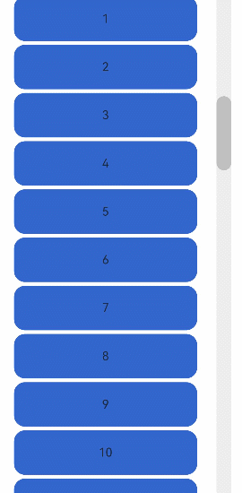
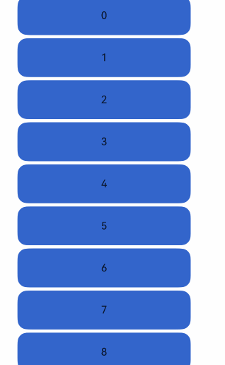

# ScrollBar

The ScrollBar component is used in conjunction with scrollable components such as [List](./cj-scroll-swipe-list.md), [Grid](./cj-scroll-swipe-grid.md), and [Scroll](./cj-scroll-swipe-scroll.md).

> **Note:**
>
> When the main axis size of ScrollBar is not specified, it adopts the maxSize from the parent component's <!--[-->layout constraints<!--]()-->. If the parent component of ScrollBar contains a scrollable component (e.g., [List](./cj-scroll-swipe-list.md), [Grid](./cj-scroll-swipe-grid.md), [Scroll](./cj-scroll-swipe-scroll.md)), it is recommended to set the main axis size of ScrollBar; otherwise, the main axis size of ScrollBar may become infinite.

## Import Module

```cangjie
import kit.ArkUI.*
```

## Child Components

Can contain a single child component.

## Creating the Component

### init(?Scroller, ?ScrollBarDirection, ?BarState, () -> Unit)

```cangjie
public init(
    scroller!: ?Scroller,
    direction!: ?ScrollBarDirection = None,
    state!: ?BarState = None,
    child!: () -> Unit
)
```

**Functionality:** Creates a scrollbar component.

**System Capability:** SystemCapability.ArkUI.ArkUI.Full

**Since Version:** 22

**Parameters:**

| Parameter | Type | Required | Default Value | Description |
|:---|:---|:---|:---|:---|
| scroller | ?[Scroller](./cj-scroll-swipe-scroll.md#class-scroller) | Yes | - | **Named parameter.** The controller of the scrollable component. Used to bind with the scrollable component. |
| direction | ?[ScrollBarDirection](./cj-common-types.md#enum-scrollbardirection) | No | None | **Named parameter.** The direction of the scrollbar, controlling the scrolling of the corresponding direction in the scrollable component. Initial value: ScrollBarDirection.Vertical. |
| state | ?[BarState](./cj-common-types.md#enum-barstate) | No | None | **Named parameter.** The state of the scrollbar. Initial value: BarState.Auto. |
| child | () -> Unit | Yes | - | **Named parameter.** The child component within the container. |

## Common Attributes/Common Events

Common Attributes: All supported  
Common Events: All supported  

## Example Code

### Example 1 (With Child Component)

This example demonstrates the scrollbar style when the ScrollBar component has a child component.

<!-- run -->

```cangjie
package ohos_app_cangjie_entry
import kit.ArkUI.*
import ohos.arkui.state_macro_manage.*
import std.collection.ArrayList

@Entry
@Component
class EntryView {
    var arr: ArrayList<Int64> = ArrayList<Int64>([0, 1, 2, 3, 4, 5, 6, 7, 8, 9, 10, 11, 12, 13, 14, 15])
    let scroller = Scroller()
    func build() {
        Column() {
            Stack(alignContent: Alignment.End) {
                Scroll(this.scroller) {
                    Flex(direction: FlexDirection.Column, alignItems: ItemAlign.Start) {
                        ForEach(this.arr, itemGeneratorFunc: { item: Int64, idx: Int64 =>
                            Row() {
                                Text(item.toString())
                                .width(80.percent)
                                .height(60)
                                .backgroundColor(0x3366CC)
                                .borderRadius(15)
                                .fontSize(16)
                                .textAlign(TextAlign.Center)
                                .margin(top: 5)
                            }
                        })
                    }
                    .margin(right: 15)
                }
                .width(90.percent)
                .scrollBar(BarState.Off)
                .scrollable(ScrollDirection.Vertical)
                ScrollBar(scroller: this.scroller, direction: ScrollBarDirection.Vertical, state: BarState.Auto) {
                    Text("")
                    .width(20)
                    .height(100)
                    .borderRadius(10)
                    .backgroundColor(0xC0C0C0)
                }
                .width(20)
                .backgroundColor(0xededed)
            }
        }
    }
}
```



### Example 2 (Without Child Component)

This example demonstrates the scrollbar style when the ScrollBar component has no child component.

<!-- run -->

```cangjie
package ohos_app_cangjie_entry
import kit.ArkUI.*
import ohos.arkui.state_macro_manage.*
import std.collection.ArrayList

@Entry
@Component
class EntryView {
    var arr: ArrayList<Int64> = ArrayList<Int64>([0, 1, 2, 3, 4, 5, 6, 7, 8, 9, 10, 11, 12, 13, 14, 15])
    let scroller = Scroller()
    func build() {
        Column() {
            Stack(alignContent: Alignment.End) {
                Scroll(this.scroller) {
                    Flex(direction: FlexDirection.Column, alignItems: ItemAlign.Start) {
                        ForEach(
                            this.arr,
                            itemGeneratorFunc: {
                                item: Int64, idx: Int64 => Row() {
                                    Text(item.toString()).width(80.percent).height(60).backgroundColor(0x3366CC).
                                        borderRadius(15).fontSize(16).textAlign(TextAlign.Center).margin(top: 5)
                                }
                            }
                        )
                    }.margin(right: 15)
                }.width(90.percent).scrollBar(BarState.Off).scrollable(ScrollDirection.Vertical)
                ScrollBar(scroller: this.scroller, direction: ScrollBarDirection.Vertical, state: BarState.Auto) {}
            }
        }
    }
}
```

