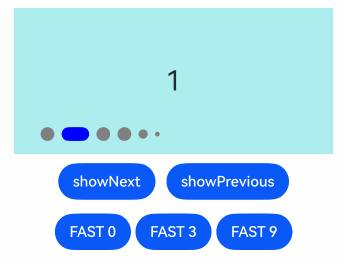
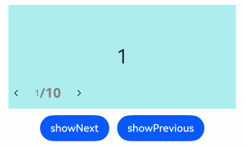
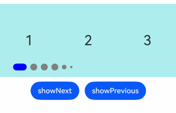
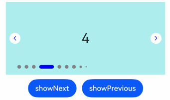

# Swiper

A sliding view container that provides the ability to display child components in a carousel.

## Import Module

```cangjie
import kit.ArkUI.*
```

## Child Components

Can contain child components.

> **Note:**
>
> - Child component types: System components and custom components, supporting rendering control types ([if/else](../../arkui-cj/rendering_control/cj-rendering-control-ifelse.md), [ForEach](../../arkui-cj/rendering_control/cj-rendering-control-foreach.md), and [LazyForEach](../../arkui-cj/rendering_control/cj-rendering-control-lazyforeach.md)). It is not recommended to mix lazy-load components (including LazyForEach) with non-lazy-load components in child components, or to use multiple lazy-load components in child components, as this may cause issues such as the preloading capability of lazy-load components becoming invalid. It is not recommended to perform operations on data sources during component animations, as this may lead to abnormal layouts.
> - When the [visibility](./cj-universal-attribute-visibility.md#func-visibilityvisibility) attribute of a Swiper child component is set to Visibility.None and the displayCount attribute of Swiper is set to 'auto', the corresponding child component does not occupy space within the viewport but does not affect the number of navigation points. When the visibility attribute is set to Visibility.None or Visibility.Hidden, the corresponding child component is not displayed but still occupies space within the viewport.
> - When the [offset](./cj-universal-attribute-location.md#func-offsetlength-length) attribute is set for a Swiper child component, the components are drawn according to their hierarchy, with higher-level components covering lower-level ones. For example, if Swiper contains 3 child components and the 3rd child component has offset({ x : 100 }) set, during horizontal cyclic sliding, the 3rd child component will cover the 1st child component. In this case, you can set the [zIndex](./cj-universal-attribute-zorder.md#func-zindexint32) attribute value of the 1st child component to be greater than that of the 3rd child component, making the 1st child component higher in hierarchy than the 3rd.

## Creating the Component

### init(?SwiperController, () -> Unit)

```cangjie
public init(controller!: ?SwiperController = Option.None, child!: () -> Unit)
```

**Function:** Creates a Swiper object containing a Swiper controller and child components.

**System Capability:** SystemCapability.ArkUI.ArkUI.Full

**Initial Version:** 22

**Parameters:**

| Parameter Name | Type | Required | Default Value | Description |
|:---|:---|:---|:---|:---|
| controller | ?[SwiperController](#class-swipercontroller) | No | Option.None | **Named parameter.** Binds a controller to the component for controlling page flipping. |
| child | () -> Unit | Yes | - | **Named parameter.** Child components of the Swiper container. |

## Universal Attributes/Events

Universal attributes: All supported.

> **Note:**
>
> The initial value of the Swiper component's [universal attribute clip](./cj-universal-attribute-shapclip.md#func-clipbool) is true.

Universal events: All supported.

## Component Attributes

### func autoPlay(?Bool)

```cangjie
public func autoPlay(value: ?Bool): This
```

**Function:** Sets whether child components automatically play. When [loop](#func-loopbool) is false, automatic carousel stops at the last page. Playback continues if the gesture switches to a page that is not the last. Playback stops when Swiper is not visible.

**System Capability:** SystemCapability.ArkUI.ArkUI.Full

**Initial Version:** 22

**Parameters:**

| Parameter Name | Type | Required | Default Value | Description |
|:---|:---|:---|:---|:---|
| value | ?Bool | Yes | - | Whether child components automatically play.<br>Initial value: false, no automatic carousel. |

### func cachedCount(?Int32)

```cangjie
public func cachedCount(value: ?Int32): This
```

**Function:** Sets the number of preloaded child components, based on the current page, loading the specified number of pages before and after the currently displayed page. For example, when cachedCount=1, the child components of the page before and after the currently displayed page are preloaded. If flipping by group is enabled (i.e., the swipeByGroup parameter of displayCount is set to true), preloading is done by group. For example, when cachedCount=1 and swipeByGroup=true, the child components of the group before and after the current group are preloaded.

**System Capability:** SystemCapability.ArkUI.ArkUI.Full

**Initial Version:** 22

**Parameters:**

| Parameter Name | Type | Required | Default Value | Description |
|:---|:---|:---|:---|:---|
| value | ?Int32 | Yes | - | Number of preloaded child components.<br>Initial value: 1.<br>Range: [0, +∞). Values less than 0 are treated as the initial value. |

### func curve(?Curve)

```cangjie
public func curve(value: ?Curve): This
```

**Function:** Sets the animation curve for Swiper, defaulting to a spring interpolation curve. Common curves can be found in the [Curve enum description](./cj-common-types.md#enum-curve).

**System Capability:** SystemCapability.ArkUI.ArkUI.Full

**Initial Version:** 22

**Parameters:**

| Parameter Name | Type | Required | Default Value | Description |
|:---|:---|:---|:---|:---|
| value | ?[Curve](./cj-common-types.md#enum-curve) | Yes | - | Animation curve for Swiper.<br>Initial value: Curve.Linear. |

### func disableSwipe(?Bool)

```cangjie
public func disableSwipe(value: ?Bool): This
```

**Function:** Disables the swipe-to-switch functionality of the component.

**System Capability:** SystemCapability.ArkUI.ArkUI.Full

**Initial Version:** 22

**Parameters:**

| Parameter Name | Type | Required | Default Value | Description |
|:---|:---|:---|:---|:---|
| value | ?Bool | Yes | - | Whether to disable the swipe-to-switch functionality. true disables, false enables.<br>Initial value: false. |

### func displayCount(?Int32, ?Bool)

```cangjie
public func displayCount(value: ?Int32, swipeByGroup!: ?Bool = None): This
```

**Function:** Sets the number of elements displayed within the Swiper viewport.

When using the Int32 type, child components are stretched (or shrunk) along the main axis to evenly divide the Swiper width (minus displayCount-1 itemSpace). Values less than or equal to 0 are displayed as the initial value of 1.

When flipping by group, the drag distance threshold for flipping is adjusted to 50% of the Swiper width (if flipping by child element, this threshold is 50% of the child element width). If the last group has fewer child elements than displayCount, placeholder child elements are used for filling. Placeholder child elements are only used for layout positioning and do not display any content; their positions will show the Swiper's background style directly.

**System Capability:** SystemCapability.ArkUI.ArkUI.Full

**Initial Version:** 22

**Parameters:**

| Parameter Name | Type | Required | Default Value | Description |
|:---|:---|:---|:---|:---|
| value | ?Int32 | Yes | - | Number of child elements displayed within the viewport. Values less than or equal to 0 are treated as the initial value.<br>Initial value: 1.<br>Range: (0, +∞). Values less than or equal to 0 are treated as the initial value. |
| swipeByGroup | ?Bool | No | None | **Named parameter.** Whether to flip by group. If true, flipping is done by group, with the number of child elements per group equal to the displayCount value. If false, the default flipping behavior (by child element) is used.<br>Initial value: false. |

> **Note:**
>
> When the number of Swiper child components is less than or equal to the total number of nodes displayed within the Swiper component's content area (totalDisplayCount = DisplayCount + prevMargin? (1 : 0) + nextMargin? (1 : 0)), the layout is generally handled in non-loop mode. In this case, the margin child components corresponding to the front and back are not displayed but still occupy space within the viewport. The Swiper component measures specifications based on the totalDisplayCount number. Exceptions are as follows:
>
> - When the number of Swiper child components equals the total number of nodes displayed within the Swiper component's content area and both prevMargin and nextMargin are effective, setting loop to true enables looping.
> - When the number of Swiper child components equals DisplayCount + 1 and at least one of prevMargin or nextMargin is effective, setting loop to true generates screenshot placeholder components (if components with long display times, such as asynchronous image loading, are used, screenshots may not be generated correctly; it is not recommended to enable looping in this scenario), enabling looping.

### func displayMode(?SwiperDisplayMode)

```cangjie
public func displayMode(value: ?SwiperDisplayMode): This
```

**Function:** Sets the arrangement mode of elements along the main axis, prioritizing the number set by displayCount. If displayCount is not set, this attribute takes effect.

**System Capability:** SystemCapability.ArkUI.ArkUI.Full

**Initial Version:** 22

**Parameters:**

| Parameter Name | Type | Required | Default Value | Description |
|:---|:---|:---|:---|:---|
| value | ?[SwiperDisplayMode](./cj-common-types.md#enum-swiperdisplaymode) | Yes | - | Arrangement mode of elements along the main axis.<br>Initial value: SwiperDisplayMode.Stretch. |

### func duration(?UInt32)

```cangjie
public func duration(value: ?UInt32): This
```

**Function:** Sets the animation duration for child component switching.

duration needs to be used together with [curve](#func-curvecurve).

The default curve is [interpolatingSpring](./cj-apis-curves.md#static-func-interpolatingspringfloat32-float32-float32-float32), in which case the animation duration is only affected by the curve's own parameters and is no longer controlled by duration. Curves not controlled by duration can be found in the [Interpolation Calculation](./cj-apis-curves.md) module, such as [springMotion](./cj-apis-curves.md#static-func-springmotionfloat32-float32-float32), [responsiveSpringMotion](./cj-apis-curves.md#static-func-responsivespringmotionfloat32-float32-float32), and interpolatingSpring-type curves. If you want the animation duration to be controlled by duration, you need to set other curves for curve.

**System Capability:** SystemCapability.ArkUI.ArkUI.Full

**Initial Version:** 22

**Parameters:**

| Parameter Name | Type | Required | Default Value | Description |
|:---|:---|:---|:---|:---|
| value | ?UInt32 | Yes | - | Animation duration for child component switching, in milliseconds. Values less than 0 are treated as the initial value.<br>Initial value: 400.<br>Range: [0, +∞). Values less than 0 are treated as the initial value. |

### func effectMode(?EdgeEffect)

```cangjie
public func effectMode(value: ?EdgeEffect): This
```

**Function:** Sets the edge swipe effect, effective when [loop](#func-loopbool) = false. The bounce effect is not applied when jumping to the first or last page using the SwiperController.changeIndex(), SwiperController.showNext(), or SwiperController.showPrevious() interfaces.

**System Capability:** SystemCapability.ArkUI.ArkUI.Full

**Initial Version:** 22

**Parameters:**

| Parameter Name | Type | Required | Default Value | Description |
|:---|:---|:---|:---|:---|
| value | ?[EdgeEffect](./cj-common-types.md#enum-edgeeffect) | Yes | - | Edge swipe effect.<br>Initial value: EdgeEffect.Spring. |

### func index(?UInt32)

```cangjie
public func index(value: ?UInt32): This
```

**Function:** Sets the index value of the child component currently displayed in the container. Values greater than or equal to the number of child components are treated as the initial value of 0.

**System Capability:** SystemCapability.ArkUI.ArkUI.Full

**Initial Version:** 22

**Parameters:**

| Parameter Name | Type | Required | Default Value | Description |
|:---|:---|:---|:---|:---|
| value | ?UInt32 | Yes | - | Index value of the child component currently displayed in the container.<br> **Note:**<br>Values less than 0 or greater than the maximum page index are treated as 0.<br>Initial value: 0. |

### func indicator(?Bool)

```cangjie
public func indicator(indicator: ?Bool): This
```

**Function:** Sets the optional navigation point indicator style.

**System Capability:** SystemCapability.ArkUI.ArkUI.Full

**Initial Version:** 22

**Parameters:**

| Parameter Name | Type | Required | Default Value | Description |
|:---|:---|:---|:---|:---|
| indicator | ?Bool | Yes | - | Optional navigation point indicator style.<br>- boolean: Whether to enable the navigation point indicator. true enables, false disables.<br>Initial value: true. |

### func indicator(?DotIndicator)

```cangjie
public func indicator(indicator: ?DotIndicator): This
```

**Function:** Sets the externally bound navigation point component controller.

**System Capability:** SystemCapability.ArkUI.ArkUI.Full

**Initial Version:** 22

**Parameters:**

| Parameter Name | Type | Required | Default Value | Description |
|:---|:---|:---|:---|:---|
| indicator | ?[DotIndicator](#class-dotindicator) | Yes | - | Optional navigation point indicator style.<br>- DotIndicator: Dot indicator style.<br>Initial value: DigitIndicator(). |

### func indicator(?DigitIndicator)

```cangjie
public func indicator(indicator: ?DigitIndicator): This
```

**Function:** Sets the externally bound navigation point component controller.

**System Capability:** SystemCapability.ArkUI.ArkUI.Full

**Initial Version:** 22

**Parameters:**

| Parameter Name | Type | Required | Default Value | Description |
|:---|:---|:---|:---|:---|
| indicator | ?[DigitIndicator](#class-digitindicator) | Yes | - | Optional navigation point indicator style.<br>- DigitIndicator: Digit indicator style.<br>Initial value: DigitIndicator(). |

### func interval(?UInt32)

```cangjie
public func interval(value: ?UInt32): This
```

**Function:** Sets the time interval for playback when using auto-play.

**System Capability:** SystemCapability.ArkUI.ArkUI.Full

**Initial Version:** 22

**Parameters:**

| Parameter Name | Type | Required | Default Value | Description |
|:---|:---|:---|:---|:---|
| value | ?UInt32 | Yes | - | Time interval for playback during auto-play. If less than the [duration](#func-durationuint32) attribute value, the next carousel starts immediately after page flipping completes.<br>Initial value: 3000.<br>Unit: milliseconds.<br>Values less than 0 are treated as the initial value. |

### func itemSpace(?Length)

```cangjie
public func itemSpace(value: ?Length): This
```

**Function:** Sets the gap between child components. Percentage values are not supported.

For Int64 and Float64 types, the default unit is vp. For string types, pixel units must be explicitly specified, e.g., '10px'. If pixel units are not specified, e.g., '10', the unit is vp.

**System Capability:** SystemCapability.ArkUI.ArkUI.Full

**Initial Version:** 22

**Parameters:**

| Parameter Name | Type | Required | Default Value | Description |
|:---|:---|:---|:---|:---|
| value | ?[Length](./cj-common-types.md#interface-length) | Yes | - | Gap between child components.<br/> For Int64 and Float64 types, the default unit is vp.<br>Values less than 0 or exceeding the Swiper component width range are treated as the initial value.<br>Initial value: 0.0.vp. |

### func loop(?Bool)

```cangjie
public func loop(value: ?Bool): This
```

**Function:** Sets whether to enable looping. When set to true, looping is enabled. In LazyForEach lazy loading mode, it is recommended to have more than 5 components loaded.

**System Capability:** SystemCapability.ArkUI.ArkUI.Full

**Initial Version:** 22

**Parameters:**

| Parameter Name | Type | Required | Default Value | Description |
|:---|:---|:---|:---|:---|
| value | ?Bool | Yes | - | Whether to enable looping. true enables looping, false disables looping.<br>Initial value: true. |

### func vertical(?Bool)

```cangjie
public func vertical(value: ?Bool): This
```

**Function:** Sets whether to enable vertical sliding.

**System Capability:** SystemCapability.ArkUI.ArkUI.Full

**Initial Version:** 22

**Parameters:**

| Parameter Name | Type | Required | Default Value | Description |
|:---|:---|:---|:---|:---|
| value | ?Bool | Yes | - | Whether to enable vertical sliding. true enables vertical sliding, false enables horizontal sliding.<br>Initial value: false. |

## Component Events

### func onChange(?(Int32) -> Unit)

```cangjie
public func onChange(event: ?(Int32) -> Unit): This
```

**Function:** Triggered when the index of the currently displayed child component changes, returning the index value of the currently displayed child component.

When using Swiper with LazyForEach, do not trigger UI refresh of child pages in the onChange event.

## Basic Type Definitions

### class DotIndicator

```cangjie
public class DotIndicator <: Indicator {
    public init()
}
```

**Function:** Constructor for DotIndicator.

> **Note:**
>
>When a navigation dot is pressed, it scales up to 1.33 times its original size. Therefore, there is a certain distance between the visible boundary of the unpressed dot and its actual boundary. This distance increases as parameters like `itemWidth`, `itemHeight`, `selectedItemWidth`, and `selectedItemHeight` grow larger.

**System Capability:** SystemCapability.ArkUI.ArkUI.Full

**Since:** 22

**Parent Type:**

- [Indicator](#class-indicator)

#### init()

```cangjie
public init()
```

**Function:** Constructor for DigitIndicator.

**System Capability:** SystemCapability.ArkUI.ArkUI.Full

**Since:** 22

#### func color(?ResourceColor)

```cangjie
public func color(value: ?ResourceColor): This
```

**Function:** Sets the color of the dot navigation indicator for the Swiper component.

**System Capability:** SystemCapability.ArkUI.ArkUI.Full

**Since:** 22

**Parameters:**

| Parameter | Type | Required | Default Value | Description |
|:---|:---|:---|:---|:---|
| value | ?[ResourceColor](./cj-common-types.md#interface-resourcecolor) | Yes | - | Sets the color of the dot navigation indicator for the Swiper component.<br>Initial value: 0x182431 (10% opacity). |

#### func itemHeight(?Length)

```cangjie
public func itemHeight(value: ?Length): This
```

**Function:** Sets the height of the dot navigation indicator for the Swiper component. Percentage values are not supported.

**System Capability:** SystemCapability.ArkUI.ArkUI.Full

**Since:** 22

**Parameters:**

| Parameter | Type | Required | Default Value | Description |
|:---|:---|:---|:---|:---|
| value | ?[Length](./cj-common-types.md#interface-length) | Yes | - | Sets the height of the dot navigation indicator for the Swiper component. Percentage values are not supported.<br>Initial value: 6.<br>Unit: vp. |

#### func itemWidth(?Length)

```cangjie
public func itemWidth(value: ?Length): This
```

**Function:** Sets the width of the dot navigation indicator for the Swiper component. Percentage values are not supported.

**System Capability:** SystemCapability.ArkUI.ArkUI.Full

**Since:** 22

**Parameters:**

| Parameter | Type | Required | Default Value | Description |
|:---|:---|:---|:---|:---|
| value | ?[Length](./cj-common-types.md#interface-length) | Yes | - | Sets the width of the dot navigation indicator for the Swiper component. Percentage values are not supported.<br>Initial value: 6.<br>Unit: vp. |

#### func mask(?Bool)

```cangjie
public func mask(value: ?Bool): This
```

**Function:** Determines whether to display the mask style for the dot navigation indicator of the Swiper component.

**System Capability:** SystemCapability.ArkUI.ArkUI.Full

**Since:** 22

**Parameters:**

| Parameter | Type | Required | Default Value | Description |
|:---|:---|:---|:---|:---|
| value | ?Bool | Yes | - | Sets whether to display the mask style for the dot navigation indicator of the Swiper component.<br>Initial value: false. |

#### func maxDisplayCount(?UInt32)

```cangjie
public func maxDisplayCount(value: ?UInt32): This
```

**Function:** Sets the maximum number of navigation dots to display in dot navigation indicator mode.

This property does not take effect when the navigation dot component is used independently without being bound to a Swiper.

**System Capability:** SystemCapability.ArkUI.ArkUI.Full

**Since:** 22

**Parameters:**

| Parameter | Type | Required | Default Value | Description |
|:---|:---|:---|:---|:---|
| value | ?UInt32 | Yes | - | Sets the maximum number of navigation dots to display in dot navigation indicator mode. When the actual number of navigation dots exceeds this value, an overflow effect style will be applied, as shown in Example 4.<br>Initial value: This property has no initial value. Invalid settings will result in no overflow effect.<br>Valid range: 6-9.<br> **Note:**<br>1. Overflow display scenarios currently do not support interactive functions (including touch, drag, mouse operations, etc.).<br>2. In overflow display scenarios, the position of the selected navigation dot corresponding to the middle page is not completely fixed and depends on the previous page-turning operation sequence.<br>3. Currently, only scenarios where `displayCount` is 1 are supported. |

#### func selectedColor(?ResourceColor)

```cangjie
public func selectedColor(value: ?ResourceColor): This
```

**Function:** Sets the color of the selected dot navigation indicator for the Swiper component.

**System Capability:** SystemCapability.ArkUI.ArkUI.Full

**Since:** 22

**Parameters:**

| Parameter | Type | Required | Default Value | Description |
|:---|:---|:---|:---|:---|
| value | ?[ResourceColor](./cj-common-types.md#interface-resourcecolor) | Yes | - | Sets the color of the selected dot navigation indicator for the Swiper component.<br>Initial value: 0x007DFF. |

#### func selectedItemHeight(?Length)

```cangjie
public func selectedItemHeight(value: ?Length): This
```

**Function:** Sets the height of the selected dot navigation indicator for the Swiper component. Percentage values are not supported.

**System Capability:** SystemCapability.ArkUI.ArkUI.Full

**Since:** 22

**Parameters:**

| Parameter | Type | Required | Default Value | Description |
|:---|:---|:---|:---|:---|
| value | ?[Length](./cj-common-types.md#interface-length) | Yes | - | Sets the height of the selected dot navigation indicator for the Swiper component. Percentage values are not supported.<br>Initial value: 6.<br>Unit: vp. |

#### func selectedItemWidth(?Length)

```cangjie
public func selectedItemWidth(value: ?Length): This
```

**Function:** Sets the width of the selected dot navigation indicator for the Swiper component. Percentage values are not supported.

**System Capability:** SystemCapability.ArkUI.ArkUI.Full

**Since:** 22

**Parameters:**

| Parameter | Type | Required | Default Value | Description |
|:---|:---|:---|:---|:---|
| value | ?[Length](./cj-common-types.md#interface-length) | Yes | - | Sets the width of the selected dot navigation indicator for the Swiper component. Percentage values are not supported.<br>Initial value: 12.<br>Unit: vp. |

### class Indicator

```cangjie
public open class Indicator {
    public func bottom(?Length): This
    public func end(?Length): This
    public func left(?Length): This
    public func right(?Length): This
    public func start(?Length): This
    public func top(?Length): This
    public static func digit(): DigitIndicator
    public static func dot(): DotIndicator
    public init()
}
```

**Function:** Sets the distance between the navigation dots and the Swiper component. Due to the default interactive area of the navigation dots (32 vp in height), it is not possible to make the visible part completely flush with the bottom.

**System Capability:** SystemCapability.ArkUI.ArkUI.Full

**Since:** 22

#### init()

```cangjie
public init()
```

**Function:** Constructor for the Indicator.

**System Capability:** SystemCapability.ArkUI.ArkUI.Full

**Since:** 22

#### static func digit()

```cangjie
public static func digit(): DigitIndicator
```

**Function:** Returns a DigitIndicator object.

**System Capability:** SystemCapability.ArkUI.ArkUI.Full

**Since:** 22

**Return Value:**

| Type | Description |
|:----|:----|
| [DigitIndicator](#class-digitindicator) | A digit indicator. |

#### static func dot()

```cangjie
public static func dot(): DotIndicator
```

**Function:** Returns a DotIndicator object.

**System Capability:** SystemCapability.ArkUI.ArkUI.Full

**Since:** 22

**Return Value:**

| Type | Description |
|:----|:----|
| [DotIndicator](#class-dotindicator) | A dot indicator. |

#### func bottom(?Length)

```cangjie
public func bottom(value: ?Length): This
```

**Function:** Sets the position of the navigation dots relative to the bottom of the Swiper.

**System Capability:** SystemCapability.ArkUI.ArkUI.Full

**Since:** 22

**Parameters:**

| Parameter | Type | Required | Default Value | Description |
|:---|:---|:---|:---|:---|
| value | ?[Length](./cj-common-types.md#interface-length) | Yes | - | Sets the position of the navigation dots relative to the bottom of the Swiper.<br>When neither `top` nor `bottom` is set, adaptive layout is applied. The indicator aligns to the bottom in the cross-axis direction based on its own size and the Swiper's size, which is equivalent to setting `bottom=0`.<br>Setting to 0: Layout is calculated based on the 0 position.<br>Priority: Lower than the `top` attribute.<br>Valid range: [0, Swiper height - navigation dot area height]. Values outside this range will be clamped to the nearest boundary. |

#### func end(?Length)

```cangjie
public func end(value: ?Length): This
```

**Function:** In RTL mode, sets the distance between the navigation dots and the left side of the Swiper component. In LTR mode, sets the distance between the navigation dots and the right side of the Swiper component.

**System Capability:** SystemCapability.ArkUI.ArkUI.Full

**Since:** 22

**Parameters:**

| Parameter | Type | Required | Default Value | Description |
|:---|:---|:---|:---|:---|
| value | ?[Length](./cj-common-types.md#interface-length) | Yes | - | In RTL mode, sets the distance between the navigation dots and the left side of the Swiper component. In LTR mode, sets the distance between the navigation dots and the right side of the Swiper component.<br>Initial value: 0.<br>Unit: vp. |

#### func left(?Length)

```cangjie
public func left(value: ?Length): This
```

**Function:** Sets the position of the navigation dots relative to the left side of the Swiper.

**System Capability:** SystemCapability.ArkUI.ArkUI.Full

**Since:** 22

**Parameters:**

| Parameter | Type | Required | Default Value | Description |
|:---|:---|:---|:---|:---|
| value | ?[Length](./cj-common-types.md#interface-length) | Yes | - | Sets the position of the navigation dots relative to the left side of the Swiper.<br>When neither `left` nor `right` is set, adaptive layout is applied. The indicator centers itself in the main-axis direction based on its own size and the Swiper's size.<br>Setting to 0: Layout is calculated based on the 0 position.<br>Priority: Higher than the `right` attribute.<br>Valid range: [0, Swiper width - navigation dot area width]. Values outside this range will be clamped to the nearest boundary. |

#### func right(?Length)

```cangjie
public func right(value: ?Length): This
```

**Function:** Sets the position of the navigation dots relative to the right side of the Swiper.

**System Capability:** SystemCapability.ArkUI.ArkUI.Full

**Since:** 22

**Parameters:**

| Parameter | Type | Required | Default Value | Description |
|:---|:---|:---|:---|:---|
| value | ?[Length](./cj-common-types.md#interface-length) | Yes | - | Sets the position of the navigation dots relative to the right side of the Swiper.<br>When neither `left` nor `right` is set, adaptive layout is applied. The indicator centers itself in the main-axis direction based on its own size and the Swiper's size.<br>Setting to 0: Layout is calculated based on the 0 position.<br>Priority: Lower than the `left` attribute.<br>Valid range: [0, Swiper width - navigation dot area width]. Values outside this range will be clamped to the nearest boundary. |

#### func start(?Length)

```cangjie
public func start(value: ?Length): This
```

**Function:** In RTL mode, sets the distance between the navigation dots and the right side of the Swiper component. In LTR mode, sets the distance between the navigation dots and the left side of the Swiper component.

**System Capability:** SystemCapability.ArkUI.ArkUI.Full

**Since:** 22

**Parameters:**

| Parameter | Type | Required | Default Value | Description |
|:---|:---|:---|:---|:---|
| value | ?[Length](./cj-common-types.md#interface-length) | Yes | - | In RTL mode, sets the distance between the navigation dots and the right side of the Swiper component. In LTR mode, sets the distance between the navigation dots and the left side of the Swiper component.<br>Initial value: 0.<br>Unit: vp. |

#### func top(?Length)

```cangjie
public func top(value: ?Length): This
```

**Function:** Sets the position of the navigation dots relative to the top of the Swiper.

**System Capability:** SystemCapability.ArkUI.ArkUI.Full

**Since:** 22

**Parameters:**

| Parameter | Type | Required | Default Value | Description |
|:---|:---|:---|:---|:---|
| value | ?[Length](./cj-common-types.md#interface-length) | Yes | - | Sets the position of the navigation dots relative to the top of the Swiper.<br>When neither `top` nor `bottom` is set, adaptive layout is applied. The indicator aligns to the bottom in the cross-axis direction based on its own size and the Swiper's size, which is equivalent to setting `bottom=0`.<br>Setting to 0: Layout is calculated based on the 0 position.<br>Priority: Higher than the `bottom` attribute.<br>Valid range: [0, Swiper height - navigation dot area height]. Values outside this range will be clamped to the nearest boundary. |

### class SwiperController

```cangjie
public class SwiperController {
    public init()
}
```

**Function:** SwiperController is the controller for the Swiper container component. An object of this type can be defined and bound to a Swiper component to control page-turning for child components.

**System Capability:** SystemCapability.ArkUI.ArkUI.Full

**Since:** 22

#### init()

```cangjie
public init()
```

**Function:** Constructor for SwiperController.

**System Capability:** SystemCapability.ArkUI.ArkUI.Full

**Since:** 22

#### func finishAnimation()

```cangjie
public func finishAnimation(): Unit
```

**Function:** Stops the animation playback.

**System Capability:** SystemCapability.ArkUI.ArkUI.Full

**Since:** 22

#### func finishAnimation(?() -> Unit)

```cangjie
public func finishAnimation(callback: ?() -> Unit): Unit
```

**Function:** Stops the animation playback.

**System Capability:** SystemCapability.ArkUI.ArkUI.Full

**Since:** 22

**Parameters:**

| Parameter | Type | Required | Default Value | Description |
|:---|:---|:---|:---|:---|
| callback | ?() -> Unit | Yes | - | Callback function triggered when the animation ends.<br>Initial value: { => }. |

#### func showNext()

```cangjie
public func showNext(): Unit
```

**Function:** Turns to the next page. The page-turning animation duration is set via the Swiper's [duration](#func-durationuint32) property.

**System Capability:** SystemCapability.ArkUI.ArkUI.Full

**Since:** 22

#### func showPrevious()

```cangjie
public func showPrevious(): Unit
```

**Function:** Turns to the previous page. The page-turning animation duration is set via the Swiper's [duration](#func-durationuint32) property.

**System Capability:** SystemCapability.ArkUI.ArkUI.Full

**Since:** 22## Sample Code

### Sample Code 1 (Setting Navigation Point Interaction and Page Flip Animation)

This example implements page flipping to a specified page in the Swiper component by setting the SwiperAnimationMode effect through the changeIndex interface.

```cangjie
package ohos_app_cangjie_entry

import kit.ArkUI.*
import ohos.arkui.state_macro_manage.*
import std.collection.ArrayList

class MyDataSource<T> <: IDataSource<T> {
    private var list: ArrayList<T> = ArrayList<T>([])

    MyDataSource(list: ArrayList<T>) {
        this.list = list
    }

    public func totalCount(): Int64 {
        return this.list.size
    }

    public func getData(index: Int64): T {
        return this.list[index]
    }

    public func registerDataChangeListener(listener: DataChangeListener): Unit {
    }

    public func unregisterDataChangeListener(listener: DataChangeListener): Unit {
    }
}

@Entry
@Component
class EntryView {
    private var swiperController: SwiperController = SwiperController()
    private var data: MyDataSource<Int64> = MyDataSource<Int64>(ArrayList<Int64>([]))

    protected override func aboutToAppear() {
        var list: ArrayList<Int64> = ArrayList<Int64>([])
        for (i in 0..10) {
            list.add(i)
        }
        this.data = MyDataSource<Int64>(list)
    }

    func build() {
        Column(space: 5) {
            Swiper(controller: this.swiperController) {
                LazyForEach(
                    this.data,
                    itemGeneratorFunc: {
                        item: Int64, idx: Int64 => Text(item.toString())
                            .width(90.percent)
                            .height(160)
                            .backgroundColor(0xAFEEEE)
                            .textAlign(TextAlign.Center)
                            .fontSize(30)
                    }
                )
            }
                .cachedCount(2)
                .index(1)
                .autoPlay(true)
                .interval(4000)
                .loop(true)
                .duration(1000)
                .itemSpace(0)
                .indicator( // Set dot navigation point style
                    DotIndicator()
                        .itemWidth(15)
                        .itemHeight(15)
                        .selectedItemWidth(15)
                        .selectedItemHeight(15)
                        .color(Color.Gray)
                        .selectedColor(Color.Blue))
                .curve(Curve.Linear)

            Row(space: 12) {
                Button("showNext").onClick({
                    _ => this
                        .swiperController
                        .showNext()
                })

                Button("showPrevious").onClick({
                    _ => this
                        .swiperController
                        .showPrevious()
                })
            }.margin(5)
        }
            .width(100.percent)
            .margin(top: 5)
    }
}
```



### Sample Code 2 (Setting Digital Indicator)

This example implements the digital indicator effect and functionality through the DigitIndicator interface.

```cangjie
package ohos_app_cangjie_entry

import kit.ArkUI.*
import ohos.arkui.state_macro_manage.*
import std.collection.ArrayList

class MyDataSource<T> <: IDataSource<T> {
    private var list: ArrayList<T> = ArrayList<T>([])

    MyDataSource(list: ArrayList<T>) {
        this.list = list
    }

    public func totalCount(): Int64 {
        return this
            .list
            .size
    }

    public func getData(index: Int64): T {
        return this.list[index]
    }

    public func registerDataChangeListener(listener: DataChangeListener): Unit {
    }

    public func unregisterDataChangeListener(listener: DataChangeListener): Unit {
    }
}

@Entry
@Component
class EntryView {
    private var swiperController: SwiperController = SwiperController()
    private var data: MyDataSource<Int64> = MyDataSource<Int64>(ArrayList<Int64>([]))

    protected override func aboutToAppear() {
        var list: ArrayList<Int64> = ArrayList<Int64>([])
        for (i in 1..=10) {
            list.add(i)
        }
        this.data = MyDataSource<Int64>(list)
    }

    func build() {
        Column(space: 5) {
            Swiper(controller: this.swiperController) {
                LazyForEach(
                    this.data,
                    itemGeneratorFunc: {
                        item: Int64, idx: Int64 => Text(item.toString())
                            .width(90.percent)
                            .height(160)
                            .backgroundColor(0xAFEEEE)
                            .textAlign(TextAlign.Center)
                            .fontSize(30)
                    }
                )
            }
                .cachedCount(2)
                .index(1)
                .autoPlay(true)
                .interval(4000)
                .indicator( // Set digital navigation point style
                    Indicator
                        .digit()
                        .top(200)
                        .fontColor(Color.Gray)
                        .selectedFontColor(Color.Gray)
                        .digitFont(Font(size: 20, weight: FontWeight.Bold)))
                .loop(true)
                .duration(1000)
                .itemSpace(0)

            Row(space: 12) {
                Button("showNext").onClick({
                    _ => this
                        .swiperController
                        .showNext()
                })

                Button("showPrevious").onClick({
                    _ => this
                        .swiperController
                        .showPrevious()
                })
            }.margin(5)
        }
            .width(100.percent)
            .margin(top: 5)
    }
}
```



### Sample Code 3 (Setting Group Page Flip)

This example implements group page flip effect through the displayCount property.

```cangjie
package ohos_app_cangjie_entry

import kit.ArkUI.*
import ohos.arkui.state_macro_manage.*
import std.collection.ArrayList

class MyDataSource<T> <: IDataSource<T> {
    private var list: ArrayList<T> = ArrayList<T>([])

    MyDataSource(list: ArrayList<T>) {
        this.list = list
    }

    public func totalCount(): Int64 {
        return this
            .list
            .size
    }

    public func getData(index: Int64): T {
        return this.list[index]
    }

    public func registerDataChangeListener(listener: DataChangeListener): Unit {
    }

    public func unregisterDataChangeListener(listener: DataChangeListener): Unit {
    }
}

@Entry
@Component
class EntryView {
    private var swiperController: SwiperController = SwiperController()
    private var data: MyDataSource<Int64> = MyDataSource<Int64>(ArrayList<Int64>([]))

    protected override func aboutToAppear() {
        var list: ArrayList<Int64> = ArrayList<Int64>([])
        for (i in 1..=10) {
            list.add(i)
        }
        this.data = MyDataSource<Int64>(list)
    }

    func build() {
        Column(space: 5) {
            Swiper(controller: this.swiperController) {
                LazyForEach(
                    this.data,
                    itemGeneratorFunc: {
                        item: Int64, idx: Int64 => Text(item.toString())
                            .width(90.percent)
                            .height(160)
                            .backgroundColor(0xAFEEEE)
                            .textAlign(TextAlign.Center)
                            .fontSize(30)
                    }
                )
            }
                .displayCount(3, swipeByGroup: true)
                .autoPlay(true)
                .interval(4000)
                .indicator( // Set dot navigation point style
                    DotIndicator()
                        .itemWidth(15)
                        .itemHeight(15)
                        .selectedItemWidth(15)
                        .selectedItemHeight(15)
                        .color(Color.Gray)
                        .selectedColor(Color.Blue))
                .loop(true)
                .duration(1000)

            Row(space: 12) {
                Button("showNext").onClick({
                    _ => this
                        .swiperController
                        .showNext()
                })

                Button("showPrevious").onClick({
                    _ => this
                        .swiperController
                        .showPrevious()
                })
            }.margin(5)
        }
            .width(100.percent)
            .margin(top: 5)
    }
}
```



### Sample Code 4 (Setting Extended Dot Navigation Display)

This example implements extended dot navigation animation effect through the maxDisplayCount property of the DotIndicator interface.

```cangjie
package ohos_app_cangjie_entry

import kit.ArkUI.*
import ohos.arkui.state_macro_manage.*
import std.collection.ArrayList

class MyDataSource<T> <: IDataSource<T> {
    private var list: ArrayList<T> = ArrayList<T>([])

    MyDataSource(list: ArrayList<T>) {
        this.list = list
    }

    public func totalCount(): Int64 {
        return this
            .list
            .size
    }

    public func getData(index: Int64): T {
        return this.list[index]
    }

    public func registerDataChangeListener(listener: DataChangeListener): Unit {
    }

    public func unregisterDataChangeListener(listener: DataChangeListener): Unit {
    }
}

@Entry
@Component
class EntryView {
    private var swiperController: SwiperController = SwiperController()
    private var data: MyDataSource<Int64> = MyDataSource<Int64>(ArrayList<Int64>([]))

    protected override func aboutToAppear() {
        var list: ArrayList<Int64> = ArrayList<Int64>([])
        for (i in 1..=10) {
            list.add(i)
        }
        this.data = MyDataSource<Int64>(list)
    }

    func build() {
        Column(space: 5) {
            Swiper(controller: this.swiperController) {
                LazyForEach(
                    this.data,
                    itemGeneratorFunc: {
                        item: Int64, idx: Int64 => Text(item.toString())
                            .width(90.percent)
                            .height(160)
                            .backgroundColor(0xAFEEEE)
                            .textAlign(TextAlign.Center)
                            .fontSize(30)
                    }
                )
            }
                .cachedCount(2)
                .index(5)
                .autoPlay(true)
                .interval(4000)
                .loop(true)
                .duration(1000)
                .itemSpace(0)
                .indicator(
                    DotIndicator()
                        .itemWidth(8)
                        .itemHeight(8)
                        .selectedItemWidth(16)
                        .selectedItemHeight(8)
                        .color(Color.Gray)
                        .selectedColor(Color.Blue)
                        .maxDisplayCount(9))
                .curve(Curve.Linear)

            Row(space: 12) {
                Button("showNext").onClick({
                    _ => this
                        .swiperController
                        .showNext()
                })

                Button("showPrevious").onClick({
                    _ => this
                        .swiperController
                        .showPrevious()
                })
            }.margin(5)
        }
            .width(100.percent)```swift
.margin(top: 5)
    }
}
```

