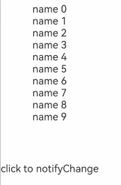

# LazyForEach

## Import Module

```cangjie
import kit.ArkUI.*
```

## interface IDataSource

```cangjie
public interface IDataSource<T> {
    func totalCount(): Int64
    func getData(index: Int64): T
    func onRegisterDataChangeListener(listener: DataChangeListener): Unit
    func onUnregisterDataChangeListener(listener: DataChangeListener): Unit
}
```

**Description:** Data source for LazyForEach, requiring developers to implement relevant interfaces.

**System Capability:** SystemCapability.ArkUI.ArkUI.Full

**Since:** 21

### func getData(Int64)

```cangjie
func getData(index: Int64): T
```

**Description:** Retrieves the data corresponding to the specified index value.

**Parameters:**

| Parameter | Type | Required | Default | Description |
|:---|:---|:---|:---|:---|
| index | Int64 | Yes | - | The index value corresponding to the data. |

**Return Value:**

| Type | Description |
|:----|:----|
| T | The data corresponding to the specified index value. |

### func onRegisterDataChangeListener(DataChangeListener)

```cangjie
func onRegisterDataChangeListener(listener: DataChangeListener): Unit
```

**Description:** Registers a listener for data changes.

**Parameters:**

| Parameter | Type | Required | Default | Description |
|:---|:---|:---|:---|:---|
| listener | [DataChangeListener](#class-datachangelistener) | Yes | - | The listener for data changes. |

### func onUnregisterDataChangeListener(DataChangeListener)

```cangjie
func onUnregisterDataChangeListener(listener: DataChangeListener): Unit
```

**Description:** Unregisters a listener for data changes.

**Parameters:**

| Parameter | Type | Required | Default | Description |
|:---|:---|:---|:---|:---|
| listener | [DataChangeListener](#class-datachangelistener) | Yes | - | The listener for data changes. |

### func totalCount()

```cangjie
func totalCount(): Int64
```

**Description:** Retrieves the total count of data items.

**Return Value:**

| Type | Description |
|:----|:----|
| Int64 | The total count of data items. |

## class DataChangeListener

```cangjie
public class DataChangeListener {
    public DataChangeListener(id: Int64)
}
```

**Description:** Listener for data changes.

> **Note:**
>
> In methods of DataChangeListener other than `onDatasetChange`, if the parameter contains an index with a negative value, it will be replaced with 0 by default.
> In `onDatasetChange`, if a single DataOperation parameter contains an index that is outside the data source index range (in DataAddOperation, the index can be equal to the length of the data source), the corresponding DataOperation will not take effect.

**System Capability:** SystemCapability.ArkUI.ArkUI.Full

**Since:** 21

### DataChangeListener(Int64)

```cangjie
public DataChangeListener(id: Int64)
```

**Description:** Creates an object of type DataChangeListener.

**System Capability:** SystemCapability.ArkUI.ArkUI.Full

**Since:** 21

**Parameters:**

| Parameter | Type | Required | Default | Description |
|:---|:---|:---|:---|:---|
| id | Int64 | Yes | - | The listener ID. |

### func onDataAdd(Int64)

```cangjie
public func onDataAdd(index: Int64): Unit
```

**Description:** Notifies the component that data has been added at the specified index. This should be called after the data addition is complete.

**System Capability:** SystemCapability.ArkUI.ArkUI.Full

**Since:** 21

**Parameters:**

| Parameter | Type | Required | Default | Description |
|:---|:---|:---|:---|:---|
| index | Int64 | Yes | - | The index value of the position where data was added. |

### func onDataChange(Int64)

```cangjie
public func onDataChange(index: Int64): Unit
```

**Description:** Notifies the component that data has changed at the specified index. This should be called after the data modification is complete.

**System Capability:** SystemCapability.ArkUI.ArkUI.Full

**Since:** 21

**Parameters:**

| Parameter | Type | Required | Default | Description |
|:---|:---|:---|:---|:---|
| index | Int64 | Yes | - | The index value of the position where data was modified. |

### func onDataDelete(Int64)

```cangjie
public func onDataDelete(index: Int64): Unit
```

**Description:** Notifies the component to delete data at the specified index and refresh the display content of LazyForEach. This should be called after the data deletion is complete.

> **Note:**
>
> Ensure that the corresponding data in the dataSource has been deleted before calling `onDataDelete`; otherwise, undefined behavior may occur in page rendering.

**System Capability:** SystemCapability.ArkUI.ArkUI.Full

**Since:** 21

**Parameters:**

| Parameter | Type | Required | Default | Description |
|:---|:---|:---|:---|:---|
| index | Int64 | Yes | - | The index value of the position where data was deleted. |

### func onDataMove(Int64, Int64)

```cangjie
public func onDataMove(fromIdx: Int64, toIdx: Int64): Unit
```

**Description:** Notifies the component that data has been moved. This swaps the data at the `fromIdx` and `toIdx` positions. This should be called after the data swap is complete.

> **Note:**
>
> The key values must remain unchanged before and after the data move. If the key values change, the delete and add data interfaces should be used instead.

**System Capability:** SystemCapability.ArkUI.ArkUI.Full

**Since:** 21

**Parameters:**

| Parameter | Type | Required | Default | Description |
|:---|:---|:---|:---|:---|
| fromIdx | Int64 | Yes | - | The starting position of the data move. |
| toIdx | Int64 | Yes | - | The target position of the data move. |

### func onDataReloaded()

```cangjie
public func onDataReloaded(): Unit
```

**Description:** Notifies the component to reload all data. Data items with unchanged key values will reuse their original child components, while those with changed key values will rebuild their child components. This should be called after the data reload is complete.

**System Capability:** SystemCapability.ArkUI.ArkUI.Full

**Since:** 21

## class LazyForEach

```cangjie
public class LazyForEach <: UINodeBase {
    public LazyForEach()
}
```

**Description:** Used to create [LazyForEach](#lazyforeach) components.

**System Capability:** SystemCapability.ArkUI.ArkUI.Full

**Since:** 21

**Parent Type:**

- UINodeBase

### func create\<T>(Int64, CustomView, IDataSource\<T>, ItemGenFuncType\<T>, KeyGenFuncType\<T>)

```cangjie
public func create<T>(viewID: Int64, parentView: CustomView, dataSource: IDataSource<T>,
    itemGeneratorFunc!: ItemGenFuncType<T>,
    keyGeneratorFunc!: KeyGenFuncType<T> = {
        _: T, idx: Int64 =>
        uniqueKey++
        return "${viewID} - ${idx} - ${uniqueKey}"
    }): LazyForEach
```

**Description:** Constructs a LazyForEach object. LazyForEach iterates over data from the provided data source on demand and creates corresponding components during each iteration. When used within a scrollable container, the framework creates components on demand based on the visible area of the container. When components scroll out of the visible area, the framework destroys and recycles them to reduce memory usage.

> **Notes:**
>
> - Lazy data loading must be used within container components, and only List, Grid, and Swiper components support lazy loading (i.e., loading only the visible portion and a small amount of surrounding data for buffering). Other components still load all data at once.
> - LazyForEach must create exactly one child component during each iteration.
> - The generated child components must be allowed within the parent container component of LazyForEach.
> - LazyForEach can be included in if/else conditional rendering statements and can also contain if/else conditional rendering statements within itself.
> - The key generator must produce unique values for each data item. Duplicate key values will cause rendering issues for UI components with the same keys.
> - LazyForEach must use a DataChangeListener object for updates. When the first parameter `dataSource` uses a state variable, changes to the state variable will not trigger UI refreshes in LazyForEach.
> - For high-performance rendering, when updating the UI via the `onDataChange` method of the DataChangeListener object, a different key value must be generated to trigger component refreshes.
> - When List uses LazyForEach to load child components, if the width and height of the List are not set, all child components will be loaded. If the width and height are set, only child components within the visible area of the List will be loaded.

**System Capability:** SystemCapability.ArkUI.ArkUI.Full

**Since:** 21

**Parameters:**

| Parameter | Type | Required | Default | Description |
|:---|:---|:---|:---|:---|
| viewID | Int64 | Yes | - | Observer ID |
| parentView | [CustomView](./cj-ui-framework.md#class-customview) | Yes | - | Parent observer |
| dataSource | [IDataSource](#interface-idatasource)\<T> | Yes | - | Data source for LazyForEach, requiring developers to implement relevant interfaces. |
| itemGeneratorFunc | ItemGenFuncType\<T> | Yes | - | Child component generator function, which creates a child component for each data item in the array. The first generic parameter of the lambda function is the data type, which must be a subclass of FFIData; the second parameter is the index value of the current list item. |
| keyGeneratorFunc | KeyGenFuncType\<T> | No | { _: T, idx: Int64 => } | Anonymous function for key generation, producing unique and stable key values for given array items. When the position of a child item changes in the array, its key value must not change. When a child item is replaced by a new item in the array, the key values of the replaced item and the new item must differ. The key generator is optional, but it is recommended to provide one to help the framework better identify array changes and improve performance. For example, when reversing an array without a key generator, all nodes in LazyForEach will be rebuilt. |

**Return Value:**

| Type | Description |
|:----|:----|
| [LazyForEach](#class-lazyforeach) | The LazyForEach instance object for further operations. |

### func initial()

```cangjie
public func initial(): Unit
```

**Description:** Creates a LazyForEach object.

**System Capability:** SystemCapability.ArkUI.ArkUI.Full

**Since:** 21

### func update()

```cangjie
public func update(): Unit
```

**Description:** Updates a LazyForEach object.

**System Capability:** SystemCapability.ArkUI.ArkUI.Full

**Since:** 21

## Example Code

<!-- run -->

```cangjie
package ohos_app_cangjie_entry
import kit.ArkUI.*
import ohos.arkui.state_macro_manage.*
import std.collection.*

public class Student {
    public Student(
        let name: String,
        let id: Int64
    ) {}
}

class StudentDataSource <: IDataSource<Student> {
    public StudentDataSource(let data_: ArrayList<Student>) {}
    public var listenerOp: Option<DataChangeListener> = None
    public func totalCount(): Int64 {
        return data_.size
    }
    public func getData(index: Int64): Student {
        return data_[index]
    }

    public func onRegisterDataChangeListener(listener: DataChangeListener): Unit {
        listenerOp = listener
    }

    public func onUnregisterDataChangeListener(listener: DataChangeListener): Unit {
        listenerOp = None
    }

    public func notifyChange(): Unit {
        let listener: DataChangeListener = listenerOp.getOrThrow()
        listener.onDataReloaded()
    }
}

func getDS(): StudentDataSource
{
    let data: ArrayList<Student> = ArrayList<Student>()
    for (i in 0..10) {
        data.add(Student("name ${i}", i * i))
    }
    let dataSourceStu: StudentDataSource = StudentDataSource(data)
    return dataSourceStu
}

let dataSourceStu: StudentDataSource = getDS()
var changeID: Int64 = 0

@Entry
@Component
public class EntryView {

    public func build(): Unit {
        Column(space: 30) {
            Column {
                LazyForEach(dataSourceStu, itemGeneratorFunc: {stu: Student, idx: Int64 =>
                    Column {
                        Text(stu.name)
                    }
                })
            }
            .height(220.0)

            Text("click to notifyChange").onClick({ evt =>
                if (changeID < dataSourceStu.data_.size) {
                    dataSourceStu.data_.remove(at: changeID)
                    dataSourceStu.data_.add(Student("xiaoming", 10086), at: changeID)
                    dataSourceStu.notifyChange()
                    changeID += 1
                }
            })
        }
    }
}
```

