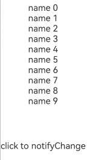

# LazyForEach

In scenarios with a large number of child components, using LazyForEach in combination with cached list items, dynamic preloading, and component reuse can further improve scrolling frame rates and reduce application memory consumption.

## Import Module

```cangjie
import kit.ArkUI.*
```

## interface IDataSource\<T>

```cangjie
public interface IDataSource<T> {
    func totalCount(): Int64
    func getData(Int64): T
    func registerDataChangeListener(DataChangeListener): Unit
    func unregisterDataChangeListener(DataChangeListener): Unit
}
```

**Description:** Data source for LazyForEach, requiring developers to implement related interfaces.

**System Capability:** SystemCapability.ArkUI.ArkUI.Full

**Since:** 22

### func getData(Int64)

```cangjie
func getData(index: Int64): T
```

**Description:** Retrieves the data corresponding to the specified index value.

**System Capability:** SystemCapability.ArkUI.ArkUI.Full

**Since:** 22

**Parameters:**

| Name | Type | Required | Default | Description |
|:---|:---|:---|:---|:---|
| index | Int64 | Yes | - | The index value corresponding to the data. |

**Return Value:**

| Type | Description |
|:----|:----|
| T | The data corresponding to the specified index value. |

### func registerDataChangeListener(DataChangeListener)

```cangjie
func registerDataChangeListener(listener: DataChangeListener): Unit
```

**Description:** Registers a listener for data changes.

**System Capability:** SystemCapability.ArkUI.ArkUI.Full

**Since:** 22

**Parameters:**

| Name | Type | Required | Default | Description |
|:---|:---|:---|:---|:---|
| listener | [DataChangeListener](#class-datachangelistener) | Yes | - | The listener for data changes. |

### func unregisterDataChangeListener(DataChangeListener)

```cangjie
func unregisterDataChangeListener(listener: DataChangeListener): Unit
```

**Description:** Unregisters a listener for data changes.

**System Capability:** SystemCapability.ArkUI.ArkUI.Full

**Since:** 22

**Parameters:**

| Name | Type | Required | Default | Description |
|:---|:---|:---|:---|:---|
| listener | [DataChangeListener](#class-datachangelistener) | Yes | - | The listener for data changes. |

### func totalCount()

```cangjie
func totalCount(): Int64
```

**Description:** Retrieves the total count of data items.

**System Capability:** SystemCapability.ArkUI.ArkUI.Full

**Since:** 22

**Return Value:**

| Type | Description |
|:----|:----|
| Int64 | The total count of data items. |

## class DataChangeListener

```cangjie
public class DataChangeListener {}
```

**Description:** Listener for data changes.

**System Capability:** SystemCapability.ArkUI.ArkUI.Full

**Since:** 22

### func onDataAdd(IntNative)

```cangjie
public func onDataAdd(index: IntNative): Unit
```

**Description:** Notifies the component that data has been added at the specified index. Called after data addition is completed.

**System Capability:** SystemCapability.ArkUI.ArkUI.Full

**Since:** 22

**Parameters:**

| Name | Type | Required | Default | Description |
|:---|:---|:---|:---|:---|
| index | IntNative | Yes | - | The index value where data was added. |

### func onDataChange(IntNative)

```cangjie
public func onDataChange(index: IntNative): Unit
```

**Description:** Notifies the component that data has changed at the specified index. Called after data modification is completed.

**System Capability:** SystemCapability.ArkUI.ArkUI.Full

**Since:** 22

**Parameters:**

| Name | Type | Required | Default | Description |
|:---|:---|:---|:---|:---|
| index | IntNative | Yes | - | The index value where data was modified. |

### func onDataDelete(IntNative)

```cangjie
public func onDataDelete(index: IntNative): Unit
```

**Description:** Notifies the component to delete data at the specified index and refresh the LazyForEach display. Called after data deletion is completed.

**System Capability:** SystemCapability.ArkUI.ArkUI.Full

**Since:** 22

**Parameters:**

| Name | Type | Required | Default | Description |
|:---|:---|:---|:---|:---|
| index | IntNative | Yes | - | The index value where data was deleted. |

### func onDataMove(IntNative, IntNative)

```cangjie
public func onDataMove(from: IntNative, to: IntNative): Unit
```

**Description:** Notifies the component that data has been moved. Swaps data between the `from` and `to` positions. Called after the swap is completed.

**System Capability:** SystemCapability.ArkUI.ArkUI.Full

**Since:** 22

**Parameters:**

| Name | Type | Required | Default | Description |
|:---|:---|:---|:---|:---|
| from | IntNative | Yes | - | The source position of the data move. |
| to | IntNative | Yes | - | The target position of the data move. |

### func onDataReloaded()

```cangjie
public func onDataReloaded(): Unit
```

**Description:** Notifies the component to reload all data. Items with unchanged key values will reuse existing child components, while items with changed key values will rebuild child components. Called after data reload is completed.

**System Capability:** SystemCapability.ArkUI.ArkUI.Full

**Since:** 22

## class LazyForEach\<T>

```cangjie
public class LazyForEach<T> {
    public init(dataSource: IDataSource<T>, itemGenerator!: ItemGeneratorFunc<T>,
        keyGenerator!: ?KeyGeneratorFunc<T> = None)
}
```

**Description:** Used to create a LazyForEach component.

**System Capability:** SystemCapability.ArkUI.ArkUI.Full

**Since:** 22

### init(IDataSource\<T>, ItemGeneratorFunc\<T>, ?KeyGeneratorFunc\<T>)

```cangjie
public init(dataSource: IDataSource<T>, itemGenerator!: ItemGeneratorFunc<T>, keyGenerator!: ?KeyGeneratorFunc<T> = None)
```

**Description:** Creates a LazyForEach component.

**System Capability:** SystemCapability.ArkUI.ArkUI.Full

**Since:** 22

**Parameters:**

| Name | Type | Required | Default | Description |
|:---|:---|:---|:---|:---|
| dataSource | [IDataSource](#interface-idatasourcet)\<T> | Yes | - | The data source for LazyForEach, requiring developers to implement related interfaces. |
| itemGenerator | [ItemGeneratorFunc\<T>](./cj-common-types.md#type-itemgeneratorfunct) | Yes | - |  **Named parameter.** The child component generator function, which creates a child component for each data item in the array. The first generic parameter of the lambda function is the data type, and the second parameter is the index of the current list item. |
| keyGenerator | ?[KeyGeneratorFunc\<T>](./cj-common-types.md#type-keygeneratorfunct) | No | None |  **Named parameter.** An anonymous function for key generation, which generates a unique and stable key for a given array item. |

## Example Code

<!-- run -->

```cangjie
package ohos_app_cangjie_entry
import kit.ArkUI.*
import ohos.arkui.state_macro_manage.*
import std.collection.*

public class Student {
    public Student(
        let name: String,
        let id: Int64
    ) {}
}

class StudentDataSource <: IDataSource<Student> {
    public StudentDataSource(let data_: ArrayList<Student>) {}
    public var listenerOp: Option<DataChangeListener> = None
    public func totalCount(): Int64 {
        return data_.size
    }
    public func getData(index: Int64): Student {
        return data_[index]
    }

    public func registerDataChangeListener(listener: DataChangeListener): Unit {
        listenerOp = listener
    }

    public func unregisterDataChangeListener(listener: DataChangeListener): Unit {
        listenerOp = None
    }

    public func notifyChange(): Unit {
        let listener: DataChangeListener = listenerOp.getOrThrow()
        listener.onDataReloaded()
    }
}

func getDS(): StudentDataSource
{
    let data: ArrayList<Student> = ArrayList<Student>()
    for (i in 0..10) {
        data.add(Student("name ${i}", i * i))
    }
    let dataSourceStu: StudentDataSource = StudentDataSource(data)
    return dataSourceStu
}

let dataSourceStu: StudentDataSource = getDS()
var changeID: Int64 = 0

@Entry
@Component
public class EntryView {

    public func build(): Unit {
        Column(space: 30) {
            Column {
                LazyForEach(dataSourceStu, itemGeneratorFunc: {stu: Student, idx: Int64 =>
                    Column {
                        Text(stu.name)
                    }
                })
            }
            .height(220.0)

            Text("click to notifyChange").onClick({ evt =>
                if (changeID < dataSourceStu.data_.size) {
                    dataSourceStu.data_.remove(at: changeID)
                    dataSourceStu.data_.add(Student("xiaoming", 10086), at: changeID)
                    dataSourceStu.notifyChange()
                    changeID += 1
                }
            })
        }
    }
}
```

