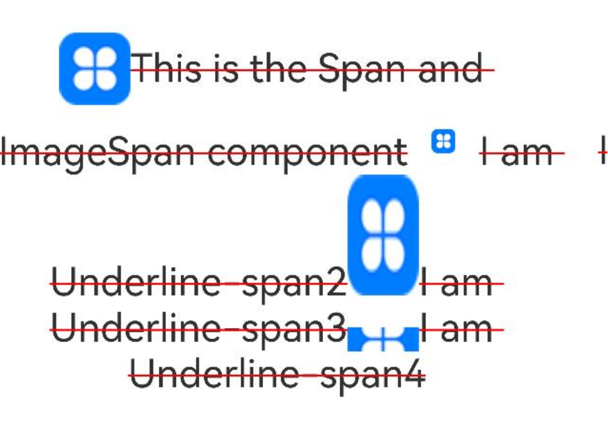
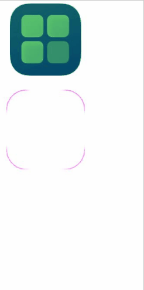

# ImageSpan

A child component of the [Text](./cj-text-input-text.md#text) component, used to display inline images.

## Import Module

```cangjie
import kit.ArkUI.*
```

## Child Components

None

## Creating the Component

### init(?ResourceStr)

```cangjie
public init(value: ?ResourceStr)
```

**Function:** Creates an ImageSpan component.

**System Capability:** SystemCapability.ArkUI.ArkUI.Full

**Since Version:** 22

**Parameters:**

| Parameter | Type | Required | Default Value | Description |
|:---|:---|:---|:---|:---|
| value | ?[ResourceStr](./cj-common-types.md#interface-resourcestr) | Yes | - | The image data source, supporting both local and network images. |

### init(?PixelMap)

```cangjie
public init(value: ?PixelMap)
```

**Function:** Creates an ImageSpan component.

**System Capability:** SystemCapability.ArkUI.ArkUI.Full

**Since Version:** 22

**Parameters:**

| Parameter | Type | Required | Default Value | Description |
|:---|:---|:---|:---|:---|
| value | ?[PixelMap](../ImageKit/cj-apis-image.md#class-pixelmap) | Yes | - | The image data source, supporting both local and network images. |

## Universal Attributes/Events

Universal Attributes: Supports [Size Settings](./cj-universal-attribute-size.md), [Background Settings](./cj-universal-attribute-background.md), [Border Settings](./cj-universal-attribute-border.md).

Universal Events: Only supports [Click Event](./cj-universal-event-click.md#func-onclick).

## Component Attributes

### func colorFilter(?ColorFilter)

```cangjie
public func colorFilter(filter: ?ColorFilter): This
```

**Function:** Sets the color filter effect for the image.

**System Capability:** SystemCapability.ArkUI.ArkUI.Full

**Since Version:** 22

**Parameters:**

| Parameter | Type | Required | Default Value | Description |
|:---|:---|:---|:---|:---|
| filter | ?[ColorFilter](./cj-image-video-image.md#class-colorfilter) | Yes | - | The color filter effect.<br>Initial value: ColorFilter([]). |

### func objectFit(?ImageFit)

```cangjie
public func objectFit(value: ?ImageFit): This
```

**Function:** Sets the scaling type for the image.

**System Capability:** SystemCapability.ArkUI.ArkUI.Full

**Since Version:** 22

**Parameters:**

| Parameter | Type | Required | Default Value | Description |
|:---|:---|:---|:---|:---|
| value | ?[ImageFit](./cj-common-types.md#enum-imagefit) | Yes | - | The scaling type for the image.<br>Initial value: ImageFit.Cover. |

### func verticalAlign(?ImageSpanAlignment)

```cangjie
public func verticalAlign(value: ?ImageSpanAlignment): This
```

**Function:** Sets the alignment of the image relative to the line height.

**System Capability:** SystemCapability.ArkUI.ArkUI.Full

**Since Version:** 22

**Parameters:**

| Parameter | Type | Required | Default Value | Description |
|:---|:---|:---|:---|:---|
| value | ?[ImageSpanAlignment](./cj-common-types.md#enum-imagespanalignment) | Yes | - | The alignment of the image relative to the text.<br>Initial value: ImageSpanAlignment.Bottom. |

## Component Events

### func onComplete(?ImageCompleteCallback)

```cangjie
public func onComplete(callback: ?ImageCompleteCallback): This
```

**Function:** Triggered when the image data is successfully loaded and decoded.

**System Capability:** SystemCapability.ArkUI.ArkUI.Full

**Since Version:** 22

**Parameters:**

| Parameter | Type | Required | Default Value | Description |
|:---|:---|:---|:---|:---|
| callback | ?[ImageCompleteCallback](./cj-image-video-image.md#type-imagecompletecallback) | Yes | - | The callback function, triggered when the image data is successfully loaded and decoded. Parameter: The size of the successfully loaded image.<br>Initial value: { _ => }. |

### func onError(?ImageErrorCallback)

```cangjie
public func onError(callback: ?ImageErrorCallback): This
```

**Function:** Triggered when an error occurs during image loading.

**System Capability:** SystemCapability.ArkUI.ArkUI.Full

**Since Version:** 22

**Parameters:**

| Parameter | Type | Required | Default Value | Description |
|:---|:---|:---|:---|:---|
| callback | ?[ImageErrorCallback](./cj-image-video-image.md#type-imageerrorcallback) | Yes | - | The callback function, triggered when an error occurs during image loading. Parameter: The error information during image loading.<br>Initial value: { _ => }. |

## Example Code

### Example 1

This example demonstrates the alignment and scaling effects of ImageSpan using the `verticalAlign` and `objectFit` attributes.

<!-- run -->

```cangjie
package ohos_app_cangjie_entry

import kit.ArkUI.*
import ohos.arkui.state_macro_manage.*
import ohos.i18n.*
import ohos.resource_manager.*
import ohos.resource.__GenerateResource__

@Entry
@Component
class EntryView {
    func build() {
        Column {
            Flex(direction: FlexDirection.Column, alignItems: ItemAlign.Center, justifyContent: FlexAlign.Center) {
                Text() {
                    // Load image resource with specified size and layout
                    ImageSpan(@r(app.media.startIcon))
                        .width(150.px)
                        .height(250.px)
                        .objectFit(ImageFit.Contain)
                        .verticalAlign(ImageSpanAlignment.Center)
                    // Apply text decoration to the image
                    Span("This is the Span and ImageSpan component")
                        .decoration(decorationType: TextDecorationType.LineThrough, color: Color.Red).fontSize(25)
                    ImageSpan(@r(app.media.startIcon))
                       .width(150.px)
                       .height(50.px)
                        .objectFit(ImageFit.Contain)
                       .verticalAlign(ImageSpanAlignment.Top)
                    Span("I am Underline-span2")
                        .decoration(decorationType: TextDecorationType.LineThrough, color: Color.Red).fontSize(25)
                    ImageSpan(@r(app.media.startIcon))
                        .width(150.px)
                        .height(250.px)
                        .objectFit(ImageFit.Fill)
                        .verticalAlign(ImageSpanAlignment.Baseline)
                    Span("I am Underline-span3")
                        .decoration(decorationType: TextDecorationType.LineThrough, color: Color.Red).fontSize(25)
                    ImageSpan(@r(app.media.startIcon))
                        .width(150.px)
                        .height(50.px)
                        .objectFit(ImageFit.Auto)
                        .verticalAlign(ImageSpanAlignment.Bottom)
                    Span("I am Underline-span4")
                        .decoration(decorationType: TextDecorationType.LineThrough, color: Color.Red).fontSize(25)
                }.textAlign(TextAlign.Center)
            }
        }
        .height(720)
        .width(360)
        .padding(left:0, right: 0, top: 0)
    }
}
```



### Example 2 (Setting Color Filter Effect for Images)

This example demonstrates setting a color filter effect for images using `colorFilter`.

<!-- run -->

```cangjie
package ohos_app_cangjie_entry
import kit.ArkUI.*
import ohos.arkui.state_macro_manage.*
import ohos.i18n.*
import ohos.resource_manager.*
import ohos.resource.__GenerateResource__

@Entry
@Component
class EntryView {
    let blueColor = ColorFilter([0.38, 0.0, 0.0, 0.0, 0.0,
                                0.0, 0.81, 0.0, 0.0, 0.0,
                                0.0, 0.0, 0.43, 0.0, 0.0,
                                0.0, 0.0, 0.0, 1.0, 0.0])
    let colorFilter = ColorFilter([1.0, 0.0, 1.0, 0.0, 1.0,
                                   0.0, 0.0, 0.0, 1.0, 0.0,
                                   1.0, 0.0, 1.0, 0.0, 0.0,
                                   0.0, 1.0, 0.0, 1.0, 0.0])

    @State var DrawingColorFilterFirst: ColorFilter = blueColor
    @State var DrawingColorFilterSecond: ColorFilter = colorFilter

    func build() {
        Column(space: 5){
            Text {
                ImageSpan(@r(app.media.startIcon))
                .width(100)
                .height(100)
                .colorFilter(this.DrawingColorFilterFirst)
                .onClick({
                        evt =>
                        this.DrawingColorFilterFirst = colorFilter
                })
            }
            Text {
                ImageSpan(@r(app.media.startIcon))
                .width(110)
                .height(110)
                .margin(15)
                .colorFilter(this.DrawingColorFilterSecond)
                .onClick({
                        evt =>
                        this.DrawingColorFilterSecond = blueColor
                })
            }
        }
    }
}
```

