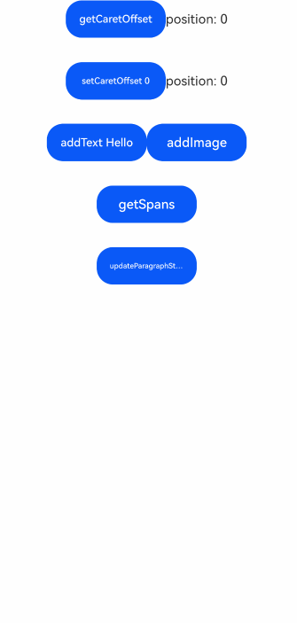

# RichEditor

A component that supports mixed text and image layout with interactive text editing capabilities.

## Import Module

```cangjie
import kit.ArkUI.*
```

## Child Components

None

## Creating the Component

### init(?RichEditorController)

```cangjie
public init(controller: ?RichEditorController)
```

**Function:** Creates a RichEditor component.

**System Capability:** SystemCapability.ArkUI.ArkUI.Full

**Since:** 22

**Parameters:**

| Parameter | Type | Required | Default | Description |
|:---|:---|:---|:---|:---|
| controller | ?[RichEditorController](#class-richeditorcontroller) | Yes | - | Rich text controller. |

## Common Attributes/Common Events

Common Attributes: All supported.

> **Note:**
>
> - The `align` attribute only supports top, middle, and bottom alignment.
> - The `borderImage` attribute is not supported.

Common Events: All supported.

## Component Attributes

### func bindSelectionMenu(?RichEditorSpanType, ?CustomBuilder, ?ResponseType, ?SelectionMenuOptions)

```cangjie
public func bindSelectionMenu(
    spanType!: ?RichEditorSpanType = None,
    content!: ?CustomBuilder,
    responseType!: ?ResponseType = None,
    options!: ?SelectionMenuOptions
): This
```

**Function:** Sets a custom selection menu.

> **Note:**
>
> When the custom menu is too long, it is recommended to nest a [Scroll](cj-scroll-swipe-scroll.md) component internally to avoid keyboard occlusion.

**System Capability:** SystemCapability.ArkUI.ArkUI.Full

**Since:** 22

**Parameters:**

| Parameter | Type | Required | Default | Description |
|:---|:---|:---|:---|:---|
| spanType | ?[RichEditorSpanType](./cj-common-types.md#enum-richeditorspantype) | No | None | **Named parameter.** Specifies the type of selection menu.<br>Initial value: RichEditorSpanType.Text. |
| content | ?[CustomBuilder](./cj-common-types.md#type-custombuilder) | Yes | - | **Named parameter.** Specifies the content of the selection menu. Use with [@Builder](../../arkui-cj/paradigm/cj-macro-builder.md) and bind method.<br>Initial value: { => }. |
| responseType | ?[ResponseType](./cj-common-types.md#enum-responsetype) | No | None | **Named parameter.** Specifies the response type of the selection menu.<br>Initial value: ResponseType.LongPress. |
| options | ?[SelectionMenuOptions](#class-selectionmenuoptions) | Yes | - | **Named parameter.** Specifies the options for the selection menu.<br>Initial value: SelectionMenuOptions(). |

### func copyOptions(?CopyOptions)

```cangjie
public func copyOptions(value: ?CopyOptions): This
```

**Function:** Enables copy-paste capability for text content.

> **Note:**
>
> - When `copyOptions` is not set to `CopyOptions.None`, a text selection dialog will pop up when long-pressing the component content. If a custom selection menu is defined via `bindSelectionMenu`, the custom menu will appear instead.
> - Setting `copyOptions` to `CopyOptions.None` disables copy and cut functionality.

**System Capability:** SystemCapability.ArkUI.ArkUI.Full

**Since:** 22

**Parameters:**

| Parameter | Type | Required | Default | Description |
|:---|:---|:---|:---|:---|
| value | ?[CopyOptions](./cj-common-types.md#enum-copyoptions) | Yes | - | Copy-paste capability. Initial value: CopyOptions.LocalDevice. |

### func customKeyboard(?CustomBuilder)

```cangjie
public func customKeyboard(value!: ?CustomBuilder): This
```

**Function:** Defines a custom keyboard.

> **Note:**
>
> - When a custom keyboard is set, the system input method will not open upon activating the input field; instead, the specified custom component will load.
> - The height of the custom keyboard can be set via the `height` attribute of the root node of the custom component. Width cannot be set and uses the system default.
> - The custom keyboard overlays the original interface and does not compress or push up the application's original interface.
> - The custom keyboard cannot gain focus but will intercept gesture events.
> - By default, the custom keyboard closes when the input field loses focus.
> - If the device supports camera input, setting a custom keyboard will disable camera input for that field.

**System Capability:** SystemCapability.ArkUI.ArkUI.Full

**Since:** 22

**Parameters:**

| Parameter | Type | Required | Default | Description |
|:---|:---|:---|:---|:---|
| value | ?[CustomBuilder](./cj-common-types.md#type-custombuilder) | Yes | - | **Named parameter.** Custom keyboard for the rich text editor. Use with [@Builder](../../arkui-cj/paradigm/cj-macro-builder.md) and bind method.<br>Initial value: { => }. |

## Component Events

### func onReady(?VoidCallback)

```cangjie
public func onReady(callback: ?VoidCallback): This
```

**Function:** Triggered when the rich text component initialization is complete.

**System Capability:** SystemCapability.ArkUI.ArkUI.Full

**Since:** 22

**Parameters:**

| Parameter | Type | Required | Default | Description |
|:---|:---|:---|:---|:---|
| callback | ?[VoidCallback](./cj-common-types.md#type-voidcallback) | Yes | - | Callback function triggered after rich text component initialization.<br>Initial value: { => }. |

### func aboutToImeInput(?Callback\<RichEditorInsertValue, Bool>)

```cangjie
public func aboutToImeInput(callback: ?Callback<RichEditorInsertValue, Bool>): This
```

**Function:** Triggered before input method content is entered.

**System Capability:** SystemCapability.ArkUI.ArkUI.Full

**Since:** 22

**Parameters:**

| Parameter | Type | Required | Default | Description |
|:---|:---|:---|:---|:---|
| callback | ?[Callback](./cj-common-types.md#type-callbackt-v)\<[RichEditorInsertValue](#class-richeditorinsertvalue), Bool> | Yes | - | Callback function triggered before input method content is entered. `RichEditorInsertValue`: Information about the content to be entered. `true`: The component performs the add operation. `false`: The component does not perform the add operation.<br>Initial value: { _ => false }. |

### func onImeInputComplete(?Callback\<RichEditorTextSpanResult, Unit>)

```cangjie
public func onImeInputComplete(callback: ?Callback<RichEditorTextSpanResult, Unit>): This
```

**Function:** Triggered after input method input is completed.

**System Capability:** SystemCapability.ArkUI.ArkUI.Full

**Since:** 22

**Parameters:**

| Parameter | Type | Required | Default | Description |
|:---|:---|:---|:---|:---|
| callback | ?[Callback](./cj-common-types.md#type-callbackt-v)\<[RichEditorTextSpanResult](#class-richeditortextspanresult), Unit> | Yes | - | Callback function triggered after input method input is completed. `RichEditorTextSpanResult`: Text span information after input method input.<br>Initial value: { _ => false }. |

### func onDeleteComplete(?VoidCallback)

```cangjie
public func onDeleteComplete(callback: ?VoidCallback): This
```

**Function:** Triggered after input method deletion is completed.

**System Capability:** SystemCapability.ArkUI.ArkUI.Full

**Since:** 22

**Parameters:**

| Parameter | Type | Required | Default | Description |
|:---|:---|:---|:---|:---|
| callback | ?[VoidCallback](./cj-common-types.md#type-voidcallback) | Yes | - | Callback function triggered when input method deletion is completed.<br>Initial value: { => }. |

### func aboutToDelete(?Callback\<RichEditorDeleteValue, Bool>)

```cangjie
public func aboutToDelete(callback: ?Callback<RichEditorDeleteValue, Bool>): This
```

**Function:** Triggered before input method content is deleted.

**System Capability:** SystemCapability.ArkUI.ArkUI.Full

**Since:** 22

**Parameters:**

| Parameter | Type | Required | Default | Description |
|:---|:---|:---|:---|:---|
| callback | ?[Callback](./cj-common-types.md#type-callbackt-v)\<[RichEditorDeleteValue](#class-richeditordeletevalue), Bool> | Yes | - | Callback function triggered before input method content is deleted. `RichEditorDeleteValue`: Text span information of the content to be deleted. `true`: The component performs the delete operation. `false`: The component does not perform the delete operation.<br>Initial value: { _ => false }. |

### func onSelect(?Callback\<RichEditorSelection, Unit>)

```cangjie
public func onSelect(callback: ?Callback<RichEditorSelection, Unit>): This
```

**Function:** Triggered when content is selected via left mouse button double-click (triggered again upon release) or via long-press gesture (triggered again upon release).

**System Capability:** SystemCapability.ArkUI.ArkUI.Full

**Since:** 22

**Parameters:**

| Parameter | Type | Required | Default | Description |
|:---|:---|:---|:---|:---|
| callback | ?[Callback](./cj-common-types.md#type-callbackt-v)\<[RichEditorSelection](#class-richeditorselection), Unit> | Yes | - | `RichEditorSelection`: Information of all selected spans.<br>Initial value: { _ => }. |

### func onPaste(?PasteEventCallback)

```cangjie
public func onPaste(callback: ?PasteEventCallback): This
```

**Function:** Triggered before paste operation is completed.

> **Note:**
>
> Developers can override the default system behavior to implement custom text/image pasting via this method.

**System Capability:** SystemCapability.ArkUI.ArkUI.Full

**Since:** 22

**Parameters:**

| Parameter | Type | Required | Default | Description |
|:---|:---|:---|:---|:---|
| callback | ?[PasteEventCallback](#type-pasteeventcallback) | Yes | - | Callback function triggered before paste operation is completed. `PasteEvent`: Defines user paste events.<br>Initial value: { _ => }. |

### func onDidChange(?OnDidChangeCallback)

```cangjie
public func onDidChange(callback: ?OnDidChangeCallback): This
```

**Function:** Triggered after the component performs add/delete operations. Not triggered if no actual text changes occur.

**System Capability:** SystemCapability.ArkUI.ArkUI.Full

**Since:** 22

**Parameters:**

| Parameter | Type | Required | Default | Description |
|:---|:---|:---|:---|:---|
| callback | ?[OnDidChangeCallback](#type-ondidchangecallback) | Yes | - | Callback function triggered after add/delete operations. Not triggered if no actual text changes occur. Parameters: Content range before and after changes.<br>Initial value: { rangeBefore: TextRange, rangeAfter: TextRange => }. |

## Basic Type Definitions

### interface RichEditorSpanResult

```cangjie
public interface RichEditorSpanResult {}
```

**Function:** Defines RichEditor span result.

**System Capability:** SystemCapability.ArkUI.ArkUI.Full

**Since:** 22

### class RichEditorSpanPosition

```cangjie
public class RichEditorSpanPosition {
    public var spanIndex: ?Int32
    public var spanRange: ?(Int32, Int32)
    public init(
        spanIndex: ?Int32,
        spanRange: ?(Int32, Int32)
    )
}
```

**Function:** Defines span position.

**System Capability:** SystemCapability.ArkUI.ArkUI.Full

**Since:** 22

#### var spanIndex

```cangjie
public var spanIndex: ?Int32
```

**Function:** Defines the index of the span.

**Type:** ?Int32

**Read/Write:** Read-Write

**System Capability:** SystemCapability.ArkUI.ArkUI.Full

**Since:** 22

#### var spanRange

```cangjie
public var spanRange: ?(Int32, Int32)
```

**Function:** The range of the span.

**Type:** ?(Int32, Int32)

**Read/Write:** Read-Write

**System Capability:** SystemCapability.ArkUI.ArkUI.Full

**Since:** 22

#### init(?Int32, ?(Int32, Int32))

```cangjie
public init(
    spanIndex: ?Int32,
    spanRange: ?(Int32, Int32)
)
```

**Function:** RichEditorSpanPosition constructor.

**System Capability:** SystemCapability.ArkUI.ArkUI.Full

**Since:** 22

**Parameters:**

| Parameter | Type | Required | Default | Description |
|:---|:---|:---|:---|:---|
| spanIndex | ?Int32 | Yes | - | Span index. Initial value: 0. |
| spanRange | ?(Int32, Int32) | Yes | - | Span range. Initial value: (0, 0). |

### class RichEditorTextStyleResult

```cangjie
public class RichEditorTextStyleResult {
    public var fontColor: String
    public var fontSize: Float64
    public var fontStyle: FontStyle
    public var fontWeight: Int32
    public var fontFamily: String
    public var decoration: DecorationStyleResult
    public init(
        fontColor: String,
        fontSize: Float64,
        fontStyle: FontStyle,
        fontWeight: Int32,
        fontFamily: String,
        decoration: DecorationStyleResult
    )
}
```

**Function:** Defines text style result.

**System Capability:** SystemCapability.ArkUI.ArkUI.Full

**Since:** 22

#### var fontColor

```cangjie
public var fontColor: String
```

**Function:** Font color.

**Type:** String

**Read/Write:** Read-Write

**System Capability:** SystemCapability.ArkUI.ArkUI.Full

**Since:** 22

#### var fontSize

```cangjie
public var fontSize: Float64
```

**Function:** Font size.

**Type:** Float64

**Read/Write:** Read-Write

**System Capability:** SystemCapability.ArkUI.ArkUI.Full

**Since:** 22

#### var fontStyle

```cangjie
public var fontStyle: FontStyle
```

**Function:** Font style.

**Type:** [FontStyle](./cj-common-types.md#enum-fontstyle)

**Read/Write:** Read-Write

**System Capability:** SystemCapability.ArkUI.ArkUI.Full

**Since:** 22

#### var fontWeight

```cangjie
public var fontWeight: Int32
```

**Function:** Font weight.

**Type:** Int32

**Read/Write:** Read-Write

**System Capability:** SystemCapability.ArkUI.ArkUI.Full

**Since:** 22

#### var fontFamily

```cangjie
public var fontFamily: String
```

**Function:** Font family.

**Type:** String

**Read/Write:** Read-Write

**System Capability:** SystemCapability.ArkUI.ArkUI.Full

**Since:** 22

#### var decoration

```cangjie
public var decoration: DecorationStyleResult
```

**Function:** Font decoration.

**Type:** [DecorationStyleResult](#class-decorationstyleresult)

**Read/Write:** Read-Write

**System Capability:** SystemCapability.ArkUI.ArkUI.Full

**Since:** 22

#### init(String, Float64, FontStyle, Int32, String, DecorationStyleResult)

```cangjie
public init(
    fontColor: String,
    fontSize: Float64,
    fontStyle: FontStyle,
    fontWeight: Int32,
    fontFamily: String,
    decoration: DecorationStyleResult
)
```

**Function:** RichEditorTextStyleResult constructor.

**System Capability:** SystemCapability.ArkUI.ArkUI.Full

**Since:** 22

**Parameters:**

| Parameter | Type | Required | Default | Description |
|:---|:---|:---|:---|:---|
| fontColor | String | Yes | - | Font color. |
| fontSize | Float64 | Yes | - | Font size. |
| fontStyle | [FontStyle](./cj-common-types.md#enum-fontstyle) | Yes | - | Font style. |
| fontWeight | Int32 | Yes | - | Font weight. |
| fontFamily | String | Yes | - | Font family. |
| decoration | [DecorationStyleResult](#class-decorationstyleresult) | Yes | - | Font decoration. |### class RichEditorImageSpanStyleResult

```cangjie
public class RichEditorImageSpanStyleResult {
    public var size: ?(Float64, Float64)
    public var verticalAlign: ?ImageSpanAlignment
    public var objectFit: ?ImageFit
}
```

**Function:** Defines the style result for span images.

**System Capability:** SystemCapability.ArkUI.ArkUI.Full

**Since:** 22

#### var size

```cangjie
public var size: ?(Float64, Float64)
```

**Function:** Image dimensions.

**Type:** ?(Float64, Float64)

**Read-Write Access:** Readable and Writable

**System Capability:** SystemCapability.ArkUI.ArkUI.Full

**Since:** 22

#### var verticalAlign

```cangjie
public var verticalAlign: ?ImageSpanAlignment
```

**Function:** Vertical alignment of the image.

**Type:** ?[ImageSpanAlignment](./cj-common-types.md#enum-imagespanalignment)

**Read-Write Access:** Readable and Writable

**System Capability:** SystemCapability.ArkUI.ArkUI.Full

**Since:** 22

#### var objectFit

```cangjie
public var objectFit: ?ImageFit
```

**Function:** Image fitting method.

**Type:** ?[ImageFit](./cj-common-types.md#enum-imagefit)

**Read-Write Access:** Readable and Writable

**System Capability:** SystemCapability.ArkUI.ArkUI.Full

**Since:** 22

### class RichEditorTextSpanResult

```cangjie
public class RichEditorTextSpanResult <: RichEditorSpanResult {
    public var spanPosition: RichEditorSpanPosition
    public var value: String
    public var textStyle: RichEditorTextStyleResult
    public var offsetInSpan: (Int32, Int32)
    public init(
        spanPosition: RichEditorSpanPosition,
        value: String,
        textStyle: RichEditorTextStyleResult,
        offsetInSpan: (Int32, Int32)
    )
}
```

**Function:** Defines the result for text spans.

**System Capability:** SystemCapability.ArkUI.ArkUI.Full

**Since:** 22

**Parent Type:**

- [RichEditorSpanResult](#interface-richeditorspanresult)

#### var spanPosition

```cangjie
public var spanPosition: RichEditorSpanPosition
```

**Function:** Position of the text span.

**Type:** [RichEditorSpanPosition](#class-richeditorspanposition)

**Read-Write Access:** Readable and Writable

**System Capability:** SystemCapability.ArkUI.ArkUI.Full

**Since:** 22

#### var value

```cangjie
public var value: String
```

**Function:** Content of the text span.

**Type:** String

**Read-Write Access:** Readable and Writable

**System Capability:** SystemCapability.ArkUI.ArkUI.Full

**Since:** 22

#### var textStyle

```cangjie
public var textStyle: RichEditorTextStyleResult
```

**Function:** Text style.

**Type:** [RichEditorTextStyleResult](#class-richeditortextstyleresult)

**Read-Write Access:** Readable and Writable

**System Capability:** SystemCapability.ArkUI.ArkUI.Full

**Since:** 22

#### var offsetInSpan

```cangjie
public var offsetInSpan: (Int32, Int32)
```

**Function:** Offset within the span.

**Type:** (Int32, Int32)

**Read-Write Access:** Readable and Writable

**System Capability:** SystemCapability.ArkUI.ArkUI.Full

**Since:** 22

#### init(RichEditorSpanPosition, String, RichEditorTextStyleResult, (Int32, Int32))

```cangjie
public init(
    spanPosition: RichEditorSpanPosition,
    value: String,
    textStyle: RichEditorTextStyleResult,
    offsetInSpan: (Int32, Int32)
)
```

**Function:** Constructor for RichEditorTextSpanResult.

**System Capability:** SystemCapability.ArkUI.ArkUI.Full

**Since:** 22

**Parameters:**

| Parameter Name | Type | Required | Default Value | Description |
|:---|:---|:---|:---|:---|
| spanPosition | [RichEditorSpanPosition](#class-richeditorspanposition) | Yes | - | Position of the text span. |
| value | String | Yes | - | Content of the text span. |
| textStyle | [RichEditorTextStyleResult](#class-richeditortextstyleresult) | Yes | - | Text style. |
| offsetInSpan | (Int32, Int32) | Yes | - | Offset within the span. |

### class RichEditorImageSpanResult

```cangjie
public class RichEditorImageSpanResult <: RichEditorSpanResult {
    public var spanPosition: ?RichEditorSpanPosition
    public var valuePixelMap: Option<PixelMap>
    public var valueResourceStr: ?String
    public var imageStyle: ?RichEditorImageSpanStyleResult
    public var offsetInSpan: ?(Int32, Int32)
    public init(
        spanPosition!: ?RichEditorSpanPosition = Option.None,
        valuePixelMap!: Option<PixelMap> = Option.None,
        valueResourceStr!: ?String = None,
        imageStyle!: ?RichEditorImageSpanStyleResult = None,
        offsetInSpan!: ?(Int32, Int32) = None
    )
}
```

**Function:** Defines image spans.

**System Capability:** SystemCapability.ArkUI.ArkUI.Full

**Since:** 22

**Parent Type:**

- [RichEditorSpanResult](#interface-richeditorspanresult)

#### var spanPosition

```cangjie
public var spanPosition: ?RichEditorSpanPosition
```

**Function:** Position of the image span.

**Type:** ?[RichEditorSpanPosition](#class-richeditorspanposition)

**Read-Write Access:** Readable and Writable

**System Capability:** SystemCapability.ArkUI.ArkUI.Full

**Since:** 22

#### var valuePixelMap

```cangjie
public var valuePixelMap: Option<PixelMap>
```

**Function:** Pixel map of the image span.

**Type:** Option\<[PixelMap](../ImageKit/cj-apis-image.md#class-pixelmap)>

**Read-Write Access:** Readable and Writable

**System Capability:** SystemCapability.ArkUI.ArkUI.Full

**Since:** 22

#### var valueResourceStr

```cangjie
public var valueResourceStr: ?String
```

**Function:** Resource string of the image span.

**Type:** ?String

**Read-Write Access:** Readable and Writable

**System Capability:** SystemCapability.ArkUI.ArkUI.Full

**Since:** 22

#### var imageStyle

```cangjie
public var imageStyle: ?RichEditorImageSpanStyleResult
```

**Function:** Image attributes.

**Type:** ?[RichEditorImageSpanStyleResult](#class-richeditorimagespanstyleresult)

**Read-Write Access:** Readable and Writable

**System Capability:** SystemCapability.ArkUI.ArkUI.Full

**Since:** 22

#### var offsetInSpan

```cangjie
public var offsetInSpan: ?(Int32, Int32)
```

**Function:** Offset within the span.

**Type:** ?(Int32, Int32)

**Read-Write Access:** Readable and Writable

**System Capability:** SystemCapability.ArkUI.ArkUI.Full

**Since:** 22

#### init(?RichEditorSpanPosition, Option\<PixelMap>, ?String, ?RichEditorImageSpanStyleResult, ?(Int32, Int32))

```cangjie
public init(
    spanPosition!: ?RichEditorSpanPosition = Option.None,
    valuePixelMap!: Option<PixelMap> = Option.None,
    valueResourceStr!: ?String = None,
    imageStyle!: ?RichEditorImageSpanStyleResult = None,
    offsetInSpan!: ?(Int32, Int32) = None
)
```

**Function:** Constructor for RichEditorImageSpanResult.

**System Capability:** SystemCapability.ArkUI.ArkUI.Full

**Since:** 22

**Parameters:**

| Parameter Name | Type | Required | Default Value | Description |
|:---|:---|:---|:---|:---|
| spanPosition | ?[RichEditorSpanPosition](#class-richeditorspanposition) | No | Option.None | **Named parameter.** Position of the image span. Initial value: RichEditorSpanPosition(0, (0, 0)). |
| valuePixelMap | Option\<[PixelMap](../ImageKit/cj-apis-image.md#class-pixelmap)> | No | Option.None | **Named parameter.** Pixel map of the image span. |
| valueResourceStr | ?String | No | None | **Named parameter.** Resource string of the image span. Initial value: "". |
| imageStyle | ?[RichEditorImageSpanStyleResult](#class-richeditorimagespanstyleresult) | No | None | **Named parameter.** Image attributes. Initial value: RichEditorImageSpanStyleResult(). |
| offsetInSpan | ?(Int32, Int32) | No | None | **Named parameter.** Offset within the span. Initial value: (0, 0). |

### class RichEditorSelection

```cangjie
public class RichEditorSelection {
    public var selection: ?(Int32, Int32)
    public var spans: ?ArrayList<RichEditorSpanResult>
    public init(selection: ?(Int32, Int32), spans: ?ArrayList<RichEditorSpanResult>)
}
```

**Function:** Selected content information.

**System Capability:** SystemCapability.ArkUI.ArkUI.Full

**Since:** 22

#### var selection

```cangjie
public var selection: ?(Int32, Int32)
```

**Function:** Selected Range.

**Type:** ?(Int32, Int32)

**Read-Write Access:** Readable and Writable

**System Capability:** SystemCapability.ArkUI.ArkUI.Full

**Since:** 22

#### var spans

```cangjie
public var spans: ?ArrayList<RichEditorSpanResult>
```

**Function:** Selected text content.

**Type:** ?ArrayList\<[RichEditorSpanResult](#interface-richeditorspanresult)>

**Read-Write Access:** Readable and Writable

**System Capability:** SystemCapability.ArkUI.ArkUI.Full

**Since:** 22

#### init(?(Int32, Int32), ?ArrayList\<RichEditorSpanResult>)

```cangjie
public init(selection: ?(Int32, Int32), spans: ?ArrayList<RichEditorSpanResult>)
```

**Function:** Constructor for RichEditorSelection.

**System Capability:** SystemCapability.ArkUI.ArkUI.Full

**Since:** 22

**Parameters:**

| Parameter Name | Type | Required | Default Value | Description |
|:---|:---|:---|:---|:---|
| selection | ?(Int32, Int32) | Yes | - | Position information. Initial value: (0, 0). |
| spans | ?ArrayList\<[RichEditorSpanResult](#interface-richeditorspanresult)> | Yes | - | Selected text content. Initial value: ArrayList\<RichEditorSpanResult>(). |### class RichEditorDeleteValue

```cangjie
public class RichEditorDeleteValue {
    public var offset: Int32
    public var direction: RichEditorDeleteDirection
    public var length: Int32
    public var richEditorDeleteSpans: ArrayList<RichEditorSpanResult>
    public init(
        offset: Int32,
        direction: RichEditorDeleteDirection,
        length: Int32,
        richEditorDeleteSpans: ArrayList<RichEditorSpanResult>
    )
}
```

**Function:** Provides an interface for deleting values from text.

**System Capability:** SystemCapability.ArkUI.ArkUI.Full

**Since:** 22

#### var offset

```cangjie
public var offset: Int32
```

**Function:** The offset for deletion.

**Type:** Int32

**Read-Write Access:** Readable and Writable

**System Capability:** SystemCapability.ArkUI.ArkUI.Full

**Since:** 22

#### var direction

```cangjie
public var direction: RichEditorDeleteDirection
```

**Function:** The direction of deletion.

**Type:** [RichEditorDeleteDirection](./cj-common-types.md#enum-richeditordeletedirection)

**Read-Write Access:** Readable and Writable

**System Capability:** SystemCapability.ArkUI.ArkUI.Full

**Since:** 22

#### var length

```cangjie
public var length: Int32
```

**Function:** The length of text to be deleted.

**Type:** Int32

**Read-Write Access:** Readable and Writable

**System Capability:** SystemCapability.ArkUI.ArkUI.Full

**Since:** 22

#### var richEditorDeleteSpans

```cangjie
public var richEditorDeleteSpans: ArrayList<RichEditorSpanResult>
```

**Function:** The span objects to be deleted.

**Type:** ArrayList\<[RichEditorSpanResult](#interface-richeditorspanresult)>

**Read-Write Access:** Readable and Writable

**System Capability:** SystemCapability.ArkUI.ArkUI.Full

**Since:** 22

#### init(Int32, RichEditorDeleteDirection, Int32, ArrayList\<RichEditorSpanResult>)

```cangjie
public init(
    offset: Int32,
    direction: RichEditorDeleteDirection,
    length: Int32,
    richEditorDeleteSpans: ArrayList<RichEditorSpanResult>
)
```

**Function:** Constructor for RichEditorDeleteValue.

**System Capability:** SystemCapability.ArkUI.ArkUI.Full

**Since:** 22

**Parameters:**

| Parameter Name | Type | Required | Default Value | Description |
|:---|:---|:---|:---|:---|
| offset | Int32 | Yes | - | The offset for deletion. |
| direction | [RichEditorDeleteDirection](./cj-common-types.md#enum-richeditordeletedirection) | Yes | - | The direction of deletion. |
| length | Int32 | Yes | - | The length of text to be deleted. |
| richEditorDeleteSpans | ArrayList\<[RichEditorSpanResult](#interface-richeditorspanresult)> | Yes | - | The span objects to be deleted. |

### class TextRange

```cangjie
public class TextRange {
    public var start: ?Int32
    public var end: ?Int32
    public init(start: ?Int32, end: ?Int32)
}
```

**Function:** Defines the range for text-type components.

**System Capability:** SystemCapability.ArkUI.ArkUI.Full

**Since:** 22

#### var start

```cangjie
public var start: ?Int32
```

**Function:** The starting offset.

**Type:** ?Int32

**Read-Write Access:** Readable and Writable

**System Capability:** SystemCapability.ArkUI.ArkUI.Full

**Since:** 22

#### var end

```cangjie
public var end: ?Int32
```

**Function:** The ending offset.

**Type:** ?Int32

**Read-Write Access:** Readable and Writable

**System Capability:** SystemCapability.ArkUI.ArkUI.Full

**Since:** 22

#### init(?Int32, ?Int32)

```cangjie
public init(start: ?Int32, end: ?Int32)
```

**Function:** Constructor for TextRange.

**System Capability:** SystemCapability.ArkUI.ArkUI.Full

**Since:** 22

**Parameters:**

| Parameter Name | Type | Required | Default Value | Description |
|:---|:---|:---|:---|:---|
| start | ?Int32 | Yes | - | The starting offset. Initial value: -1. |
| end | ?Int32 | Yes | - | The ending offset. Initial value: -1. |

### class PasteEvent

```cangjie
public class PasteEvent {}
```

**Function:** Defines the paste event.

**System Capability:** SystemCapability.ArkUI.ArkUI.Full

**Since:** 22

#### func preventDefault()

```cangjie
public func preventDefault(): Unit
```

**Function:** Overrides the system paste event.

**System Capability:** SystemCapability.ArkUI.ArkUI.Full

**Since:** 22

### class RichEditorInsertValue

```cangjie
public class RichEditorInsertValue {
    public var insertOffset: ?Int32
    public var insertValue: ?String
    public init(
        insertOffset: ?Int32,
        insertValue: ?String
    )
}
```

**Function:** Defines the insertion value for RichEditor.

**System Capability:** SystemCapability.ArkUI.ArkUI.Full

**Since:** 22

#### var insertOffset

```cangjie
public var insertOffset: ?Int32
```

**Function:** The insertion offset.

**Type:** ?Int32

**Read-Write Access:** Readable and Writable

**System Capability:** SystemCapability.ArkUI.ArkUI.Full

**Since:** 22

#### var insertValue

```cangjie
public var insertValue: ?String
```

**Function:** The value to be inserted.

**Type:** ?String

**Read-Write Access:** Readable and Writable

**System Capability:** SystemCapability.ArkUI.ArkUI.Full

**Since:** 22

#### init(?Int32, ?String)

```cangjie
public init(
    insertOffset: ?Int32,
    insertValue: ?String
)
```

**Function:** Constructor for RichEditorInsertValue.

**System Capability:** SystemCapability.ArkUI.ArkUI.Full

**Since:** 22

**Parameters:**

| Parameter Name | Type | Required | Default Value | Description |
|:---|:---|:---|:---|:---|
| insertOffset | ?Int32 | Yes | - | The insertion offset. Initial value: 0. |
| insertValue | ?String | Yes | - | The value to be inserted. Initial value: "". |

### class DecorationStyleResult

```cangjie
public class DecorationStyleResult {
    public var decorationType: ?TextDecorationType
    public var color: ResourceColor
    public init(
        decorationType: TextDecorationType,
        color: ResourceColor
    )
}
```

**Function:** Defines the decoration style result.

**System Capability:** SystemCapability.ArkUI.ArkUI.Full

**Since:** 22

#### var decorationType

```cangjie
public var decorationType: ?TextDecorationType
```

**Function:** The type of decoration.

**Type:** ?[TextDecorationType](./cj-common-types.md#enum-textdecorationstyle)

**Read-Write Access:** Readable and Writable

**System Capability:** SystemCapability.ArkUI.ArkUI.Full

**Since:** 22

#### var color

```cangjie
public var color: ResourceColor
```

**Function:** The color.

**Type:** [ResourceColor](./cj-common-types.md#interface-resourcecolor)

**Read-Write Access:** Readable and Writable

**System Capability:** SystemCapability.ArkUI.ArkUI.Full

**Since:** 22

#### init(TextDecorationType, ResourceColor)

```cangjie
public init(
    decorationType: TextDecorationType,
    color: ResourceColor
)
```

**Function:** Constructor for DecorationStyleResult.

**System Capability:** SystemCapability.ArkUI.ArkUI.Full

**Since:** 22

**Parameters:**

| Parameter Name | Type | Required | Default Value | Description |
|:---|:---|:---|:---|:---|
| decorationType | [TextDecorationType](./cj-common-types.md#enum-textdecorationstyle) | Yes | - | The type of decoration. |
| color | [ResourceColor](./cj-common-types.md#interface-resourcecolor) | Yes | - | The color. |

### class SelectionMenuOptions

```cangjie
public class SelectionMenuOptions {
    public var onAppear: ?VoidCallback
    public var onDisappear: ?VoidCallback
    public init(onAppear!: ?() -> Unit = None, onDisappear!: ?() -> Unit = None)
}
```

**Function:** Defines the selection menu options.

**System Capability:** SystemCapability.ArkUI.ArkUI.Full

**Since:** 22

#### var onAppear

```cangjie
public var onAppear: ?VoidCallback
```

**Function:** Callback function when the selection menu appears.

**Type:** ?[VoidCallback](./cj-common-types.md#type-voidcallback)

**Read-Write Access:** Readable and Writable

**System Capability:** SystemCapability.ArkUI.ArkUI.Full

**Since:** 22

#### var onDisappear

```cangjie
public var onDisappear: ?VoidCallback
```

**Function:** Callback function when the selection menu disappears.

**Type:** ?[VoidCallback](./cj-common-types.md#type-voidcallback)

**Read-Write Access:** Readable and Writable

**System Capability:** SystemCapability.ArkUI.ArkUI.Full

**Since:** 22

#### init(?() -> Unit, ?() -> Unit)

```cangjie
public init(onAppear!: ?() -> Unit = None, onDisappear!: ?() -> Unit = None)
```

**Function:** Constructor for SelectionMenuOptions.

**System Capability:** SystemCapability.ArkUI.ArkUI.Full

**Since:** 22

**Parameters:**

| Parameter Name | Type | Required | Default Value | Description |
|:---|:---|:---|:---|:---|
| onAppear | ?() -> Unit | No | None | **Named parameter.** Callback function when the selection menu appears. Initial value: {=>}. |
| onDisappear | ?() -> Unit | No | None | **Named parameter.** Callback function when the selection menu disappears. Initial value: {=>}. |

### class RichEditorTextStyle

```cangjie
public class RichEditorTextStyle {
    public var fontColor: ?ResourceColor
    public var fontSize: ?Length
    public var fontStyle: ?FontStyle
    public var fontWeight: ?FontWeight
    public var fontFamily: ?ResourceStr
    public var decoration: ?TextDecorationOptions
    public init(
        fontColor!: ?ResourceColor = None,
        fontSize!: ?Length = None,
        fontStyle!: ?FontStyle = None,
        fontWeight!: ?FontWeight = None,
        fontFamily!: ?ResourceStr = None,
        decoration!: ?TextDecorationOptions = None
    )
}
```

**Function:** Defines span text styles.

**System Capability:** SystemCapability.ArkUI.ArkUI.Full

**Since:** 22

#### var fontColor

```cangjie
public var fontColor: ?ResourceColor
```

**Function:** Font color.

**Type:** ?[ResourceColor](./cj-common-types.md#interface-resourcecolor)

**Read-Write Access:** Readable and Writable

**System Capability:** SystemCapability.ArkUI.ArkUI.Full

**Since:** 22

#### var fontSize

```cangjie
public var fontSize: ?Length
```

**Function:** Font size.

**Type:** ?[Length](./cj-common-types.md#interface-length)

**Read-Write Access:** Readable and Writable

**System Capability:** SystemCapability.ArkUI.ArkUI.Full

**Since:** 22

#### var fontStyle

```cangjie
public var fontStyle: ?FontStyle
```

**Function:** Font style.

**Type:** ?[FontStyle](./cj-common-types.md#enum-fontstyle)

**Read-Write Access:** Readable and Writable

**System Capability:** SystemCapability.ArkUI.ArkUI.Full

**Since:** 22

#### var fontWeight

```cangjie
public var fontWeight: ?FontWeight
```

**Function:** Font weight.

**Type:** ?[FontWeight](./cj-common-types.md#enum-fontweight)

**Read-Write Access:** Readable and Writable

**System Capability:** SystemCapability.ArkUI.ArkUI.Full

**Since:** 22

#### var fontFamily

```cangjie
public var fontFamily: ?ResourceStr
```

**Function:** Font family.

**Type:** ?[ResourceStr](./cj-common-types.md#interface-resourcestr)

**Read-Write Access:** Readable and Writable

**System Capability:** SystemCapability.ArkUI.ArkUI.Full

**Since:** 22

#### var decoration

```cangjie
public var decoration: ?TextDecorationOptions
```

**Function:** Text decoration.

**Type:** ?[TextDecorationOptions](#class-textdecorationoptions)

**Read-Write Access:** Readable and Writable

**System Capability:** SystemCapability.ArkUI.ArkUI.Full

**Since:** 22

#### init(?ResourceColor, ?Length, ?FontStyle, ?FontWeight, ?ResourceStr, ?TextDecorationOptions)

```cangjie
public init(
    fontColor!: ?ResourceColor = None,
    fontSize!: ?Length = None,
    fontStyle!: ?FontStyle = None,
    fontWeight!: ?FontWeight = None,
    fontFamily!: ?ResourceStr = None,
    decoration!: ?TextDecorationOptions = None
)
```

**Function:** Constructor for RichEditorTextStyle.

**System Capability:** SystemCapability.ArkUI.ArkUI.Full

**Since:** 22

**Parameters:**

| Parameter Name | Type | Required | Default Value | Description |
|:---|:---|:---|:---|:---|
| fontColor | ?[ResourceColor](./cj-common-types.md#interface-resourcecolor) | No | None | **Named parameter.** Font color. Initial value: Color.Black. |
| fontSize | ?[Length](./cj-common-types.md#interface-length) | No | None | **Named parameter.** Font size. Initial value: 16.vp. |
| fontStyle | ?[FontStyle](./cj-common-types.md#enum-fontstyle) | No | None | **Named parameter.** Font style. Initial value: FontStyle.Normal. |
| fontWeight | ?[FontWeight](./cj-common-types.md#enum-fontweight) | No | None | **Named parameter.** Font weight. Initial value: FontWeight.Normal. |
| fontFamily | ?[ResourceStr](./cj-common-types.md#interface-resourcestr) | No | None | **Named parameter.** Font family. Initial value: DEFAULT_FONT. |
| decoration | ?[TextDecorationOptions](#class-textdecorationoptions) | No | None | **Named parameter.** Text decoration. Initial value: TextDecorationOptions(decorationType: TextDecorationType.None, color: Color.Black). |

### class RichEditorTextSpanOptions

```cangjie
public class RichEditorTextSpanOptions {
    public var offset: ?Int32
    public var style: ?RichEditorTextStyle
    public init(offset!: ?Int32 = None, style!: ?RichEditorTextStyle = None)
}
```

**Function:** Defines span options for RichEditor.

**System Capability:** SystemCapability.ArkUI.ArkUI.Full

**Since:** 22

#### var offset

```cangjie
public var offset: ?Int32
```

**Function:** Offset for adding text spans.

**Type:** ?Int32

**Read-Write Access:** Readable and Writable

**System Capability:** SystemCapability.ArkUI.ArkUI.Full

**Since:** 22

#### var style

```cangjie
public var style: ?RichEditorTextStyle
```

**Function:** Text style.

**Type:** ?[RichEditorTextStyle](#class-richeditortextstyle)

**Read-Write Access:** Readable and Writable

**System Capability:** SystemCapability.ArkUI.ArkUI.Full

**Since:** 22

#### init(?Int32, ?RichEditorTextStyle)

```cangjie
public init(offset!: ?Int32 = None, style!: ?RichEditorTextStyle = None)
```

**Function:** Constructor for RichEditorTextSpanOptions.

**System Capability:** SystemCapability.ArkUI.ArkUI.Full

**Since:** 22

**Parameters:**

| Parameter Name | Type | Required | Default Value | Description |
|:---|:---|:---|:---|:---|
| offset | ?Int32 | No | None | **Named parameter.** Offset for adding text spans. Initial value: Int32.Max. |
| style | ?[RichEditorTextStyle](#class-richeditortextstyle) | No | None | **Named parameter.** Text style. Initial value: RichEditorTextStyle(). |

### class RichEditorLayoutStyle

```cangjie
public class RichEditorLayoutStyle {
    public var margin: ?Margin
    public var borderRadius: ?BorderRadiuses
    public init(margin!: ?Margin = None, borderRadius!: ?BorderRadiuses = None)
    public init(margin!: ?Length, borderRadius!: ?Length)
}
```

**Function:** Defines image layout styles for RichEditor.

**System Capability:** SystemCapability.ArkUI.ArkUI.Full

**Since:** 22

#### var margin

```cangjie
public var margin: ?Margin
```

**Function:** Margin.

**Type:** ?[Margin](./cj-common-types.md#class-margin)

**Read-Write Access:** Readable and Writable

**System Capability:** SystemCapability.ArkUI.ArkUI.Full

**Since:** 22

#### var borderRadius

```cangjie
public var borderRadius: ?BorderRadiuses
```

**Function:** Border radius.

**Type:** ?[BorderRadiuses](./cj-common-types.md#class-borderradiuses)

**Read-Write Access:** Readable and Writable

**System Capability:** SystemCapability.ArkUI.ArkUI.Full

**Since:** 22

#### init(?Margin, ?BorderRadiuses)

```cangjie
public init(margin!: ?Margin = None, borderRadius!: ?BorderRadiuses = None)
```

**Function:** Constructor for RichEditorLayoutStyle.

**System Capability:** SystemCapability.ArkUI.ArkUI.Full

**Since:** 22

**Parameters:**

| Parameter Name | Type | Required | Default Value | Description |
|:---|:---|:---|:---|:---|
| margin | ?[Margin](./cj-common-types.md#class-margin) | No | None | **Named parameter.** Margin. Initial value: Margin(). |
| borderRadius | ?[BorderRadiuses](./cj-common-types.md#class-borderradiuses) | No | None | **Named parameter.** Border radius. Initial value: BorderRadiuses(). |

#### init(?Length, ?Length)

```cangjie
public init(margin!: ?Length, borderRadius!: ?Length)
```

**Function:** Constructor for RichEditorLayoutStyle.

**System Capability:** SystemCapability.ArkUI.ArkUI.Full

**Since:** 22

**Parameters:**

| Parameter Name | Type | Required | Default Value | Description |
|:---|:---|:---|:---|:---|
| margin | ?[Length](./cj-common-types.md#interface-length) | Yes | - | **Named parameter.** Margin. |
| borderRadius | ?[Length](./cj-common-types.md#interface-length) | Yes | - | **Named parameter.** Border radius. |

### class RichEditorImageSpanStyle

```cangjie
public class RichEditorImageSpanStyle {
    public var size: Option<(Length, Length)>
    public var verticalAlign: ?ImageSpanAlignment
    public var objectFit: ?ImageFit
    public var layoutStyle: RichEditorLayoutStyle
    public init(
        size!: Option<(Length, Length)> = Option.None,
        verticalAlign!: ?ImageSpanAlignment = Option.None,
        objectFit!: ?ImageFit = Option.None
    )
}
```

**Function:** Defines image styles for spans.

**System Capability:** SystemCapability.ArkUI.ArkUI.Full

**Since:** 22

#### var size

```cangjie
public var size: Option<(Length, Length)>
```

**Function:** Image size.

**Type:** Option\<([Length](./cj-common-types.md#interface-length), [Length](./cj-common-types.md#interface-length))>

**Read-Write Access:** Readable and Writable

**System Capability:** SystemCapability.ArkUI.ArkUI.Full

**Since:** 22

#### var verticalAlign

```cangjie
public var verticalAlign: ?ImageSpanAlignment
```

**Function:** Vertical alignment of images.

**Type:** ?[ImageSpanAlignment](./cj-common-types.md#enum-imagespanalignment)

**Read-Write Access:** Readable and Writable

**System Capability:** SystemCapability.ArkUI.ArkUI.Full

**Since:** 22

#### var objectFit

```cangjie
public var objectFit: ?ImageFit
```

**Function:** Image fitting method.

**Type:** ?[ImageFit](./cj-common-types.md#enum-imagefit)

**Read-Write Access:** Readable and Writable

**System Capability:** SystemCapability.ArkUI.ArkUI.Full

**Since:** 22

#### var layoutStyle

```cangjie
public var layoutStyle: ?RichEditorLayoutStyle
```

**Function:** Image layout style.

**Type:** ?[RichEditorLayoutStyle](#class-richeditorlayoutstyle)

**Read-Write Access:** Readable and Writable

**System Capability:** SystemCapability.ArkUI.ArkUI.Full

**Since:** 22

#### init(Option\<(Length, Length)>, ?ImageSpanAlignment, ?ImageFit)

```cangjie
public init(
    size!: Option<(Length, Length)> = Option.None,
    verticalAlign!: ?ImageSpanAlignment = Option.None,
    objectFit!: ?ImageFit = Option.None
)
```

**Function:** Constructor for RichEditorImageSpanStyle.

**System Capability:** SystemCapability.ArkUI.ArkUI.Full

**Since:** 22

**Parameters:**

| Parameter Name | Type | Required | Default Value | Description |
|:---|:---|:---|:---|:---|
| size | Option\<([Length](./cj-common-types.md#interface-length), [Length](./cj-common-types.md#interface-length))> | No | Option.None | **Named parameter.** Image size. |
| verticalAlign | ?[ImageSpanAlignment](./cj-common-types.md#enum-imagespanalignment) | No | Option.None | **Named parameter.** Vertical alignment of images. Initial value: ImageSpanAlignment.Bottom. |
| objectFit | ?[ImageFit](./cj-common-types.md#enum-imagefit) | No | Option.None | **Named parameter.** Image fitting method. Initial value: ImageFit.Cover. |### class RichEditorImageSpanOptions

```cangjie
public class RichEditorImageSpanOptions {
    public var offset: ?Int32
    public var imageStyle: ?RichEditorImageSpanStyle
    public init(
        offset!: ?Int32 = None,
        imageStyle!: ?RichEditorImageSpanStyle = None
    )
}
```

**Description:** Defines image span options for RichEditor.

**System Capability:** SystemCapability.ArkUI.ArkUI.Full

**Since:** 22

#### var offset

```cangjie
public var offset: ?Int32
```

**Description:** The offset for adding an image span.

**Type:** ?Int32

**Readable/Writable:** Readable and Writable

**System Capability:** SystemCapability.ArkUI.ArkUI.Full

**Since:** 22

#### var imageStyle

```cangjie
public var imageStyle: ?RichEditorImageSpanStyle
```

**Description:** The image style.

**Type:** ?[RichEditorImageSpanStyle](#class-richeditorimagespanstyle)

**Readable/Writable:** Readable and Writable

**System Capability:** SystemCapability.ArkUI.ArkUI.Full

**Since:** 22

#### init(?Int32, ?RichEditorImageSpanStyle)

```cangjie
public init(
    offset!: ?Int32 = None,
    imageStyle!: ?RichEditorImageSpanStyle = None
)
```

**Description:** Constructor for RichEditorImageSpanOptions.

**System Capability:** SystemCapability.ArkUI.ArkUI.Full

**Since:** 22

**Parameters:**

| Parameter | Type | Required | Default Value | Description |
|:---|:---|:---|:---|:---|
| offset | ?Int32 | No | None | **Named parameter.** The offset for adding an image span. Initial value: Int32.Max. |
| imageStyle | ?[RichEditorImageSpanStyle](#class-richeditorimagespanstyle) | No | None | **Named parameter.** The image style. Initial value: RichEditorImageSpanStyle(). |

### class RichEditorParagraphStyle

```cangjie
public class RichEditorParagraphStyle {
    public var textAlign: ?TextAlign
    public var leadingMargin: ?LeadingMarginType
    public init(textAlign!: ?TextAlign = None)
    public init(textAlign!: ?TextAlign = None, leadingMargin!: ?Length)
    public init(textAlign!: ?TextAlign = None, leadingMargin!: ?LeadingMarginPlaceholder)
}
```

**Description:** Defines paragraph styles.

**System Capability:** SystemCapability.ArkUI.ArkUI.Full

**Since:** 22

#### var textAlign

```cangjie
public var textAlign: ?TextAlign
```

**Description:** Text alignment.

**Type:** ?[TextAlign](./cj-common-types.md#enum-textalign)

**Readable/Writable:** Readable and Writable

**System Capability:** SystemCapability.ArkUI.ArkUI.Full

**Since:** 22

#### var leadingMargin

```cangjie
public var leadingMargin: ?LeadingMarginType
```

**Description:** First-line indentation.

**Type:** ?[LeadingMarginType](#enum-leadingmargintype)

**Readable/Writable:** Readable and Writable

**System Capability:** SystemCapability.ArkUI.ArkUI.Full

**Since:** 22

#### init(?TextAlign)

```cangjie
public init(textAlign!: ?TextAlign = None)
```

**Description:** Constructor for RichEditorParagraphStyle.

**System Capability:** SystemCapability.ArkUI.ArkUI.Full

**Since:** 22

**Parameters:**

| Parameter | Type | Required | Default Value | Description |
|:---|:---|:---|:---|:---|
| textAlign | ?[TextAlign](./cj-common-types.md#enum-textalign) | No | None | **Named parameter.** Text alignment. Initial value: TextAlign.Start. |

#### init(?TextAlign, ?Length)

```cangjie
public init(textAlign!: ?TextAlign = None, leadingMargin!: ?Length)
```

**Description:** Constructor for RichEditorParagraphStyle.

**System Capability:** SystemCapability.ArkUI.ArkUI.Full

**Since:** 22

**Parameters:**

| Parameter | Type | Required | Default Value | Description |
|:---|:---|:---|:---|:---|
| textAlign | ?[TextAlign](./cj-common-types.md#enum-textalign) | No | None | **Named parameter.** Text alignment. Initial value: TextAlign.Start. |
| leadingMargin | ?[Length](./cj-common-types.md#interface-length) | Yes | - | **Named parameter.** First-line indentation. |

#### init(?TextAlign, ?LeadingMarginPlaceholder)

```cangjie
public init(textAlign!: ?TextAlign = None, leadingMargin!: ?LeadingMarginPlaceholder)
```

**Description:** Constructor for RichEditorParagraphStyle.

**System Capability:** SystemCapability.ArkUI.ArkUI.Full

**Since:** 22

**Parameters:**

| Parameter | Type | Required | Default Value | Description |
|:---|:---|:---|:---|:---|
| textAlign | ?[TextAlign](./cj-common-types.md#enum-textalign) | No | None | **Named parameter.** Text alignment. Initial value: TextAlign.Start. |
| leadingMargin | ?[LeadingMarginPlaceholder](#class-leadingmarginplaceholder) | Yes | - | **Named parameter.** First-line indentation. |

### class TextDecorationOptions

```cangjie
public class TextDecorationOptions {
    public var decorationType: ?TextDecorationType
    public var color: ?ResourceColor
    public init(decorationType!: ?TextDecorationType, color!: ?ResourceColor = None)
}
```

**Description:** Defines text decoration options.

**System Capability:** SystemCapability.ArkUI.ArkUI.Full

**Since:** 22

#### var decorationType

```cangjie
public var decorationType: ?TextDecorationType
```

**Description:** Decoration type.

**Type:** ?[TextDecorationType](./cj-common-types.md#enum-textdecorationstyle)

**Readable/Writable:** Readable and Writable

**System Capability:** SystemCapability.ArkUI.ArkUI.Full

**Since:** 22

#### var color

```cangjie
public var color: ?ResourceColor
```

**Description:** Color.

**Type:** ?[ResourceColor](./cj-common-types.md#interface-resourcecolor)

**Readable/Writable:** Readable and Writable

**System Capability:** SystemCapability.ArkUI.ArkUI.Full

**Since:** 22

#### init(?TextDecorationType, ?ResourceColor)

```cangjie
public init(decorationType!: ?TextDecorationType, color!: ?ResourceColor = None)
```

**Description:** Constructor for TextDecorationOptions.

**System Capability:** SystemCapability.ArkUI.ArkUI.Full

**Since:** 22

**Parameters:**

| Parameter | Type | Required | Default Value | Description |
|:---|:---|:---|:---|:---|
| decorationType | ?[TextDecorationType](./cj-common-types.md#enum-textdecorationstyle) | Yes | - | **Named parameter.** Decoration type. Initial value: TextDecorationType.None. |
| color | ?[ResourceColor](./cj-common-types.md#interface-resourcecolor) | No | None | **Named parameter.** Color. Initial value: Color.Black. |

### class LeadingMarginPlaceholder

```cangjie
public class LeadingMarginPlaceholder {
    public var pixelMap: PixelMap
    public var size: ?(Length, Length)
    public init(pixelMap!: PixelMap, size!: ?(Length, Length))
}
```

**Description:** Defines a first-line indentation placeholder for paragraphs.

**System Capability:** SystemCapability.ArkUI.ArkUI.Full

**Since:** 22

#### var pixelMap

```cangjie
public var pixelMap: PixelMap
```

**Description:** Placeholder pixel map.

**Type:** [PixelMap](../ImageKit/cj-apis-image.md#class-pixelmap)

**Readable/Writable:** Readable and Writable

**System Capability:** SystemCapability.ArkUI.ArkUI.Full

**Since:** 22

#### var size

```cangjie
public var size: ?(Length, Length)
```

**Description:** Placeholder size.

**Type:** ?([Length](./cj-common-types.md#interface-length), [Length](./cj-common-types.md#interface-length))

**Readable/Writable:** Readable and Writable

**System Capability:** SystemCapability.ArkUI.ArkUI.Full

**Since:** 22

#### init(PixelMap, ?(Length, Length))

```cangjie
public init(pixelMap!: PixelMap, size!: ?(Length, Length))
```

**Description:** Constructor for LeadingMarginPlaceholder.

**System Capability:** SystemCapability.ArkUI.ArkUI.Full

**Since:** 22

**Parameters:**

| Parameter | Type | Required | Default Value | Description |
|:---|:---|:---|:---|:---|
| pixelMap | [PixelMap](../ImageKit/cj-apis-image.md#class-pixelmap) | Yes | - | **Named parameter.** Placeholder pixel map. |
| size | ?([Length](./cj-common-types.md#interface-length), [Length](./cj-common-types.md#interface-length)) | Yes | - | **Named parameter.** Placeholder size. Initial value: (0.0.px, 0.0.px). |

### class RichEditorBaseController

```cangjie
public open class RichEditorBaseController {
    protected init(id: Int64)
}
```

**Description:** Provides the base controller for RichEditor.

**System Capability:** SystemCapability.ArkUI.ArkUI.Full

**Since:** 22

### init(Int64)

```cangjie
protected init(id: Int64)
```

**Function:** Constructs a RichEditorBaseController object.

**System Capability:** SystemCapability.ArkUI.ArkUI.Full

**Since:** 22

**Parameters:**

| Name | Type | Required | Default | Description |
|:---|:---|:---|:---|:---|
| id | Int64 | Yes | - | identifier |

#### func getCaretOffset()

```cangjie
public func getCaretOffset(): Int32
```

**Description:** Gets the caret offset from the controller.

**System Capability:** SystemCapability.ArkUI.ArkUI.Full

**Since:** 22

**Returns:**

| Type | Description |
|:---|:---|
| Int32 | The caret offset. |

#### func setCaretOffset(?Int32)

```cangjie
public func setCaretOffset(offset: ?Int32): Bool
```

**Description:** Sets the caret offset.

**System Capability:** SystemCapability.ArkUI.ArkUI.Full

**Since:** 22

**Parameters:**

| Parameter | Type | Required | Default Value | Description |
|:---|:---|:---|:---|:---|
| offset | ?Int32 | Yes | - | The caret offset. Initial value: -1. |

**Returns:**

| Type | Description |
|:---|:---|
| Bool | The setting result. |

### class RichEditorController

```cangjie
public class RichEditorController <: RichEditorBaseController {
    public init()
}
```

**Description:** Provides the controller for RichEditor.

**System Capability:** SystemCapability.ArkUI.ArkUI.Full

**Since:** 22

**Parent Type:**

- [RichEditorBaseController](#class-richeditorbasecontroller)

#### init()

```cangjie
public init()
```

**Description:** Creates an object of the RichEditorController type.

**System Capability:** SystemCapability.ArkUI.ArkUI.Full

**Since:** 22

#### func addTextSpan(?ResourceStr, ?RichEditorTextSpanOptions)

```cangjie
public func addTextSpan(content!: ?ResourceStr, options!: ?RichEditorTextSpanOptions = None): Int32
```

**Description:** Adds text content. If the component's caret is blinking, the caret position is updated to after the newly inserted text.

**System Capability:** SystemCapability.ArkUI.ArkUI.Full

**Since:** 22

**Parameters:**

| Parameter | Type | Required | Default Value | Description |
|:---|:---|:---|:---|:---|
| content | ?[ResourceStr](./cj-common-types.md#interface-resourcestr) | Yes | - | **Named parameter.** The text content. Initial value: "". |
| options | ?[RichEditorTextSpanOptions](#class-richeditortextspanoptions) | No | None | **Named parameter.** Text options. Initial value: RichEditorTextSpanOptions(). |

**Returns:**

| Type | Description |
|:---|:---|
| Int32 | The position of the added TextSpan. |

#### func addImageSpan(?ResourceStr, ?RichEditorImageSpanOptions)

```cangjie
public func addImageSpan(value!: ?ResourceStr, options!: ?RichEditorImageSpanOptions = None): Int32
```

**Description:** Adds image content. If the component's caret is blinking, the caret position is updated to after the newly inserted image.

**System Capability:** SystemCapability.ArkUI.ArkUI.Full

**Since:** 22

**Parameters:**

| Parameter | Type | Required | Default Value | Description |
|:---|:---|:---|:---|:---|
| value | ?[ResourceStr](./cj-common-types.md#interface-resourcestr) | Yes | - | **Named parameter.** The image content. Initial value: "". |
| options | ?[RichEditorImageSpanOptions](#class-richeditorimagespanoptions) | No | None | **Named parameter.** Image options. Initial value: RichEditorImageSpanOptions(). |

**Returns:**

| Type | Description |
|:---|:---|
| Int32 | The position of the added ImageSpan. |

#### func updateSpanStyle(?Int32, ?Int32, ?RichEditorTextStyle)

```cangjie
public func updateSpanStyle(start!: ?Int32 = None, end!: ?Int32 = None, textStyle!: ?RichEditorTextStyle): Unit
```

**Description:** Updates the span style.

**System Capability:** SystemCapability.ArkUI.ArkUI.Full

**Since:** 22

**Parameters:**

| Parameter | Type | Required | Default Value | Description |
|:---|:---|:---|:---|:---|
| start | ?Int32 | No | None | **Named parameter.** The start position. Initial value: 0. |
| end | ?Int32 | No | None | **Named parameter.** The end position. Initial value: Int32.Max. |
| textStyle | ?[RichEditorTextStyle](#class-richeditortextstyle) | Yes | - | **Named parameter.** The text style. Initial value: RichEditorTextStyle(). |

#### func updateSpanStyle(?Int32, ?Int32, ?RichEditorImageSpanStyle)

```cangjie
public func updateSpanStyle(start!: ?Int32 = None, end!: ?Int32 = None, imageStyle!: ?RichEditorImageSpanStyle): Unit
```

**Description:** Updates the span style.

**System Capability:** SystemCapability.ArkUI.ArkUI.Full

**Since:** 22

**Parameters:**

| Parameter | Type | Required | Default Value | Description |
|:---|:---|:---|:---|:---|
| start | ?Int32 | No | None | **Named parameter.** The start position. Initial value: 0. |
| end | ?Int32 | No | None | **Named parameter.** The end position. Initial value: Int32.Max. |
| imageStyle | ?[RichEditorImageSpanStyle](#class-richeditorimagespanstyle) | Yes | - | **Named parameter.** The image style. Initial value: RichEditorImageSpanStyle(). |

#### func deleteSpans(?Int32, ?Int32)

```cangjie
public func deleteSpans(start!: ?Int32 = None, end!: ?Int32 = None): Unit
```

**Description:** Deletes text and images within the specified range.

> **Note:**
>
> When all parameters are omitted, all text and images are deleted.

**System Capability:** SystemCapability.ArkUI.ArkUI.Full

**Since:** 22

**Parameters:**

| Parameter | Type | Required | Default Value | Description |
|:---|:---|:---|:---|:---|
| start | ?Int32 | No | None | **Named parameter.** The start position. If omitted or set to a negative value, it starts from 0. Initial value: 0. |
| end | ?Int32 | No | None | **Named parameter.** The end position. If omitted or exceeds the text range, it goes to the end. Initial value: Int32.Max. |

#### func closeSelectionMenu()

```cangjie
public func closeSelectionMenu(): Unit
```

**Description:** Closes the custom selection menu or the system default selection menu.

**System Capability:** SystemCapability.ArkUI.ArkUI.Full

**Since:** 22

#### func updateParagraphStyle(?Int32, ?Int32, ?RichEditorParagraphStyle)

```cangjie
public func updateParagraphStyle(start!: ?Int32 = None, end!: ?Int32 = None, style!: ?RichEditorParagraphStyle): Unit
```

**Description:** Updates the span style.

**System Capability:** SystemCapability.ArkUI.ArkUI.Full

**Since:** 22

**Parameters:**

| Parameter | Type | Required | Default Value | Description |
|:---|:---|:---|:---|:---|
| start | ?Int32 | No | None | **Named parameter.** The start position. Initial value: 0. |
| end | ?Int32 | No | None | **Named parameter.** The end position. Initial value: -1. |
| style | ?[RichEditorParagraphStyle](#class-richeditorparagraphstyle) | Yes | - | **Named parameter.** The paragraph style. Initial value: RichEditorParagraphStyle(). |

#### func getSpans(?Int32, ?Int32)

```cangjie
public func getSpans(start!: ?Int32 = None, end!: ?Int32 = None): ArrayList<RichEditorSpanResult>
```

**Description:** Gets span information.

**System Capability:** SystemCapability.ArkUI.ArkUI.Full

**Since:** 22

**Parameters:**

| Parameter | Type | Required | Default Value | Description |
|:---|:---|:---|:---|:---|
| start | ?Int32 | No | None | **Named parameter.** The start position. Initial value: -1. |
| end | ?Int32 | No | None | **Named parameter.** The end position## Sample Code

<!-- run -->

```cangjie
package ohos_app_cangjie_entry
import kit.ArkUI.*
import ohos.arkui.state_macro_manage.*
import ohos.i18n.*
import ohos.resource.*
import ohos.hilog.*

@Entry
@Component
class EntryView {
    let controller = RichEditorController()

    @State var position: Int32 = 0

    @Builder
    func builder(){
        Column {
            ForEach(["1", "2", "3", "4", "5", "6", "7", "8", "9", "*", "0", "#"], itemGeneratorFunc: {item: String, idx: Int64 =>
                Button(item)
                .width(40.vp)
                .height(40.vp)
                .fontColor(0x66000000)
                .fontSize(16.fp)
            })
        }
        .borderRadius(24.vp)
        .padding(top: 4.vp, bottom: 4.vp, left: 16.vp, right: 16.vp)
        .backgroundColor(Color.Green)
        .margin(right: 24.vp, bottom: 4.vp, top: 0.vp)
        .width(130.vp)
    }

    func build() {
        Column(space: 30) {
            Row {
                Button("getCaretOffset")
                .onClick({
                    evt =>
                    Hilog.info(0, "AppLogCj", controller.getCaretOffset().toString())
                    this.position = controller.getCaretOffset()
                }).width(400.px).height(150.px)

                Text("position: ${this.position.toString()}")
            }

            Row {
                Button("setCaretOffset 0")
                .onClick({
                    evt =>
                    controller.setCaretOffset(0)
                }).width(400.px).height(150.px)

                Text("position: ${this.position.toString()}")
            }

            Row {
                Button("addText Hello")
                .onClick({
                    evt =>
                    controller.addTextSpan(
                        content: "Hello",
                        options: RichEditorTextSpanOptions(
                            style: RichEditorTextStyle(
                                fontColor: Color(0XFF1298),
                                fontSize: 20.fp,
                                fontStyle: FontStyle.Italic,
                                decoration: TextDecorationOptions(
                                    decorationType: TextDecorationType.Overline,
                                    color: Color(0X12FF98)
                                ),
                            )
                        )
                    )
                }).width(400.px).height(150.px)

                Button("addImage")
                .onClick({
                    evt =>
                    controller.addImageSpan(
                        value: @r(app.media.startIcon),
                        options: RichEditorImageSpanOptions(
                            imageStyle: RichEditorImageSpanStyle(
                                size: (24.vp, 24.vp)
                            )
                        )
                    )
                }).width(400.px).height(150.px)
            }

            Row {
                Button("updateParagraphStyle")
                .onClick({
                    evt =>
                    let array = controller.updateParagraphStyle(
                        start: 0,
                        end: 100,
                        style: RichEditorParagraphStyle(
                            textAlign: TextAlign.Center,
                            leadingMargin: 24.px
                        )
                    )
                }).width(400.px).height(150.px)
            }

            RichEditor(controller)
            .customKeyboard(value: bind(builder, this))
            .bindSelectionMenu(
                spanType: RichEditorSpanType.Text,
                content: bind(builder, this),
                responseType: ResponseType.LongPress,
                options: SelectionMenuOptions(onAppear: { => Hilog.info(0, "AppLogCj", "SelectionMenuOptions onAppear")}, onDisappear: { => Hilog.info(0, "AppLogCj", "SelectionMenuOptions onDisappear")})
            )
            .copyOptions(CopyOptions.None)
            .onReady({ => Hilog.info(0, "AppLogCj", "RichEditor onReady!!")})
            .onDeleteComplete({ => Hilog.info(0, "AppLogCj", "RichEditor onDeleteComplete!!")})
            .onSelect({ value =>
                Hilog.info(0, "AppLogCj", "RichEditor onSelect. ${value.selection.getOrThrow()[0]} ~ ${value.selection.getOrThrow()[1]}")
            })
        }
    }
}
```

