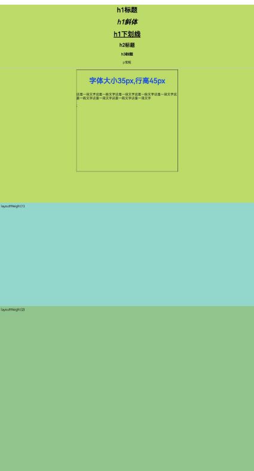

# RichText

The RichText component parses and displays HTML-formatted text.

- **Applicable Scenarios**:

  The RichText component is suitable for loading and displaying HTML strings where minimal customization of the display effects is required. It supports only a limited set of common properties and events.

  The RichText component leverages the underlying Web component to provide foundational capabilities, including but not limited to HTML parsing and rendering. Therefore, using the RichText component requires adherence to Web constraints. Common constraints include:

  The default viewport size for mobile devices is 980px, ensuring most web pages display correctly on mobile devices. If the RichText component's width is less than this value, the HTML content inside may generate a scrollable page wrapped by the RichText component. To override the default value, add the following tag within the content:

    ```html
    <meta name="viewport" content="width=device-width">
    ```

- **Non-Applicable Scenarios**:

  The RichText component is not suitable for scenarios requiring extensive customization of HTML string display effects. For example, it does not support modifying background color, font color, font size, or dynamically changing content through property or event settings. In such cases, it is recommended to use the [Web component](./cj-web-web.md).

  The RichText component is memory-intensive, and in scenarios involving repeated use—such as within a List—performance issues like lag or slow scrolling may occur. In such cases, it is recommended to use the [RichEditor](./cj-text-input-richeditor.md) component.

## Import Module

```cangjie
import kit.ArkUI.*
```

## Child Components

None

## Creating the Component

### init(?ResourceStr)

```cangjie
public init(content: ?ResourceStr)
```

**Function:** Creates a RichText component.

**System Capability:** SystemCapability.ArkUI.ArkUI.Full

**Since:** Version 22

**Parameters:**

| Parameter | Type | Required | Default | Description |
|:---|:---|:---|:---|:---|
| content | ?[ResourceStr](./cj-common-types.md#interface-resourcestr) | Yes | - | HTML-formatted string. Initial value: "". |

## Common Properties/Common Events

**Common Properties:** Only the following common properties are supported: [width](./cj-universal-attribute-size.md#func-widthlength), [height](./cj-universal-attribute-size.md#func-heightlength), [size](./cj-universal-attribute-size.md#func-sizelength-length), and [layoutWeight](./cj-universal-attribute-size.md#func-layoutweightint32). Properties such as [padding](./cj-universal-attribute-size.md#func-paddinglength), [margin](./cj-universal-attribute-size.md#func-marginlength), and [constraintSize](./cj-universal-attribute-size.md#func-constraintsizelength-length-length-length) are not supported as their behavior deviates from the common property descriptions.

**Common Events:** All common events are supported.

## Component Events

### func onStart(?() -> Unit)

```cangjie
public func onStart(callback: ?() -> Unit): This
```

**Function:** Triggered when the webpage starts loading.

**System Capability:** SystemCapability.ArkUI.ArkUI.Full

**Since:** Version 22

**Parameters:**

| Parameter | Type | Required | Default | Description |
|:---|:---|:---|:---|:---|
| callback | ?() -> Unit | Yes | - | Callback function triggered when the webpage starts loading. Initial value: { => }. |

### func onComplete(?() -> Unit)

```cangjie
public func onComplete(callback: ?() -> Unit): This
```

**Function:** Triggered when the webpage finishes loading.

**System Capability:** SystemCapability.ArkUI.ArkUI.Full

**Since:** Version 22

**Parameters:**

| Parameter | Type | Required | Default | Description |
|:---|:---|:---|:---|:---|
| callback | ?() -> Unit | Yes | - | Callback function triggered when the webpage finishes loading. Initial value: { => }. |

## Example Code

<!--run-->

```cangjie
package ohos_app_cangjie_entry
import kit.ArkUI.*
import ohos.arkui.state_macro_manage.*
import ohos.hilog.*

@Entry
@Component
class EntryView {
    @State var data: String = """
        <h1 style="text-align: center;">h1 Heading</h1>
        <h1 style="text-align: center;"><i>h1 Italic</i></h1>
        <h1 style="text-align: center;"><u>h1 Underline</u></h1>
        <h2 style="text-align: center;">h2 Heading</h2>
        <h3 style="text-align: center;">h3 Heading</h3>
        <p style="text-align: center;">p Normal</p><hr/>
        <div style="width: 500.px;height: 500.px;border: 1.px solid;margin: 0 auto;">
        <p style="font-size: 35.px;text-align: center;font-weight: bold; color: rgb(24, 78, 228)">Font Size 35.px, Line Height 45.px</p>
        <p style="background-color: #e5e5e5;line-height: 45.px;font-size: 35.px;text-indent: 2em;">
        <p>This is a paragraph. This is a paragraph. This is a paragraph. This is a paragraph. This is a paragraph. This is a paragraph. This is a paragraph. This is a paragraph. This is a paragraph.</p>;
    """
    func build() {
        Column() {
            // When layoutWeight is not set, the component renders according to its own dimensions.
            RichText(data)
            // Triggered when the webpage starts loading; logs "RichText onStart".
            .onStart({ => Hilog.info(0, "AppLogCj", "RichText onStart")})
            // Triggered when the webpage finishes loading; logs "RichText onComplete".
            .onComplete({ => Hilog.info(0, "AppLogCj", "RichText onComplete")})
            // Sets width to 500 and height to 400.
            .width(500)
            .height(400)
            // Sets the component's background color.
            .backgroundColor(Color(0XBDDB69))

            // When the parent container's dimensions are fixed, child elements with layoutWeight distribute space along the main axis according to their weights, ignoring their own size settings.
            RichText("layoutWeight(1)")
            .onStart({ => Hilog.info(0, "AppLogCj", "RichText onStart")})
            .onComplete({ => Hilog.info(0, "AppLogCj", "RichText onComplete")})
            .backgroundColor(Color(0X92D6CC))
            // Weight 1, occupying 1/3 of the remaining space on the main axis.
            .layoutWeight(1)

            RichText("layoutWeight(2)")
            .onStart({ => Hilog.info(0, "AppLogCj", "RichText onStart")})
            .onComplete({ => Hilog.info(0, "AppLogCj", "RichText onComplete")})
            .backgroundColor(Color(0X92C48D))
            // Weight 2, occupying 2/3 of the remaining space on the main axis.
            .layoutWeight(2)
        }
    }
}
```

