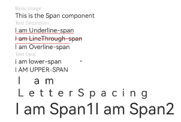

# Span

<!--Del-->
> **Note:**
>
> Currently in the beta phase.
<!--DelEnd-->

A child component of the [Text](cj-text-input-text.md) component, used to display inline text.

## Import Module

```cangjie
import kit.ArkUI.*
```

## Child Components

None

## Creating the Component

### init(?ResourceStr)

```cangjie
public init(value: ?ResourceStr)
```

**Function:** Creates a Span component.

**System Capability:** SystemCapability.ArkUI.ArkUI.Full

**Since:** 22

**Parameters:**

| Parameter | Type | Required | Default Value | Description |
|:---|:---|:---|:---|:---|
| value | ?[ResourceStr](./cj-common-types.md#interface-resourcestr) | Yes | - | Text content.<br>Initial value: "". |

## Common Attributes/Common Events

Common Attributes: Not supported.

Common Events: Only [onClick](#func-onclickclickevent---unit) click event sare supported.

> **Note:**
>
> Since the Span component has no size information, the target property of the ClickEvent object returned by click events is invalid.

## Component Attributes

### func decoration(?TextDecorationType, ?ResourceColor)

```cangjie
public func decoration(decorationType!: ?TextDecorationType, color!: ?ResourceColor = None): This
```

**Function:** Sets the text decoration line style and its color.

**System Capability:** SystemCapability.ArkUI.ArkUI.Full

**Since:** 22

**Parameters:**

| Parameter | Type | Required | Default Value | Description |
|:---|:---|:---|:---|:---|
| decorationType | ?[TextDecorationType](./cj-common-types.md#enum-textdecorationtype) | Yes | - | **Named parameter.** Text decoration line style.<br>Initial value: TextDecorationType.None. |
| color | ?[ResourceColor](./cj-common-types.md#interface-resourcecolor) | No | None | **Named parameter.** Text decoration line color.<br>Initial value: Color.Black. |

### func fontColor(?ResourceColor)

```cangjie
public func fontColor(value: ?ResourceColor): This
```

**Function:** Sets the font color.

**System Capability:** SystemCapability.ArkUI.ArkUI.Full

**Since:** 22

**Parameters:**

| Parameter | Type | Required | Default Value | Description |
|:---|:---|:---|:---|:---|
| value | ?[ResourceColor](./cj-common-types.md#interface-resourcecolor) | Yes | - | Font color. |

### func fontFamily(?ResourceStr)

```cangjie
public func fontFamily(value: ?ResourceStr): This
```

**Function:** Sets the font list.

**System Capability:** SystemCapability.ArkUI.ArkUI.Full

**Since:** 22

**Parameters:**

| Parameter | Type | Required | Default Value | Description |
|:---|:---|:---|:---|:---|
| value | ?[ResourceStr](./cj-common-types.md#interface-resourcestr) | Yes | - | Font list.<br>Initial value: "HarmonyOS Sans". |

### func fontSize(?Length)

```cangjie
public func fontSize(value: ?Length): This
```

**Function:** Sets the font size.

**System Capability:** SystemCapability.ArkUI.ArkUI.Full

**Since:** 22

**Parameters:**

| Parameter | Type | Required | Default Value | Description |
|:---|:---|:---|:---|:---|
| value | ?[Length](./cj-common-types.md#interface-length) | Yes | - | Font size. |

### func fontStyle(?FontStyle)

```cangjie
public func fontStyle(value: ?FontStyle): This
```

**Function:** Sets the font style.

**System Capability:** SystemCapability.ArkUI.ArkUI.Full

**Since:** 22

**Parameters:**

| Parameter | Type | Required | Default Value | Description |
|:---|:---|:---|:---|:---|
| value | ?[FontStyle](./cj-common-types.md#enum-fontstyle) | Yes | - | Font style.<br>Initial value: FontStyle.Normal. |

### func fontWeight(?FontWeight)

```cangjie
public func fontWeight(value: ?FontWeight): This
```

**Function:** Sets the font weight of the text. Setting too large a value may result in truncation in different fonts.

**System Capability:** SystemCapability.ArkUI.ArkUI.Full

**Since:** 22

**Parameters:**

| Parameter | Type | Required | Default Value | Description |
|:---|:---|:---|:---|:---|
| value | ?[FontWeight](./cj-common-types.md#enum-fontweight) | Yes | - | Font weight of the text. Setting too large a value may result in truncation in different fonts.<br>Initial value: FontWeight.Normal. |

### func letterSpacing(?Length)

```cangjie
public func letterSpacing(value: ?Length): This
```

**Function:** Sets the text character spacing.

**System Capability:** SystemCapability.ArkUI.ArkUI.Full

**Since:** 22

**Parameters:**

| Parameter | Type | Required | Default Value | Description |
|:---|:---|:---|:---|:---|
| value | ?[Length](./cj-common-types.md#interface-length) | Yes | - | Character spacing.<br>Initial value: 0.0.px. |

### func textCase(?TextCase)

```cangjie
public func textCase(value: ?TextCase): This
```

**Function:** Sets the text case.

**System Capability:** SystemCapability.ArkUI.ArkUI.Full

**Since:** 22

**Parameters:**

| Parameter | Type | Required | Default Value | Description |
|:---|:---|:---|:---|:---|
| value | ?[TextCase](./cj-common-types.md#enum-textcase) | Yes | - | Text case.<br>Initial value: TextCase.Normal. |

## Component Events

### func onClick(?(ClickEvent) -> Unit)

```cangjie
public func onClick(event: ?(ClickEvent) -> Unit): This
```

**Function:** Click event callback function.

**System Capability:** SystemCapability.ArkUI.ArkUI.Full

**Since:** 22

**Parameters:**

| Parameter | Type | Required | Default Value | Description |
|:---|:---|:---|:---|:---|
| event | ?([ClickEvent](./cj-common-types.md#class-clickevent)) -> Unit | Yes | - | Click event callback function, triggered on click.<br>Initial value: { _ => }. |

## Basic Type Definitions

### class BaseSpan

```cangjie
public abstract class BaseSpan {}
```

**Function:** Base class for Span components.

**System Capability:** SystemCapability.ArkUI.ArkUI.Full

**Since:** 22

## Example Code

### Example 1

Example usage of decoration, textCase, and letterSpacing attribute interfaces.

<!--run-->

```cangjie
package ohos_app_cangjie_entry

import kit.ArkUI.*
import ohos.arkui.state_macro_manage.*
import std.collection.*

@Entry
@Component
class EntryView {
    func build() {
        Flex(direction: FlexDirection.Column, alignItems: ItemAlign.Start,
                        justifyContent: FlexAlign.SpaceBetween) {
            Text("Basic Usage")
            .fontSize(9)
            .fontColor(0xCCCCCC)
            Text() {
                Span("This is the Span component")
                .fontSize(12)
                //Set text case to preserve original case
                .textCase(TextCase.Normal)
                //Inline text has no decoration
                .decoration(decorationType: TextDecorationType.None, color: Color.Red)
            }
            //Add text underline
            Text("Text Decoration")
            .fontSize(9)
            .fontColor(0xCCCCCC)
            Text() {
                Span("I am Underline-span")
                //Inline text decorated with red underline
                .decoration(decorationType: TextDecorationType.Underline, color: Color.Red)
                .fontSize(12)
            }
            Text() {
                Span("I am LineThrough-span")
                //Inline text decorated with red strikethrough
                .decoration(decorationType: TextDecorationType.LineThrough, color: Color.Red)
                .fontSize(12)
            }
            Text() {
                Span("I am Overline-span")
                //Inline text decorated with red overline
                .decoration(decorationType: TextDecorationType.Overline, color: Color.Red)
                .fontSize(12)
            }
            //Text case display
            Text("Text Case").fontSize(9).fontColor(0xCCCCCC)
            Text() {
                Span("I am Lower-span")
                //Set text case to lowercase
                .textCase(TextCase.LowerCase)
                .fontSize(12)
                .decoration(decorationType: TextDecorationType.None, color: Color.Red)
            }
            Text() {
                Span("I am Upper-span")
                //Set text case to uppercase
                .textCase(TextCase.UpperCase)
                .fontSize(12)
                .decoration(decorationType: TextDecorationType.None, color: Color.Red)
            }
            //Text character spacing display
            Text() {
                Span("I am LetterSpacing")
                .fontSize(20)
                .decoration(decorationType: TextDecorationType.None, color: Color.Red)
                //Set text character spacing to 10.fp
                .letterSpacing(10)
            }
            Text() {
                Span("I am Span1").fontSize(30)
                .decoration(decorationType: TextDecorationType.None, color: Color.Red)
                Span("I am Span2").fontSize(30)
                .decoration(decorationType: TextDecorationType.None, color: Color.Red)
            }
        }
        .width(100.percent)
        .height(250)
        .padding(left: 35, right: 35, top: 35)
    }
}
```

