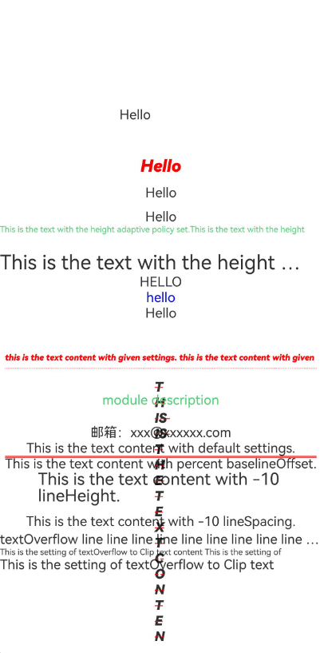

# Text

<!--Del-->
> **Note:**
>
> Currently in the beta phase.
<!--DelEnd-->

A component for displaying text content.

## Import Module

```cangjie
import kit.ArkUI.*
```

## Subcomponents

Can contain subcomponents such as [Span](./cj-text-input-span.md#span) and [ImageSpan](./cj-text-input-imagespan.md#imagespan).

## Creating the Component

### init(?ResourceStr, ?TextController, () -> Unit)

```cangjie
public init(content: ?ResourceStr, controller!: ?TextController = None, child!: () -> Unit = { =>})
```

**Function:** Creates a Text object containing text content, a controller, and subcomponents.

**System Capability:** SystemCapability.ArkUI.ArkUI.Full

**Initial Version:** 22

**Parameters:**

| Parameter Name | Type | Required | Default Value | Description |
|:---|:---|:---|:---|:---|
| content | ?[ResourceStr](./cj-common-types.md#interface-resourcestr) | Yes | - | The text content. |
| controller | ?[TextController](#class-textcontroller) | No | None | **Named parameter.** Binds a controller to the component. |
| child | () -> Unit | No | {=>} | **Named parameter.** Subcomponents of the Text container. |

### init(?TextController, () -> Unit)

```cangjie
public init(controller!: ?TextController = None, child!: () -> Unit)
```

**Function:** Creates a Text object containing a controller and subcomponents.

**System Capability:** SystemCapability.ArkUI.ArkUI.Full

**Initial Version:** 22

**Parameters:**

| Parameter Name | Type | Required | Default Value | Description |
|:---|:---|:---|:---|:---|
| controller | ?[TextController](#class-textcontroller) | No | None | **Named parameter.** Binds a controller to the component. |
| child | () -> Unit | Yes | - | **Named parameter.** Subcomponents of the Text container. |

### init(?TextController)

```cangjie
public init(controller!: ?TextController = None)
```

**Function:** Creates a Text object containing a controller.

**System Capability:** SystemCapability.ArkUI.ArkUI.Full

**Initial Version:** 22

**Parameters:**

| Parameter Name | Type | Required | Default Value | Description |
|:---|:---|:---|:---|:---|
| controller | ?[TextController](#class-textcontroller) | No | None | **Named parameter.** Binds a controller to the component. |

## Common Attributes/Common Events

Common Attributes: All supported.

Common Events: All supported.

## Component Attributes

### func baselineOffset(?Length)

```cangjie
public func baselineOffset(value: ?Length): This
```

**Function:** Sets the baseline offset of the text.

**System Capability:** SystemCapability.ArkUI.ArkUI.Full

**Initial Version:** 22

**Parameters:**

| Parameter Name | Type | Required | Default Value | Description |
|:---|:---|:---|:---|:---|
| value | ?[Length](./cj-common-types.md#interface-length) | Yes | - | The baseline offset of the text.<br>Initial value: 0.0.px. |

### func decoration(?TextDecorationType, ?ResourceColor, ?TextDecorationStyle)

```cangjie
public func decoration(decorationType!: ?TextDecorationType, color!: ?ResourceColor,
    decorationStyle!: ?TextDecorationStyle = None): This
```

**Function:** Sets the decoration line style of the text.

**System Capability:** SystemCapability.ArkUI.ArkUI.Full

**Initial Version:** 22

**Parameters:**

| Parameter Name | Type | Required | Default Value | Description |
|:---|:---|:---|:---|:---|
| decorationType | ?[TextDecorationType](./cj-common-types.md#enum-textdecorationtype) | Yes | - | **Named parameter.** The type of decoration line.<br>Initial value: TextDecorationType.None. |
| color | ?[ResourceColor](./cj-common-types.md#interface-resourcecolor) | Yes | - | **Named parameter.** The color of the decoration line.<br>Initial value: Color.Black. |
| decorationStyle | ?[TextDecorationStyle](./cj-common-types.md#enum-textdecorationstyle) | No | None | **Named parameter.** The style of the decoration line.<br>Initial value: TextDecorationStyle.Solid. |

### func fontColor(?ResourceColor)

```cangjie
public func fontColor(value: ?ResourceColor): This
```

**Function:** Sets the color of the text.

**System Capability:** SystemCapability.ArkUI.ArkUI.Full

**Initial Version:** 22

**Parameters:**

| Parameter Name | Type | Required | Default Value | Description |
|:---|:---|:---|:---|:---|
| value | ?[ResourceColor](./cj-common-types.md#interface-resourcecolor) | Yes | - | The color of the text. |

### func fontFamily(?ResourceStr)

```cangjie
public func fontFamily(value: ?ResourceStr): This
```

**Function:** Sets the font family of the text.

**System Capability:** SystemCapability.ArkUI.ArkUI.Full

**Initial Version:** 22

**Parameters:**

| Parameter Name | Type | Required | Default Value | Description |
|:---|:---|:---|:---|:---|
| value | ?[ResourceStr](./cj-common-types.md#interface-resourcestr) | Yes | - | The font family of the text.<br>Initial value: "HarmonyOS Sans". |

### func fontSize(?Length)

```cangjie
public func fontSize(value: ?Length): This
```

**Function:** Sets the font size of the text.

**System Capability:** SystemCapability.ArkUI.ArkUI.Full

**Initial Version:** 22

**Parameters:**

| Parameter Name | Type | Required | Default Value | Description |
|:---|:---|:---|:---|:---|
| value | ?[Length](./cj-common-types.md#interface-length) | Yes | - | The font size of the text.<br>Initial value: 16.fp. |

### func fontStyle(?FontStyle)

```cangjie
public func fontStyle(value: ?FontStyle): This
```

**Function:** Sets the font style of the text.

**System Capability:** SystemCapability.ArkUI.ArkUI.Full

**Initial Version:** 22

**Parameters:**

| Parameter Name | Type | Required | Default Value | Description |
|:---|:---|:---|:---|:---|
| value | ?[FontStyle](./cj-common-types.md#enum-fontstyle) | Yes | - | The font style of the text.<br>Initial value: FontStyle.Normal. |

### func fontWeight(?FontWeight)

```cangjie
public func fontWeight(value: ?FontWeight): This
```

**Function:** Sets the font weight of the text.

**System Capability:** SystemCapability.ArkUI.ArkUI.Full

**Initial Version:** 22

**Parameters:**

| Parameter Name | Type | Required | Default Value | Description |
|:---|:---|:---|:---|:---|
| value | ?[FontWeight](./cj-common-types.md#enum-fontweight) | Yes | - | The font weight of the text. |

### func lineHeight(?Length)

```cangjie
public func lineHeight(value: ?Length): This
```

**Function:** Sets the line height of the text.

**System Capability:** SystemCapability.ArkUI.ArkUI.Full

**Initial Version:** 22

**Parameters:**

| Parameter Name | Type | Required | Default Value | Description |
|:---|:---|:---|:---|:---|
| value | ?[Length](./cj-common-types.md#interface-length) | Yes | - | The line height of the text.<br>Initial value: 0.0.px. |

### func lineSpacing(?Length)

```cangjie
public func lineSpacing(value: ?Length): This
```

**Function:** Sets the line spacing of the text.

**System Capability:** SystemCapability.ArkUI.ArkUI.Full

**Initial Version:** 22

**Parameters:**

| Parameter Name | Type | Required | Default Value | Description |
|:---|:---|:---|:---|:---|
| value | ?[Length](./cj-common-types.md#interface-length) | Yes | - | The line spacing of the text.<br>Initial value: 0.0.vp. |

### func maxFontSize(?Length)

```cangjie
public func maxFontSize(value: ?Length): This
```

**Function:** Sets the maximum font size of the text.

**System Capability:** SystemCapability.ArkUI.ArkUI.Full

**Initial Version:** 22

**Parameters:**

| Parameter Name | Type | Required | Default Value | Description |
|:---|:---|:---|:---|:---|
| value | ?[Length](./cj-common-types.md#interface-length) | Yes | - | The maximum font size of the text. |

### func maxLines(?Int32)

```cangjie
public func maxLines(value: ?Int32): This
```

**Function:** Sets the maximum number of lines for the text.

**System Capability:** SystemCapability.ArkUI.ArkUI.Full

**Initial Version:** 22

**Parameters:**

| Parameter Name | Type | Required | Default Value | Description |
|:---|:---|:---|:---|:---|
| value | ?Int32 | Yes | - | The maximum number of lines for the text.<br>Initial value: Int32.Max. |

### func minFontSize(?Length)

```cangjie
public func minFontSize(value: ?Length): This
```

**Function:** Sets the minimum font size of the text.

**System Capability:** SystemCapability.ArkUI.ArkUI.Full

**Initial Version:** 22

**Parameters:**

| Parameter Name | Type | Required | Default Value | Description |
|:---|:---|:---|:---|:---|
| value | ?[Length](./cj-common-types.md#interface-length) | Yes | - | The minimum font size of the text. |

### func textCase(?TextCase)

```cangjie
public func textCase(value: ?TextCase): This
```

**Function:** Sets the text case format.

**System Capability:** SystemCapability.ArkUI.ArkUI.Full

**Initial Version:** 22

**Parameters:**

| Parameter Name | Type | Required | Default Value | Description |
|:---|:---|:---|:---|:---|
| value | ?[TextCase](./cj-common-types.md#enum-textcase) | Yes | - | The text case format.<br>Initial value: TextCase.Normal. |

### func textAlign(?TextAlign)

```cangjie
public func textAlign(value: ?TextAlign): This
```

**Function:** Sets the horizontal alignment of the text.

**System Capability:** SystemCapability.ArkUI.ArkUI.Full

**Initial Version:** 22

**Parameters:**

| Parameter Name | Type | Required | Default Value | Description |
|:---|:---|:---|:---|:---|
| value | ?[TextAlign](./cj-common-types.md#enum-textalign) | Yes | - | The horizontal alignment of the text.<br>Initial value: TextAlign.Start. |

### func textOverflow(?TextOverflow)

```cangjie
public func textOverflow(value: ?TextOverflow): This
```

**Function:** Sets the overflow handling method for the text.

**System Capability:** SystemCapability.ArkUI.ArkUI.Full

**Initial Version:** 22

**Parameters:**

| Parameter Name | Type | Required | Default Value | Description |
|:---|:---|:---|:---|:---|
| value | ?[TextOverflow](./cj-common-types.md#enum-textoverflow) | Yes | - | The overflow handling method for the text.<br>Initial value: TextOverflow.None. |

## Basic Type Definitions

### class TextController

```cangjie
public class TextController {
    public init()
}
```

**Function:** TextController is the controller for the Text component. An object of this type can be defined and bound to the Text component to control it.

**System Capability:** SystemCapability.ArkUI.ArkUI.Full

**Initial Version:** 22

#### init()

```cangjie
public init()
```

**Function:** Constructor for TextController.

**System Capability:** SystemCapability.ArkUI.ArkUI.Full

**Initial Version:** 22

#### func closeSelectionMenu()

```cangjie
public func closeSelectionMenu(): Unit
```

**Function:** Closes the selection menu.

**System Capability:** SystemCapability.ArkUI.ArkUI.Full

**Initial Version:** 22

## Example Code

<!--run-->
```cangjie
package ohos_app_cangjie_entry
import kit.ArkUI.*
import ohos.i18n.*
``````markdown
import ohos.resource.*
import ohos.arkui.state_macro_manage.*
import ohos.hilog.*
import ohos.arkui.component.CopyOptions as MyCopyOptions
import std.collection.ArrayList
import std.ast.Block

@Entry
@Component
class EntryView {
    @State
    var message: String = "Hello"
    let controller: TextController = TextController()
    @State var shadowOptionsArray: Array<ShadowOptions> = [ShadowOptions(radius: 10.0), ShadowOptions(radius: 10.0, shadowType: ShadowType.Blur, color: Color.Red, offsetX: 1.0, offsetY: 1.0, fill: true)]
    @Builder func LongPressTextCustomMenu() {
        Column() {
            Button('LongPress')
        }
    }

    @Builder func RightClickTextCustomMenu() {
        Column() {
            Button('RightClick')
        }
    }

    @Builder func SelectTextCustomMenu() {
        Column() {
            Button('Select')
        }
    }

    func build() {
        Scroll() {
            Column {
                // Display the set text style effects
                Text(message)
                    // @r(app.string.fontFamily) should be replaced with the resources required by the developer
                    .fontFamily(@r(app.string.fontFamily))
                    .height(100.vp)
                    .width(100.vp)
                    .id("textComponent1")
                Text(message)
                    .fontSize(20)
                    .fontColor(0XFFFF0000)
                    .fontStyle(FontStyle.Italic)
                    .fontWeight(FontWeight.W900)
                    .id("textComponent2")
                // Set text line height
                Blank(min: 10)
                Text(message)
                    .textAlign(TextAlign.End).baselineOffset(10.vp)
                    .id("textComponent3")
                    // @r(app.string.minFontSize) should be replaced with the resources required by the developer
                    .minFontSize(@r(app.string.font_size))
                    // @r(app.string.line_height) should be replaced with the resources required by the developer
                    .lineHeight(@r(app.string.line_height))

                Text(message)
                    .decoration(decorationType: TextDecorationType.None, color: Color.Red)
                    .id("textComponent4")
                // Set text baseline offset
                Text(
                    "This is the text with the height adaptive policy set.This is the text with the height adaptive policy set."
                )
                    .minFontSize(10.fp)
                    .maxFontSize(30.fp)
                    .maxLines(1).id("textComponent5")
                    // @r(app.string.baselineOffset) should be replaced with the resources required by the developer
                    .baselineOffset(@r(app.string.baselineOffset))
                    // @r(app.color.blue_23C452) should be replaced with the resources required by the developer
                    .fontColor(@r(app.color.blue_23C452))
                // Set display method for overflow text
                Text(
                    "This is the text with the height adaptive policy set.This is the text with the height adaptive policy set"
                )
                    .fontSize(24.vp)
                    .maxLines(1)
                    .textOverflow(TextOverflow.Ellipsis)
                    .id("textComponent6")
                // Set text to uppercase display
                Text("Hello")
                    .textCase(TextCase.UpperCase)
                    .id("textComponent7")
                    // @r(app.string.font_size) should be replaced with the resources required by the developer
                    .maxFontSize(@r(app.string.font_size))
                // Set text to lowercase display
                Text("Hello")
                    .foregroundColor(Color.Blue)
                    .id("textComponent8")
                    // @r(app.string.font_size) should be replaced with the resources required by the developer
                    .fontSize(@r(app.string.font_size))
                    .textOverflow(TextOverflow.None)
                    .textCase(TextCase.LowerCase)
                // Touch hot zone settings
                Text("Hello")
                    .responseRegion(Rectangle(x: 100.percent, y: 0.vp, width: 50.percent, height: 100.percent))
                    .responseRegion([Rectangle(x: 0.vp, y: 100.percent, width: 100.percent, height: 100.percent),Rectangle(x: 100.percent, y: 0.vp, width: 50.percent, height: 100.percent)])
                Text('This is the text content with given settings. This is the text content with given settings')
                    .baselineOffset(10)
                    .decoration(decorationType: TextDecorationType.Underline, color: Color.Red, decorationStyle: TextDecorationStyle.Dotted)
                    .fontColor(Color.Red)
                    .fontFamily("HarmonyOS Sans")
                    .fontSize(10.fp)
                    .fontStyle(FontStyle.Italic)
                    .fontWeight(FontWeight.Bolder)
                    .lineHeight(40)
                    .lineSpacing(20)
                    .maxLines(1)
                    .textAlign(TextAlign.Center)
                    .textCase(TextCase.LowerCase)
                    .textOverflow(TextOverflow.None)
                    .id("TextGivenSetting")
                // Display text styling effects
                Text('This is the text content with given font settings.')
                    .size(width:15, height: 15)
                    .fontWeight(FontWeight.Bolder)
                    .fontFamily('HarmonyOS Sans')
                    .fontStyle(FontStyle.Italic)
                    .decoration(decorationType: TextDecorationType.LineThrough, color: Color.Red, decorationStyle: TextDecorationStyle.Dashed)
                    .textCase(TextCase.UpperCase)
                    .id("TextGivenFont")
                // Set text effects through resource calls and display
                // @r(app.string.module_desc) should be replaced with the resources required by the developer
                Text(@r(app.string.module_desc))
                    // @r(app.string.font_size) should be replaced with the resources required by the developer
                    .fontSize(@r(app.string.font_size))
                    .maxFontSize(@r(app.string.font_size))
                    .minFontSize(@r(app.string.font_size))
                    // @r(app.string.fontFamily) should be replaced with the resources required by the developer
                    .fontFamily(@r(app.string.fontFamily))
                    // @r(app.string.line_height) should be replaced with the resources required by the developer
                    .lineHeight(@r(app.string.line_height))
                    // @r(app.string.baselineOffset) should be replaced with the resources required by the developer
                    .baselineOffset(@r(app.string.baselineOffset))
                    // @r(app.color.blue_23C452) should be replaced with the resources required by the developer
                    .fontColor(@r(app.color.blue_23C452))
                    .id("TextResource")

                Text('Email: xxx@xxxxxx.com')
                    .textOverflow(TextOverflow.None)
                    .id("TextDetectConfig4")
                // Display default font styling effects
                Text('This is the text content with default settings.')
                    .id("TextDefault1")
                // Set text offset
                Text('This is the text content with percent baselineOffset.')
                    .baselineOffset(10.percent)
                    .decoration(decorationType: TextDecorationType.Overline, color: Color.Red, decorationStyle: TextDecorationStyle.Double)
                    .id("TextBoundaryValue1")
                // Display text size set with percentage
                Text('This is the text content with percent fontSize.')
                    .fontSize(10.percent)
                    .id("TextBoundaryValue4")
                // Display effect when text line height is negative
                Text('This is the text content with -10 lineHeight.')
                    .lineHeight(-10)
                    .fontSize(20)
                    .id("TextBoundaryValue6")
                Text('This is the text content with -10 lineSpacing.')
                    .lineSpacing(-10)
                    .id("TextBoundaryValue7")
                // Set ellipsis for overflow text
                Text("textOverflow line line line line line line line line line line line line line line line line line.")
                    .textOverflow(TextOverflow.Ellipsis)
                    .maxLines(1)
                    .id("TextCombine1")
                Text("This is the setting of textOverflow to Clip text content This is the setting of textOverflow to None text content. ")
                    .minFontSize(10)
                    .maxFontSize(30)
                    .maxLines(1)
                    .fontSize(50)
                    .id("TextCombine6")
                Text("This is the setting of textOverflow to Clip text content This is the setting of textOverflow to None text content. ")
                    .minFontSize(-10)
                    .maxFontSize(30)
                    .maxLines(1)
                    .id("TextCombine7")
            }
        }.height(100.percent).width(100.percent)
    }
}
```


```