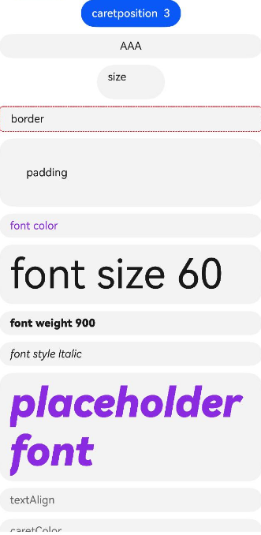

# TextArea

A multi-line text input component that automatically wraps text when the content exceeds the component width. When height is not set, the component has no default height and adapts to content height. When width is not set, it defaults to filling the maximum available width.

## Import Module

```cangjie
import kit.ArkUI.*
```

## Child Components

None

## Creating the Component

### init(ResourceStr, ResourceStr, TextAreaController)

```cangjie
public init(placeholder!: ResourceStr = "", text!: ResourceStr = "",
    controller!: TextAreaController = TextAreaController())
```

**Function:** Creates a TextArea component.

**System Capability:** SystemCapability.ArkUI.ArkUI.Full

**Since:** 21

**Parameters:**

| Parameter | Type | Required | Default | Description |
|:---|:---|:---|:---|:---|
| placeholder | [ResourceStr](../BasicServicesKit/cj-apis-base.md#interface-resourcestr) | No | "" | **Named parameter.** Hint text when no input is present.<br/>The hint text disappears when content is entered. When only the placeholder property is set, the handle still follows drag movements, and the cursor stays at the beginning of the text when the handle is released. |
| text | [ResourceStr](../BasicServicesKit/cj-apis-base.md#interface-resourcestr) | No | "" | **Named parameter.** Current text content of the input box.<br/>It is recommended to bind state variables with text in real-time through the onChange event to avoid abnormal text content in TextArea during component refresh. |
| controller | [TextAreaController](#class-textareacontroller) | No | TextAreaController() | **Named parameter.** TextArea controller. |

## Common Attributes/Common Events

Common attributes: All supported.

Common events: All supported.

## Component Attributes

### func caretColor(ResourceColor)

```cangjie
public func caretColor(value: ResourceColor): This
```

**Function:** Sets the cursor color of the input box.

**System Capability:** SystemCapability.ArkUI.ArkUI.Full

**Since:** 21

**Parameters:**

| Parameter | Type | Required | Default | Description |
|:---|:---|:---|:---|:---|
| value | [ResourceColor](../BasicServicesKit/cj-apis-base.md#interface-resourcecolor) | Yes | - | Cursor color of the input box.<br>Default: 0xFF0A59F7. |

### func enterKeyType(EnterKeyType)

```cangjie
public func enterKeyType(value: EnterKeyType): This
```

**Function:** Sets the enter key type of the input method.

**System Capability:** SystemCapability.ArkUI.ArkUI.Full

**Since:** 21

**Parameters:**

| Parameter | Type | Required | Default | Description |
|:---|:---|:---|:---|:---|
| value | [EnterKeyType](./cj-text-input-textinput.md#enum-enterkeytype) | Yes | - | Enter key type of the input method.<br>Default: EnterKeyType.NEW_LINE. |

### func fontColor(ResourceColor)

```cangjie
public func fontColor(value: ResourceColor): This
```

**Function:** Sets the font color.

**System Capability:** SystemCapability.ArkUI.ArkUI.Full

**Since:** 21

**Parameters:**

| Parameter | Type | Required | Default | Description |
|:---|:---|:---|:---|:---|
| value | [ResourceColor](../BasicServicesKit/cj-apis-base.md#interface-resourcecolor) | Yes | - | Font color.<br>Default: 0xE5000000. |

### func fontFamily(ResourceStr)

```cangjie
public func fontFamily(value: ResourceStr): This
```

**Function:** Sets the font family list.

**System Capability:** SystemCapability.ArkUI.ArkUI.Full

**Since:** 21

**Parameters:**

| Parameter | Type | Required | Default | Description |
|:---|:---|:---|:---|:---|
| value | [ResourceStr](../BasicServicesKit/cj-apis-base.md#interface-resourcestr) | Yes | - | Font family list. Default font is 'HarmonyOS Sans'. Currently supports 'HarmonyOS Sans' and [registered custom fonts](../BasicServicesKit/cj-apis-base.md#func-registerfont). |

### func fontSize(Length)

```cangjie
public func fontSize(value: Length): This
```

**Function:** Sets the font size.

**System Capability:** SystemCapability.ArkUI.ArkUI.Full

**Since:** 21

**Parameters:**

| Parameter | Type | Required | Default | Description |
|:---|:---|:---|:---|:---|
| value | [Length](../BasicServicesKit/cj-apis-base.md#interface-length) | Yes | - | Font size. When Length is Int64 or Float64, uses fp units. Percentage strings are not supported.<br>Default: 16.fp. |

### func fontStyle(FontStyle)

```cangjie
public func fontStyle(value: FontStyle): This
```

**Function:** Sets the font style.

**System Capability:** SystemCapability.ArkUI.ArkUI.Full

**Since:** 21

**Parameters:**

| Parameter | Type | Required | Default | Description |
|:---|:---|:---|:---|:---|
| value | [FontStyle](./cj-common-types.md#enum-fontstyle) | Yes | - | Font style.<br>Default: FontStyle.Normal. |

### func fontWeight(FontWeight)

```cangjie
public func fontWeight(value: FontWeight): This
```

**Function:** Sets the font weight of the text. Setting too large a value may cause truncation in different fonts.

**System Capability:** SystemCapability.ArkUI.ArkUI.Full

**Since:** 21

**Parameters:**

| Parameter | Type | Required | Default | Description |
|:---|:---|:---|:---|:---|
| value | [FontWeight](./cj-common-types.md#enum-fontweight) | Yes | - | Font weight of the text.<br>Default: FontWeight.Normal. |

### func inputFilter(ResourceStr, ?(String) -> Unit)

```cangjie
public func inputFilter(value!: ResourceStr, error!: ?(String) -> Unit = None): This
```

**Function:** Sets an input filter using a regular expression.

> **Note:**
>
> Input matching the expression is allowed to display; non-matching input is filtered. Only supports single-character matching, not string matching.

**System Capability:** SystemCapability.ArkUI.ArkUI.Full

**Since:** 21

**Parameters:**

| Parameter | Type | Required | Default | Description |
|:---|:---|:---|:---|:---|
| value | [ResourceStr](../BasicServicesKit/cj-apis-base.md#interface-resourcestr) | Yes | - | **Named parameter.** Regular expression. |
| error | ?(String)->Unit | No | None | **Named parameter.** Returns filtered content when regex matching fails. |

### func maxLength(UInt32)

```cangjie
public func maxLength(value: UInt32): This
```

**Function:** Sets the maximum number of input characters for the text.

> **Note:**
>
> By default, there is no limit on the maximum number of input characters. When the maximum character limit is reached, no more characters can be entered, and the border turns red.

**System Capability:** SystemCapability.ArkUI.ArkUI.Full

**Since:** 21

**Parameters:**

| Parameter | Type | Required | Default | Description |
|:---|:---|:---|:---|:---|
| value | UInt32 | Yes | - | Maximum number of input characters for the text. |

### func placeholderColor(ResourceColor)

```cangjie
public func placeholderColor(value: ResourceColor): This
```

**Function:** Sets the text color of the placeholder.

**System Capability:** SystemCapability.ArkUI.ArkUI.Full

**Since:** 21

**Parameters:**

| Parameter | Type | Required | Default | Description |
|:---|:---|:---|:---|:---|
| value | [ResourceColor](../BasicServicesKit/cj-apis-base.md#interface-resourcecolor) | Yes | - | Text color of the placeholder.<br>Default: Follows theme. |

### func placeholderFont(Length, FontWeight, String, FontStyle)

```cangjie
public func placeholderFont(size!: Length, weight!: FontWeight = FontWeight.W400, family!: String = "",
    style!: FontStyle = FontStyle.Normal): This
```

**Function:** Sets the placeholder text style, including font size, font weight, font family, and font style. Currently supports 'HarmonyOS Sans' and [registered custom fonts](./cj-text-input-text.md#register-custom-font).

**System Capability:** SystemCapability.ArkUI.ArkUI.Full

**Since:** 21

**Parameters:**

| Parameter | Type | Required | Default | Description |
|:---|:---|:---|:---|:---|
| size | [Length](../BasicServicesKit/cj-apis-base.md#interface-length) | Yes | - | **Named parameter.** Text size. Unit: fp.<br>Default: 16.fp. |
| weight | [FontWeight](./cj-common-types.md#enum-fontweight) | No | FontWeight.W400 | **Named parameter.** Font weight of the text. |
| family | String | No | "" | **Named parameter.** Font family list of the text. |
| style | [FontStyle](./cj-common-types.md#enum-fontstyle) | No | FontStyle.Normal | **Named parameter.** Font style of the text. |

### func textAlign(TextAlign)

```cangjie
public func textAlign(value: TextAlign): This
```

**Function:** Sets the horizontal alignment of text within the input box.

> **Note:**
>
> - Supports TextAlign.Start, TextAlign.Center, and TextAlign.End.
> - The vertical position of text paragraphs can be controlled via the [align](./cj-universal-attribute-location.md#func-alignalignment) attribute. In this component, the align attribute cannot control the horizontal position of text paragraphs. That is, Alignment.TopStart, Alignment.Top, and Alignment.TopEnd have the same effect (top alignment), Alignment.Start, Alignment.Center, and Alignment.End have the same effect (vertical center), and Alignment.BottomStart, Alignment.Bottom, and Alignment.BottomEnd have the same effect (bottom alignment).
> - When textAlign is set to TextAlign.JUSTIFY, the last line of text does not participate in justification and defaults to left alignment.

**System Capability:** SystemCapability.ArkUI.ArkUI.Full

**Since:** 21

**Parameters:**

| Parameter | Type | Required | Default | Description |
|:---|:---|:---|:---|:---|
| value | [TextAlign](./cj-common-types.md#enum-textalign) | Yes | - | Horizontal alignment of text within the input box. Only supports TextAlign.Start, TextAlign.Center, and TextAlign.End.<br>Default: TextAlign.Start. |

## Component Events

### func onChange((String) -> Unit)

```cangjie
public func onChange(callback: (String) -> Unit): This
```

**Function:** Triggered when the input content changes.

> **Note:**
>
> In this callback, if cursor operations are performed, developers need to adjust cursor logic based on the previewText parameter in pre-edit scenarios to accommodate pre-edit behavior. Conditions for triggering this event:
>
> - Keyboard input.
> - Paste or cut operations.
> - Keyboard shortcut Ctrl+v.

**System Capability:** SystemCapability.ArkUI.ArkUI.Full

**Since:** 21

**Parameters:**

| Parameter | Type | Required | Default | Description |
|:---|:---|:---|:---|:---|
| callback | (String)->Unit | Yes | - | Callback function triggered when current input text content changes. |

### func onCopy((String) -> Unit)

```cangjie
public func onCopy(callback: (String) -> Unit): This
```

**Function:** Triggered when a copy operation is performed.

**System Capability:** SystemCapability.ArkUI.ArkUI.Full

**Since:** 21

**Parameters:**

| Parameter | Type | Required | Default | Description |
|:---|:---|:---|:---|:---|
| callback | (String)->Unit | Yes | - | Callback function triggered during copy. Parameter: Copied text content. |

### func onCut((String) -> Unit)

```cangjie
public func onCut(callback: (String) -> Unit): This
```

**Function:** Triggered when a cut operation is performed.

**System Capability:** SystemCapability.ArkUI.ArkUI.Full

**Since:** 21

**Parameters:**

| Parameter | Type | Required | Default | Description |
|:---|:---|:---|:---|:---|
| callback | (String)->Unit | Yes | - | Callback function triggered during cut. Parameter: Cut text content. |

### func onEditChange((Bool) -> Unit)

```cangjie
public func onEditChange(callback: (Bool) -> Unit): This
```

**Function:** Triggered when the input state changes. The presence of a cursor indicates edit mode; absence indicates non-edit mode.

**System Capability:** SystemCapability.ArkUI.ArkUI.Full

**Since:** 21

**Parameters:**

| Parameter | Type | Required | Default | Description |
|:---|:---|:---|:---|:---|
| callback | (Bool)->Unit | Yes | - | Callback function triggered when edit state changes. Parameter: Current edit state. true indicates active input. |

### func onPaste((String) -> Unit)

```cangjie
public func onPaste(callback: (String) -> Unit): This
```

**Function:** Triggered when a paste operation is performed.

**System Capability:** SystemCapability.ArkUI.ArkUI.Full

**Since:** 21

**Parameters:**

| Parameter | Type | Required | Default | Description |
|:---|:---|:---|:---|:---|
| callback | (String)->Unit | Yes | - | Callback function triggered during paste. Returns pasted text content. |

### func onSubmit((EnterKeyType) -> Unit)

```cangjie
public func onSubmit(callback: (EnterKeyType) -> Unit): This
```

**Function:** Triggered when the enter key of the input method is pressed.

**System Capability:** SystemCapability.ArkUI.ArkUI.Full

**Since:** 21

**Parameters:**

| Parameter | Type | Required | Default | Description |
|:---|:---|:---|:---|:---|
| callback | ([EnterKeyType](./cj-text-input-textinput.md#enum-enterkeytype))->Unit | Yes | - | Callback function triggered when the enter key or soft keyboard enter key is pressed. Parameter: Current soft keyboard enter key type. Does not trigger onSubmit when type is EnterKeyType.NEW_LINE. |

## Basic Type Definitions

### class TextAreaController

```cangjie
public class TextAreaController {
    public init()
}
```

**Function:** Controller for the TextArea component.

**System Capability:** SystemCapability.ArkUI.ArkUI.Full

**Since:** 21

#### init()

```cangjie
public init()
```

**Function:** Creates an object of type TextAreaController.

**System Capability:** SystemCapability.ArkUI.ArkUI.Full

**Since:** 21

#### func caretPosition(Int32)

```cangjie
public func caretPosition(value: Int32): Unit
```

**Function:** Sets the cursor position.

**System Capability:** SystemCapability.ArkUI.ArkUI.Full

**Since:** 21

**Parameters:**

| Parameter | Type | Required | Default | Description |
|:---|:---|:---|:---|:---|
| value | Int32 | Yes | - | Cursor position. |

### enum TextAreaType

```cangjie
public enum TextAreaType {
    | NORMAL
    | NUMBER
    | PHONE_NUMBER
    | EMAIL
    | NUMBER_DECIMAL
    | URL
    | ...
}
```

**Function:** Represents the input box type.

**System Capability:** SystemCapability.ArkUI.ArkUI.Full

**Since:** 21

#### EMAIL

```cangjie
EMAIL
```

**Function:** Indicates email address input mode. Supports numbers, letters, underscores, periods, !, #, $, %, &, ', *, +, -, /, =, ?, ^, `, {, |, }, ~, and @ (only one @ character allowed).

**System Capability:** SystemCapability.ArkUI.ArkUI.Full

**Since:** 21

#### NORMAL

```cangjie
NORMAL
```

**Function:** Indicates basic input mode. Supports numbers, letters, underscores, spaces, and special characters.

**System Capability:** SystemCapability.ArkUI.ArkUI.Full

**Since:** 21

#### NUMBER

```cangjie
NUMBER
```

**Function:** Indicates numeric-only input mode.

**System Capability:** SystemCapability.ArkUI.ArkUI.Full

**Since:** 21

#### NUMBER_DECIMAL

```cangjie
NUMBER_DECIMAL
```

**Function:** Indicates numeric input mode with decimal points. Supports numbers and decimal points (only one decimal point allowed).

**System Capability:** SystemCapability.ArkUI.ArkUI.Full

**Since:** 21

#### PHONE_NUMBER

```cangjie
PHONE_NUMBER
```

**Function:** Indicates phone number input mode. Supports numbers, spaces, +, -, *, #, (, ), with no length limit.

**System Capability:** SystemCapability.ArkUI.ArkUI.Full

**Since:** 21

#### URL

```cangjie
URL
```

**Function:** Indicates URL input mode.

**System Capability:** SystemCapability.ArkUI.ArkUI.Full

**Since:** 21## Sample Code

<!--run-->

```cangjie
package ohos_app_cangjie_entry

import kit.ArkUI.*
import kit.PerformanceAnalysisKit.*
import ohos.arkui.state_macro_manage.*

@Entry
@Component
class EntryView {
    @State var placeholder: String = "please input your name"
    @State var name: String = "AAA"
    var controller: TextAreaController = TextAreaController()
    var scroller: Scroller = Scroller()
    func build() {
        Scroll(this.scroller) {
            Column(space: 10.px){
                Button("caretposition  3").onClick({
                    evt => controller.caretPosition(3)
                })

                TextArea(placeholder: this.placeholder, text: this.name, controller: controller)
                .textAlign(TextAlign.Center)

                TextArea(text: "size")
                .size(width: 100.vp, height: 50.vp).borderRadius(100.vp)

                TextArea(text: "border")
                .border(width: 1.vp, color: Color(0XFFFF0011), radius: 5.vp, style: BorderStyle.Dashed )

                TextArea(text: "padding")
                .padding(40.vp)

                TextArea(text: "font color")
                .fontColor(0x8A2BE2)

                TextArea(text: "font size 60")
                .fontSize(60)

                TextArea(text: "font weight 900")
                .fontWeight(FontWeight.W900)

                TextArea(text: "font style Italic")
                .fontStyle(FontStyle.Italic)

                TextArea(placeholder: "placeholder font")
                .placeholderColor(Color(0x8A2BE2))
                .placeholderFont(size:60.0, weight: FontWeight.W900, family:"Georgia", style:FontStyle.Italic)

                TextArea(placeholder: "textAlign")
                .textAlign(TextAlign.Start)

                TextArea(placeholder: "caretColor")
                .caretColor(Color.Red)

                TextArea(placeholder: "inputfilter only a")
                .inputFilter(value: "a" , error: { val => Hilog.info(0, "cangjie",  "TextArea OnError:" + val) })

                TextArea(placeholder: "TextArea callback")
                .onChange ({ val =>
                Hilog.info(0, "cangjie", "TextArea onChange:" + val)
                })
                .onPaste ({ val =>
                    Hilog.info(0, "cangjie", "TextArea onPaste:" + val)
                })
                .onCut ({ val =>
                    Hilog.info(0, "cangjie", "TextArea onCut:" + val)
                })
                .onCopy ({ val =>
                    Hilog.info(0, "cangjie", "TextArea onCopy:" + val)
                })
                .onSubmit ({ val =>
                    Hilog.info(0, "cangjie", "TextArea onSubmit")
                })
            }
            .height(100.percent)
            .width(100.percent)
        }
    }
}
```

