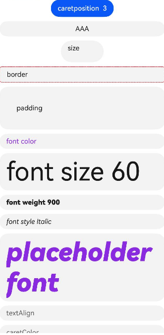

# TextArea

A multi-line text input component that automatically wraps text when the content exceeds the component's width. When height is not set, the component has no default height and adapts to the content height. When width is not set, it defaults to occupying the maximum available width.

## Import Module

```cangjie
import kit.ArkUI.*
```

## Child Components

None

## Creating the Component

### init(?ResourceStr, ?ResourceStr, ?TextAreaController)

```cangjie
public init(placeholder!: ?ResourceStr = None, text!: ?ResourceStr = None,
    controller!: ?TextAreaController = None)
```

**Function:** Creates a TextArea object containing placeholder text, current text content, and a controller.

**System Capability:** SystemCapability.ArkUI.ArkUI.Full

**Initial Version:** 22

**Parameters:**

| Parameter Name | Type | Required | Default Value | Description |
|:---|:---|:---|:---|:---|
| placeholder | ?[ResourceStr](./cj-common-types.md#interface-resourcestr) | No | None | **Named parameter.** Placeholder text displayed when there is no input. |
| text | ?[ResourceStr](./cj-common-types.md#interface-resourcestr) | No | None | **Named parameter.** Current value of the TextArea. |
| controller | ?[TextAreaController](#class-textareacontroller) | No | None | **Named parameter.** Controller for the TextArea component. |

## Common Attributes/Common Events

Common Attributes: All supported.

Common Events: All supported.

## Component Attributes

### func caretColor(?ResourceColor)

```cangjie
public func caretColor(value: ?ResourceColor): This
```

**Function:** Sets the color of the cursor.

**System Capability:** SystemCapability.ArkUI.ArkUI.Full

**Initial Version:** 22

**Parameters:**

| Parameter Name | Type | Required | Default Value | Description |
|:---|:---|:---|:---|:---|
| value | ?[ResourceColor](./cj-common-types.md#interface-resourcecolor) | Yes | - | Color of the cursor.<br>Initial value: 0xFF007DFF. |

### func enterKeyType(?EnterKeyType)

```cangjie
public func enterKeyType(value: ?EnterKeyType): This
```

**Function:** Sets the type of the input button on the soft keyboard.

**System Capability:** SystemCapability.ArkUI.ArkUI.Full

**Initial Version:** 22

**Parameters:**

| Parameter Name | Type | Required | Default Value | Description |
|:---|:---|:---|:---|:---|
| value | ?[EnterKeyType](./cj-common-types.md#enum-enterkeytype) | Yes | - | Type of the input button on the soft keyboard.<br>Initial value: EnterKeyType.NewLine. |

### func fontFamily(?ResourceStr)

```cangjie
public func fontFamily(value: ?ResourceStr): This
```

**Function:** Sets the font family of the text.

**System Capability:** SystemCapability.ArkUI.ArkUI.Full

**Initial Version:** 22

**Parameters:**

| Parameter Name | Type | Required | Default Value | Description |
|:---|:---|:---|:---|:---|
| value | ?[ResourceStr](./cj-common-types.md#interface-resourcestr) | Yes | - | Font family of the text.<br>Initial value: "HarmonyOS Sans". |

### func fontColor(?ResourceColor)

```cangjie
public func fontColor(value: ?ResourceColor): This
```

**Function:** Sets the color of the text.

**System Capability:** SystemCapability.ArkUI.ArkUI.Full

**Initial Version:** 22

**Parameters:**

| Parameter Name | Type | Required | Default Value | Description |
|:---|:---|:---|:---|:---|
| value | ?[ResourceColor](./cj-common-types.md#interface-resourcecolor) | Yes | - | Color of the text. |

### func fontSize(?Length)

```cangjie
public func fontSize(value: ?Length): This
```

**Function:** Sets the font size of the text.

**System Capability:** SystemCapability.ArkUI.ArkUI.Full

**Initial Version:** 22

**Parameters:**

| Parameter Name | Type | Required | Default Value | Description |
|:---|:---|:---|:---|:---|
| value | ?[Length](./cj-common-types.md#interface-length) | Yes | - | Font size of the text.<br>Initial value: 16.fp. |

### func fontStyle(?FontStyle)

```cangjie
public func fontStyle(value: ?FontStyle): This
```

**Function:** Sets the font style of the text.

**System Capability:** SystemCapability.ArkUI.ArkUI.Full

**Initial Version:** 22

**Parameters:**

| Parameter Name | Type | Required | Default Value | Description |
|:---|:---|:---|:---|:---|
| value | ?[FontStyle](./cj-common-types.md#enum-fontstyle) | Yes | - | Font style of the text.<br>Initial value: FontStyle.Normal. |

### func fontWeight(?FontWeight)

```cangjie
public func fontWeight(value: ?FontWeight): This
```

**Function:** Sets the font weight of the text.

**System Capability:** SystemCapability.ArkUI.ArkUI.Full

**Initial Version:** 22

**Parameters:**

| Parameter Name | Type | Required | Default Value | Description |
|:---|:---|:---|:---|:---|
| value | ?[FontWeight](./cj-common-types.md#enum-fontweight) | Yes | - | Font weight of the text.<br>Initial value: FontWeight.Normal. |

### func inputFilter(?ResourceStr, ?(String) -> Unit)

```cangjie
public func inputFilter(value!: ?ResourceStr, error!: ?(String) -> Unit = None): This
```

**Function:** Sets the input filtering rules for the text.

**System Capability:** SystemCapability.ArkUI.ArkUI.Full

**Initial Version:** 22

**Parameters:**

| Parameter Name | Type | Required | Default Value | Description |
|:---|:---|:---|:---|:---|
| value | ?[ResourceStr](./cj-common-types.md#interface-resourcestr) | Yes | - | **Named parameter.** Input filtering rules.<br>Initial value: "". |
| error | ?(String) -> Unit | No | None | **Named parameter.** Callback function for input errors. |

### func maxLength(?UInt32)

```cangjie
public func maxLength(value: ?UInt32): This
```

**Function:** Sets the maximum length of the text.

**System Capability:** SystemCapability.ArkUI.ArkUI.Full

**Initial Version:** 22

**Parameters:**

| Parameter Name | Type | Required | Default Value | Description |
|:---|:---|:---|:---|:---|
| value | ?UInt32 | Yes | - | Maximum length of the text. |

### func placeholderColor(?ResourceColor)

```cangjie
public func placeholderColor(value: ?ResourceColor): This
```

**Function:** Sets the color of the placeholder text.

**System Capability:** SystemCapability.ArkUI.ArkUI.Full

**Initial Version:** 22

**Parameters:**

| Parameter Name | Type | Required | Default Value | Description |
|:---|:---|:---|:---|:---|
| value | ?[ResourceColor](./cj-common-types.md#interface-resourcecolor) | Yes | - | Color of the placeholder text. |

### func placeholderFont(?Length, ?FontWeight, ?String, ?FontStyle)

```cangjie
public func placeholderFont(size!: ?Length, weight!: ?FontWeight = None, family!: ?String = None,
    style!: ?FontStyle = None): This
```

**Function:** Sets the font attributes of the placeholder text.

**System Capability:** SystemCapability.ArkUI.ArkUI.Full

**Initial Version:** 22

**Parameters:**

| Parameter Name | Type | Required | Default Value | Description |
|:---|:---|:---|:---|:---|
| size | ?[Length](./cj-common-types.md#interface-length) | Yes | - | **Named parameter.** Font size of the placeholder text.<br>Initial value: 16.0.fp. |
| weight | ?[FontWeight](./cj-common-types.md#enum-fontweight) | No | None | **Named parameter.** Font weight of the placeholder text.<br>Initial value: FontWeight.W400. |
| family | ?String | No | None | **Named parameter.** Font family of the placeholder text.<br>Initial value: "". |
| style | ?[FontStyle](./cj-common-types.md#enum-fontstyle) | No | None | **Named parameter.** Font style of the placeholder text.<br>Initial value: FontStyle.Normal. |

### func textAlign(?TextAlign)

```cangjie
public func textAlign(value: ?TextAlign): This
```

**Function:** Sets the horizontal alignment of the text.

**System Capability:** SystemCapability.ArkUI.ArkUI.Full

**Initial Version:** 22

**Parameters:**

| Parameter Name | Type | Required | Default Value | Description |
|:---|:---|:---|:---|:---|
| value | ?[TextAlign](./cj-common-types.md#enum-textalign) | Yes | - | Horizontal alignment of the text.<br>Initial value: TextAlign.Start. |

## Common Events

### func onChange(?(String) -> Unit)

```cangjie
public func onChange(callback: ?(String) -> Unit): This
```

**Function:** Triggers this callback when the input box content changes.

**System Capability:** SystemCapability.ArkUI.ArkUI.Full

**Initial Version:** 22

**Parameters:**

| Parameter Name | Type | Required | Default Value | Description |
|:---|:---|:---|:---|:---|
| callback | ?(String) -> Unit | Yes | - | Callback function when the input box content changes.<br>Initial value: { _ => }. |

### func onCopy(?(String) -> Unit)

```cangjie
public func onCopy(callback: ?(String) -> Unit): This
```

**Function:** Triggers this callback when using the clipboard menu.

**System Capability:** SystemCapability.ArkUI.ArkUI.Full

**Initial Version:** 22

**Parameters:**

| Parameter Name | Type | Required | Default Value | Description |
|:---|:---|:---|:---|:---|
| callback | ?(String) -> Unit | Yes | - | Callback function for copy operations.<br>Initial value: { _ => }. |

### func onCut(?(String) -> Unit)

```cangjie
public func onCut(callback: ?(String) -> Unit): This
```

**Function:** Triggers this callback when using the clipboard menu.

**System Capability:** SystemCapability.ArkUI.ArkUI.Full

**Initial Version:** 22

**Parameters:**

| Parameter Name | Type | Required | Default Value | Description |
|:---|:---|:---|:---|:---|
| callback | ?(String) -> Unit | Yes | - | Callback function for cut operations.<br>Initial value: { _ => }. |

### func onEditChange(?(Bool) -> Unit)

```cangjie
public func onEditChange(callback: ?(Bool) -> Unit): This
```

**Function:** Determines whether the text editing state has changed.

**System Capability:** SystemCapability.ArkUI.ArkUI.Full

**Initial Version:** 22

**Parameters:**

| Parameter Name | Type | Required | Default Value | Description |
|:---|:---|:---|:---|:---|
| callback | ?(Bool) -> Unit | Yes | - | Callback function triggered when the text area state changes.<br>Initial value: { _ => }. |

### func onPaste(?(String) -> Unit)

```cangjie
public func onPaste(callback: ?(String) -> Unit): This
```

**Function:** Triggers this callback when using the clipboard menu.

**System Capability:** SystemCapability.ArkUI.ArkUI.Full

**Initial Version:** 22

**Parameters:**

| Parameter Name | Type | Required | Default Value | Description |
|:---|:---|:---|:---|:---|
| callback | ?(String) -> Unit | Yes | - | Callback function for paste operations.<br>Initial value: { _ => }. |

### func onSubmit(?(EnterKeyType) -> Unit)

```cangjie
public func onSubmit(callback: ?(EnterKeyType) -> Unit): This
```

**Function:** Triggers this callback upon submission.

**System Capability:** SystemCapability.ArkUI.ArkUI.Full

**Initial Version:** 22

**Parameters:**

| Parameter Name | Type | Required | Default Value | Description |
|:---|:---|:---|:---|:---|
| callback | ?([EnterKeyType](./cj-common-types.md#enum-enterkeytype)) -> Unit | Yes | - | Callback function upon submission.<br>Initial value: { _ => }. |

## Basic Type Definitions

### class TextAreaController

```cangjie
public class TextAreaController {
    public init()
}
```

**Function:** TextAreaController is the controller for the TextArea component. Objects of this type can be defined and bound to the TextArea component to control it.

**System Capability:** SystemCapability.ArkUI.ArkUI.Full

**Initial Version:** 22

#### init()

```cangjie
public init()
```

**Function:** Constructor for TextAreaController.

**System Capability:** SystemCapability.ArkUI.ArkUI.Full

**Initial Version:** 22

#### func caretPosition(?Int32)

```cangjie
public func caretPosition(value: ?Int32): Unit
```

**Function:** Sets the position of the insertion cursor.

**System Capability:** SystemCapability.ArkUI.ArkUI.Full

**Initial Version:** 22

**Parameters:**

| Parameter Name | Type | Required | Default Value | Description |
|:---|:---|:---|:---|:---|
| value | ?Int32 | Yes | - | Length from the start of the string to the cursor position. |## Sample Code

<!--run-->

```cangjie
package ohos_app_cangjie_entry

import kit.ArkUI.*
import ohos.hilog.*
import ohos.arkui.state_macro_manage.*

@Entry
@Component
class EntryView {
    @State var placeholder: String = "please input your name"
    @State var name: String = "AAA"
    var controller: TextAreaController = TextAreaController()
    var scroller: Scroller = Scroller()
    func build() {
        Scroll(this.scroller) {
            Column(space: 10.px){
                Button("caretposition  3").onClick({
                    evt => controller.caretPosition(3)
                })

                TextArea(placeholder: this.placeholder, text: this.name, controller: controller)
                .textAlign(TextAlign.Center)

                TextArea(text: "size")
                .size(width: 100.vp, height: 50.vp).borderRadius(100.vp)

                TextArea(text: "border")
                .border(width: 1.vp, color: Color(0XFFFF0011), radius: 5.vp, style: BorderStyle.Dashed )

                TextArea(text: "padding")
                .padding(40.vp)

                TextArea(text: "font color")
                .fontColor(0x8A2BE2)

                TextArea(text: "font size 60")
                .fontSize(60)

                TextArea(text: "font weight 900")
                .fontWeight(FontWeight.W900)

                TextArea(text: "font style Italic")
                .fontStyle(FontStyle.Italic)

                TextArea(placeholder: "placeholder font")
                .placeholderColor(Color(0x8A2BE2))
                .placeholderFont(size:60.0, weight: FontWeight.W900, family:"Georgia", style:FontStyle.Italic)

                TextArea(placeholder: "textAlign")
                .textAlign(TextAlign.Start)

                TextArea(placeholder: "caretColor")
                .caretColor(Color.Red)

                TextArea(placeholder: "inputfilter only a")
                .inputFilter(value: "a" , error: { val => Hilog.info(0, "cangjie",  "TextArea OnError:" + val) })

                TextArea(placeholder: "TextArea callback")
                .onChange ({ val =>
                Hilog.info(0, "cangjie", "TextArea onChange:" + val)
                })
                .onPaste ({ val =>
                    Hilog.info(0, "cangjie", "TextArea onPaste:" + val)
                })
                .onCut ({ val =>
                    Hilog.info(0, "cangjie", "TextArea onCut:" + val)
                })
                .onCopy ({ val =>
                    Hilog.info(0, "cangjie", "TextArea onCopy:" + val)
                })
                .onSubmit ({ val =>
                    Hilog.info(0, "cangjie", "TextArea onSubmit")
                })
            }
            .height(100.percent)
            .width(100.percent)
        }
    }
}
```

