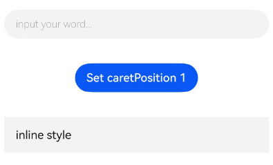

# TextInput

<!--Del-->
> **Note:**
>
> Currently in the beta phase.
<!--DelEnd-->

A single-line text input component. Currently only basic input mode is supported with no special restrictions.

## Import Module

```cangjie
import kit.ArkUI.*
```

## Subcomponents

None

## Creating the Component

### init(?ResourceStr, ?ResourceStr, ?TextInputController)

```cangjie
public init(placeholder!: ?ResourceStr = None, text!: ?ResourceStr = None, controller!: ?TextInputController = None)
```

**Function:** Creates a TextInput object containing placeholder text, current text content, and a controller.

**System Capability:** SystemCapability.ArkUI.ArkUI.Full

**Since:** 22

**Parameters:**

| Parameter Name | Type | Required | Default Value | Description |
|:---|:---|:---|:---|:---|
| placeholder | ?[ResourceStr](./cj-common-types.md#interface-resourcestr) | No | None | **Named parameter.** Placeholder text displayed when there is no input. |
| text | ?[ResourceStr](./cj-common-types.md#interface-resourcestr) | No | None | **Named parameter.** Current value of the TextInput. |
| controller | ?[TextInputController](#class-textinputcontroller) | No | None | **Named parameter.** Controller for the TextInput component. |

## Common Attributes/Common Events

Common Attributes: All supported.

Common Events: All supported.

## Component Attributes

### func caretColor(?ResourceColor)

```cangjie
public func caretColor(value: ?ResourceColor): This
```

**Function:** Sets the color of the cursor.

**System Capability:** SystemCapability.ArkUI.ArkUI.Full

**Since:** 22

**Parameters:**

| Parameter Name | Type | Required | Default Value | Description |
|:---|:---|:---|:---|:---|
| value | ?[ResourceColor](./cj-common-types.md#interface-resourcecolor) | Yes | - | Color of the cursor.<br>Default: 0xFF007DFF. |

### func customKeyboard(?CustomBuilder, ?Bool)

```cangjie
public func customKeyboard(value: ?CustomBuilder, supportAvoidance!: ?Bool = None): This
```

**Function:** Defines a custom keyboard for text input.

**System Capability:** SystemCapability.ArkUI.ArkUI.Full

**Since:** 22

**Parameters:**

| Parameter Name | Type | Required | Default Value | Description |
|:---|:---|:---|:---|:---|
| value | ?[CustomBuilder](./cj-common-types.md#type-custombuilder) | Yes | - | Sets the custom keyboard for TextInput.<br>Default: { => }. |
| supportAvoidance | ?Bool | No | None | **Named parameter.** Custom keyboard option for TextInput.<br>Default: false. |

### func enableKeyboardOnFocus(?Bool)

```cangjie
public func enableKeyboardOnFocus(value: ?Bool): This
```

**Function:** Sets whether to request the keyboard when gaining focus.

**System Capability:** SystemCapability.ArkUI.ArkUI.Full

**Since:** 22

**Parameters:**

| Parameter Name | Type | Required | Default Value | Description |
|:---|:---|:---|:---|:---|
| value | ?Bool | Yes | - | Sets whether to request the keyboard when gaining focus.<br>Default: true. |

### func enterKeyType(?EnterKeyType)

```cangjie
public func enterKeyType(value: ?EnterKeyType): This
```

**Function:** Sets the type of the soft keyboard's enter key.

**System Capability:** SystemCapability.ArkUI.ArkUI.Full

**Since:** 22

**Parameters:**

| Parameter Name | Type | Required | Default Value | Description |
|:---|:---|:---|:---|:---|
| value | ?[EnterKeyType](./cj-common-types.md#enum-enterkeytype) | Yes | - | Type of the soft keyboard's enter key.<br>Default: EnterKeyType.Done. |

### func fontFamily(?ResourceStr)

```cangjie
public func fontFamily(value: ?ResourceStr): This
```

**Function:** Sets the font family of the text.

**System Capability:** SystemCapability.ArkUI.ArkUI.Full

**Since:** 22

**Parameters:**

| Parameter Name | Type | Required | Default Value | Description |
|:---|:---|:---|:---|:---|
| value | ?[ResourceStr](./cj-common-types.md#interface-resourcestr) | Yes | - | Font family of the text.<br>Default: "HarmonyOS Sans". |

### func fontColor(?ResourceColor)

```cangjie
public func fontColor(value: ?ResourceColor): This
```

**Function:** Sets the color of the text.

**System Capability:** SystemCapability.ArkUI.ArkUI.Full

**Since:** 22

**Parameters:**

| Parameter Name | Type | Required | Default Value | Description |
|:---|:---|:---|:---|:---|
| value | ?[ResourceColor](./cj-common-types.md#interface-resourcecolor) | Yes | - | Color of the text.<br>Default: 0xdbffffff. |

### func fontSize(?Length)

```cangjie
public func fontSize(value: ?Length): This
```

**Function:** Sets the font size of the text.

**System Capability:** SystemCapability.ArkUI.ArkUI.Full

**Since:** 22

**Parameters:**

| Parameter Name | Type | Required | Default Value | Description |
|:---|:---|:---|:---|:---|
| value | ?[Length](./cj-common-types.md#interface-length) | Yes | - | Font size of the text. |

### func fontStyle(?FontStyle)

```cangjie
public func fontStyle(value: ?FontStyle): This
```

**Function:** Sets the font style of the text.

**System Capability:** SystemCapability.ArkUI.ArkUI.Full

**Since:** 22

**Parameters:**

| Parameter Name | Type | Required | Default Value | Description |
|:---|:---|:---|:---|:---|
| value | ?[FontStyle](./cj-common-types.md#enum-fontstyle) | Yes | - | Font style of the text.<br>Default: FontStyle.Normal. |

### func fontWeight(?FontWeight)

```cangjie
public func fontWeight(value: ?FontWeight): This
```

**Function:** Sets the font weight of the text.

**System Capability:** SystemCapability.ArkUI.ArkUI.Full

**Since:** 22

**Parameters:**

| Parameter Name | Type | Required | Default Value | Description |
|:---|:---|:---|:---|:---|
| value | ?[FontWeight](./cj-common-types.md#enum-fontweight) | Yes | - | Font weight of the text.<br>Default: FontWeight.Normal. |

### func inputFilter(?ResourceStr, ?(String) -> Unit)

```cangjie
public func inputFilter(value: ?ResourceStr, error!: ?(String) -> Unit = None): This
```

**Function:** Sets the input filtering rules for the text.

**System Capability:** SystemCapability.ArkUI.ArkUI.Full

**Since:** 22

**Parameters:**

| Parameter Name | Type | Required | Default Value | Description |
|:---|:---|:---|:---|:---|
| value | ?[ResourceStr](./cj-common-types.md#interface-resourcestr) | Yes | - | Input filtering rules.<br>Default: "". |
| error | ?(String) -> Unit | No | None | **Named parameter.** Callback function for input errors. |

### func maxLength(?UInt32)

```cangjie
public func maxLength(value: ?UInt32): This
```

**Function:** Sets the maximum length of the text.

**System Capability:** SystemCapability.ArkUI.ArkUI.Full

**Since:** 22

**Parameters:**

| Parameter Name | Type | Required | Default Value | Description |
|:---|:---|:---|:---|:---|
| value | ?UInt32 | Yes | - | Maximum length of the text. |

### func maxLines(?Int32)

```cangjie
public func maxLines(value: ?Int32): This
```

**Function:** Defines the maximum number of lines for text input.

**System Capability:** SystemCapability.ArkUI.ArkUI.Full

**Since:** 22

**Parameters:**

| Parameter Name | Type | Required | Default Value | Description |
|:---|:---|:---|:---|:---|
| value | ?Int32 | Yes | - | Maximum number of lines for text input.<br>Default: 3. |

### func placeholderColor(?ResourceColor)

```cangjie
public func placeholderColor(value: ?ResourceColor): This
```

**Function:** Sets the color of the placeholder text.

**System Capability:** SystemCapability.ArkUI.ArkUI.Full

**Since:** 22

**Parameters:**

| Parameter Name | Type | Required | Default Value | Description |
|:---|:---|:---|:---|:---|
| value | ?[ResourceColor](./cj-common-types.md#interface-resourcecolor) | Yes | - | Color of the placeholder text. |

### func placeholderFont(?Length, ?FontWeight, ?String, ?FontStyle)

```cangjie
public func placeholderFont(size!: ?Length, weight!: ?FontWeight = None, family!: ?String = None,
    style!: ?FontStyle = None): This
```

**Function:** Sets the font attributes of the placeholder text.

**System Capability:** SystemCapability.ArkUI.ArkUI.Full

**Since:** 22

**Parameters:**

| Parameter Name | Type | Required | Default Value | Description |
|:---|:---|:---|:---|:---|
| size | ?[Length](./cj-common-types.md#interface-length) | Yes | - | **Named parameter.** Font size of the placeholder text.<br>Default: (-1.0).px. |
| weight | ?[FontWeight](./cj-common-types.md#enum-fontweight) | No | None | **Named parameter.** Font weight of the placeholder text.<br>Default: FontWeight.W400. |
| family | ?String | No | None | **Named parameter.** Font family of the placeholder text.<br>Default: "". |
| style | ?[FontStyle](./cj-common-types.md#enum-fontstyle) | No | None | **Named parameter.** Font style of the placeholder text.<br>Default: FontStyle.Normal. |

### func selectionMenuHidden(?Bool)

```cangjie
public func selectionMenuHidden(value: ?Bool): This
```

**Function:** Controls whether the selection menu pops up.

**System Capability:** SystemCapability.ArkUI.ArkUI.Full

**Since:** 22

**Parameters:**

| Parameter Name | Type | Required | Default Value | Description |
|:---|:---|:---|:---|:---|
| value | ?Bool | Yes | - | Controls whether the selection menu pops up.<br>Default: false. |

### func showUnderline(?Bool)

```cangjie
public func showUnderline(value: ?Bool): This
```

**Function:** Defines whether to display the underline for text input.

**System Capability:** SystemCapability.ArkUI.ArkUI.Full

**Since:** 22

**Parameters:**

| Parameter Name | Type | Required | Default Value | Description |
|:---|:---|:---|:---|:---|
| value | ?Bool | Yes | - | Defines whether to display the underline for text input.<br>Default: false. |

### func style(?TextInputStyle)

```cangjie
public func style(value: ?TextInputStyle): This
```

**Function:** Text input style.

**System Capability:** SystemCapability.ArkUI.ArkUI.Full

**Since:** 22

**Parameters:**

| Parameter Name | Type | Required | Default Value | Description |
|:---|:---|:---|:---|:---|
| value | ?[TextInputStyle](./cj-common-types.md#enum-textinputstyle) | Yes | - | Text input style.<br>Default: TextInputStyle.Default. |

### func textAlign(?TextAlign)

```cangjie
public func textAlign(value: ?TextAlign): This
```

**Function:** Sets the horizontal alignment of the text.

**System Capability:** SystemCapability.ArkUI.ArkUI.Full

**Since:** 22

**Parameters:**

| Parameter Name | Type | Required | Default Value | Description |
|:---|:---|:---|:---|:---|
| value | ?[TextAlign](./cj-common-types.md#enum-textalign) | Yes | - | Horizontal alignment of the text.<br>Default: TextAlign.Start. |

## Component Events

### func onChange(?(String) -> Unit)

```cangjie
public func onChange(callback: ?(String) -> Unit): This
```

**Function:** Triggered when the content of the input box changes.

**System Capability:** SystemCapability.ArkUI.ArkUI.Full

**Since:** 22

**Parameters:**

| Parameter Name | Type | Required | Default Value | Description |
|:---|:---|:---|:---|:---|
| callback | ?(String) -> Unit | Yes | - | Callback function when the content of the input box changes.<br>Default: { _ => }. |

### func onCopy(?(String) -> Unit)

```cangjie
public func onCopy(callback: ?(String) -> Unit): This
```

**Function:** Triggered when using the clipboard menu.

**System Capability:** SystemCapability.ArkUI.ArkUI.Full

**Since:** 22

**Parameters:**

| Parameter Name | Type | Required | Default Value | Description |
|:---|:---|:---|:---|:---|
| callback | ?(String) -> Unit | Yes | - | Callback function for copy operations.<br>Default: { _ => }. |

### func onCut(?(String) -> Unit)

```cangjie
public func onCut(callback: ?(String) -> Unit): This
```

**Function:** Triggered when using the clipboard menu.

**System Capability:** SystemCapability.ArkUI.ArkUI.Full

**Since:** 22

**Parameters:**

| Parameter Name | Type | Required | Default Value | Description |
|:---|:---|:---|:---|:---|
| callback | ?(String) -> Unit | Yes | - | Callback function for cut operations.<br>Default: { _ => }. |

### func onEditChange(?(Bool) -> Unit)

```cangjie
public func onEditChange(callback: ?(Bool) -> Unit): This
```

**Function:** Determines whether the text editing state has changed.

**System Capability:** SystemCapability.ArkUI.ArkUI.Full

**Since:** 22

**Parameters:**

| Parameter Name | Type | Required | Default Value | Description |
|:---|:---|:---|:---|:---|
| callback | ?(Bool) -> Unit | Yes | - | Callback function when the text editing state changes.<br>Default: { _ => }. |

### func onPaste(?(String) -> Unit)

```cangjie
public func onPaste(callback: ?(String) -> Unit): This
```

**Function:** Triggered when using the clipboard menu.

**System Capability:** SystemCapability.ArkUI.ArkUI.Full

**Since:** 22

**Parameters:**

| Parameter Name | Type | Required | Default Value | Description |
|:---|:---|:---|:---|:---|
| callback | ?(String) -> Unit | Yes | - | Callback function for paste operations.<br>Default: { _ => }. |

### func onSubmit(?(EnterKeyType) -> Unit)

```cangjie
public func onSubmit(callback: ?(EnterKeyType) -> Unit): This
```

**Function:** Triggered upon submission.

**System Capability:** SystemCapability.ArkUI.ArkUI.Full

**Since:** 22

**Parameters:**

| Parameter Name | Type | Required | Default Value | Description |
|:---|:---|:---|:---|:---|
| callback | ?([EnterKeyType](./cj-common-types.md#enum-enterkeytype)) -> Unit | Yes | - | Callback function upon submission.<br>Default: { _ => }. |## Basic Type Definitions

### class TextInputController

```cangjie
public class TextInputController {
    public init()
}
```

**Function:** TextInputController is the controller for the TextInput component. You can define an object of this type and bind it to a TextInput component to control the component.

**System Capability:** SystemCapability.ArkUI.ArkUI.Full

**Since:** 22

#### init()

```cangjie
public init()
```

**Function:** Constructor for TextInputController.

**System Capability:** SystemCapability.ArkUI.ArkUI.Full

**Since:** 22

#### func caretPosition(?Int32)

```cangjie
public func caretPosition(value: ?Int32): Unit
```

**Function:** Sets the position of the insertion cursor.

**System Capability:** SystemCapability.ArkUI.ArkUI.Full

**Since:** 22

**Parameters:**

| Parameter | Type | Required | Default Value | Description |
|:---|:---|:---|:---|:---|
| value | ?Int32 | Yes | - | The cursor position. |

#### func setTextSelection(?Int32, ?Int32, ?MenuPolicy)

```cangjie
public func setTextSelection(selectionStart: ?Int32, selectionEnd: ?Int32, options!: ?MenuPolicy = None): Unit
```

**Function:** Selects text by specifying the start and end positions of the text.

**System Capability:** SystemCapability.ArkUI.ArkUI.Full

**Since:** 22

**Parameters:**

| Parameter | Type | Required | Default Value | Description |
|:---|:---|:---|:---|:---|
| selectionStart | ?Int32 | Yes | - | The start position of the selected text. |
| selectionEnd | ?Int32 | Yes | - | The end position of the selected text. |
| options | ?[MenuPolicy](./cj-common-types.md#enum-menupolicy) | No | None | **Named parameter.** Options for text selection.<br>Default value: MenuPolicy.Default. |

#### func stopEditing()

```cangjie
public func stopEditing(): Unit
```

**Function:** Exits the editing state.

**System Capability:** SystemCapability.ArkUI.ArkUI.Full

**Since:** 22

## Example Code

<!--run-->

```cangjie
package ohos_app_cangjie_entry
import kit.ArkUI.*
import ohos.hilog.*
import ohos.arkui.state_macro_manage.*

@Entry
@Component
class EntryView {
    @State var text: String = ''
    @State var passwordState: Bool = false
    var controller: TextInputController = TextInputController()

    func build() {
    Column() {
        TextInput(text: this.text, placeholder: 'input your word...', controller: this.controller)
            .placeholderColor(Color.Gray)
            .placeholderFont(size: 14, weight: FontWeight.W100)
            .caretColor(Color.Blue)
            .width(95.percent)
            .height(40)
            .margin(20)
            .fontSize(14)
            .fontColor(Color.Black)
            .inputFilter('[a-z]', error: { info: String =>
              Hilog.error(0, "AppLogCj", "inputFilter error")
            })
            .onChange({ value: String =>
              this.text = value
            })
        Text(this.text)
        Button('Set caretPosition 1')
            .margin(15)
            .onClick({ evt => 
                // Move the caret to after first entered character.
                this.controller.caretPosition(1)
            })
        // Inline style input field
        TextInput( text: 'inline style' )
            .width(95.percent)
            .height(50)
            .margin(20)
            .borderRadius(0)
            .style(TextInputStyle.Inline)
        }.
        width(100.percent)
    }
}
```

