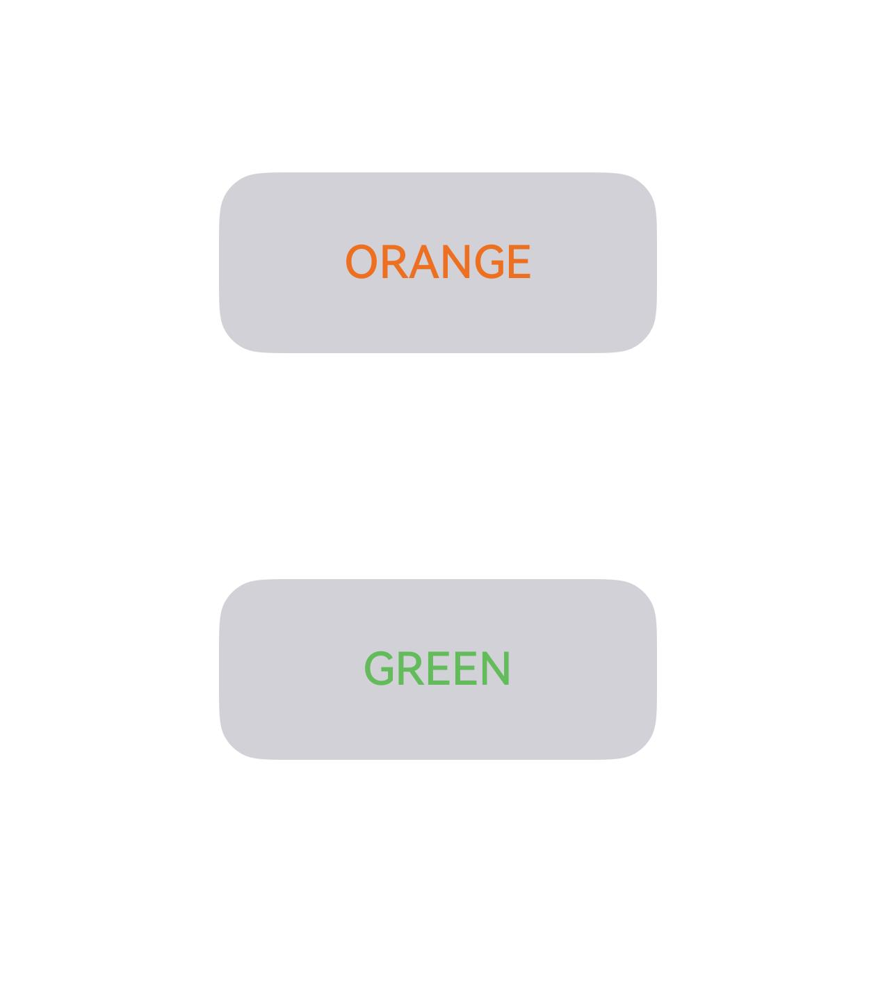

# Foreground Color Setting

<!--Del-->
> **Note:**
>
> Currently in the beta phase.
<!--DelEnd-->

Sets the foreground color of a component.

## Import Module

```cangjie
import kit.ArkUI.*
```

## func foregroundColor(?ColoringStrategy)

```cangjie
func foregroundColor(value: ?ColoringStrategy): T
```

**Function:** Sets the foreground color of a component. When no foreground color is set for a component, it inherits from its parent component by default.

**System Capability:** SystemCapability.ArkUI.ArkUI.Full

**Since:** 22

**Parameters:**

| Parameter | Type | Required | Default Value | Description |
|:---|:---|:---|:---|:---|
| value | ?[ColoringStrategy](./cj-common-types.md#enum-coloringstrategy) | Yes | - | Sets the foreground color of the component or configures it based on intelligent color selection strategy. Does not support property animation. <br/>Initial value: Color.Transparent. |

**Return Value:**

| Type | Description |
|:---|:---|
| T | Returns the current component. |

## func foregroundColor(?ResourceColor)

```cangjie
func foregroundColor(value: ?ResourceColor): T
```

**Function:** Sets the foreground color of a component. When no foreground color is set for a component, it inherits from its parent component by default.

**System Capability:** SystemCapability.ArkUI.ArkUI.Full

**Since:** 22

**Parameters:**

| Parameter | Type | Required | Default Value | Description |
|:---|:---|:---|:---|:---|
| value | ?[ResourceColor](./cj-common-types.md#interface-resourcecolor) | Yes | - | Sets the foreground color of the component or configures it based on intelligent color selection strategy. Does not support property animation. <br/>Initial value: Color.Transparent. |

**Return Value:**

| Type | Description |
|:---|:---|
| T | Returns the current component. |

## Example Code

### Example 1 (Setting Foreground Color)

This example demonstrates setting the foreground color using `foregroundColor`.

<!-- run -->

```cangjie
package ohos_app_cangjie_entry
import kit.UIKit.*
import ohos.state_macro_manage.*

@Entry
@Component
class EntryView {
    func build() {
        Column(100) {
            Button("GREEN")
                .width(50.percent)
                .height(80)
                .fontSize(20)
                .foregroundColor(Color.GREEN)
            Button("RED")
                .width(50.percent)
                .height(80)
                .fontSize(20)
                .foregroundColor(Color.RED)
            }
            .width(100.percent)
        }
}
```



### Example 2 (Setting Foreground Color as Background Color Inversion)

This example uses `INVERT` to set the foreground color as the inversion of the background color.

<!-- run -->

```cangjie
package ohos_app_cangjie_entry
import kit.UIKit.*
import ohos.state_macro_manage.*

@Entry
@Component
class EntryView {
    func build() {
        Column(100) {
            Button("NO INVERT")
                .width(100.percent)
                .height(80)
                .fontSize(20)
                .backgroundColor(Color.BLUE)
            Button("INVERT")
                .width(100.percent)
                .height(80)
                .fontSize(20)
                .backgroundColor(Color.BLUE)
                .foregroundColor(INVERT)
            }
            .width(100.percent)
        }
}
```


### Example 3 (Foreground Color Not Inherited from Parent Component)

This example compares the effects of setting both foreground and background colors versus setting only the background color.

<!-- run -->

```cangjie
package ohos_app_cangjie_entry
import kit.UIKit.*
import ohos.state_macro_manage.*

@Entry
@Component
class EntryView {
    func build() {
        Column(100) {
            Button("Set foreground color to blue")
                .width(100.percent)
                .height(80)
                .fontSize(20)
                .backgroundColor(Color.GRAY)
                .foregroundColor(Color.BLUE)

            Button("Foreground color not set (inherits from parent)")
                .width(100.percent)
                .height(80).fontSize(20)
                .backgroundColor(Color.GRAY)
            }
            .width(100.percent)
        }
}
```

