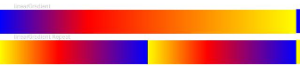
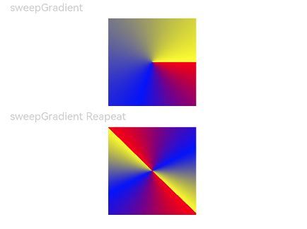
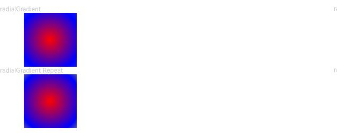

# Color Gradient

Set the color gradient effect for components.

> **Note:**
>
> - Color gradient is part of the component content and is drawn above the background.
> - Color gradient does not support explicit width/height animations. When width/height animations are executed, the color gradient will directly transition to the end state.

## Import Module

```cangjie
import kit.ArkUI.*
```

## func linearGradient(?Float64, ?GradientDirection, ?Array\<(ResourceColor, Float64)>, ?Bool)

```cangjie
func linearGradient(angle!: ?Float64, direction!: ?GradientDirection,
    colors!: ?Array<(ResourceColor, Float64)>, repeating!: ?Bool): T
```

**Function:** Sets a linear gradient.

**System Capability:** SystemCapability.ArkUI.ArkUI.Full

**Since:** 22

**Parameters:**

| Parameter | Type | Required | Default | Description |
|:---|:---|:---|:---|:---|
| angle | ?Float64 | Yes | - | **Named parameter.** The starting angle of the linear gradient. Positive angles are measured clockwise from the 0-degree position. |
| direction | ?[GradientDirection](./cj-common-types.md#enum-gradientdirection) | Yes | - | **Named parameter.** The direction of the linear gradient. This parameter does not take effect if angle is set.<br>Default: GradientDirection.Bottom. |
| colors | ?Array\<([ResourceColor](./cj-common-types.md#interface-resourcecolor), Float64)> | Yes | - | **Named parameter.** An array specifying gradient colors and their corresponding percentage positions. Invalid colors will be skipped.<br>Default: [(Color.Transparent, 0.0)]. |
| repeating | ?Bool | Yes | - | **Named parameter.** Repeats the gradient colors.<br>Default: false. |


## func sweepGradient(?(Length, Length), ?Float64, ?Float64, ?Float64, ?Array\<(ResourceColor, Float64)>, ?Bool)

```cangjie
func sweepGradient(center: ?(Length, Length), start!: ?Float64, end!: ?Float64,
    rotation!: ?Float64, colors!: ?Array<(ResourceColor, Float64)>,
    repeating!: ?Bool): T
```

**Function:** Sets an angular gradient.

**System Capability:** SystemCapability.ArkUI.ArkUI.Full

**Since:** 22

**Parameters:**

| Parameter | Type | Required | Default | Description |
|:---|:---|:---|:---|:---|
| center | ?([Length](./cj-common-types.md#interface-length), [Length](./cj-common-types.md#interface-length)) | Yes | - | The center coordinates relative to the top-left corner of the current component.<br>Default: (0.0.vp, 0.0.vp). |
| start | ?Float64 | Yes | - | **Named parameter.** The starting point of the angular gradient.<br>Default: 0.0. |
| end | ?Float64 | Yes | - | **Named parameter.** The ending point of the angular gradient.<br>Default: 0.0. |
| rotation | ?Float64 | Yes | - | **Named parameter.** The rotation angle of the angular gradient.<br>Default: 0.0. |
| colors | ?Array\<([ResourceColor](./cj-common-types.md#interface-resourcecolor), Float64)> | Yes | - | **Named parameter.** An array specifying gradient colors and their corresponding percentage positions. Invalid colors will be skipped.<br>Default: [(Color.Transparent, 0.0)]. |
| repeating | ?Bool | Yes | - | **Named parameter.** Repeats the gradient colors.<br>Default: false. |


## func radialGradient(?(Length, Length), ?Length, ?Array\<(ResourceColor, Float64)>, ?Bool)

```cangjie
func radialGradient(center: ?(Length, Length), radius: ?Length, colors: ?Array<(ResourceColor, Float64)>,
    repeating!: ?Bool): T
```

**Function:** Sets a radial gradient.

**System Capability:** SystemCapability.ArkUI.ArkUI.Full

**Since:** 22

**Parameters:**

| Parameter | Type | Required | Default | Description |
|:---|:---|:---|:---|:---|
| center | ?([Length](./cj-common-types.md#interface-length), [Length](./cj-common-types.md#interface-length)) | Yes | - | The center coordinates relative to the top-left corner of the current component.<br>Default: (0.0.px, 0.0.px). |
| radius | ?[Length](./cj-common-types.md#interface-length) | Yes | - | The radius of the radial gradient. |
| colors | ?Array\<([ResourceColor](./cj-common-types.md#interface-resourcecolor), Float64)> | Yes | - | An array specifying gradient colors and their corresponding percentage positions. Invalid colors will be skipped.<br>Default: []. |
| repeating | ?Bool | Yes | - | **Named parameter.** Repeats the gradient colors.<br>Default: false. |


## Example Code

### Example 1 (Linear Gradient from Right to Left)

This example demonstrates a linear color gradient using linearGradient.

<!-- run -->

```cangjie
package ohos_app_cangjie_entry
import kit.UIKit.*
import ohos.state_macro_manage.*

@Entry
@Component
class EntryView {
    func build() {
        Column() {
            Text("linearGradient")
                .fontSize(24.px)
                .width(90.percent)
                .fontColor(Color(0xCCCCCC))
            Row()
                .width(100.percent)
                .height(100.px)
                .linearGradient(
                    angle: 90.0,
                    colors: [(Color(0x0000ff), 0.0), (Color(0xff0000), 0.3), (Color(0xffff00), 1.0)],
                    repeating: false
                )

            Text("linearGradient Repeat")
                .fontSize(24.px)
                .width(90.percent)
                .fontColor(Color(0xCCCCCC))
            Row()
                .width(100.percent)
                .height(100.px)
                .linearGradient(
                    colors: [(Color(0x0000ff), 0.0), (Color(0xff0000), 0.3), (Color(0xffff00), 0.5)],
                    direction: GradientDirection.Left,
                    repeating: true
                )
        }
    }
}
```



### Example 2 (Angular Gradient with Rotation)

This example demonstrates an angular color gradient using sweepGradient.

<!-- run -->

```cangjie
package ohos_app_cangjie_entry
import kit.UIKit.*
import ohos.state_macro_manage.*

@Entry
@Component
class EntryView {
    func build() {
        Column() {
            Text("sweepGradient")
                .fontSize(24.px)
                .width(30.percent)
                .fontColor(Color(0xCCCCCC))
            Row()
                .width(200.px)
                .height(200.px)
                .sweepGradient(
                    (100.0.px, 100.0.px),
                    start: 0.0,
                    end: 359.0,
                    colors: [(Color(0xff0000), 0.0), (Color(0x0000ff), 0.3), (Color(0xffff00), 1.0)],
                    repeating: false
                )

            Text("sweepGradient Reapeat")
                .fontSize(24.px)
                .width(30.percent)
                .fontColor(Color(0xCCCCCC))
            Row()
                .width(200.px)
                .height(200.px)
                .sweepGradient(
                    (100.0.px, 100.0.px),
                    start: 0.0,
                    end: 359.0,
                    rotation: 45.0,
                    colors: [(Color(0xff0000), 0.0), (Color(0x0000ff), 0.3), (Color(0xffff00), 0.5)],
                    repeating: true
                )
        }
    }
}
```



### Example 3 (Radial Gradient)

This example demonstrates a radial color gradient using radialGradient.

<!-- run -->

```cangjie
package ohos_app_cangjie_entry
import kit.UIKit.*
import ohos.state_macro_manage.*

@Entry
@Component
class EntryView {
    func build() {
        Column() {
            Text("radialGradient")
                .fontSize(24.px)
                .width(30.percent)
                .fontColor(Color(0xCCCCCC))
            Row()
                .width(200.px)
                .height(200.px)
                .radialGradient(
                    (100.0.px, 100.0.px),
                    120.0,
                    colors: [(Color(0xff0000), 0.0), (Color(0x0000ff), 0.3), (Color(0xffff00), 1.0)]
                )

            Text("radialGradient Repeat")
                .fontSize(24.px)
                .width(30.percent)
                .fontColor(Color(0xCCCCCC))
            Row()
                .width(200.px)
                .height(200.px)
                .radialGradient(
                    (100.0.px, 100.0.px),
                    120.0,
                    colors: [(Color(0xff0000), 0.0), (Color(0x0000ff), 0.3), (Color(0xffff00), 0.5)],
                    repeating: true
                )
        }
    }
}
```

