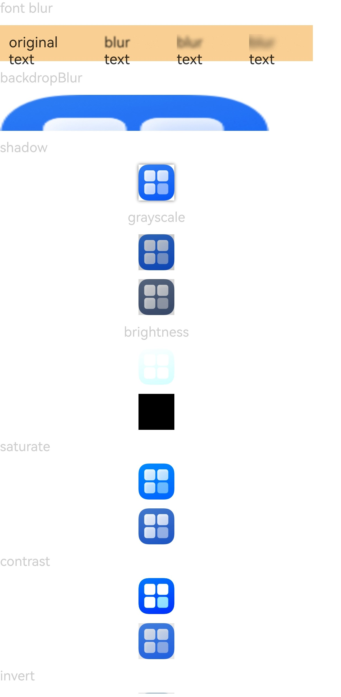
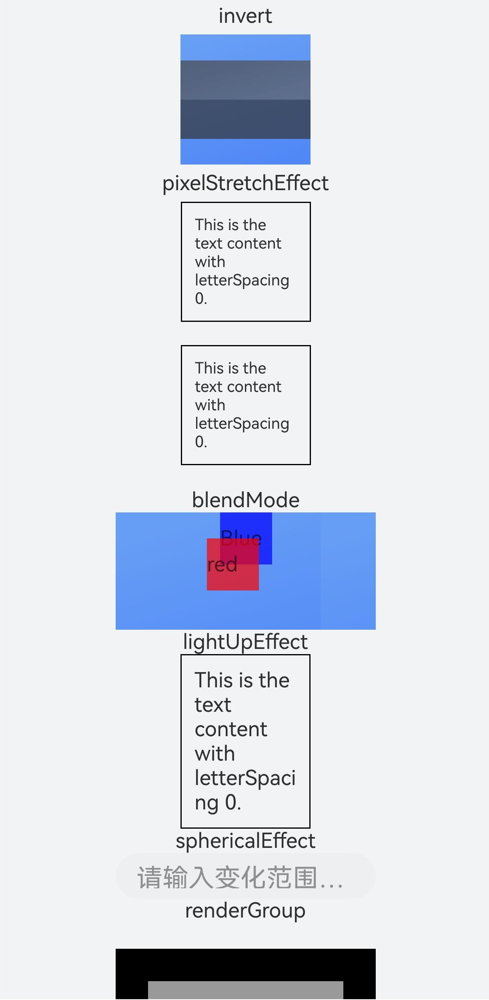
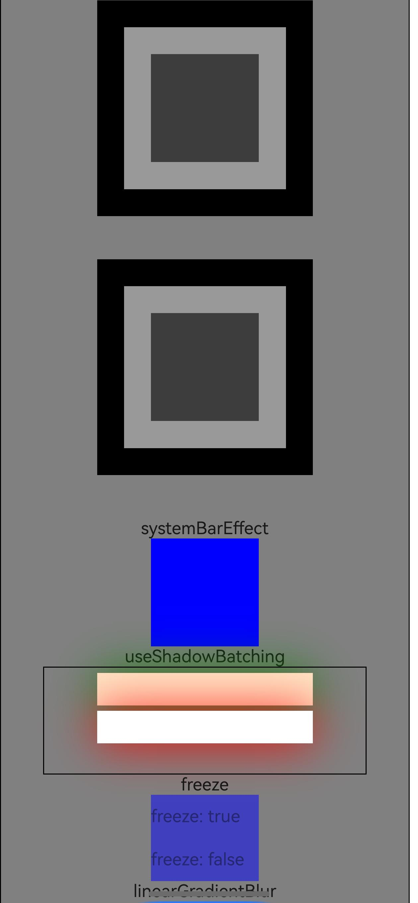
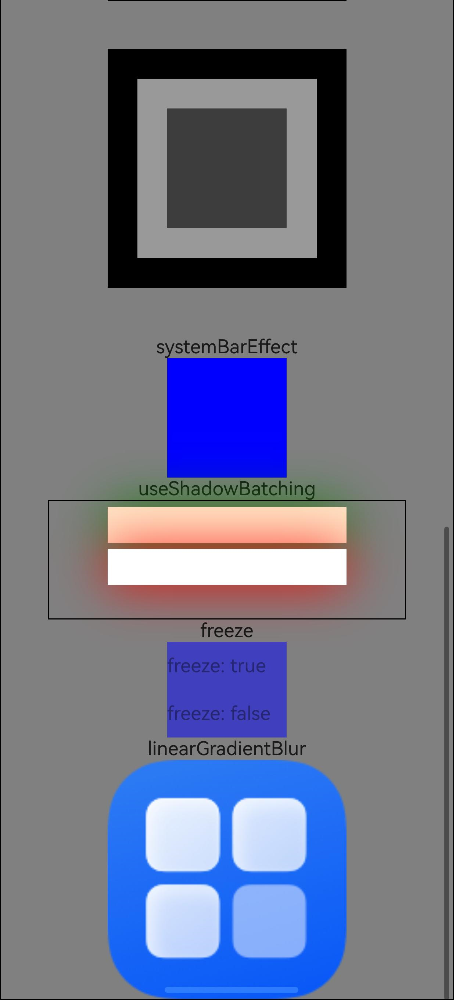

# Image Effects

Configure blur, shadow, spherical effects for components, and set image effects for pictures.

## Import Module

```cangjie
import kit.ArkUI.*
```

## func blur(?Float64)

```cangjie
public func blur(value: ?Float64): T
```

**Function:** Adds a content blur effect to the current component. The input parameter is the blur radius—the larger the radius, the more blurred the content becomes. A value of 0 means no blur.

**System Capability:** SystemCapability.ArkUI.ArkUI.Full

**Since:** 22

**Parameters:**

| Parameter | Type | Required | Default | Description |
|:---|:---|:---|:---|:---|
| value | ?Float64 | Yes | - | Blur radius. Initial value: 0.0 |

**Return Value:**

| Type | Description |
|:---|:---|
| T | Returns the component instance itself that called this interface. |


## func colorBlend(?ResourceColor)

```cangjie
public func colorBlend(value: ?ResourceColor): T
```

**Function:** Adds a color blending effect to the component.

**System Capability:** SystemCapability.ArkUI.ArkUI.Full

**Since:** 22

**Parameters:**

| Parameter | Type | Required | Default | Description |
|:---|:---|:---|:---|:---|
| value | ?[ResourceColor](./cj-common-types.md#interface-resourcecolor) | Yes | - | Color blending value. Initial value: Color.Transparent |

**Return Value:**

| Type | Description |
|:---|:---|
| T | Returns the component instance itself that called this interface. |


## func backdropBlur(?Float64)

```cangjie
public func backdropBlur(value: ?Float64): T
```

**Function:** Adds a background blur effect to the component, allowing customization of the blur radius.

**System Capability:** SystemCapability.ArkUI.ArkUI.Full

**Since:** 22

**Parameters:**

| Parameter | Type | Required | Default | Description |
|:---|:---|:---|:---|:---|
| value | ?Float64 | Yes | - | Blur radius. Initial value: 0.0 |

**Return Value:**

| Type | Description |
|:---|:---|
| T | Returns the component instance itself that called this interface. |


## func shadow(?Float64, ?ResourceColor, ?Float64, ?Float64)

```cangjie
public func shadow(radius!: ?Float64, color!: ?ResourceColor = None, offsetX!: ?Float64 = None, offsetY!: ?Float64 = None): T
```

**Function:** Adds a shadow effect to the component.

**System Capability:** SystemCapability.ArkUI.ArkUI.Full

**Since:** 22

**Parameters:**

| Parameter | Type | Required | Default | Description |
|:---|:---|:---|:---|:---|
| radius | ?Float64 | Yes | - | **Named parameter.** Shadow blur radius. Initial value: 0.0 |
| color | ?[ResourceColor](./cj-common-types.md#interface-resourcecolor) | No | None | **Named parameter.** Shadow color. Initial value: Color(0x666666) |
| offsetX | ?Float64 | No | None | **Named parameter.** Shadow X-axis offset. Initial value: 0.0 |
| offsetY | ?Float64 | No | None | **Named parameter.** Shadow Y-axis offset. Initial value: 0.0 |

**Return Value:**

| Type | Description |
|:---|:---|
| T | Returns the component instance itself that called this interface. |


## func grayscale(?Float64)

```cangjie
public func grayscale(value: ?Float64): T
```

**Function:** Adds a grayscale effect to the component.

**System Capability:** SystemCapability.ArkUI.ArkUI.Full

**Since:** 22

**Parameters:**

| Parameter | Type | Required | Default | Description |
|:---|:---|:---|:---|:---|
| value | ?Float64 | Yes | - | Grayscale value. Defined as the proportion of grayscale conversion. A value of 1.0 fully converts the image to grayscale, 0.0 leaves the image unchanged, and values between 0.0 and 1.0 produce linear changes. Range: [0.0, 1.0]. Initial value: 0.0 |

**Return Value:**

| Type | Description |
|:---|:---|
| T | Returns the component instance itself that called this interface. |


## func brightness(?Float64)

```cangjie
public func brightness(value: ?Float64): T
```

**Function:** Adds a brightness effect to the component.

**System Capability:** SystemCapability.ArkUI.ArkUI.Full

**Since:** 22

**Parameters:**

| Parameter | Type | Required | Default | Description |
|:---|:---|:---|:---|:---|
| value | ?Float64 | Yes | - | Brightness value. Initial value: 1.0 |

**Return Value:**

| Type | Description |
|:---|:---|
| T | Returns the component instance itself that called this interface. |


## func saturate(?Float64)

```cangjie
public func saturate(value: ?Float64): T
```

**Function:** Adds a saturation effect to the component.

**System Capability:** SystemCapability.ArkUI.ArkUI.Full

**Since:** 22

**Parameters:**

| Parameter | Type | Required | Default | Description |
|:---|:---|:---|:---|:---|
| value | ?Float64 | Yes | - | Saturation value. Initial value: 1.0 |

**Return Value:**

| Type | Description |
|:---|:---|
| T | Returns the component instance itself that called this interface. |


## func contrast(?Float64)

```cangjie
public func contrast(value: ?Float64): T
```

**Function:** Adds a contrast effect to the component.

**System Capability:** SystemCapability.ArkUI.ArkUI.Full

**Since:** 22

**Parameters:**

| Parameter | Type | Required | Default | Description |
|:---|:---|:---|:---|:---|
| value | ?Float64 | Yes | - | Contrast value. A value of 1.0 displays the original image. Values greater than 1.0 increase contrast (higher values make the image sharper and more pronounced), while values less than 1.0 decrease contrast. Recommended range: [0.0, 10.0). Initial value: 1.0 |

**Return Value:**

| Type | Description |
|:---|:---|
| T | Returns the component instance itself that called this interface. |


## func invert(?Float64)

```cangjie
public func invert(value: ?Float64): T
```

**Function:** Adds a color inversion effect to the component.

**System Capability:** SystemCapability.ArkUI.ArkUI.Full

**Since:** 22

**Parameters:**

| Parameter | Type | Required | Default | Description |
|:---|:---|:---|:---|:---|
| value | ?Float64 | Yes | - | Inversion value. Range: [0.0, 1.0]. A value of 1 indicates full inversion, while values ≤ 0 leave the image unchanged. Initial value: 0.0 |

**Return Value:**

| Type | Description |
|:---|:---|
| T | Returns the component instance itself that called this interface. |


## func invert(?Float64, ?Float64, ?Float64, ?Float64)

```cangjie
public func invert(low!: ?Float64, high!: ?Float64, threshold!: ?Float64, thresholdRange!: ?Float64): T
```

**Function:** Adds a color inversion effect with specified range and threshold to the component.

**System Capability:** SystemCapability.ArkUI.ArkUI.Full

**Since:** 22

**Parameters:**

| Parameter | Type | Required | Default | Description |
|:---|:---|:---|:---|:---|
| low | ?Float64 | Yes | - | **Named parameter.** Low threshold. Initial value: 0.0 |
| high | ?Float64 | Yes | - | **Named parameter.** High threshold. Initial value: 0.0 |
| threshold | ?Float64 | Yes | - | **Named parameter.** Threshold. Initial value: 0.0 |
| thresholdRange | ?Float64 | Yes | - | **Named parameter.** Threshold range. Initial value: 0.0 |

**Return Value:**

| Type | Description |
|:---|:---|
| T | Returns the component instance itself that called this interface. |


## func sepia(?Float64)

```cangjie
public func sepia(value: ?Float64): T
```

**Function:** Adds a sepia effect to the component.

**System Capability:** SystemCapability.ArkUI.ArkUI.Full

**Since:** 22

**Parameters:**

| Parameter | Type | Required | Default | Description |
|:---|:---|:---|:---|:---|
| value | ?Float64 | Yes | - | Sepia value. Converts the image to sepia, reducing color saturation to create a warm, vintage style. A value of 1 produces a fully sepia image, values ≤ 0 leave the image unchanged, and values > 1 further amplify the color shift (making the image brighter and more yellow/red), though this is not a standard sepia effect. Range: [0.0, +∞). Recommended range: (0.0, 1.0]. Initial value: 0.0 |

**Return Value:**

| Type | Description |
|:---|:---|
| T | Returns the component instance itself that called this interface. |

## func hueRotate(?Float32)

```cangjie
public func hueRotate(value: ?Float32): T
```

**Function:** Adds a hue rotation effect to the component.

**System Capability:** SystemCapability.ArkUI.ArkUI.Full

**Since:** 22

**Parameters:**

| Parameter | Type | Required | Default | Description |
|:---|:---|:---|:---|:---|
| value | ?Float32 | Yes | - | Hue rotation angle value. Initial value: 0.0. |

**Return Value:**

| Type | Description |
|:---|:---|
| T | Returns the component instance itself that called this interface. |


## Example Code

### Example 1 (Setting Different Image Effects)

Configure various image effects, including shadow, grayscale, brightness, saturation, contrast, inversion, color blending, and hue rotation.

<!-- run -->

```cangjie
package ohos_app_cangjie_entry
import kit.UIKit.*
import ohos.state_macro_manage.*
import kit.LocalizationKit.*
import ohos.resource.__GenerateResource__

@Entry
@Component
class EntryView {
    @State
    var cnt: Int64 = 0
    func build() {
        Scroll() {
            Column(10) {
                Text("font blur")
                    .fontSize(15)
                    .fontColor(0xCCCCCC)
                    .width(90.percent)
                Flex(FlexParams(alignItems: ItemAlign.Center)) {
                    Text("original text")
                        .margin(10)
                    Text("blur text")
                        .blur(5)
                        .margin(10)
                    Text("blur text")
                        .blur(10)
                        .margin(10)
                    Text("blur text")
                        .blur(15)
                        .margin(10)
                }
                    .width(90.percent)
                    .height(40)
                    .backgroundColor(0xF9CF93)

                // Blur the background
                Text("backdropBlur")
                    .fontSize(15)
                    .fontColor(0xCCCCCC)
                    .width(90.percent)
                Text("")
                    .width(90.percent)
                    .height(40)
                    .fontSize(16)
                    .backdropBlur(3)
                    .backgroundImage(src: @r(app.media.icon))
                    .backgroundImageSize(width: 300, height: 160)

                Text("shadow")
                    .fontSize(15)
                    .fontColor(0xCCCCCC)
                    .width(90.percent)
                Image(@r(app.media.icon))
                    .shadow(radius: 10)
                    .height(40)

                // Grayscale effect (0~1). Closer to 1 means more pronounced grayscale.
                Text("grayscale")
                    .fontSize(15)
                    .fontColor(0xCCCCCC)
                Image(@r(app.media.icon))
                    .grayscale(0.3)
                    .height(40)
                Image(@r(app.media.icon))
                    .grayscale(0.8)
                    .height(40)

                // Brightness effect. 1 = normal image, <1 = darker, >1 = brighter.
                Text("brightness")
                    .fontSize(15)
                    .fontColor(0xCCCCCC)
                Image(@r(app.media.icon))
                    .brightness(1.8)
                    .height(40)
                Image(@r(app.media.icon))
                    .brightness(0)
                    .height(40)

                // Saturation. Original image = 1.
                Text("saturate")
                    .fontSize(15)
                    .fontColor(0xCCCCCC)
                    .width(90.percent)
                Image(@r(app.media.icon))
                    .saturate(2.0)
                    .height(40)
                Image(@r(app.media.icon))
                    .saturate(0.7)
                    .height(40)

                // Contrast. 1 = original image, >1 = sharper (higher values increase clarity), <1 = blurrier.
                Text("contrast")
                    .fontSize(15)
                    .fontColor(0xCCCCCC)
                    .width(90.percent)
                Image(@r(app.media.icon))
                    .contrast(2.0)
                    .height(40)
                Image(@r(app.media.icon))
                    .contrast(0.8)
                    .height(40)

                // Image inversion ratio
                Text("invert")
                    .fontSize(15)
                    .fontColor(0xCCCCCC)
                    .width(90.percent)
                Image(@r(app.media.icon))
                    .invert(0.2)
                    .height(40)
                Image(@r(app.media.icon))
                    .invert(0.8)
                    .height(40)

                // Color blending
                Text("colorBlend")
                    .fontSize(15)
                    .fontColor(0xCCCCCC)
                    .width(90.percent)
                Image(@r(app.media.icon))
                    .colorBlend(Color.GREEN)
                    .height(40)
                Image(@r(app.media.icon))
                    .colorBlend(Color.BLUE)
                    .height(40)

                // Sepia effect
                Text("sepia")
                    .fontSize(15)
                    .fontColor(0xCCCCCC)
                    .width(90.percent)
                Image(@r(app.media.icon))
                    .sepia(0.8)
                    .height(40)

                // Hue rotation
                Text("hueRotate")
                    .fontSize(15)
                    .fontColor(0xCCCCCC)
                    .width(90.percent)
                Image(@r(app.media.icon))
                    .hueRotate(90)
                    .height(40)
            }
        }
    }
}
```

### Example 2 (Setting Different Image Effects)

This example primarily demonstrates:
- Using `invert` to intelligently invert foreground colors
- Applying `pixelStretchEffect` to extend edge pixels of component images
- Blending current component content with underlying canvas content via `blendMode`
- Setting image brightening effects with `lightUpEffect`
- Creating spherical image effects with `sphericalEffect`
- Using `renderGroup` to determine whether components should be rendered off-screen before blending with parent controls
- Implementing intelligent system navigation bar color inversion with `systemBarEffect`
- Achieving non-overlapping same-layer shadows through `useShadowBatching` combined with `shadow`
- Controlling off-screen rendering caching with `freeze` for current and child components
- Applying linear gradient blur effects to component content with `linearGradientBlur`

<!-- run -->

```cangjie
package ohos_app_cangjie_entry
import kit.UIKit.*
import ohos.state_macro_manage.*
import ohos.resource_manager.*
import ohos.resource.__GenerateResource__

@Entry
@Component
class EntryView {
    public func build() {
        Scroll() {
            Column() {
                Text("invert").margin(5)
                Stack() {
                    Column()
                    Stack() {
                        Image(@r(app.media.background))
                        Column() {
                            Column()
                                .width(100.percent)
                                .height(30.vp)
                                .invert(
                                    low: 0.0,
                                    high: 1.0,
                                    threshold: 0.5,
                                    thresholdRange: 0.2
                                )
                            Column()
                                .width(100.percent)
                                .height(30.vp)
                                .invert(
                                    low: 0.2,
                                    high: 0.5,
                                    threshold: 0.3,
                                    thresholdRange: 0.2
                                )
                        }
                    }
                    .width(100.vp)
                    .height(100.vp)
                }

                Text("pixelStretchEffect").margin(5)
                Column() {
                    Text('This is the text content with letterSpacing 0.')
                        .letterSpacing(0)
                        .fontSize(12)
                        .borderWidth(1.vp)
                        .padding(10.vp)
                        .width(50.percent)
                        .pixelStretchEffect(top: 5.vp, left: 20.vp, bottom: 10.vp)
                        .id("test_pixelStretchEffect")
                }
                .width(200.vp)
                .height(110.vp)
                Column() {
                    Text('This is the text content with letterSpacing 0.')
                        .letterSpacing(0)
                        .fontSize(12)
                        .borderWidth(1.vp)
                        .padding(10.vp)
                        .width(50.percent)
                }
                .width(200.vp)
                .height(110.vp)

                Text("blendMode")
                Column() {
                    Column() {
                        Text("Blue")
                            .width(40)
                            .height(40)
                            .backgroundColor(Color.BLUE)
                        Text("red")
                            .width(40)
                            .height(40)
                            .backgroundColor(Color.RED)
                            .position(x: 20, y: 20)
                    }
                        .height(80)
                        .width(100)
                        .blendMode(BlendMode.OVERLAY, BlendApplyType.OFFSCREEN)
                        .id("test_blendMode")
                }
                    .height(90)
                    .width(200)
                    .backgroundImage(repeat: ImageRepeat.X, src: @r(app.media.background))

                Text("lightUpEffect")
                Text('This is the text content with letterSpacing 0.')
                    .borderWidth(1)
                    .padding(10)
                    .width(100)
                    .lightUpEffect(0.6)
                    .id("test_lightUpEffect")

                Text("sphericalEffect")
                TextInput(placeholder: "Enter percentage change range ([0%,100%])")
                    .width(200)
                    .height(35)
                    .caretColor(Color.RED)
                    .placeholderColor(Color.BLUE)
                    .placeholderFont(size: 20.vp)
                    .sphericalEffect(0.5)
                    .id("test_sphericalEffect")

                Text("renderGroup")
                Column() {
                    Row() {
                        Row() {
                            Row()
                                .backgroundColor(Color.BLACK)
                                .width(100.vp)
                                .height(100.vp)
                                .opacity(1)
                        }
                        .backgroundColor(Color.WHITE)
                        .width(150.vp)
                        .height(150.vp)
                        .justifyContent(FlexAlign.Center)
                        .opacity(0.6)
                        .renderGroup(true)
                    }
                    .backgroundColor(Color.BLACK)
                    .width(200)
                    .height(200)
                    .justifyContent(FlexAlign.Center)
                    .opacity(1)
                    .margin(20.vp)

                    Row() {
                        Row() {
                            Row()
                                .backgroundColor(Color.BLACK)
                                .width(100.vp)
                                .height(100.vp)
                                .opacity(1)
                        }
                        .backgroundColor(Color.WHITE)
                        .width(150.vp)
                        .height(150.vp)
                        .justifyContent(FlexAlign.Center)
                        .opacity(0.6)
                        .renderGroup(false)
                        .id("test_renderGroup")
                    }
                    .backgroundColor(Color.BLACK)
                    .width(200)
                    .height(200)
                    .justifyContent(FlexAlign.Center)
                    .opacity(1)
                    .margin(20.vp)
                }
                .width(380.vp)
                .height(500.vp)

                Text("systemBarEffect")
                Stack() {
                    Image("")
                        .width(100)
                        .height(100)
                        .backgroundColor(Color.BLUE)
                    Column()
                        .width(80)
                        .height(10)
                        .systemBarEffect()
                        .borderRadius(5)
                        .margin(bottom: 20)
                        .id("test_systemBarEffect")
                }

                Text("useShadowBatching")
                Column() {
                    Column() {
                    }
                    .width(200)
                    .height(30)
                    .margin(top: 5)
                    .backgroundColor(0xFFE4C4)
                    .shadow(radius: 120, color: Color.GREEN, offsetX: 0, offsetY: 0)

                    Column() {
                    }
                    .width(200)
                    .height(30)
                    .margin(top: 5)
                    .backgroundColor(0xFFE4C4)
                    .shadow(radius: 120, color: Color.RED, offsetX: 0, offsetY: 0)
                    .backgroundColor(Color.WHITE)
                }
                .borderWidth(1)
                .width(300)
                .height(100)
                .useShadowBatching(true)
                .id("test_useShadowBatching")

                Text("freeze")
                Column() {
                    Text("freeze: true")
                        .width(100)
                        .height(40)
                        .backgroundColor(Color.BLUE)
                }
                .opacity(0.5)
                .freeze(true)
                .id("test_freeze")
                Column() {
                    Text("freeze: false")
                        .width(100)
                        .height(40)
                        .backgroundColor(Color.BLUE)
                }
                .opacity(0.5)
                .freeze(false)

                Text("linearGradientBlur")
                Image(@r(app.media.startIcon))
                    .linearGradientBlur(
                        60.0,
                        LinearGradientBlurOptions(fractionStops: [(0.0, 0.0), (0.0, 0.33), (1.0, 0.66), (1.0, 1.0)],
                        direction: GradientDirection.Bottom)
                    )
                    .width(200)
                    .height(200)
                    .id("test_linearGradientBlur")
            }
            .width(380)
            .borderWidth(1)
            .backgroundColor(Color.GRAY)
        }
    }
}
```





