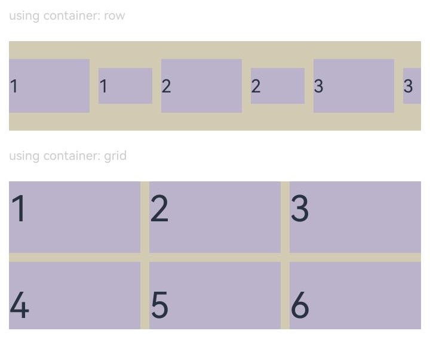
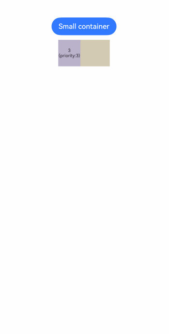

# Layout Constraints

Control component behavior in layouts by constraining dimensions, alignment, and other properties.

## Import Module

```cangjie
import kit.ArkUI.*
```

## func constraintSize(?Length, ?Length, ?Length, ?Length)

```cangjie
func constraintSize(minWidth!: ?Length = None, maxWidth!: ?Length = None, minHeight!: ?Length = None, maxHeight!: ?Length = None): T
```

**Function:** Sets constraint dimensions for components.

**System Capability:** SystemCapability.ArkUI.ArkUI.Full

**Since:** 22

**Parameters:**

| Parameter | Type | Required | Default | Description |
|:---|:---|:---|:---|:---|
| minWidth | ?[Length](./cj-common-types.md#interface-length) | No | None | **Named parameter** Minimum component width <br>Default: 0.vp |
| maxWidth | ?[Length](./cj-common-types.md#interface-length) | No | None | **Named parameter** Maximum component width <br>Default: (Float64.Inf).vp |
| minHeight | ?[Length](./cj-common-types.md#interface-length) | No | None | **Named parameter** Minimum component height <br>Default: 0.vp |
| maxHeight | ?[Length](./cj-common-types.md#interface-length) | No | None | **Named parameter** Maximum component height <br>Default: (Float64.Inf).vp |

**Return Value:**

| Type | Description |
|:---|:---|
| T | Returns generic method interface type |


## func align(?Alignment)

```cangjie
func align(value: ?Alignment): T
```

**Function:** Sets component alignment within parent container.

**System Capability:** SystemCapability.ArkUI.ArkUI.Full

**Since:** 22

**Parameters:**

| Parameter | Type | Required | Default | Description |
|:---|:---|:---|:---|:---|
| value | ?[Alignment](cj-common-types.md#enum-alignment) | Yes | - | Alignment method <br>Default: Alignment.Center |

**Return Value:**

| Type | Description |
|:---|:---|
| T | Returns generic method interface type |


## func direction(?Direction)

```cangjie
func direction(value: ?Direction): T
```

**Function:** Sets component layout direction.

**System Capability:** SystemCapability.ArkUI.ArkUI.Full

**Since:** 22

**Parameters:**

| Parameter | Type | Required | Default | Description |
|:---|:---|:---|:---|:---|
| value | ?[Direction](./cj-common-types.md#enum-direction) | Yes | - | Layout direction <br>Default: Direction.Auto |

**Return Value:**

| Type | Description |
|:---|:---|
| T | Returns generic method interface type |

## Example Code

### Example 1 (Setting Component Aspect Ratio)

Set different aspect ratios through aspectRatio.

<!-- run -->

```cangjie
package ohos_app_cangjie_entry
import kit.UIKit.*
import ohos.state_macro_manage.*

var children = ["1", "2", "3", "4", "5", "6"]

@Entry
@Component
class EntryView {
    func build(): Unit {
        Column(20) {
            Text("using container: row")
                .fontSize(14)
                .fontColor(0xCCCCCC)
                .width(100.percent)
            Row(10) {
                ForEach(
                    children,
                    itemGeneratorFunc: {
                        item: String, _: Int64 =>
                        // Component width = component height*1.5 = 90
                        Text(item)
                            .backgroundColor(0xbbb2cb)
                            .fontSize(20)
                            .aspectRatio(1.5)
                            .height(60)
                        // Component height = component width/1.5 = 60/1.5 = 40
                        Text(item)
                            .backgroundColor(0xbbb2cb)
                            .fontSize(20)
                            .aspectRatio(1.5)
                            .width(60)
                    }
                )
            }
            .size(width: 100.percent, height: 100.vp)
            .backgroundColor(0xd2cab3)
            .clip(true)

            // Grid child element width/height=3/2
            Text("using container: grid")
                .fontSize(14)
                .fontColor(0xCCCCCC)
                .width(100.percent)
            Grid() {
                ForEach(
                    children,
                    itemGeneratorFunc: {
                        item: String, _: Int64 => GridItem() {
                            Text(item)
                                .backgroundColor(0xbbb2cb)
                                .fontSize(40)
                                .width(100.percent)
                                .aspectRatio(1.5)
                        }
                    }
                )
            }
            .columnsTemplate("1fr 1fr 1fr")
            .columnsGap(10)
            .rowsGap(10)
            .size(width: 100.percent, height: 165.vp)
            .backgroundColor(0xd2cab3)
        }
        .padding(10)
    }
}
```



### Example 2 (Setting Component Display Priority)

Bind display priority to child components using displayPriority.

<!-- run -->

```cangjie
package ohos_app_cangjie_entry
import kit.UIKit.*
import ohos.state_macro_manage.*

class ContainerInfo {
    var label: String
    var size: Length
    public init(label!: String, size!: Length) {
        this.label = label
        this.size = size
    }
}

class ChildInfo {
    var text: String
    var priority: Int32
    public init(text!: String, priority!: Int32) {
        this.text = text
        this.priority = priority
    }
}

@Entry
@Component
class EntryView {
    private let container: Array<ContainerInfo> = [
        ContainerInfo( label: 'Big container', size: 100.percent ),
        ContainerInfo( label: 'Middle container', size: 60.percent ),
        ContainerInfo( label: 'Small container', size: 30.percent )
    ]
    private let children: Array<ChildInfo> = [
        ChildInfo( text: '1\n(priority:2)', priority: 2 ),
        ChildInfo( text: '2\n(priority:1)', priority: 1 ),
        ChildInfo( text: '3\n(priority:3)', priority: 3 ),
        ChildInfo( text: '4\n(priority:1)', priority: 1 ),
        ChildInfo( text: '5\n(priority:2)', priority: 2 )
    ]

    @State var currentIndex: Int64 = 0;

    func build(): Unit {
        Column(10) {
            // Toggle parent container size
            Button(this.container[this.currentIndex].label)
                .backgroundColor(0x317aff)
                .onClick({ =>
                    this.currentIndex = (this.currentIndex + 1) % this.container.size
                })
            // Set Flex parent container width via variable
            Flex(FlexParams(justifyContent: FlexAlign.SpaceBetween)) {
                ForEach(
                    this.children, itemGeneratorFunc:
                    {
                        item: ChildInfo, idx: Int64 =>
                            // Bind display priority to child components using displayPriority
                            Text(item.text)
                                .width(50)
                                .height(60)
                                .fontSize(10)
                                .textAlign(TextAlign.Center)
                                .backgroundColor(0xbbb2cb)
                                .displayPriority(item.priority)
                    }
                 )
             }
            .width(this.container[this.currentIndex].size)
            .backgroundColor(0xd2cab3)
        }
        .width(100.percent)
        .margin( top: 50 )
    }
}
```

