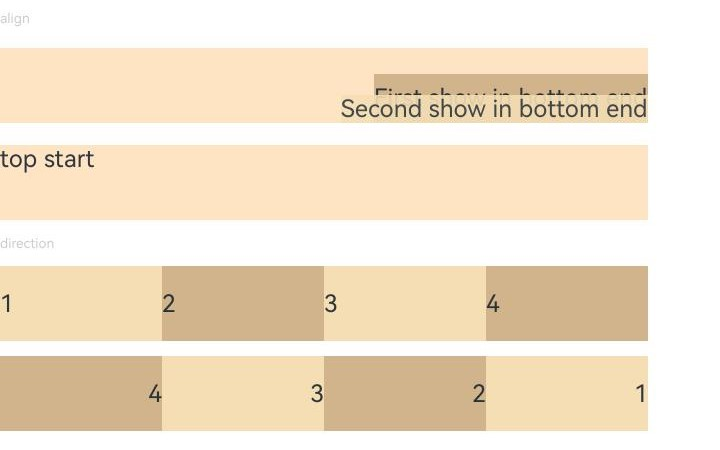
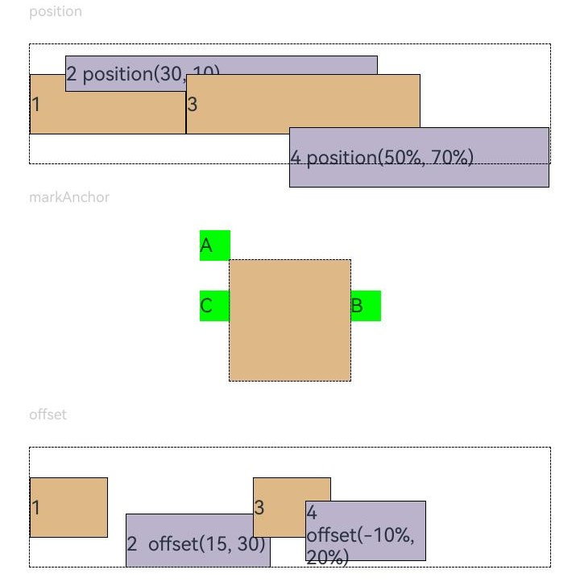

# Position Settings

Configure the position, anchor point, and offset of components.

## Import Module

```cangjie
import kit.ArkUI.*
```

## func position(?Length, ?Length)

```cangjie
func position(x!: ?Length, y!: ?Length): T
```

**Function:** Sets the position of a component.

**System Capability:** SystemCapability.ArkUI.ArkUI.Full

**Since:** 22

**Parameters:**

| Parameter | Type | Required | Default | Description |
|:---|:---|:---|:---|:---|
| x | ?[Length](./cj-common-types.md#interface-length) | Yes | - | **Named parameter.** The x-coordinate of the component |
| y | ?[Length](./cj-common-types.md#interface-length) | Yes | - | **Named parameter.** The y-coordinate of the component |

**Return Value:**

| Type | Description |
|:---|:---|
| T | Returns the generic method interface type |

## func markAnchor(?Length, ?Length)

```cangjie
func markAnchor(x!: ?Length, y!: ?Length): T
```

**Function:** Sets the anchor point.

**System Capability:** SystemCapability.ArkUI.ArkUI.Full

**Since:** 22

**Parameters:**

| Parameter | Type | Required | Default | Description |
|:---|:---|:---|:---|:---|
| x | ?[Length](./cj-common-types.md#interface-length) | Yes | - | **Named parameter.** The x-coordinate of the anchor point |
| y | ?[Length](./cj-common-types.md#interface-length) | Yes | - | **Named parameter.** The y-coordinate of the anchor point |

**Return Value:**

| Type | Description |
|:---|:---|
| T | Returns the generic method interface type |

## func offset(?Length, ?Length)

```cangjie
func offset(x!: ?Length, y!: ?Length): T
```

**Function:** Sets the offset.

**System Capability:** SystemCapability.ArkUI.ArkUI.Full

**Since:** 22

**Parameters:**

| Parameter | Type | Required | Default | Description |
|:---|:---|:---|:---|:---|
| x | ?[Length](./cj-common-types.md#interface-length) | Yes | - | **Named parameter.** The x-axis offset |
| y | ?[Length](./cj-common-types.md#interface-length) | Yes | - | **Named parameter.** The y-axis offset |

**Return Value:**

| Type | Description |
|:---|:---|
| T | Returns the generic method interface type |

## func alignRules(?AlignRuleOptions)

```cangjie
func alignRules(value: ?AlignRuleOptions): T
```

**Function:** Sets component alignment rules.

> **Note:**
>
> This component is only effective when its parent container is a RelativeComponent.

**System Capability:** SystemCapability.ArkUI.ArkUI.Full

**Since:** 22

**Parameters:**

| Parameter | Type | Required | Default | Description |
|:---|:---|:---|:---|:---|
| value | ?[AlignRuleOptions](./cj-common-types.md#class-alignruleoptions) | Yes | - | Alignment rule options <br>Default: AlignRuleOptions() |

**Return Value:**

| Type | Description |
|:---|:---|
| T | Returns generic method interface type |

## Example Code

### Example 1 (Alignment and Main Axis Layout)

Configures the alignment of content within an element and the layout of child elements along the main axis of the parent container.

<!-- run -->

```cangjie
package ohos_app_cangjie_entry
import kit.UIKit.*
import ohos.state_macro_manage.*

@Entry
@Component
class EntryView {
    func build(): Unit {
        Column {
            Column(10) {
                // Sets the offset position of the child component's top-left corner relative to the parent component's top-left corner
                // Element content < element dimensions, sets the alignment of content within the element
                Text("align")
                    .fontSize(9)
                    .fontColor(0xCCCCCC)
                    .width(90.percent)
                Stack() {
                    Text("First show in bottom end")
                        .height(65.percent)
                        .backgroundColor(0xD2B48C)
                    Text("Second show in bottom end")
                        .backgroundColor(0xF5DEB3)
                        .opacity(0.9)
                }
                .width(90.percent)
                .height(50)
                .margin(top: 5)
                .backgroundColor(0xFFE4C4)
                .align(Alignment.BottomEnd)
                Stack() {
                    Text("top start")
                }
                .width(90.percent)
                .height(50)
                .margin(top: 5)
                .backgroundColor(0xFFE4C4)
                .align(Alignment.TopStart)

                // Parent container sets direction to Direction.Ltr, child elements are arranged left to right
                Text("direction")
                    .fontSize(9)
                    .fontColor(0xCCCCCC)
                    .width(90.percent)
                Row() {
                    Text("1")
                        .height(50)
                        .width(25.percent)
                        .fontSize(16)
                        .backgroundColor(0xF5DEB3)
                    Text("2")
                        .height(50)
                        .width(25.percent)
                        .fontSize(16)
                        .backgroundColor(0xD2B48C)
                    Text("3")
                        .height(50)
                        .width(25.percent)
                        .fontSize(16)
                        .backgroundColor(0xF5DEB3)
                    Text("4")
                        .height(50)
                        .width(25.percent)
                        .fontSize(16)
                        .backgroundColor(0xD2B48C)
                }
                .width(90.percent)
                .direction(Direction.Ltr)
                // Parent container sets direction to Direction.Rtl, child elements are arranged right to left
                Row() {
                    Text("1")
                        .height(50)
                        .width(25.percent)
                        .fontSize(16)
                        .backgroundColor(0xF5DEB3)
                        .textAlign(TextAlign.End)
                    Text("2")
                        .height(50)
                        .width(25.percent)
                        .fontSize(16)
                        .backgroundColor(0xD2B48C)
                        .textAlign(TextAlign.End)
                    Text("3")
                        .height(50)
                        .width(25.percent)
                        .fontSize(16)
                        .backgroundColor(0xF5DEB3)
                        .textAlign(TextAlign.End)
                    Text("4")
                        .height(50)
                        .width(25.percent)
                        .fontSize(16)
                        .backgroundColor(0xD2B48C)
                        .textAlign(TextAlign.End)
                }
                .width(90.percent)
                .direction(Direction.Rtl)
            }
        }
    }
}
```



### Example 2 (Position Offset)

Applies position offsets based on the parent component, relative positioning, and anchor points.

<!-- run -->

```cangjie
package ohos_app_cangjie_entry
import kit.UIKit.*
import ohos.state_macro_manage.*

@Entry
@Component
class EntryView {
    func build(): Unit {
        Scroll() {
            Column(20) {
                // Sets the offset position of the child component's top-left corner relative to the parent component's top-left corner
                Text("position")
                    .fontSize(12)
                    .fontColor(0xCCCCCC)
                    .width(90.percent)
                Row() {
                    Text("1")
                        .size(width: 30.percent, height: 50.vp)
                        .backgroundColor(0xdeb887)
                        .borderWidth(1)
                        .fontSize(16)
                    Text("2 position(30, 10)")
                        .size(width: 60.percent, height: 30.vp)
                        .backgroundColor(0xbbb2cb)
                        .borderWidth(1)
                        .fontSize(16)
                        .align(Alignment.Start)
                        .position(x: 30, y: 10)
                    Text("3")
                        .size(width: 45.percent, height: 50.vp)
                        .backgroundColor(0xdeb887)
                        .borderWidth(1)
                        .fontSize(16)
                    Text("4 position(50%, 70%)")
                        .size(width: 50.percent, height: 50.vp)
                        .backgroundColor(0xbbb2cb)
                        .borderWidth(1)
                        .fontSize(16)
                        .position(x: 50.percent, y: 70.percent)
                }
                .width(90.percent)
                .height(100)
                .border(width: 1.vp, style: BorderStyle.Dashed)

                // Offsets relative to the starting point, where x is the horizontal distance from the final position to the starting point (x>0 moves left, otherwise right)
                // y is the vertical distance from the final position to the starting point (y>0 moves up, otherwise down)
                Text("markAnchor")
                    .fontSize(12)
                    .fontColor(0xCCCCCC)
                    .width(90.percent)
                Stack(Alignment.TopStart) {
                    Row()
                        .size(width: 100, height: 100)
                        .backgroundColor(0xdeb887)
                    Text("A")
                        .size(width: 25, height: 25)
                        .backgroundColor(Color.GREEN)
                        .markAnchor(x: 25, y: 25)
                    Text("B")
                        .size(width: 25, height: 25)
                        .backgroundColor(Color.GREEN)
                        .markAnchor(x: -100, y: -25)
                    Text("C")
                        .size(width: 25, height: 25)
                        .backgroundColor(Color.GREEN)
                        .markAnchor(x: 25, y: -25)
                }
                .margin(top: 25)
                .border(width: 1.vp, style: BorderStyle.Dashed)

                // Relative positioning: x>0 offsets right, otherwise left; y>0 offsets down, otherwise up
                Text("offset")
                    .fontSize(12)
                    .fontColor(0xCCCCCC)
                    .width(90.percent)
                Row() {
                    Text("1")
                        .size(width: 15.percent, height: 50.vp)
                        .backgroundColor(0xdeb887)
                        .borderWidth(1)
                        .fontSize(16)
                    Text("2  offset(15, 30)")
                        .size(width: 120.vp, height: 50.vp)
                        .backgroundColor(0xbbb2cb)
                        .borderWidth(1)
                        .fontSize(16)
                        .align(Alignment.Start)
                        .offset(x: 15, y: 30)
                    Text("3")
                        .size(width: 15.percent, height: 50.vp)
                        .backgroundColor(0xdeb887)
                        .borderWidth(1)
                        .fontSize(16)
                    Text("4 offset(-10%, 20%)")
                        .size(width: 100.vp, height: 50.vp)
                        .backgroundColor(0xbbb2cb)
                        .borderWidth(1)
                        .fontSize(16)
                        .offset(x: (-5).percent, y: 20.percent)
                }
                .width(90.percent)
                .height(100)
                .border(width: 1.vp, style: BorderStyle.Dashed)
            }
            .width(100.percent)
            .margin(top: 25)
        }
    }
}
```

