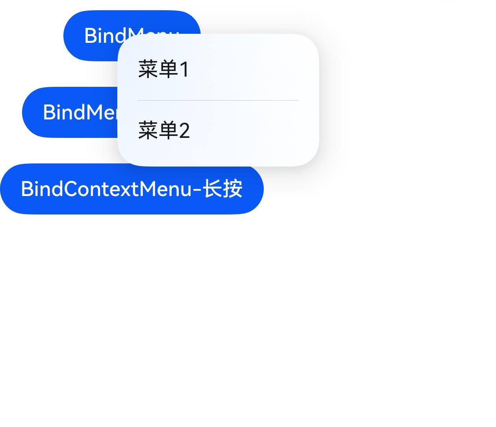

# Menu Control

Bind a pop-up menu to a component. The pop-up menu displays menu items in a vertical list and can be triggered via long press, click, or right-click.

> **Note:**
>
> - CustomBuilder does not support using bindMenu or bindContextMenu to pop up menus. For multi-level menus, use the [Menu](./cj-menu-menu.md#menu) component.
> - The text content of the pop-up menu does not support long-press selection.
> - If the component is a draggable node and bindContextMenu is bound without specifying preview, the menu pop-up will float the drag preview, and the menu options and preview will not avoid each other. Developers can set preview or make the target node non-draggable based on usage scenarios.
> - The menu supports long-press for 500ms to pop up submenus and supports press state following finger movement.<br> a. Only supports scenarios using the [Menu](./cj-menu-menu.md#menu) component and subcomponents containing [MenuItem](./cj-menu-menuitem.md#menuitem) or [MenuItemGroup](./cj-menu-menuitemgroup.md#menuitemgroup).<br> b. Only supports menus with [MenuPreviewMode](./cj-common-types.md#enum-menupreviewmode) set to NONE.

## Import Module

```cangjie
import kit.ArkUI.*
```

## func bindContextMenu(?CustomBuilder, ?ResponseType, ?ContextMenuOptions)

```cangjie
func bindContextMenu(builder!: ?CustomBuilder, responseType!: ?ResponseType,
    options!: ?ContextMenuOptions): T
```

**Function:** Binds a context menu to a component.

**System Capability:** SystemCapability.ArkUI.ArkUI.Full

**Initial Version:** 22

**Parameters:**

| Parameter Name | Type | Required | Default Value | Description |
| :--- | :--- | :--- | :--- | :--- |
| builder | ?[CustomBuilder](./cj-common-types.md#type-custombuilder) | Yes | - | **Named parameter.** Custom builder.<br>Initial value: { => }. |
| responseType | ?[ResponseType](./cj-common-types.md#enum-responsetype) | Yes | - | **Named parameter.** Response type.<br>Initial value: ResponseType.LongPress. |
| options | ?[ContextMenuOptions](./cj-common-types.md#class-contextmenuoptions) | Yes | - | **Named parameter.** Context menu options.<br>Initial value: ContextMenuOptions(). |

**Return Value:**

| Type | Description |
| :--- | :--- |
| T | Returns the component instance itself that calls this interface. |

## func bindMenu(?Array\<MenuElement>)

```cangjie
func bindMenu(content: ?Array<MenuElement>): T
```

**Function:** Binds a menu to a component.

**System Capability:** SystemCapability.ArkUI.ArkUI.Full

**Initial Version:** 22

**Parameters:**

| Parameter Name | Type | Required | Default Value | Description |
| :--- | :--- | :--- | :--- | :--- |
| content | ?Array\<[MenuElement](./cj-common-types.md#class-menuelement)> | Yes | - | **Named parameter.** Array of menu elements. |

**Return Value:**

| Type | Description |
| :--- | :--- |
| T | Returns the component instance itself that calls this interface. |

## func bindMenu(?CustomBuilder)

```cangjie
func bindMenu(builder!: ?CustomBuilder): T
```

**Function:** Binds a custom menu to a component.

**System Capability:** SystemCapability.ArkUI.ArkUI.Full

**Initial Version:** 22

**Parameters:**

| Parameter Name | Type | Required | Default Value | Description |
| :--- | :--- | :--- | :--- | :--- |
| builder | ?[CustomBuilder](./cj-common-types.md#type-custombuilder) | Yes | - | **Named parameter.** Custom builder.<br>Initial value: { => }. |

**Return Value:**

| Type | Description |
| :--- | :--- |
| T | Returns the generic method interface type. |

## Example Code

### Example 1 (Pop Up Custom Menu)

This example demonstrates popping up a custom menu by configuring CustomBuilder with bindMenu.

<!-- run -->

```cangjie

package ohos_app_cangjie_entry
import kit.UIKit.*
import ohos.state_macro_manage.*

@Entry
@Component
class EntryView {
    @Builder
    func builder() {
        Column {
            Button("Builder Content")
                .width(300.px)
                .onClick({
                    evt => nativeLog("Button in Builder clicked")
                })
        }
        .width(300.px)
    }

    func build() {
        Column(20) {
            Button("BindMenu").bindMenu(
                [
                    Action(
                        value: "Menu1",
                        action: {
                            => nativeLog("Menu1 clicked")
                        }
                    ),
                    Action(
                        value: "Menu2",
                        action: {
                            => nativeLog("Menu2 clicked")
                        }
                    )
                ]
            )

            Button("BindMenu-Custom")
                .bindMenu(builder: builder)
            Button("BindContextMenu-LongPress")
                .bindContextMenu(builder: builder)
        }
    }
}
```



### Example 2 (Pop Up Regular Menu)

This example demonstrates popping up a regular menu by configuring MenuElement with bindMenu.

<!-- run -->

```cangjie

package ohos_app_cangjie_entry

import kit.UIKit.*
import ohos.state_macro_manage.*

@Entry
@Component
class EntryView {
    func build() {
        Scroll() {
            Column(10) {
                Button("BindMenu").bindMenu(
                    [
                        MenuElement(
                            "Menu1",
                            {
                                => AppLog.error("MenuElement test: Menu1 clicked")
                            }
                        ),
                        MenuElement(
                            "Menu2",
                            {
                                => AppLog.error("MenuElement test: Menu2 clicked")
                            },
                            icon: "data:image/png;base64,iVBORw0KGgoAAAANSUhEUgAAAJAAAACQCAYAAADnRuK4AAAABGdBTUEAALGPC/xhBQAAADhlWElmTU0AKgAAAAgAAYdpAAQAAAABAAAAGgAAAAAAAqACAAQAAAABAAAAkKADAAQAAAABAAAAkAAAAAAc9yiyAABAAElEQVR4AcW9C7Bl21Wet/bpvo9uXV2hV+BKFpIMRDwM5hFbIiY2EKoMxsElTFHEMcG2Aq44SihQFRZOUkClKgUEYVymijIEMBEBmaIwwaKoODwqRgSDDbbBPAQCiZceXL3vvd19b3efk//7x/jnmmuffU6fvveCZ/dac8wx/n+MMceca+199tln793yH7B9yteeXL1+49rLjnbHLz3ZLQ8dnSwfdrLsHtotJ89flt0DJ8vyTKXH8YCOq9Lduywn90i+pOOoD3V3107keLfbctAt6NpWGGViw2nsyi/Sk+MniZNj8Y8V//Zysrup/gnFvXa0O3r0+Pj4EUV/ZNmdPLpbdg8r8Xcsx8fvVL3ecXR09NYr91998y987e7aNsM/vlFm8Ecekc1y44lHX350fPRpx8vJp2oBPk5BX6TjjzSH2gjr9DL2gqOu9Tdgp6RO2EFspm7BB5jx2XwRh7HE2mwV6K75clcFmvlTniX+nmL8ipA/e7wcv+mBqw/83B/XpqrcUq2nuf/4177/2SdH97xyOT75fFXhs+T+vqc5xCl3WaDZMOtKXhdjxiHP2P1Ns9rP4Qu0FrUk7mLZRCWz6h2MHiOB1TjrTjMk6+6e/7juWD9+crL7oXsv3fynv/z1H/I+/PxRtHWuT6P3T/h7j32y7smvlssv0nHlaXR9IVe9FmNdpvXZ42ehtupa3HVdL8ZffV2Yv3F8Hl8bbn9SpDz4Wcbafr6LYtY/8a6rf4Og3/pr/9szfnE706c+SuSn7kkePvarr71+d3L8NUr2c54Wh+c4oZ7Uj+baSma41nkquvR+eIqxcWfy7essvqM4zlPik5MO2pp/xzwQf7tZaotcnG+HBPqx4+Xo637zm67+XEV+6ufk8JQ8/cev+eDz7r336Jvl5IufkqNzyBR5XrCtvC42+izI5rmMfGeyp33N/HUR6/GkHNa1XQkWH29aSOe1cvqqr2QTSP1hPrny8HY3fGH1rx7m9vml9d0qheie+DTnt5y8fjk5/srfeN2D7y7tkz+npk/aw8d99aNfIievk4PnPmkn5xCzBkAiH+q9O1Klyd9m4aRfFxiH6zo/eX4WvzbaFNrRarHRrgtf20kqxy899tr5hbVxcA7xG88GSaMwbuhq5pvN1huv4u/eo3iv+Y3XPfA9TXpS3RT97vif+NrrL7m9u/2dSvMz7455NjobA0TkQz32cdUy6BYswyrfYT/Yz+dnscPPJmnHZ/HR6+CcjVN5PF18eWeSRMhdy6M6Zc5r/OSR+Pt8eCc/eXT70qt+/VuuvK283N35SW2gT/gfr71Cr0/8iELp9Zqnv202QtVLBRu1OyMgUynwyu/CyXKo4BQ6nMj2oFNd2Gfxw0tPSsh4E/mu+cXd8tvfoQ0zipH4d+DLPO685GlaJ1nFevj4ePd5b/nmq//Sk7iLEy/G3VX7uK9+5Au0eX5KpKdl83R9fGFFrsXWOmiOaRs5SvXR87gfeeWvDvy8oHmTdnDCp9Bn8YtXV3VSSMzi13OT0/zaiGfzyb2ONb63YoXpu83gJ+ip+c/xJ77mZP+Zv/naRXJonyfL83e745/6yNc88gWZ10X7u9pAer7zVZrgD8j5/RcNcAiX+aefMeiY7OHGpaNmM0WpYa5+mwa/sYG4n3Vn8Wsh+xYk1sphcTu49WuejVGXjbDlV6LFdyJn8Huhmdh8l+mJHuQnPfpsNMJt+BVzy9+v8+7+3XL0Ax/1mke/qtAXOyf8HdEf/9pH/65ePv/6OwIPADb12LeTgSfc/b69rx7XA9s+dvAlrDtq8lKLcja/eaPga4hycg6f2GyqniCbh0Xi2rfJDsIv/SZ/YtLumg8vhXiyfAJ3Ox3/tW/55ge+Iebz+nWe56B42FJhuPNcCD+7IjfaXKvSoKviZlz9XBzuBq215MY35O74lbrvGk+ZLwdKLA9VtZiZRTvvUuUuBZZW8YtfdwlrbatT4aK4O/6Wa89dwPPjG6mT+Lig7LvdF77ldVd/EMt57XTEPXQ/Yf4pqQ8+bJFfNgfULPjs5vBCF+LJ8zPTOf6hDYn9kH7ml0z1smB3zv+CfMF8VxqFWWN5pRRofmjh7jVuLlw8yt0M5NlA0eXTECOwt8dSNvzJ8nc3FPwz7vTEmtzObPyofmt3++cFOPMJczbAqfrgNbXaRNgqiz8tXMzOTKfhOE4CqPHZfDuY+OGlf6r88nM6vvSl7AB0mxWdxlj6YS/znK/GUGe+Nw6GanfkA7Nv8lXbTn8bfz/2sjx8+fjoz573I/65T6J5nUchvXkyv7mfZSfn/DpRFL5qyrJiq5iMN7oxvxaABaBZR6w7RI03uhE2/CmA+TjEJf3EF9y6UbyVv96N1g2eax5bu9rjO4xzL37H62Js+VNOI76TPIO/zaP8t+4sfuab+B7LPf9ic4ouRCWPnv8nJ8+/WXugJ3W6O3MD8QqzfHzmPoU8Owc/dOWxNbhKKqNejAzVF5+MkXV7zcRL1ZOyGUQLbWxOYhziV3LhpT/MJ5m6wQuXSbkvXtmSC33hHR9I+MwhvPSNHWylUPeaacEnfs1p8pNY6tOYBRkMLHFp6ofOU0XfuV6IT/rlnY0D12f7333mR3zFo19ixYHTmt1k5Hdb99xz9OviP9d+ZcNX5Am6J+Kur8w9DotdSe5RNsNKx1dpz6cmRPynk195bkJ7cMH4m2LMvvb5GlM0devCK9BBfnFJY53/Pr+sxW9ZnsHjn//Uy3zMKBzfVkxjXAMUhd/ySzvx33Pp6PZHH/rd2cE7UP9i1L/bYq525+glV6aVSzYVZjZI59vAnlTbwnMBrCsf6Fc+xahWk6qRN1+Scd8cQ/f5xTmbD+lu+VCS2cwn8wPxBTUajiCu07l8lp36ZTPUmezFJ+4a3PNxAG5rR+RZ36tSzGdlcWOeIof3JT/c28fX+aX5afa6q1N/ZaMgy9pZ3Okr8JlwTUJz/JUjKGoUrueSprGxPf4GABuWinvnh9nM38vpuNjZ5EVwQueBM7jN2fmO3HpRx0uwqcK1RJ18JWLN1TnVPFP/olf3ETyyI502vApazZb9WAT8zRfRinX+Mty+2T3irf9g+1bQU7dgXg/j5MY06oR3piHmx2XczKgXqc2zwBP/JDVD87Md6Eav+ELRPxD/NnXKT68tPBrPOJrSO7O3/yKVZM9j98cZTX4ZIhj+k3+xCR+zQB55SU+GLWZL1dmOA2kPb4JxTGNcYSuhWN2Shfhuw74IVTiNv9od/I1mOaWjKz7GL2T8Oh4+QWcpJb7zz0O6qO0l/UKKT813t/qG793xVfKzg+/ahTsaeNXOcaVOuIohoMpXmLR0zbxpXN6faXfBd+1gnyQ33GId0b8g3wlzQba1AkfydkyPlH1XcmyVeKd5uuO8ylv+Zb1nY2bO9Du9smrTYqTdkwcglQrgYCjWa5EKyj1VvANv3i5Cle+QXI185Hhq0+cLFgHtb7jCnoHvmKc4otyik/UFG2Of5rvmIf40mXR1vz3+cy5Fs2FlVwcRT/IZ3rijEWY+Og3/Pjq3jk233WSjJ/Ex+3gk1NFKSj1B6/WcY5PFt6qPBp0N94Af3xy+Q+Ev7JOvI0mlyfORarIawAZ2uhiDAMEYXsM5BUfeWn5bz79nuWjPvRouao/1LmsP9I5ApNWrjO6q76ybEoPbiv2zVvL8sHrJ8sv/s7x8q3//Oby++/ByIKpS2jLtcW9QZN3egFrg8FhTvawvOwFl5Yv/Yx7lo/9E0fLA/qzgXs0n0u6NNlKtNB3wt9mrEMLUa1jOw/7a/1k5m9+gJtyvCw3Jdx44mT5oP6Y55d/7/byfT9za3nrH0LWoWC