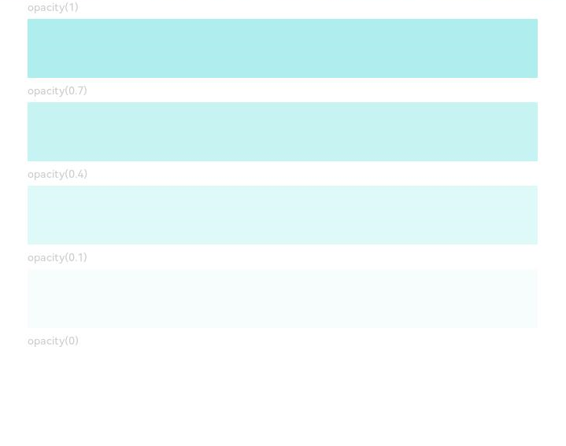

# Opacity Setting

Sets the opacity of a component.

## Import Module

```cangjie
import kit.ArkUI.*
```

## func opacity(?Float64)

```cangjie
func opacity(value: ?Float64): T
```

**Function:** Sets the opacity of a component.

**System Capability:** SystemCapability.ArkUI.ArkUI.Full

**Since:** 22

**Parameters:**

| Parameter | Type | Required | Default | Description |
|:---|:---|:---|:---|:---|
| value | ?Float64 | Yes | - | Opacity value. Range: 0.0 to 1.0, where 0.0 means completely transparent and 1.0 means completely opaque. Initial value: 1.0 |

**Return Value:**

| Type | Description |
|:---|:---|
| T | Returns the component instance itself that calls this interface. |


## Example Code

This example mainly demonstrates setting component opacity through the opacity method.

<!-- run -->

```cangjie
package ohos_app_cangjie_entry
import kit.UIKit.*
import ohos.state_macro_manage.*

@Entry
@Component
class EntryView {
    func build() {
        Column(5) {
            Text("opacity(1)")
                .fontSize(9)
                .width(90.percent)
                .fontColor(0xCCCCCC)
            Text("")
                .width(90.percent)
                .height(50)
                .opacity(1)
                .backgroundColor(0xAFEEEE)
            Text("opacity(0.7)")
                .fontSize(9)
                .width(90.percent)
                .fontColor(0xCCCCCC)
            Text("")
                .width(90.percent)
                .height(50)
                .opacity(0.7)
                .backgroundColor(0xAFEEEE)
            Text("opacity(0.4)")
                .fontSize(9)
                .width(90.percent)
                .fontColor(0xCCCCCC)
            Text("")
                .width(90.percent)
                .height(50)
                .opacity(0.4)
                .backgroundColor(0xAFEEEE)
            Text("opacity(0.1)")
                .fontSize(9)
                .width(90.percent)
                .fontColor(0xCCCCCC)
            Text("")
                .width(90.percent)
                .height(50)
                .opacity(0.1)
                .backgroundColor(0xAFEEEE)
            Text("opacity(0)")
                .fontSize(9)
                .width(90.percent)
                .fontColor(0xCCCCCC)
            Text("")
                .width(90.percent)
                .height(50)
                .opacity(0)
                .backgroundColor(0xAFEEEE)
        }
        .width(100.percent)
        .padding(top: 5)
    }
}
```

