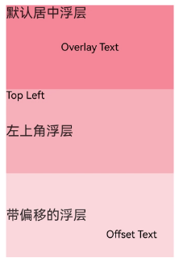

# Overlay

Sets the overlay text for a component.

## Import Module

```cangjie
import kit.ArkUI.*
```

## func overlay(?String, ?Alignment, ?OverlayOffset)

```cangjie
func overlay(value!: ?String, align!: ?Alignment,
    offset!: ?OverlayOffset): T
```

**Functionality:** Adds overlay text as a floating layer above the current component.

**System Capability:** SystemCapability.ArkUI.ArkUI.Full

**Since:** 22

**Parameters:**

| Parameter | Type | Required | Default | Description |
|:---|:---|:---|:---|:---|
| value | ?String | Yes | - | **Named parameter.** The content of the overlay text. |
| align | ?[Alignment](./cj-common-types.md#enum-alignment) | Yes | - | **Named parameter.** The position of the overlay relative to the component. Initial value: Alignment.Center |
| offset | ?[OverlayOffset](./cj-common-types.md#class-overlayoffset) | Yes | - | **Named parameter.** The offset of the overlay based on its own top-left corner. The overlay is positioned at the component's top-left corner by default. Initial value: OverlayOffset(x: 0.0, y: 0.0) |

> **Note:**
>
> When both align and offset are set, the effects overlap. The overlay is first positioned relative to the component and then offset based on the current position's top-left corner.

**Return Value:**

| Type | Description |
|:---|:---|
| T | Returns the component instance itself that called this interface. |

## Example Code

### Example 1 (Overlay Effect)

This example demonstrates how to use the overlay method to add overlay text to a component.

<!-- run -->

```cangjie
package ohos_app_cangjie_entry
import kit.ArkUI.*
import ohos.arkui.state_macro_manage.*

@Entry
@Component
class EntryView {
    func build() {
        Column() {
            Text("Default Centered Overlay")
                .width(200)
                .height(100)
                .backgroundColor(0xf48899)
                .align(Alignment.Top)
                .overlay(value: "Overlay Text")
            
            Text("Top-Left Overlay")
                .width(200)
                .height(100)
                .backgroundColor(0xf7b0bb)
                .overlay(value: "Top Left", align: Alignment.TopStart)
            
            Text("Overlay with Offset")
                .width(200)
                .height(100)
                .backgroundColor(0xfbd7dd)
                .overlay(
                    value: "Offset Text", 
                    align: Alignment.BottomEnd,
                    offset: OverlayOffset(x: -20.0, y: -20.0)
                )
        }
        .width(100.percent)
        .height(100.percent)
        .justifyContent(FlexAlign.Center)
        .alignItems(HorizontalAlign.Center)
    }
}
```

