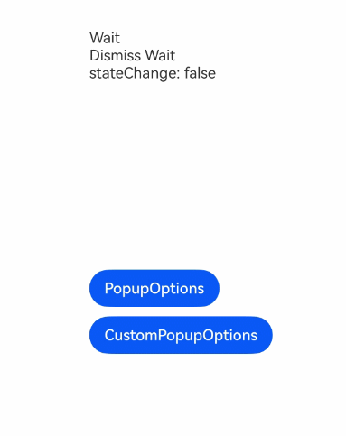

# Popup Control

Bind a popup dialog to a component and configure its content, interaction logic, and display state.

> **Note:**
>
> The display state of the popup dialog is reported in the `onStateChange` event callback. Its visibility is not strongly correlated with the creation or destruction of the component.

## Import Module

```cangjie
import kit.ArkUI.*
```

## func bindPopup(?Bool, ?PopupOptions)

```cangjie
func bindPopup(show: ?Bool, popup: ?PopupOptions): T
```

**Function:** Binds a Popup dialog to a component.

**System Capability:** SystemCapability.ArkUI.ArkUI.Full

**Since:** 22

**Parameters:**

| Parameter | Type | Required | Default | Description |
|:---|:---|:---|:---|:---|
| show | ?Bool | Yes | - | Popup display state. The popup dialog must wait for the page to fully render before displaying. Therefore, `show` cannot be set to `true` during page construction, as this may cause incorrect popup positioning or shape.<br>Initial value: `false`. |
| popup | ?[PopupOptions](./cj-common-types.md#class-popupoptions) | Yes | - | Parameters for configuring the current popup dialog. |

**Return Value:**

| Type | Description |
|:---|:---|
| T | Returns the component instance itself that called this interface. |


## func bindPopup(?Bool, ?CustomPopupOptions)

```cangjie
func bindPopup(show: ?Bool, popup: ?CustomPopupOptions): T
```

**Function:** Binds a Popup dialog to a component.

**System Capability:** SystemCapability.ArkUI.ArkUI.Full

**Since:** 22

**Parameters:**

| Parameter | Type | Required | Default | Description |
|:---|:---|:---|:---|:---|
| show | ?Bool | Yes | - | Popup display state. The popup dialog must wait for the page to fully render before displaying. Therefore, `show` cannot be set to `true` during page construction, as this may cause incorrect popup positioning or shape.<br>Initial value: `false`. |
| popup | ?[CustomPopupOptions](./cj-common-types.md#class-custompopupoptions) | Yes | - | Parameters for configuring the current popup dialog. |

**Return Value:**

| Type | Description |
|:---|:---|
| T | Returns the component instance itself that called this interface. |


## Example Code

<!-- run -->

```cangjie

package ohos_app_cangjie_entry

import ohos.component.*
import ohos.state_manage.*
import ohos.state_macro_manage.*
import ohos.base.{LengthProp, Length, AppLog, Color, nativeLog, BaseLog, LengthType}

@Builder
func popupBuilder() {
    Column {
        Text("Custom Popup")
    }
}

@Entry
@Component
class EntryView {
    @State var msg: String = "State Change Wait"
    @State var dismiss: String = "Dismiss Wait"
    @State var custom: String = "Custom Wait"
    @State var handlePopup: Bool = false
    @State var customPopup: Bool = false

    public func build() {
        Flex(FlexOptions(direction: FlexDirection.Column)) {
            Text(msg)
            Text(dismiss)
            Text(custom)
            Button('PopupOptions')
                .margin(top: 200)
                .onClick {
                    this.handlePopup = !this.handlePopup
                }
                .bindPopup(
                    show: this.handlePopup,
                    popup: PopupOptions(
                        message: 'This is a popup with PopupOptions',
                        placementOnTop: true,
                        primaryButton: Action(
                            value: 'confirm',
                            action: {
                                => this.handlePopup = !this.handlePopup
                            }
                        ),
                        secondaryButton: Action(
                            value: 'cancel',
                            action: {
                                => this.handlePopup = !this.handlePopup
                            }
                        ),
                        onStateChange: {
                            e =>
                            this.msg = "PopUp"
                            if (!e.isVisible) {
                                this.msg = "Wait"
                                this.handlePopup = false
                            }
                        },
                        showInSubWindow: false,
                        arrowOffset: 60.0.vp,
                        targetSpace: 20.0.vp,
                        enableArrow: true,
                        arrowHeight: 30.0.vp,
                        arrowWidth: 30.0.vp,
                        radius: 25.0.vp,
                        autoCancel: true,
                        backgroundBlurStyle: BlurStyle.Thick,
                        shadow: ShadowStyle.OUTER_FLOATING_SM,
                        offset: Position(50.0, 50.0),
                        placement: Placement.Top,
                        arrowPointPosition: ArrowPointPosition.CENTER,
                        mask: Color(0x33000000),
                        popupColor: Color.GREEN,
                        messageOptions: PopupMessageOptions(textColor: Color.BLUE, font: Fonts(size: 20.vp)),
                        transition: TransitionEffect.SLIDE_SWITCH,
                        onWillDismiss: {
                            dismissPopupAction: DismissPopupAction =>
                            dismissPopupAction.dismiss()
                            match (dismissPopupAction.reason) {
                                case PRESS_BACK => this.dismiss = "dismissReason: PRESS_BACK"
                                case TOUCH_OUTSIDE => this.dismiss = "dismissReason: TOUCH_OUTSIDE"
                                case _ => this.dismiss = "dismissReason: unknown"
                            }
                        },
                        followTransformOfTarget: true
                    )
                )
            Button("CustomPopupOptions")
                .onClick({=> customPopup = !customPopup})
                .bindPopup(
                    show: customPopup,
                    popup: CustomPopupOptions(
                        builder: bind(popupBuilder, this),
                        enableArrow: true,
                        placement: Placement.BottomLeft,
                        popupColor: Color.RED,
                        arrowHeight: 24.0.vp,
                        arrowWidth: 24.0.vp,
                        radius: 10.vp,
                        offset: Position(5.0, 5.0),
                        width: 300.vp,
                        autoCancel: true,
                        targetSpace: 10.vp,
                        arrowOffset: 5.vp,
                        focusable: true,
                        arrowPointPosition: ArrowPointPosition.CENTER,
                        transition: TransitionEffect.SLIDE_SWITCH,
                        onStateChange: {
                            evt =>
                            custom = "stateChange: ${evt.isVisible}"
                            if (!evt.isVisible) {
                                customPopup = true
                            }
                        }
                    )
                )
        }
    }
}

```

