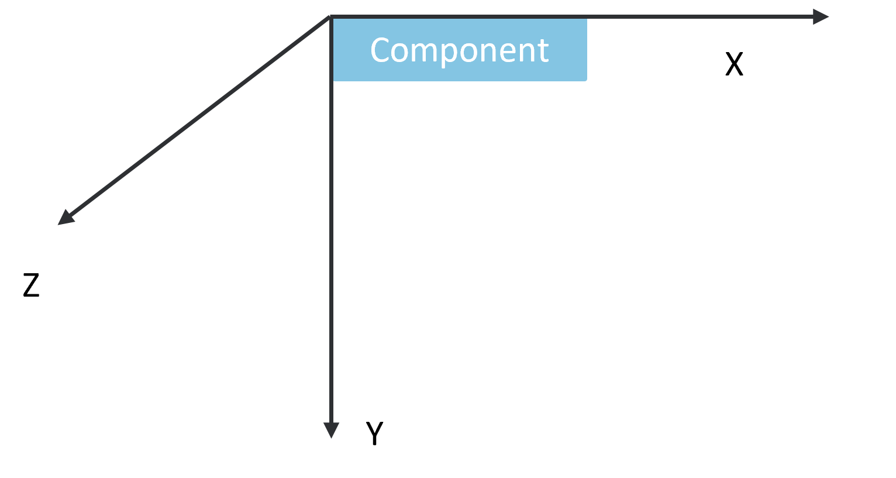
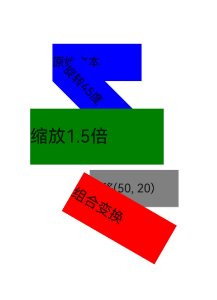

# Graphic Transformations

Used to perform operations such as rotation, translation, scaling, and matrix transformations on components.

## Import Module

```cangjie
import kit.ArkUI.*
```

## func rotate(?Float64, ?Float64, ?Float64, ?Float64, ?Length, ?Length)

```cangjie
public func rotate(x!: ?Float64 = None, y!: ?Float64 = None, z!: ?Float64 = None, angle!: ?Float64 = None,
    centerX!: ?Length = None, centerY!: ?Length = None): T
```

**Function:** Sets the rotation of a component.

> **Note:**
>
> - Allows the component to rotate in a coordinate system with the top-left corner of the component as the origin (as shown in the coordinate system diagram below). Here, (x, y, z) specifies a vector as the rotation axis.
> - Both the rotation axis and the rotation center point are based on the coordinate system settings. When the component moves, the coordinate system does not follow.
> - Default values: When x, y, and z are not specified, their default values are 0, 0, and 1, respectively. If any of x, y, or z is specified, the unspecified values default to 0.
> 

**System Capability:** SystemCapability.ArkUI.ArkUI.Full

**Initial Version:** 22

**Parameters:**

| Parameter | Type | Required | Default | Description |
|:---|:---|:---|:---|:---|
| x | ?Float64 | No | None | **Named parameter.** X-coordinate of the rotation axis vector. Initial value: 0.0 |
| y | ?Float64 | No | None | **Named parameter.** Y-coordinate of the rotation axis vector. Initial value: 0.0 |
| z | ?Float64 | No | None | **Named parameter.** Z-coordinate of the rotation axis vector. Initial value: 1.0 |
| angle | ?Float64 | No | None | **Named parameter.** Rotation angle. A positive value rotates clockwise relative to the rotation axis direction, while a negative value rotates counterclockwise. Initial value: 0.0 |
| centerX | ?[Length](./cj-common-types.md#interface-length) | No | None | **Named parameter.** X-coordinate of the transformation center point. Represents the x-coordinate of the component's transformation center point (i.e., anchor point). Initial value: 50.percent |
| centerY | ?[Length](./cj-common-types.md#interface-length) | No | None | **Named parameter.** Y-coordinate of the transformation center point. Represents the y-coordinate of the component's transformation center point (i.e., anchor point). Initial value: 50.percent |

**Return Value:**

| Type | Description |
|:---|:---|
| T | Returns the component instance itself that called this interface. |


## func scale(?Float32, ?Float32, ?Float32, ?Length, ?Length)

```cangjie
public func scale(x!: ?Float32 = None, y!: ?Float32 = None, z!: ?Float32 = None, centerX!: ?Length = None,
    centerY!: ?Length = None): T
```

**Function:** Sets the scaling of a component.

**System Capability:** SystemCapability.ArkUI.ArkUI.Full

**Initial Version:** 22

**Parameters:**

| Parameter | Type | Required | Default | Description |
|:---|:---|:---|:---|:---|
| x | ?Float32 | No | None | **Named parameter.** X-axis scaling component. Initial value: 1.0 |
| y | ?Float32 | No | None | **Named parameter.** Y-axis scaling component. Initial value: 1.0 |
| z | ?Float32 | No | None | **Named parameter.** Z-axis scaling component. Initial value: 1.0 |
| centerX | ?[Length](./cj-common-types.md#interface-length) | No | None | **Named parameter.** X-coordinate of the transformation center point. Represents the x-coordinate of the component's transformation center point (i.e., anchor point). Initial value: 50.percent |
| centerY | ?[Length](./cj-common-types.md#interface-length) | No | None | **Named parameter.** Y-coordinate of the transformation center point. Represents the y-coordinate of the component's transformation center point (i.e., anchor point). Initial value: 50.percent |

**Return Value:**

| Type | Description |
|:---|:---|
| T | Returns the component instance itself that called this interface. |


## func translate(?Length, ?Length, ?Length)

```cangjie
public func translate(x!: ?Length = None, y!: ?Length = None, z!: ?Length = None): T
```

**Function:** Sets the translation of a component.

**System Capability:** SystemCapability.ArkUI.ArkUI.Full

**Initial Version:** 22

**Parameters:**

| Parameter | Type | Required | Default | Description |
|:---|:---|:---|:---|:---|
| x | ?[Length](./cj-common-types.md#interface-length) | No | None | **Named parameter.** X-axis translation distance. Initial value: 0.px |
| y | ?[Length](./cj-common-types.md#interface-length) | No | None | **Named parameter.** Y-axis translation distance. Initial value: 0.px |
| z | ?[Length](./cj-common-types.md#interface-length) | No | None | **Named parameter.** Z-axis translation distance. Initial value: 0.px |

**Return Value:**

| Type | Description |
|:---|:---|
| T | Returns the component instance itself that called this interface. |


## Example Code

### Example 1 (Graphic Transformation Effects)

This example demonstrates how to use the `rotate`, `scale`, and `translate` methods to transform components.

<!-- run -->

```cangjie
package ohos_app_cangjie_entry
import kit.ArkUI.*
import ohos.arkui.state_macro_manage.*

@Entry
@Component
class EntryView {
    func build() {
        Column() {
            Text("Original Text")
                .width(120)
                .height(50)
                .backgroundColor(Color.Blue)

            Text("Rotated 45 Degrees")
                .width(120)
                .height(50)
                .backgroundColor(Color.Blue)
                .rotate(angle: 45.0)

            Text("Scaled 1.5x")
                .width(120)
                .height(50)
                .backgroundColor(Color.Green)
                .scale(x: 1.5, y: 1.5)

            Text("Translated (50, 20)")
                .width(120)
                .height(50)
                .backgroundColor(Color.Gray)
                .translate(x: 50.vp, y: 20.vp)

            Text("Combined Transformations")
                .width(120)
                .height(50)
                .backgroundColor(Color.Red)
                .rotate(angle: 30.0)
                .scale(x: 1.2, y: 1.2)
                .translate(x: 30.vp, y: 10.vp)
        }
        .width(100.percent)
        .height(100.percent)
        .justifyContent(FlexAlign.Center)
        .alignItems(HorizontalAlign.Center)
    }
}
```

