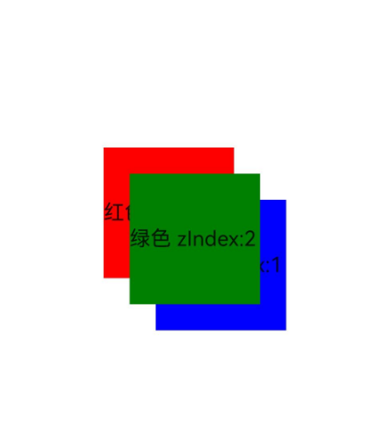

# Z-Order Control

The Z-order of a component determines its stacking order in the layout.

## Import Module

```cangjie
import kit.ArkUI.*
```

## func zIndex(?Int32)

```cangjie
func zIndex(value: ?Int32): T
```

**Function:** Sets the Z-axis level of a component.

**System Capability:** SystemCapability.ArkUI.ArkUI.Full

**Since:** 22

**Parameters:**

| Parameter | Type | Required | Default | Description |
|:---|:---|:---|:---|:---|
| value | ?Int32 | Yes | - | Defines the display hierarchy among sibling components within the same container. A higher zIndex value indicates a higher display level, meaning components with larger zIndex values will overlay those with smaller values.<br>Initial value: 0. |

**Return Value:**

| Type | Description |
|:---|:---|
| T | Returns the component instance itself that calls this interface. |

## Example Code

### Example 1 (Z-Order Control)

This example demonstrates how to use zIndex to control the stacking order of components.

<!-- run -->

```cangjie
package ohos_app_cangjie_entry
import kit.ArkUI.*
import ohos.arkui.state_macro_manage.*

@Entry
@Component
class EntryView {
    func build() {
        Stack() {
            Text("Red zIndex:0")
                .width(100)
                .height(100)
                .backgroundColor(Color.Red)
                .zIndex(0)
            
            Text("Green zIndex:2")
                .width(100)
                .height(100)
                .backgroundColor(Color.Green)
                .zIndex(2)
                .offset(x: 20.vp, y: 20.vp)
            
            Text("Blue zIndex:1")
                .width(100)
                .height(100)
                .backgroundColor(Color.Blue)
                .zIndex(1)
                .offset(x: 40.vp, y: 40.vp)
        }
        .width(100.percent)
        .height(100.percent)
    }
}
```

