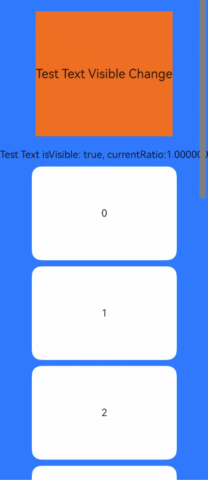

# Component Visible Area Change Event

The Component Visible Area Change Event is triggered when the display area of a component on the screen changes, providing the capability to determine whether a component is fully or partially displayed on the screen. It is suitable for scenarios such as ad exposure tracking.

## func onVisibleAreaChange(Array\<Float64>, (Bool, Float64)->Unit)

```cangjie
public func onVisibleAreaChange(raitos: Array<Float64>, event: (Bool, Float64) -> Unit): This
```

**Function:** Event triggered when the visible area of a component changes.

**System Capability:** SystemCapability.ArkUI.ArkUI.Full

**Since:** 21

**Parameters:**

| Parameter | Type | Required | Default Value | Description |
|:---|:---|:---|:---|:---|
| raitos | Array\<Float64> | Yes | - | Threshold array. Each threshold represents the ratio of the component's visible area (i.e., the area of the component displayed on the screen, calculated only within the parent component; areas outside the parent component are not counted) to the component's own area. The callback is triggered when the ratio of the component's visible area to its own area approaches any of the thresholds. Each threshold must be within the range [0.0, 1.0]. If a developer sets a threshold outside this range, it will be clamped to 0.0 or 1.0. **Note:** When the value approaches the boundaries 0 or 1, it will be rounded with an error tolerance of 0.001. For example, 0.9997 will be approximated as 1. |
| event | (Bool, Float64)->Unit | Yes | - | Callback for the component visible area change event. The first parameter indicates whether the ratio of the component's visible area to its own area has increased (true) or decreased (false) compared to the previous change. The second parameter is the ratio of the component's visible area to its own area when the callback is triggered. |

> **Notes:**
>
> - Only provides the ratio of the relative clipped area of the node itself to all ancestor nodes (up to the window boundary) and its own area, as well as the trend of change.
> - Does not support calculation of occlusion by sibling components or occlusion by sibling nodes of all ancestors, such as [Stack](../../../en/application-dev/arkui-cj/cj-layout-development-stack-layout.md#层叠布局-stack), [Z-Order Control](../../../en/application-dev/arkui-cj/cj-layout-development-stack-layout.md#z序控制), etc.
> - Does not support visible area change calculation for non-mounted nodes. For example, preloaded nodes or custom nodes mounted via the [overlay](./cj-universal-attribute-overlay.md#func-overlaystring-alignment-contentoffset) capability.

## Example Code

<!-- run -->

```cangjie
package ohos_app_cangjie_entry
import kit.ArkUI.*
import kit.PerformanceAnalysisKit.*
import ohos.arkui.state_macro_manage.*
import std.collection.ArrayList

@Entry
@Component
class EntryView {
    @State var testTextStr: String = "test"
    @State var testRowStr: String = "test"
    @State var sizeValue: String = ""
    let scroller = Scroller()
    var arr: ArrayList<String> = ArrayList(["0", "1", "2", "3", "4", "5", "6", "7", "8", "9"])

    func build() {
    Stack(alignContent: Alignment.TopStart) {
        Column {
            Column() {
                Text(this.testTextStr)
                .fontSize(20)

                Text(this.testRowStr)
                .fontSize(20)
            }
            .height(100)
            .backgroundColor(Color.Gray)
            .opacity(0.3)
        }
        Scroll(this.scroller) {
            Column() {
                Text("Test Text Visible Change")
                .fontSize(20)
                .height(200)
                .margin(20)
                .backgroundColor(Color.Green)
                // By setting raitos to [0.0, 1.0], the callback is triggered when the component is fully displayed or completely disappears from the screen
                .onVisibleAreaChange([0.0, 1.0], {isVisible, currentRatio =>
                this.sizeValue = isVisible.toString() + ", currentRatio:" + currentRatio.toString()
                if (isVisible && currentRatio >= 1.0) {
                    this.testTextStr = "Test Text is fully visible"
                    Text("Test Text is fully visible. currentRatio:" + currentRatio.toString())
                }

                if (!isVisible && currentRatio <= 0.0) {
                    this.testTextStr = "Test Text is completely invisible"
                    Text("Test Text is completely invisible.")
                }
                })
                Text("Test Text isVisible: " + this.sizeValue)

                ForEach(this.arr, itemGeneratorFunc: {item: String, idx: Int64 =>
                    Text(item.toString())
                    .width(90.percent)
                    .height(150)
                    .backgroundColor(0xFFFFFF)
                    .borderRadius(15)
                    .fontSize(16)
                    .textAlign(TextAlign.Center)
                    .margin(top: 10)
                })
            }
        }
        .backgroundColor(0x317aff)
        .scrollable(ScrollDirection.Vertical)
        .scrollBar(BarState.On)
        .scrollBarColor(Color.Gray)
        .scrollBarWidth(10)
        .onScrollEdge({ edge =>
            match(edge) {
                case Edge.Top => Hilog.info(0, "cangjie", "Top")
                case Edge.Bottom => Hilog.info(0, "cangjie", "Bottom")
                case _ => Hilog.info(0, "cangjie", "None")
             }
         })
    }
}
}
```

