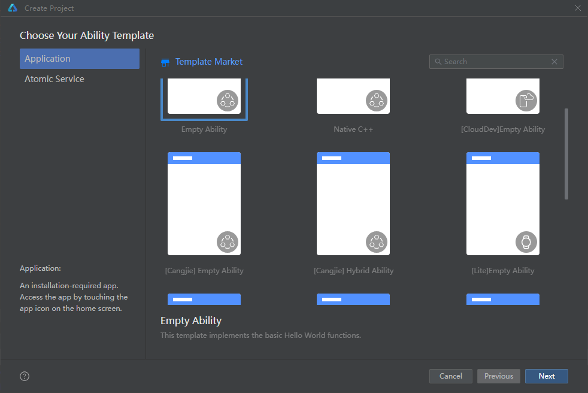
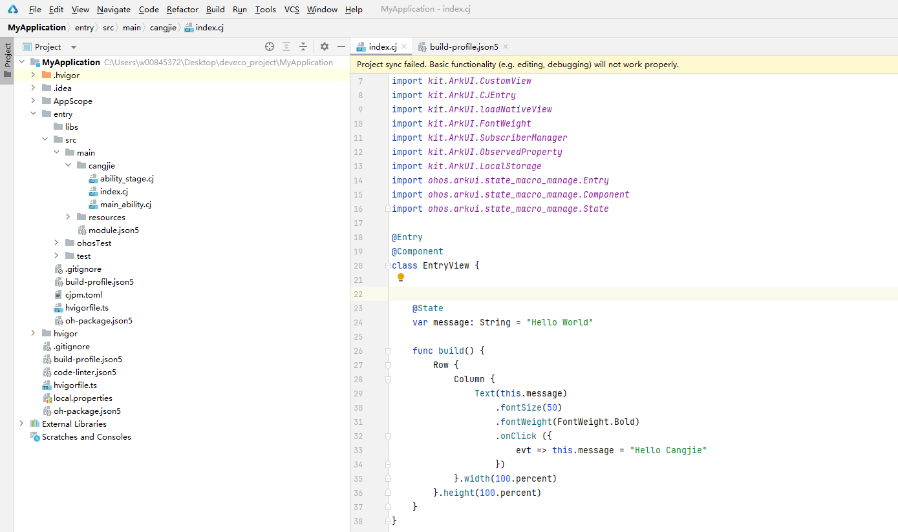

# Development Notes

The API reference is primarily intended for developers to consult various API descriptions related to application development. To facilitate developers' use of API documentation, common fields in the documentation are explained below.

## Version Notes

The version number from which a component or interface begins to be supported will be indicated in the corresponding description, e.g., **Initial Version:** 22.

## System Capability Description

System Capability (SysCap) refers to each relatively independent feature in the operating system. Different devices correspond to different sets of system capabilities, and each system capability corresponds to multiple interfaces. Developers can determine whether an interface is available based on system capabilities. For details, refer to the [SystemCapability Usage Guide](cj-syscap.md).

The documentation specifies the system capability for each interface, e.g., **System Capability:** SystemCapability.xxx.xxx.

- The SystemCapability list allows quick reference to the devices supported by specific capability sets, such as [phones](./cj-phone-syscap-list.md).
- Additionally, the system provides the `canIUse` interface, which can be used to [determine whether an API is available](cj-syscap.md#判断api是否可以使用).
- On specific device models, capabilities may exceed the default capability set defined for the project. To use such capabilities, additional configuration of custom syscap is required. Refer to [Adding Custom Syscap](./cj-syscap.md#加入自定义syscap).
- The same system capability may vary across different devices. Developers can perform [differences checks for the same capability across devices](./cj-syscap.md#不同设备相同能力的差异检查).

## Interface Usage Notes

The open capabilities (interfaces) provided by the OpenHarmony-Cangjie SDK must be imported before use. The SDK encapsulates interface modules under the same Kit, allowing developers to use the capabilities included in a Kit by importing it in sample code. The interface modules encapsulated by each Kit can be viewed in the Kit subdirectory under the SDK directory.

## Cangjie Sample Code Notes

The Cangjie samples in each Kit are not complete programs but rather key code snippets corresponding to the APIs, provided for reference only. To compile and run the code, developers must copy the samples into a Cangjie project template. The steps are as follows:

1. Create a Cangjie template project.

    

2. Upon creation, template files will be generated: `index.cj`, `main_ability.cj`, and `ability_stage.cj`.

    

3. Add the sample code to the corresponding location in `index.cj`.

    ```cangjie
    // index.cj
    package ohos_app_cangjie_entry

    import kit.ArkUI.LengthProp
    import kit.ArkUI.Column
    import kit.ArkUI.Row
    import kit.ArkUI.Text
    import kit.ArkUI.CustomView
    import kit.ArkUI.CJEntry
    import kit.ArkUI.loadNativeView
    import kit.ArkUI.FontWeight
    import kit.ArkUI.SubscriberManager
    import kit.ArkUI.ObservedProperty
    import kit.ArkUI.LocalStorage
    import ohos.arkui.state_macro_manage.Entry
    import ohos.arkui.state_macro_manage.Component
    import ohos.arkui.state_macro_manage.State

    // Define required dependencies such as classes and functions here

    @Entry
    @Component
    class EntryView {
        @State
        var message: String = "Hello World"

        func build() {
            Row {
                Column {
                    Text(this.message)
                        .fontSize(50)
                        .fontWeight(FontWeight.Bold)
                        .onClick ({
                            evt => this.message = "Hello Cangjie"
                        })
                }.width(100.percent)
            }.height(100.percent)
        }
    }
    ```

4. If the sample code involves the [Context](./AbilityKit/cj-apis-app-ability-ui_ability.md#class-context) object, define a `Global` class and assign values in the `main_ability.cj` file of the Cangjie template project. The content of `main_ability.cj` is as follows:

    ```cangjie
    import kit.AbilityKit.*
    internal import kit.AbilityKit.UIAbilityContext
    internal import kit.AbilityKit.AbilityStage
    internal import kit.ArkUI.WindowStage
    import kit.PerformanceAnalysisKit.Hilog

    class MainAbility <: UIAbility {
        public init() {
            super()
            registerSelf()
        }

        public override func onCreate(want: Want, launchParam: LaunchParam): Unit {
            HiLog.info(0, "system", "MainAbility OnCreated.${want.abilityName}")
            match (launchParam.launchReason) {
                case LaunchReason.START_ABILITY => Hilog.info(0, "AppLogCj", "START_ABILITY")
                case _ => ()
            }
        }

        public override func onWindowStageCreate(windowStage: WindowStage): Unit {
            Hilog.info(0, "system", "MainAbility onWindowStageCreate.")
            Global._abilityContext = Some(this.context)
            Global._windowStage_ = Some(windowStage)
            windowStage.loadContent("EntryView")
        }
    }

    // Define the Global class
    public class Global {
        public static var _abilityContext: Option<UIAbilityContext> = None
        public static var _windowStage: Option<WindowStage> = None
        public static prop abilityContext: UIAbilityContext {
            get() {
                match (this._abilityContext) {
                    case Some(context) => context
                    case None => throw Exception("Global.abilityContext is not set")
                }
            }
        }
        public static prop windowStage: WindowStage {
            get() {
                match (this._windowStage) {
                    case Some(stage) => stage
                    case None => throw Exception("Global.windowStage is not set")
                }
            }
        }
    }
    ```

## Permission Notes

By default, applications can only access limited system resources. However, in certain cases, applications may need to access additional system or other applications' data (including user personal data) or functionalities to extend their capabilities. For details, refer to the [Application Permission Management Overview](../../application-dev/security/AccessToken/cj-app-permission-mgmt-overview.md).

When calling interfaces to access these resources, corresponding permissions must be requested. The request method can be found in the [Access Control Development Guide](../../application-dev/security/AccessToken/cj-determine-application-mode.md).

- If an application requires a specific permission to call an interface, it will be indicated in the interface description: **Required Permission:** ohos.permission.xxxx.
- If no permissions are required to call the interface, no special note will be provided.

## Application Model Notes

As the system evolves, two application models have been introduced: the FA model and the Stage model.

Currently, Cangjie APIs are only available under the Stage model.

## Deprecated Interface Notes

Deprecated interfaces are marked with the superscript "<sup>deprecated</sup>", indicating that the interface is no longer recommended for use.

Compatibility is maintained for five API levels starting from the deprecated version, but this behavior is not recommended.

- For interfaces with alternative APIs, developers are advised to review the new interface documentation and adapt as soon as possible.
- If no alternative interface is available, developers should refer to the deprecation notes and change logs (changelog) to adjust their implementation.