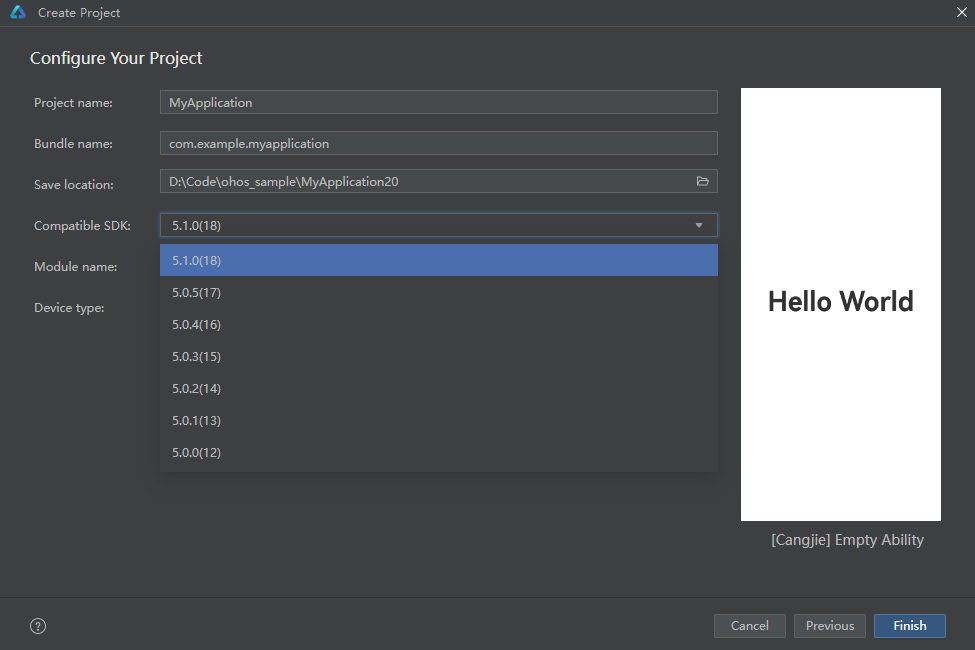

# API Labeling Control

<!--Del-->
> **Note:**
>
> Currently in the beta phase.
<!--DelEnd-->

## Overview

Typically, developers need to label certain APIs to restrict their usage in different locations within the source code. Global labels are obtained from the Cangjie project created by Deveco Studio. For example, if the created project is version 6.0.2, its global API level will be 22. Labeled APIs must comply with the global label configuration to be legally used.

To achieve API labeling control, the Cangjie language introduces the `@IfAvailable` macro expression. Based on global label settings, it provides finer-grained control over the usage of labeled APIs. `@IfAvailable` must be used in conjunction with the custom annotation `APILevel`. This chapter will introduce the functionality and usage of `@IfAvailable`.

## Syntax of `@IfAvailable`

<!-- compile -->

```cangjie
@IfAvailable(<label>: <value>, <lambda1>, <lambda2>)
```

Where:

- `<label>` is the parameter name of the custom annotation `APILevel`;
- `<value>` is the parameter of the annotation type, supporting only literal expressions;
- `<label>: <value>` constitutes the condition for `@IfAvailable`;
- `<lambda1>` and `<lambda2>` must comply with Lambda expression syntax and are restricted to parameterless forms. The return types of `<lambda1>` and `<lambda2>` are inferred by the compiler as `Unit`.

## Semantics of `@IfAvailable`

If the condition of `@IfAvailable` is satisfied at runtime, the function body of `<lambda1>` will be executed; otherwise, the function body of `<lambda2>` will be executed. All symbols called in `<lambda1>` will be marked as weak symbols, meaning they are not required to be found during compilation and linking.

In a Cangjie project, the dependency packages required by `@IfAvailable` must be imported manually depending on the check type: `level` checks depend on `ohos.device_info`, and `syscap` checks depend on `ohos.base`.

### `level` Check

In the `@IfAvailable` macro expression, when `<label>` is specified as `level`, this check takes effect.

In any scope, calling APIs with a higher Level than the current scope is prohibited. That is, `<lambda1>` must not call APIs higher than the value specified by `<value>` in `level: <value>`, and `<lambda2>` must not call APIs higher than the Level of the current project.

### `syscap` Check

In the `@IfAvailable` macro expression, when `<label>` is specified as `syscap`, this check takes effect.

> **Note:**
>
> - **Intersection**: The set of capabilities supported by all devices simultaneously;
> - **Union**: The set of capabilities supported by at least one device.

**Check Rules:**

- No error is reported when the called API satisfies the **intersection**;
- A compilation warning is issued when the called API does not satisfy the **intersection** but satisfies the **union**;
- A compilation error is reported when the called API satisfies neither the **intersection** nor the **union**.

In any scope, calling APIs not supported by any device is prohibited, while calling APIs with syscap in the **intersection** or **union** is allowed. `@IfAvailable` can add capabilities to the **intersection** and **union**, meaning `<lambda1>` can call APIs with the syscap specified by `<value>` in `syscap: <value>`, while `<lambda2>` cannot.

## Usage Examples of `@IfAvailable`

### Using `IfAvailable` to Control `APILevel`

Prerequisite: Provide APIs with different labels:

<!-- compile -pkg0 -->

```cangjie
package ohos.sample

import kit.PerformanceAnalysisKit.Hilog
import ohos.labels.APILevel

@!APILevel[since: "23"]
public func f23() {
    Hilog.info(0, "", "level-23")
}

@!APILevel[since: "24"]
public func f24() {
    Hilog.info(0, "", "level-24")
}

@!APILevel[since: "26.0.0"]
public func f26() {
    Hilog.info(0, "", "level-26")
}
```

Assuming `ohos.sample` is a package provided by the SDK, users can select the desired APILevel when using the Cangjie project in Deveco Studio, taking a project with compatibleSDKVersion 23 as an example:



When using `@IfAvailable`, `<label>: <value>` is `level: xx`, where `xx` can be an integer literal (e.g., `24`) or a three-segment string literal (e.g., `"26.0.0"`).

<!-- compile -pkg0 -->

```cangjie
import ohos.sample.*
import ohos.device_info.*

func demo() {
    @IfAvailable(level: 24, { =>
        // Compile-time: This scope allows calling APIs with level 24 or lower. That is, this branch can use f23 and f24, but calling higher-level interfaces (e.g., f26) will result in a compilation error.
        // Runtime: If the execution device supports level 24, this branch will be executed.
        f23()
        f24()
        f26() // compile error
    }, { =>
        // Compile-time: This scope uses the capabilities provided by the project, allowing calls to APIs with level 23 or lower. That is, this branch can use f23, but calling higher-level interfaces will result in a compilation error.
        // Runtime: If the execution device supports level 23, this branch will be executed.
        f23()
        f24() // compile error
        f26() // compile error
    })
}
```

A three-segment string form can also be used to specify the version:

<!-- compile -pkg0 -->

```cangjie
import ohos.sample.*
import ohos.device_info.*

func demo() {
    @IfAvailable(level: "26.0.0", { =>
        // Compile-time: This scope allows calling APIs with since "26.0.0" or lower.
        // Runtime: If the execution device supports version "26.0.0", this branch will be executed.
        f23()
        f24()
        f26()
    }, { =>
        // Compile-time: This scope uses the capabilities provided by the project, allowing calls to APIs with level 23 or lower.
        f23()
        f24() // compile error
        f26() // compile error
    })
}
```

### Using `IfAvailable` to Control `syscap`

Prerequisite: Provide APIs with different `syscap` labels:

<!-- compile -pkg1 -->

```cangjie
package ohos.sample

import kit.PerformanceAnalysisKit.Hilog
import ohos.labels.APILevel

@!APILevel[since: "22", syscap: "SystemCapability.A"]
public func f1() {
    Hilog.info(0, "", "SystemCapability.A")
}

@!APILevel[since: "22", syscap: "SystemCapability.B"]
public func f2() {
    Hilog.info(0, "", "SystemCapability.B")
}

@!APILevel[since: "22", syscap: "SystemCapability.C"]
public func f3() {
    Hilog.info(0, "", "SystemCapability.C")
}

@!APILevel[since: "22", syscap: "SystemCapability.D"]
public func f4() {
    Hilog.info(0, "", "SystemCapability.D")
}
```

Deveco Studio reads the SystemCapability supported by all devices by default to check whether labeled APIs are allowed in the scope.

Assuming `ohos.sample` is the SDK, Device 1's syscap is `["SystemCapability.A", "SystemCapability.B"]`, and Device 2's syscap is `["SystemCapability.B", "SystemCapability.C"]`.

When using `@IfAvailable`, `<label>: <value>` is `syscap: "SystemCapability.xx"`, where `"SystemCapability.xx"` is a string literal.

<!-- compile -pkg1 -->

```cangjie
import ohos.sample.*
import ohos.base.*

func demo() {
    @IfAvailable(syscap: "SystemCapability.D", { =>
        // This scope allows the highest usage of ["SystemCapability.A", "SystemCapability.B", "SystemCapability.C", "SystemCapability.D"], where:
        // ["SystemCapability.B", "SystemCapability.D"] will not trigger warnings;
        // ["SystemCapability.A", "SystemCapability.C"] will trigger warnings;
        // Anything outside ["SystemCapability.A", "SystemCapability.B", "SystemCapability.C", "SystemCapability.D"] will result in an error.
        f1() // warning
        f2() // ok
        f3() // warning
        f4() // ok
    }, { =>
        // This scope allows the highest usage of ["A", "B", "C"], where:
        // ["B"] will not trigger warnings;
        // ["A", "C"] will trigger warnings;
        // Anything outside ["A", "B", "C"] will result in an error.
        f1() // warning
        f2() // ok
        f3() // warning
        f4() // error
    })
}
```
