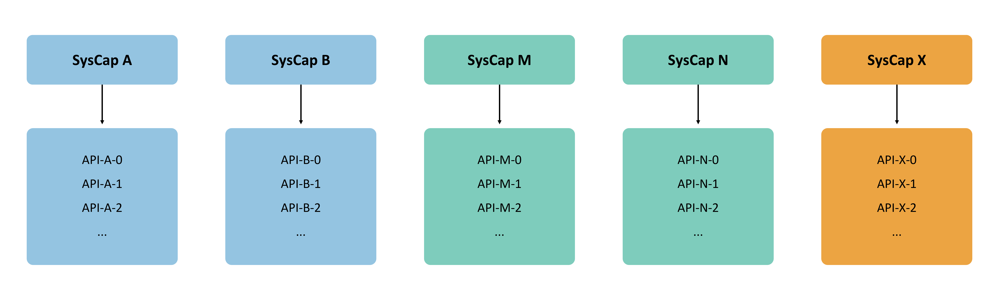
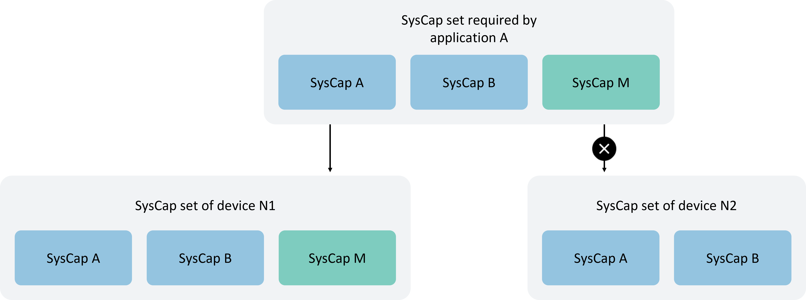
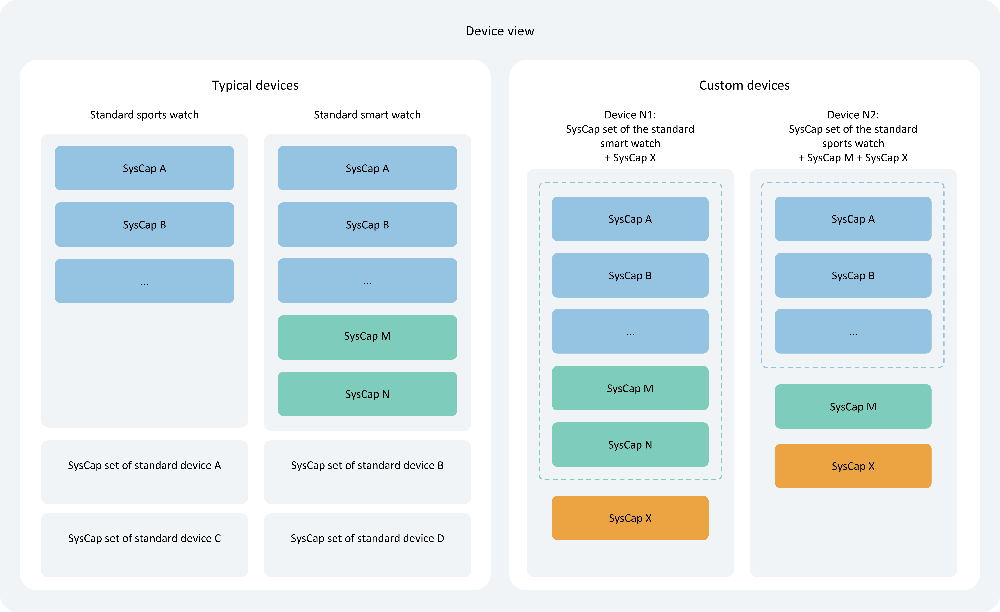
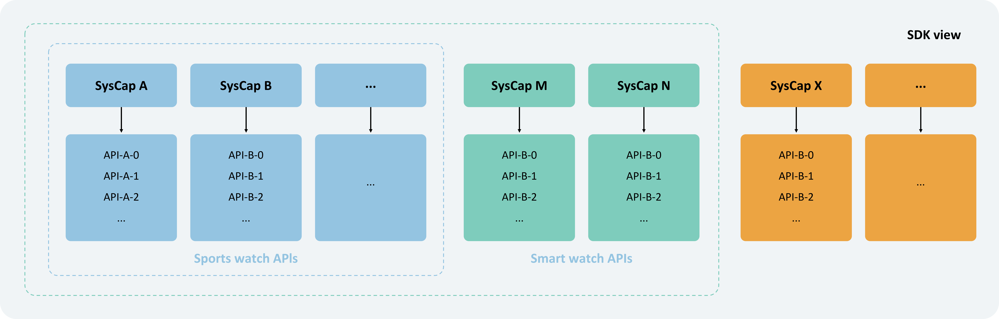
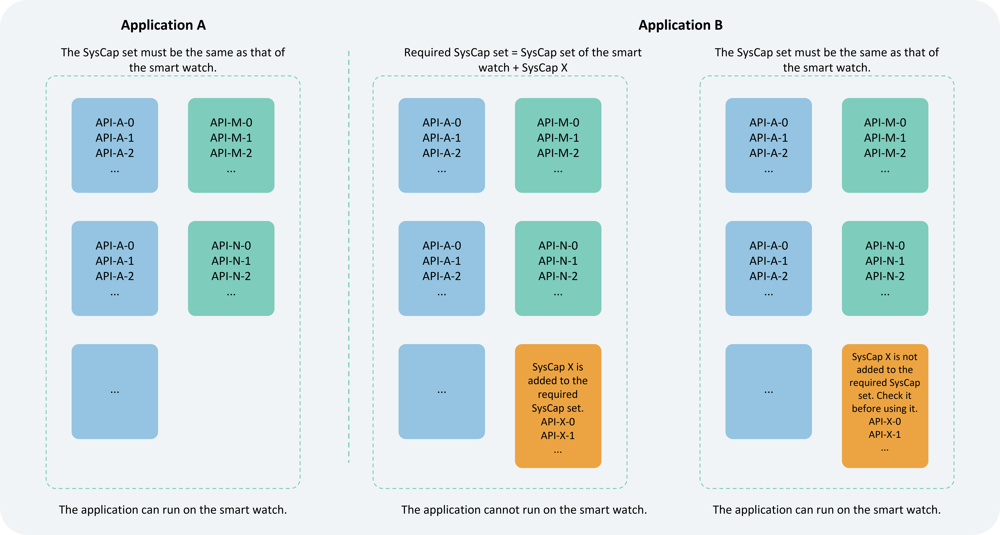
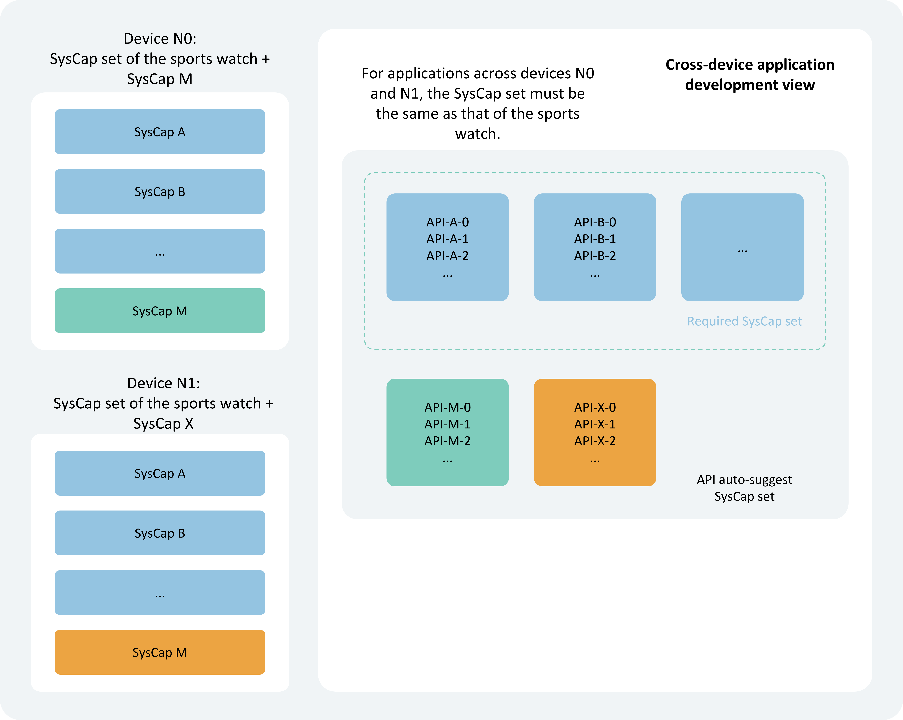
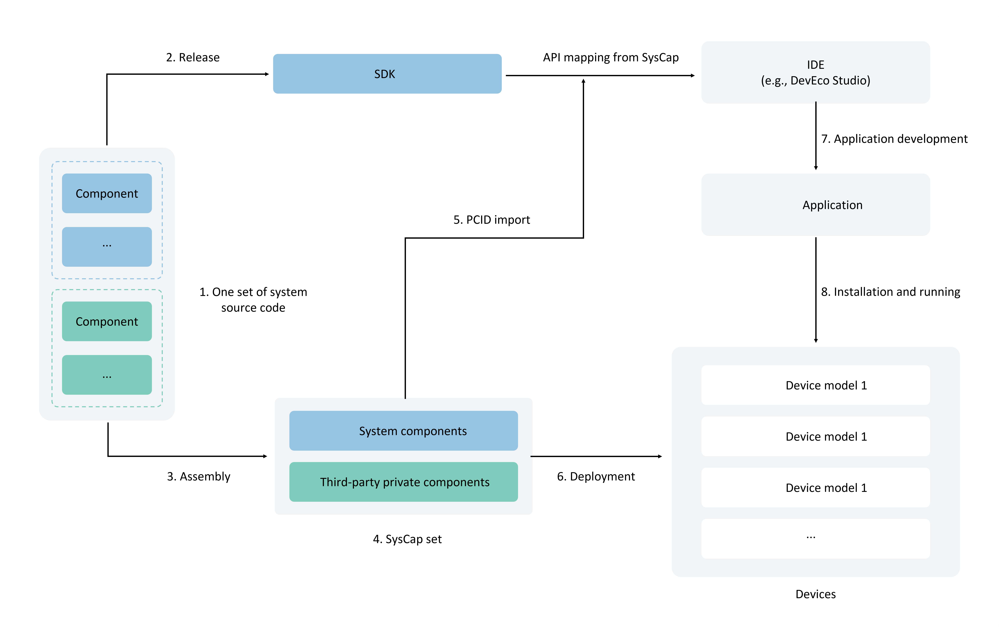

# SystemCapability Usage Guide

<!--Del-->
> **Note:**
>
> Currently in the beta phase.
<!--DelEnd-->

## Overview

### SystemCapability and APIs

SysCap, short for SystemCapability, refers to each relatively independent feature in the operating system. Examples include Bluetooth, WiFi, NFC, camera, etc., each being a system capability. Each system capability corresponds to multiple APIs, which coexist or disappear depending on whether the target device supports that system capability. These are also provided to developers for code completion in DevEco Studio.



Developers can query OpenHarmony's capability set in the [SysCap List](cj-phone-syscap-list.md).

### Supported Capability Set, Suggested Capability Set, and Required Capability Set

Supported Capability Set, Suggested Capability Set, and Required Capability Set are all collections of system capabilities.

- **Supported Capability Set** describes device capabilities.
- **Required Capability Set** describes application capabilities. 
  
If the Required Capability Set of Application A is a subset of the Supported Capability Set of Device N, then Application A can be distributed and installed on Device N; otherwise, it cannot.

- **Suggested Capability Set** refers to the collection of system capabilities for which DevEco Studio can provide API suggestions during application development.



### Devices and Supported Capability Set

Each device corresponds to a different Supported Capability Set based on its hardware capabilities.

The SDK categorizes devices into two groups: 
1. **Typical Devices**: Their Supported Capability Sets are defined by OpenHarmony.
2. **Custom Devices**: Their Supported Capability Sets are provided by device manufacturers.



### Device and SDK Capability Correspondence

The SDK provides the full set of APIs to DevEco Studio. DevEco Studio identifies the device type selected in the developer's project, locates the device's Supported Capability Set, filters the APIs included in that set, and provides API suggestions.



## SysCap Development Guide

### Obtaining PCID

PCID, short for Product Compatibility ID, contains SysCap information supported by the current device. A certification center for obtaining PCIDs of all devices is under construction. Currently, you need to contact the manufacturer of the corresponding device to obtain its PCID.

### Configuring Suggested Capability Set and Required Capability Set

DevEco Studio automatically configures the Suggested Capability Set and Required Capability Set based on the project settings. Developers can also modify them manually.

- **Suggested Capability Set**: By adding more system capabilities, developers can access more APIs in DevEco Studio. However, note that these APIs may not be supported on the target device and should be checked before use.
- **Required Capability Set**: Developers should exercise caution when modifying this set, as improper changes may prevent the application from being distributed to the target device.

```json
// syscap.json
{
 "devices": {
  "general": [            // Each typical device corresponds to a SysCap Supported Capability Set. Multiple typical devices can be configured.
   "default",
   "car"
  ],
  "custom": [             // Manufacturer-defined custom devices
   {
    "CustomDevice": [
     "SystemCapability.Communication.SoftBus.Core"
    ]
   }
  ]
 },
 "development": {             // The union of the SysCap set in addedSysCaps and the SysCap sets supported by devices configured in 'devices' forms the Suggested Capability Set.
  "addedSysCaps": [
   "SystemCapability.Location.Location.Lite"
  ]
 },
 "production": {              // Used to generate RPCID. Add with caution, as it may prevent app distribution to target devices.
  "addedSysCaps": [],      // The intersection of SysCap sets supported by devices configured in 'devices', plus the addedSysCaps set minus the removedSysCaps set, forms the Required Capability Set.
  "removedSysCaps": []     // The app can only be distributed to a device if this Required Capability Set is a subset of the device's Supported Capability Set.
 }
}
```

### Single-Device Application Development

By default, the Suggested Capability Set and Required Capability Set of an application are equal to the device's Supported Capability Set. Developers should modify the Required Capability Set with caution.



### Cross-Device Application Development

By default, the Suggested Capability Set of an application is the union of the Supported Capability Sets of multiple devices, while the Required Capability Set is the intersection.



### Checking API Availability

The Cangjie API is provided to help determine whether a specific API is available.

```cangjie
import ohos.base.canIUse

if(canIUse("SystemCapability.ArkUI.ArkUI.Full")){
    Hilog.info(0, "SysCap", "Supports SystemCapability.ArkUI.ArkUI.Full")
}else{
    Hilog.info(0, "SysCap", "Does not support SystemCapability.ArkUI.ArkUI.Full")
}
```

### Checking Capability Differences Across Devices

Even for the same system capability, there may be differences across devices. For example, the camera capability on a tablet is superior to that on a smart wearable device.

```cangjie
import ohos.base.*
import kit.UserAuthenticationKit.*
import kit.PerformanceAnalysisKit.Hilog

try {
    let userAuthInstance = getUserAuthInstance(
        AuthParam([], [UserAuthType.PIN], AuthTrustLevel.ATL1),
        WidgetParam("TEST PIN_ATL1", "")
    )
    userAuthInstance.on("result", {u => userAuthInstance.off("result")})
    userAuthInstance.start()
} catch (e: Exception) {
    Hilog.error(0, "AppLogCj", "auth catch error: ${e.toString()}")
}
```

### How SysCap Differences Between Devices Arise

SysCap varies across devices due to different component assemblies by product solution vendors. The overall process is as follows:



1. The OpenHarmony source code consists of optional and mandatory components. Different components map to different system capabilities (SysCap).
2. A normalized SDK is released, with APIs mapped to SysCap.
3. Product solution vendors assemble components based on hardware capabilities and product requirements.
4. The configured components can be system components or third-party private components. Since components map to SysCap, the assembled product yields its SysCap set.
5. The SysCap set is encoded into a PCID (Product Compatibility ID). Developers can import the PCID into DevEco Studio, decode it into SysCap, and handle compatibility differences during development.
6. The system parameters deployed on the device include the SysCap set. The system provides native and application interfaces to query whether a specific SysCap exists.
7. During app development, the required SysCap is encoded into an RPCID (Required Product Compatibility ID) and written into the app installation package. During installation, the package manager decodes the RPCID to obtain the required SysCap and compares it with the device's SysCap. If all required SysCap are met, the installation succeeds.
8. During runtime, apps can query the device's SysCap using the `canIUse` interface to ensure compatibility across devices.