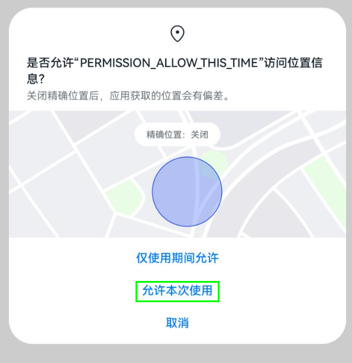
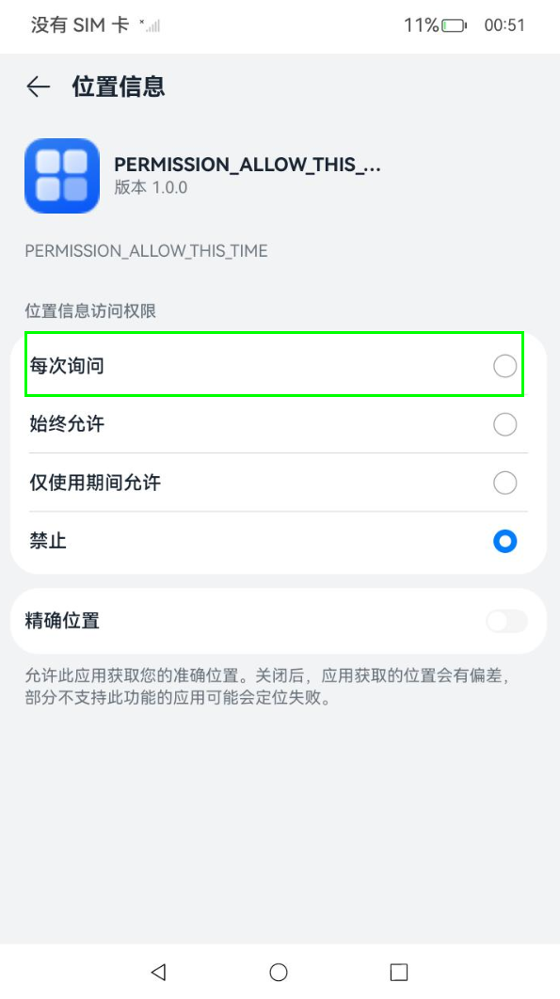

# Requesting One-Time Authorization from Users

<!--Del-->
> **Note:**
>
> Currently in the beta phase.
<!--DelEnd-->

Based on the principle of minimal authorization to prevent applications from obtaining and misusing user data, a new "Allow this time" authorization option has been added to the pop-up window when requesting sensitive permissions from users.

When developing applications, developers do not need additional configurations. They can still call `requestPermissionsFromUser()` [Request User Authorization](./cj-request-user-authorization.md). The system will display the corresponding pop-up window based on the [supported permissions](#supported-scope) of this capability.

The authorization pop-up window is shown below:

<!--RP1-->

The options in Settings are shown below:

Path: Settings > Privacy > Permission Management > Applications > Target Application > Location
<!--RP1End-->

## Supported Scope

Currently, only the following permissions are supported. When an application requests these permissions from users, the pop-up window will display the "Allow this time" authorization option, and the "Ask every time" authorization option will appear when modifying permissions in Settings.

- Clipboard: ["ohos.permission.READ_PASTEBOARD"](./cj-restricted-permissions.md#ohospermissionread_pasteboard)
- Approximate Location: ["ohos.permission.APPROXIMATELY_LOCATION"](./cj-permissions-for-all-user.md#ohospermissionapproximately_location)
- Location: ["ohos.permission.LOCATION"](./cj-permissions-for-all-user.md#ohospermissionlocation)
- Background Location: ["ohos.permission.LOCATION_IN_BACKGROUND"](./cj-permissions-for-all-user.md#ohospermissionlocation_in_background)

## Usage Restrictions

- When a user clicks the "Allow this time" button, the application will be granted temporary permission. A timer will start, and after ten seconds, the temporary permission will be revoked. To obtain it again, the user must re-grant the permission.

- When a user selects the "Ask every time" option in the permission settings, the application will be granted temporary permissions for approximate location and location. The revocation of temporary permissions follows the same process as above.