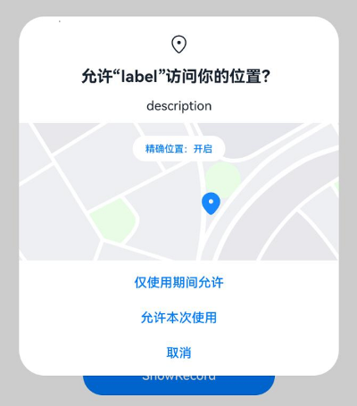

# Requesting User Authorization

When an application needs to access user privacy information or utilize system capabilities—such as obtaining location data, accessing calendars, using the camera to take photos, or recording videos—it must request user authorization. These permissions are classified as `user_grant` permissions.

When applying for `user_grant` permissions, the following steps must be completed:

1. Declare the required permissions in the configuration file.

2. Associate the target objects in the application that require permissions with the corresponding permissions, ensuring users clearly understand which operations necessitate granting specific permissions.

    For these two steps, refer to the section [Declaring Permissions](./cj-declare-permissions.md).

3. During runtime, when a user triggers an operation that accesses the target object, invoke the appropriate interface to precisely trigger the dynamic authorization dialog. This interface internally checks whether the user has already granted the required permissions. If not, it will display the dynamic authorization dialog to request user authorization.

4. Verify the user's authorization result. Proceed with further operations only after confirming the user has granted the necessary permissions.

This section explains how to complete steps 3 and 4.

## Constraints and Limitations

- Authorization for `user_grant` permissions must adhere to the principle of user awareness and control. Applications must actively call the system's dynamic permission request interface during runtime. The system dialog prompts the user for authorization, allowing them to assess the reasonableness of the requested sensitive permissions based on the application's operational context and make an informed decision.

- The system discourages frequent pop-ups that disrupt the user experience. If a user denies authorization, the dialog cannot be triggered again. The application must guide the user to manually grant permissions in the system "Settings" app.

- System permission dialogs must not be obscured.

  System permission dialogs must not be overlapped by other components/controls. The dialog content must be fully displayed so users can recognize and complete the authorization action.

  If a system permission dialog and other components/controls appear simultaneously at the same location, the system permission dialog will default to overlaying the other components/controls.

- Before performing any operation that requires a target permission, the application must verify whether it already has that permission.

  To check if the user has granted a specific permission to your application, use the [checkAccessToken()](../../../../en/application-dev/reference/AbilityKit/cj-apis-ability_access_ctrl.md#func-checkaccesstokenuint32-permissions) function. This method returns either [PERMISSION_GRANTED](../../../../en/application-dev/reference/AbilityKit/cj-apis-ability_access_ctrl.md#enum-grantstatus) or [PERMISSION_DENIED](../../../../en/application-dev/reference/AbilityKit/cj-apis-ability_access_ctrl.md#enum-grantstatus). Refer to the example below for details.

- Before accessing any interface protected by a target permission, you must use the [requestPermissionsFromUser()](../../../../en/application-dev/reference/AbilityKit/cj-apis-ability_access_ctrl.md#func-requestpermissionsfromuseruiabilitycontext-arraypermissions-asynccallbackexpermissionrequestresult) interface to request the corresponding permission.

  Users may revoke previously granted permissions via system settings, so the authorization state should not be persisted.

- When requesting permissions in the `onWindowStageCreate()` callback, ensure the asynchronous interfaces `loadContent()`/`setUIContent()` have completed execution, or call [requestPermissionsFromUser()](../../../../en/application-dev/reference/AbilityKit/cj-apis-ability_access_ctrl.md#func-requestpermissionsfromuseruiabilitycontext-arraypermissions-asynccallbackexpermissionrequestresult) within their callbacks. Otherwise, `requestPermissionsFromUser` will fail if called before Content loading is complete.
  <!--RP1--><!--RP1End-->

## Development Steps

The following example demonstrates how to request location permissions.

**Effect Demonstration:**

<!--RP4-->

<!--RP4End-->

1. Request the `ohos.permission.LOCATION` and `ohos.permission.APPROXIMATELY_LOCATION` permissions. For configuration details, refer to [Declaring Permissions](./cj-declare-permissions.md).

2. Verify current authorization status.

    Before requesting permissions, check whether the application has already been granted the permissions. Use the [checkAccessToken()](../../../../en/application-dev/reference/AbilityKit/cj-apis-ability_access_ctrl.md#func-checkaccesstokenuint32-permissions) method to verify the current authorization status. If permissions are already granted, proceed with the target operation. Otherwise, proceed to the next step: requesting user authorization.

    <!-- compile -->

    ```cangjie
    import kit.AbilityKit.{Permissions, AbilityAccessCtrl, GrantStatus, BundleManager, BundleFlag}
    import ohos.hilog.Hilog
    import ohos.bundle.bundle_manager.BundleInfo

    func checkPermissionGrant(permission: Permissions): GrantStatus {
        try {
            // Get the application's accessTokenID
            let tokenID = BundleManager.getBundleInfoForSelf(BundleFlag.GET_BUNDLE_INFO_WITH_APPLICATION).appInfo.accessTokenId
            let atManager = AbilityAccessCtrl.createAtManager()
            // Check if the permission is granted
            return atManager.checkAccessToken(tokenID, permission)
        } catch(e: Exception) {
            Hilog.error(0,"","checkAccessToken Exception: ${e}")
            throw e
        }
    }

    func checkPermissions(): Unit {
        let grantStatus1: Bool = (checkPermissionGrant("ohos.permission.LOCATION") == GrantStatus.PermissionGranted)
        let grantStatus2: Bool = (checkPermissionGrant("ohos.permission.APPROXIMATELY_LOCATION") == GrantStatus.PermissionDenied)
        // Precise location permission (ohos.permission.LOCATION) can only be requested alongside approximate location permission (ohos.permission.APPROXIMATELY_LOCATION), or if approximate location permission is already granted.
        if (grantStatus2 && !grantStatus1) {
            // Approximate location permission granted, precise location permission not granted
            Hilog.info(0,"","Only APPROXIMATELY_LOCATION is granted")
        } else if (!grantStatus1 && !grantStatus2) {
            // Neither precise nor approximate location permissions granted. Request both or only approximate location permission.
            Hilog.info(0,"","LOCATION and APPROXIMATELY_LOCATION not granted")
        } else {
            // Permissions granted; proceed with target operation
            Hilog.info(0,"","LOCATION and APPROXIMATELY_LOCATION are granted")
        }
    }
    ```

3. Dynamically request user authorization.

    Dynamic permission requests involve prompting the user for authorization during runtime. Use the [requestPermissionsFromUser()](../../../../en/application-dev/reference/AbilityKit/cj-apis-ability_access_ctrl.md#func-requestpermissionsfromuseruiabilitycontext-arraypermissions-asynccallbackexpermissionrequestresult) method, which accepts a list of permissions (e.g., location, calendar, camera, microphone). The user can choose to grant or deny the permissions.

    You can call [requestPermissionsFromUser()](../../../../en/application-dev/reference/AbilityKit/cj-apis-ability_access_ctrl.md#func-requestpermissionsfromuseruiabilitycontext-arraypermissions-asynccallbackexpermissionrequestresult) in the `onWindowStageCreate()` callback of an Ability to request permissions dynamically or trigger the request via UI interactions based on business needs.

    When requesting permissions in the `onWindowStageCreate()` callback, ensure `loadContent()`/`setUIContent()` has completed execution, or call [requestPermissionsFromUser()](../../../../en/application-dev/reference/AbilityKit/cj-apis-ability_access_ctrl.md#func-requestpermissionsfromuseruiabilitycontext-arraypermissions-asynccallbackexpermissionrequestresult) within their callbacks. Otherwise, the call will fail if made before Content loading is complete.

    <!--RP1--><!--RP1End-->

    <!--RP2-->

    - Request authorization in a UIAbility.

        <!-- compile -->

        ```cangjie
        // main_ability.cj
        import kit.AbilityKit.*
        import ohos.hilog.Hilog
        import ohos.business_exception.*
        import ohos.window.WindowStage

        class MainAbility <: UIAbility {
            // ...
            public override func onWindowStageCreate(windowStage: WindowStage): Unit {
                Hilog.info(0,"","MainAbility onWindowStageCreate.")
                windowStage.loadContent("EntryView")
                // Set callback
                var resultCallback = {
                    errorCode: Option<BusinessException>, data: Option<PermissionRequestResult> => match (errorCode) {
                        case Some(e) => Hilog.error(0,"","requestPermissionsFromUser failed, errcode: ${e.code}")
                        case _ =>
                            match (data) {
                                case Some(value) =>
                                    for (i in (0..value.permissions.size)) {
                                        if (value.authResults[i] == 0) {
                                            // User granted permission
                                            Hilog.info(0,"","permission: ${value.permissions[i]} is granted.")
                                        } else {
                                            // User denied permission. Notify the user that authorization is required for current functionality and guide them to system settings.
                                            Hilog.info(0,"","permission: ${value.permissions[i]} is denied by user.")
                                        }
                                    }
                                case _ => Hilog.error(0,"","requestPermissionsFromUser error: data is null")
                            }
                    }
                }
                let permissionList = ["ohos.permission.LOCATION", "ohos.permission.APPROXIMATELY_LOCATION"]
                let atManager = AbilityAccessCtrl.createAtManager()
                // Request permissions. requestPermissionsFromUser checks the current authorization status to determine whether to show the dialog.
                atManager.requestPermissionsFromUser(this.context, permissionList, resultCallback)
            }
        }
        ```

    - Request authorization in the UI.

        1. Obtain the context.

            <!-- compile -->

            ```cangjie
            // main_ability.cj
            import kit.AbilityKit.*
            import ohos.window.WindowStage
            import ohos.hilog.Hilog

            var globalAbilityContext: Option<UIAbilityContext> = Option<UIAbilityContext>.None

            class MainAbility <: UIAbility {
                public init() {
                    super()
                    registerSelf()
                }

                public override func onCreate(want: Want, launchParam: LaunchParam): Unit {
                    Hilog.info(0,"","MainAbility OnCreated.${want.abilityName}")
                    // Obtain the context
                    globalAbilityContext = Option<UIAbilityContext>.Some(this.context)
                    match (launchParam.launchReason) {
                        case LaunchReason.StartAbility => Hilog.info(0,"","START_ABILITY")
                        case _ => ()
                    }
                }

                public override func onWindowStageCreate(windowStage: WindowStage): Unit {
                    Hilog.info(0,"","MainAbility onWindowStageCreate.")
                    windowStage.loadContent("EntryView")
                }
            }
            ```

        2. Request permissions.

            <!-- compile -->

            ```cangjie
            // index.cj
            import kit.AbilityKit.*
            import ohos.business_exception.*
            import ohos.hilog.Hilog
            import ohos.arkui.component.button.Button
            import ohos.arkui.state_macro_manage.Entry
            import ohos.arkui.state_macro_manage.Component
            

            @Entry
            @Component
            class EntryView {
                // Request permissions
                func requestPermissons(): Unit {
                    var resultCallback = {
                        errorCode: Option<BusinessException>, data: Option<PermissionRequestResult> => match (errorCode) {
                            case Some(e) => Hilog.info(0,"","permissionResultCallBack request error: errcode: ${e.code}")
                            case _ =>
                                match (data) {
                                    case Some(value) =>
                                        for (i in (0..value.permissions.size)) {
                                            if (value.authResults[i] == 0) {
                                                // User granted permission
                                                Hilog.info(0,"","permission: ${value.permissions[i]} is granted.")
                                            } else {
                                                // User denied permission. Notify the user that authorization is required for current functionality and guide them to system settings.
                                                Hilog.info(0,"","permission: ${value.permissions[i]} is denied by user.")
                                            }
                                        }
                                    case _ => Hilog.info(0,"","permissionResultCallBack request error: data is null")
                                }
                        }
                    }
                    let atManager = AbilityAccessCtrl.createAtManager()
                    let stageContext = Global.abilityContext
                    let permissionList = ["ohos.permission.LOCATION", "ohos.permission.APPROXIMATELY_LOCATION"]
                    atManager.requestPermissionsFromUser(stageContext, permissionList, resultCallback)
                }

                func build() {
                    Row {
                        Column {
                            Button("requestPermissons").onClick {
                                evt => Hilog.info(0,"","Hello Cangjie")
                                // Trigger permission request on button click
                                requestPermissons()
                            }.fontSize(30).height(50)

                        }.width(100.percent)
                    }.height(100.percent)
                }
            }
            ```

    <!--RP2End-->

4. Handle authorization results.

    After calling [requestPermissionsFromUser()](../../../../en/application-dev/reference/AbilityKit/cj-apis-ability_access_ctrl.md#func-requestpermissionsfromuseruiabilitycontext-arraypermissions-asynccallbackexpermissionrequestresult), the application awaits the user's decision. If granted, proceed with the target operation. If denied, notify the user that authorization is required for current functionality and guide them to the system "Settings" app to enable the permissions.
    <!--RP3-->

    Path: Settings > Privacy > Permission Management > Apps > Target App<!--RP3End-->