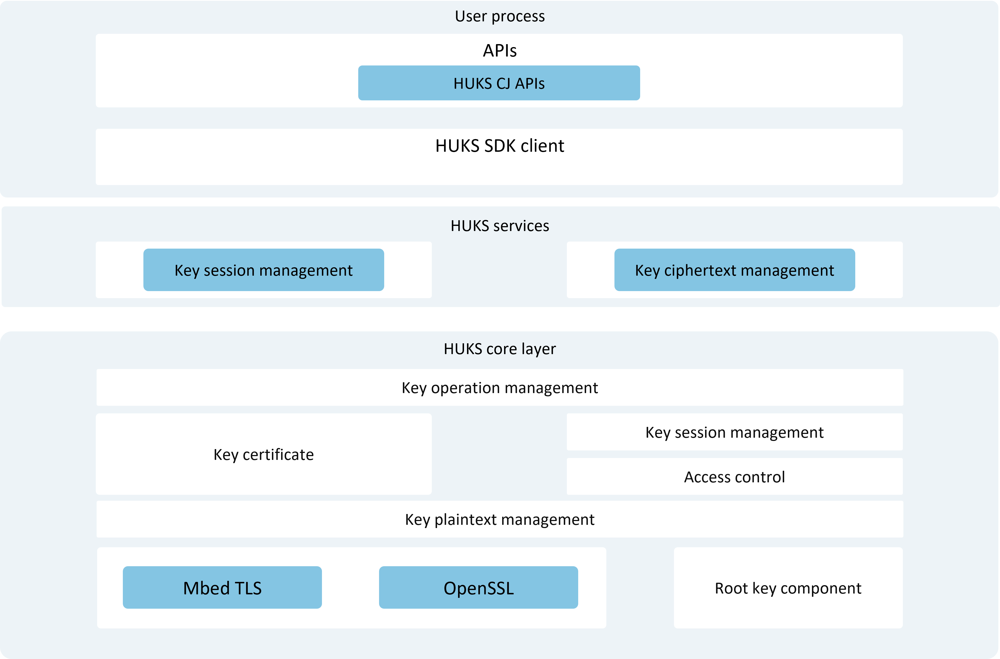

# Introduction to Universal Keystore Kit  

Universal Keystore Kit (Key Management Service, hereinafter referred to as HUKS) provides businesses/applications with unified and secure key operation capabilities, including key management (key generation/destruction, key import, key attestation, key agreement, key derivation) and key usage (encryption/decryption, signing/verification, access control).  

Keys managed by HUKS can be imported by businesses/applications or generated by calling HUKS interfaces. Additionally, HUKS offers key access control capabilities to ensure that keys stored in HUKS are accessed legally and correctly.  

## Overall Architecture  

As shown in the diagram, the HUKS module can be divided into the following three major components:  

- **SDK**: Provides key management interfaces for developers to invoke.  
- **HUKS Service Layer**: Implements key session management and storage management.  
- **HUKS Core Layer**: Hosts the core functionalities of HUKS, including cryptographic operations on keys, encryption/decryption of plaintext keys, and key access control.  

> **Note:**  
>  
> For systems/devices equipped with a secure environment (e.g., [TEE](./cj-huks-concepts.md), secure chip), the HUKS Core Layer must operate within the secure environment. Since the secure environment relies on hardware support, the open-source repository only provides a simulated implementation, requiring adaptation by OEM vendors.  

  

## Core Features  

HUKS provides developers with full lifecycle key management capabilities. Its core features are categorized by the key lifecycle as follows:  

### Key Generation  

| Feature | Description |  
| -------- | -------- |  
| **[Key Generation](./cj-huks-key-generation-overview.md)** | Randomly generates keys, ensuring that their plaintext is only accessed within the secure environment throughout the key's lifecycle and never transmitted outside the secure environment. |  
| **[Key Import](./cj-huks-key-import-overview.md)** | Allows businesses to import externally generated keys into HUKS for management. |  

### Key Usage  

| Feature | Description |  
| -------- | -------- |  
| **[Encryption/Decryption](./cj-huks-encryption-decryption-overview.md)** | Uses keys to encrypt data into ciphertext unintelligible to attackers or decrypt data into plaintext usable by businesses. |  
| **[Signing/Verification](./cj-huks-signing-signature-verification-overview.md)** | Authenticates the content of messages and the identity of the sender. |  
| **[Key Agreement](./cj-huks-key-agreement-overview.md)** | Enables two or more entities to jointly establish a session key through negotiation. |  
| **[Key Derivation](./cj-huks-key-derivation-overview.md)** | Derives one or more new keys from an existing key. |  
| **[Access Control](./cj-huks-identity-authentication-overview.md)** | Ensures that keys stored in HUKS are not accessed beyond authorized permissions. |  

### Key Deletion  

| Feature | Description |  
| -------- | -------- |  
| **[Key Deletion](./cj-huks-delete-key.md)** | Securely deletes key data stored in HUKS. |  

### Key Attestation  

| Feature | Description |  
| -------- | -------- |  
| **[Key Attestation](./cj-huks-key-attestation-overview.md)** | Issues certificates for the public keys in asymmetric key pairs stored in HUKS to prove the legitimacy of the keys (e.g., keys generated in a secure environment). |