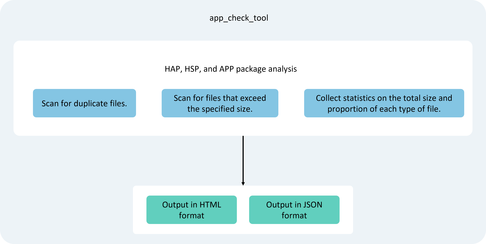

# Scanning Tool

## Introduction

The scanning tool can be used to analyze and inspect application installation packages. Based on different parameter settings, it scans the contents of HAP, HSP, or App packages in specified paths and outputs inspection reports, providing developers with data support for optimizing package structures or troubleshooting issues. Currently, the scanning tool supports the following types of analysis and statistics:

- Scanning for duplicate files.
- Scanning for files exceeding a specified size.
- Statistical analysis of the total size and proportion of various file types.

By default, the tool outputs results in both JSON and HTML file formats.

The scanning tool `app_check_tool.jar` can be obtained from the `toolchains` directory under the SDK path.



> **Note:**
>
> Currently, Cangjie only supports the development of HAR and HAP packages and does not support HSP packages. Therefore, the HSP-related features in this tool are unavailable in the Cangjie program.

## Constraints and Limitations

- The scanning tool requires Java 8 or higher to run.
- The directory where the scanning tool runs must have read and write permissions.

## Example: Scanning for Duplicate Files

**Command Example:**

```bash
java -jar app_check_tool.jar --input ./test.app --out-path ./test --stat-duplicate true
```

**Parameter Description for Scanning Duplicate Files:**

| Command       | Required | Description                                                                 |
| ------------- | -------- | --------------------------------------------------------------------------- |
| `--input`     | Yes      | Specifies the file path of the HAP, HSP, or App package to be scanned.     |
| `--out-path`  | Yes      | Specifies the output directory for the results.                            |
| `--stat-duplicate` | No    | Whether to scan for duplicate files. Default is `false`.<br>`true`: Enable.<br>`false`: Disable. |

**JSON Statistical Results:**

```json
[{
    "taskType":1,
    "taskDesc":"find the duplicated files",
    "param":"--stat-duplicate",
    "startTime":"2023-11-17 14:48:01:265",
    "stopTime":"2023-11-17 14:48:01:434",
    "result":[{
        "md5":"975c41f5727b416b1ffefa5bb0f073b",
        "size":1108880,
        "files":[
            "/application-entry-default.hap/libs/armeabi-v7a/example.so",
            "/entry-default.hap/libs/armeabi-v7a/example.so"
        ]
    }]
}]
```

**Field Information for Scanning Duplicate Files:**

| Field       | Type     | Description                                                                 |
| ----------- | -------- | --------------------------------------------------------------------------- |
| `taskType`  | `int`    | Value is `1`, indicating the task is for scanning duplicate files.         |
| `taskDesc`  | `String` | Detailed description of the task.                                          |
| `param`     | `String` | Parameters passed to the scanning program.                                  |
| `startTime` | `String` | Task start time.                                                            |
| `stopTime`  | `String` | Task end time.                                                              |
| `result`    | `Struct` | Refer to the table below.                                                   |

**Field Information for Duplicate File Statistics:**

| Field  | Type            | Description                                                                 |
| ------ | --------------- | --------------------------------------------------------------------------- |
| `md5`  | `String`        | MD5 value of the duplicate files.                                           |
| `size` | `int`           | Size of the duplicate files, in Bytes.                                      |
| `files`| `Vector<String>`| Paths corresponding to the duplicate filenames.                            |

## Example: Scanning for Files Exceeding a Specified Size

**Command Example:**

```bash
java -jar app_check_tool.jar --input ./test.app --out-path ./test --stat-file-size 4
```

**Parameter Description for Scanning Files Exceeding a Specified Size:**

| Command          | Required | Description                                                                 |
| ---------------- | -------- | --------------------------------------------------------------------------- |
| `--input`        | Yes      | Specifies the file path of the HAP, HSP, or App package to be scanned.     |
| `--out-path`     | Yes      | Specifies the output directory for the results.                            |
| `--stat-file-size` | No    | Scans for files exceeding the specified size, in KB.<br>Range: `0-4294967295` KB. |

**JSON Statistical Results:**

```json
[{
    "taskType":2,
    "taskDesc":"find files whose size exceed the limit size",
    "param":"--stat-file-size 4",
    "startTime":"2023-11-17 14:48:01:458",
    "stopTime":"2023-11-17 14:48:01:491",
    "result":[{
            "file":"/application-entry-default.hap/libs/x86_64/example.so",
            "size":1292840
    }]
}]
```

**Field Information for Scanning Files Exceeding a Specified Size:**

| Field       | Type     | Description                                                                 |
| ----------- | -------- | --------------------------------------------------------------------------- |
| `taskType`  | `int`    | Value is `2`, indicating the task is for scanning files exceeding a specified size. |
| `taskDesc`  | `String` | Detailed description of the task.                                          |
| `param`     | `String` | Parameters passed to the scanning program.                                  |
| `startTime` | `String` | Task start time.                                                            |
| `stopTime`  | `String` | Task end time.                                                              |
| `result`    | `Struct` | Refer to the table below.                                                   |

**Field Information for Files Exceeding a Specified Size:**

| Field  | Type     | Description                                                                 |
| ------ | -------- | --------------------------------------------------------------------------- |
| `file` | `String` | Path of the large file.                                                    |
| `size` | `int`    | Size of the large file, in Bytes.                                          |

## Example: Statistics on File Size Proportions by Type

**Command Example:**

```bash
java -jar app_check_tool.jar --input ./test.app --out-path ./test --stat-suffix true
```

**Parameter Description for Statistics on File Size Proportions by Type:**

| Command       | Required | Description                                                                 |
| ------------- | -------- | --------------------------------------------------------------------------- |
| `--input`     | Yes      | Specifies the file path of the HAP, HSP, or App package to be scanned.     |
| `--out-path`  | Yes      | Specifies the output directory for the results.                            |
| `--stat-suffix` | No    | Whether to calculate file size proportions by type. Default is `false`.<br>`true`: Enable.<br>`false`: Disable. |

**JSON Statistical Results:**

```json
[{
    "taskType":3,
    "taskDesc":"show files group by file type[.suffix]",
    "param":"--stat-suffix",
    "startTime":"2023-11-17 14:48:01:497",
    "stopTime":"2023-11-17 14:48:01:537",
    "pathList":[
        "test.app/application-entry-default.hap",
        "test.app/entry-default.hap"
    ],
    "result":[{
        "suffix":"so",
        "totalSize":1292840,
        "files":[{
            "compress":"false",
            "file":"/application-entry-default.hap/libs/x86_64/example.so",
            "size":1292840
        }]
    },
    {
        "suffix":"abc",
        "totalSize":84852,
        "files":[{
            "file":"/application-entry-default.hap/ets/modules.abc",
            "size":76304
        },
        {
            "file":"/entry-default.hap/ets/modules.abc",
            "size":8548
        }]
    }]
}]
```

**Field Information for Statistics on File Size Proportions by Type:**

| Field       | Type               | Description                                                                 |
| ----------- | ------------------ | --------------------------------------------------------------------------- |
| `taskType`  | `int`              | Value is `3`, indicating the task is for file size proportions by type.    |
| `taskDesc`  | `String`           | Detailed description of the task.                                          |
| `param`     | `String`           | Parameters passed to the scanning program.                                  |
| `startTime` | `String`           | Task start time.                                                            |
| `stopTime`  | `String`           | Task end time.                                                              |
| `pathList`  | `Vector<String>`   | Paths of multiple HAP or HSP packages.                                      |
| `result`    | `Struct`           | Refer to the table below.                                                   |

**Field Information for File Size Proportions by Type:**

| Field       | Type     | Description                                                                 |
| ----------- | -------- | --------------------------------------------------------------------------- |
| `suffix`    | `String` | File extension for the file type.                                           |
| `totalSize` | `int`    | Total size of files of the same type, in Bytes.                             |
| `files`     | `Struct` | Refer to the table below.                                                   |

**Field Information for File Paths and Sizes by Type:**

| Field      | Type     | Description                                                                 |
| ---------- | -------- | --------------------------------------------------------------------------- |
| `file`     | `String` | File path.                                                                  |
| `size`     | `int`    | File size.                                                                  |
| `compress` | `bool`   | Whether the file is compressed (only displayed for `.so` files).<br>`true`: Compressed.<br>`false`: Not compressed. |