# bm Tool

Bundle Manager (abbreviated as bm) is a tool that implements functionalities such as application installation, uninstallation, updates, and queries. It provides developers with basic debugging capabilities for application installation packages.

> **Note:**
>
> Currently, Cangjie only supports developing HAR and HAP packages but not HSP packages. Therefore, HSP-related features in this tool are unavailable in the Cangjie program.

## Environment Requirements (hdc Tool)

Before using this tool, developers need to obtain the [hdc tool](./cj-hdc.md) and execute `hdc shell`.

## bm Tool Command List

| Command | Description |
| :-------- | :-------- |
| help | Help command, used to query command information supported by bm. |
| install | Installation command, used to install applications. |
| uninstall | Uninstallation command, used to uninstall applications. |
| dump | Query command, used to query application-related information. |
| clean | Cleanup command, used to clear application cache and data. This command is available in root versions and in user versions with developer mode enabled. Otherwise, it is unavailable. |
| <!--DelRow-->enable | Enable command, used to enable applications. Once enabled, applications can continue to be used. This command is available in root versions but not in user versions. |
| <!--DelRow-->disable | Disable command, used to disable applications. Once disabled, applications cannot be used. This command is available in root versions but not in user versions. |
| get | UDID command, used to obtain the device's UDID. |
| quickfix | Quick fix-related commands, used to perform patch-related operations such as patch installation and querying. |
| compile | Command to compile applications for AOT (Ahead-of-Time). |
| copy-ap | Copies the application's AP file to the `/data/local/pgo` directory for shell users to read. |
| dump-dependencies | Queries module dependency information for applications. |
| dump-shared | Queries HSP application information between applications. |
| dump-overlay | Prints overlayModuleInfo for overlay applications. |
| dump-target-overlay | Prints overlayModuleInfo for all associated overlay applications of the target application. |

## Help Command (help)

```bash
# Display help information
bm help
```

## Installation Command (install)

```bash
bm install [-h] [-p filePath] [-r] [-w waitingTime] [-s hspDirPath]
```

**Installation Command Parameter List:**

| Parameter | Description |
| :-------- | :-------- |
| -h | Help information. |
| -p | Required parameter, specifies the path and allows simultaneous installation of multiple HAPs. |
| -r | Optional parameter, overwrites the installation of a HAP. Default is overwrite installation. |
| -s | Required parameter when installing inter-application HSPs; otherwise optional. Installs inter-application shared libraries. Only one HSP with the same package name can exist in each directory path. |
| -w | Optional parameter, specifies the waiting time for the bm tool during HAP installation. Minimum wait time is 5s, maximum is 600s. Default is 5s. |

Examples:

```bash
# Install a HAP
bm install -p /data/app/ohos.app.hap
# Overwrite install a HAP
bm install -p /data/app/ohos.app.hap -r
# Install an inter-application shared library
bm install -s xxx.hsp
# Simultaneously install the consumer application and its dependent inter-application shared libraries
bm install -p aaa.hap -s xxx.hsp yyy.hsp
# Install a HAP with a 10s wait time
bm install -p /data/app/ohos.app.hap -w 10
```

## Uninstallation Command (uninstall)

```bash
bm uninstall [-h] [-n bundleName] [-m moduleName] [-k] [-s] [-v versionCode]
```

**Uninstallation Command Parameter List:**

| Parameter | Description |
| :-------- | :-------- |
| -h | Help information. |
| -n | Required parameter, specifies the Bundle name to uninstall the application. |
| -m | Optional parameter, specifies a module of the application to uninstall. Default uninstalls all modules. |
| -k | Optional parameter, retains application data during uninstallation. By default, application data is not retained. |
| -s | Required parameter when uninstalling inter-application HSPs; otherwise optional. Uninstalls the specified shared library. |
| -v | Optional parameter, specifies the version number of the shared package. Default uninstalls all shared packages with the same package name. |

Examples:

```bash
# Uninstall an application
bm uninstall -n com.ohos.app
# Uninstall a module of an application
bm uninstall -n com.ohos.app -m com.ohos.app.EntryAbility
# Uninstall a shared bundle
bm uninstall -n com.ohos.example -s
# Uninstall a specific version of a shared bundle
bm uninstall -n com.ohos.example -s -v 100001
# Uninstall an application and retain user data
bm uninstall -n com.ohos.app -k
```

## Application Information Query Command (dump)

```bash
bm dump [-h] [-a] [-n bundleName] [-s shortcutInfo] [-d deviceId]
```

**Query Command Parameter List:**

| Parameter | Description |
| :-------- | :-------- |
| -h | Help information. |
| -a | Optional parameter, queries all installed applications in the system. |
| -n | Optional parameter, queries detailed information for the specified Bundle name. |
| -s | Optional parameter, queries shortcut information for the specified Bundle name. |
| -d | Optional parameter, queries package information for the specified device. Default queries the current device. |

Examples:

```bash
# Display all installed Bundle names
bm dump -a
# Query detailed information for the application
bm dump -n com.ohos.app
# Query shortcut information for the application
bm dump -s -n com.ohos.app
# Query cross-device application information
bm dump -n com.ohos.app -d xxxxx
```

## Cleanup Command (clean)

```bash
bm clean [-h] [-c] [-n bundleName] [-d] [-i appIndex]
```

**Cleanup Command Parameter List:**

| Parameter | Description |
| :-------- | :--------- |
| -h | Help information. |
| -c&nbsp;-n | -n is required, -c is optional. Clears cache data for the specified Bundle name. |
| -d&nbsp;-n | -n is required, -d is optional. Clears the data directory for the specified Bundle name. |
| -i | Optional parameter, clears the data directory for a cloned application. Default is 0. |

Examples:

```bash
# Clear cache data for the application
bm clean -c -n com.ohos.app
# Clear user data for the application
bm clean -d -n com.ohos.app
# Execution result
clean bundle data files successfully.
```

<!--Del-->
## Enable Command (enable)

```bash
bm enable [-h] [-n bundleName] [-a abilityName]
```

**Enable Command Parameter List**

| Parameter | Description |
| :-------- | :-------- |
| -h | Help information. |
| -n | Required parameter, enables the application with the specified Bundle name. |
| -a | Optional parameter, enables the specified ability module under the Bundle name. |

Example:

```bash
# Enable the application
bm enable -n com.ohos.app -a com.ohos.app.EntryAbility
# Execution result
enable bundle successfully.
```

## Disable Command (disable)

```bash
bm disable [-h] [-n bundleName] [-a abilityName]
```

**Disable Command Parameter List**

| Parameter | Description |
| :-------- | :-------- |
| -h | Help information. |
| -n | Required parameter, disables the application with the specified Bundle name. |
| -a | Optional parameter, disables the specified ability module under the Bundle name. |

Example:

```bash
# Disable the application
bm disable -n com.ohos.app -a com.ohos.app.EntryAbility
# Execution result
disable bundle successfully.
```

<!--DelEnd-->

## Get UDID Command (get)

```bash
bm get [-h] [-u]
```

**Get UDID Command Parameter List:**

| Parameter | Description |
| :-------- | :-------- |
| -h | Help information. |
| -u | Required parameter, retrieves the device's UDID. |

Example:

```bash
# Get the device's UDID
bm get -u
# Execution result
udid of current device is:
23CADE0C
```

## Quick Fix Command (quickfix)

```bash
bm quickfix [-h] [-a -f filePath [-t targetPath] [-d]] [-q -b bundleName] [-r -b bundleName]
```

> **Note:**
>
> For HQF file creation methods, refer to [HQF Packaging Instructions](./cj-packing-tool.md#hqf-packaging-instructions).

**Quick Fix Command Parameter List:**

| Parameter | Description |
| :-------- | :-------- |
| -h | Help information. |
| -a&nbsp;-f | -a is optional; if specified, -f is required. Executes the quick fix patch installation command. `file-path` corresponds to the HQF file, supporting one or multiple HQF files or the directory containing HQF files. |
| -q&nbsp;-b | -q is optional; if specified, -b is required. Queries patch information based on the package name. |
| -r&nbsp;-b | -r is optional; if specified, -b is required. Uninstalls inactive patches based on the package name. |
| -t | Optional parameter, applies quick fixes to the specified target path. |
| -d | Optional parameter, enables debug mode for quick fixes. |

**Example 1:**

```bash
# Query patch package information based on the package name
bm quickfix -q -b com.ohos.app
```

**Execution Result:**

```text
Information as follows:
ApplicationQuickFixInfo:
bundle name: com.ohos.app
bundle version code: xxx
bundle version name: xxx
patch version code: x
patch version name:
cpu abi:
native library path:
type:
```

**Example 2:**

```bash
# Install quick fix patches
bm quickfix -a -f /data/app/
```

**Execution Result:**

```text
apply quickfix succeed.
```

**Example 3:**

```bash
# Uninstall quick fix patches
bm quickfix -r -b com.ohos.app
```

**Execution Result:**

```text
delete quick fix successfully
```

## Shared Library Query Command (dump-shared)

```bash
bm dump-shared [-h] [-a] [-n bundleName] [-m moduleName]
```

**Shared Library Query Command Parameter List:**

| Parameter | Description |
| :-------- | :-------- |
| -h | Help information. |
| -a | Optional parameter, queries all installed shared libraries in the system. |
| -n | Optional parameter, queries detailed information for the specified shared library package name. |
| -m | Optional parameter, queries detailed information for the specified shared library package name and module name. |

Examples:

```bash
# Display all installed shared library package names
bm dump-shared -a
# Display detailed information for the shared library
bm dump-shared -n com.ohos.lib
# Display shared library dependency information for the specified application and module
bm dump-dependencies -n com.ohos.app -m entry
```

## Shared Library Dependency Query Command (dump-dependencies)

Displays shared library dependency information for the specified application and module.

```bash
bm dump-dependencies [-h] [-n bundleName] [-m moduleName]
```

**Shared Library Dependency Query Command Parameter List:**

| Parameter | Description |
| :-------- | :-------- |
| -h | Help information. |
| -n | Required parameter, queries detailed information for the specified shared library package name. |
| -m | Optional parameter, queries shared library dependency information for the specified application and module. |

Example:

```bash
# Display shared library dependency information for the specified application and module
bm dump-dependencies -n com.ohos.app -m entry
```

## Application AOT Compilation Command (compile)

Compiles applications for AOT (Ahead-of-Time).

```bash
bm compile [-h] [-m mode] [-r bundleName] [-a]
```

**Compile Command Parameter List:**

| Parameter | Description |
| :-------- | :-------- |
| -h | Help information. |
| -a | Optional parameter, compiles all applications. |
| -m | Optional parameter, values can be `partial` or `full`. Compiles the application based on the package name. |
| -r | Optional parameter, removes the application's results. |

Example:

```bash
# Compile the application based on the package name
bm compile -m partial com.example.myapplication
```

## Copy AP File Command (copy-ap)

Copies AP files to the `/data/local/pgo` path of the specified application.

```bash
bm copy-ap [-h] [-a] [-n bundleName]
```

**Copy AP Command Parameter List:**

| Parameter | Description |
| :-------- | :-------- |
| -h | Help information. |
| -a | Optional parameter, copies all AP files related to the package by default. |
| -n | Optional parameter, defaults to the current application package name. Copies AP files related to the specified package name. |

Example:

```bash
# Copy AP files related to the specified package name
bm copy-ap -n com.example.myapplication
```

## Overlay Application Information Query Command (dump-overlay)

Prints overlayModuleInfo for overlay applications.

```bash
bm dump-overlay [-h] [-b bundleName] [-m moduleName] [-t targetModuleName]
```

**Dump-overlay Command Parameter List:**

| Parameter | Description |
| :-------- | :-------- |
| -h | Help information. |
| -b | Required parameter, retrieves all OverlayModuleInfo information for the specified application. |
| -m | Optional parameter, defaults to the current application's main module name. Queries OverlayModuleInfo information based on the specified package name and module name. |
| -t | Optional parameter, queries OverlayModuleInfo information based on the specified package name and target module name. |

Examples:

```bash
# Retrieve all OverlayModuleInfo information for overlay application com.ohos.app based on the package name
bm dump-overlay -b com.ohos.app

# Retrieve all OverlayModuleInfo information for overlay application com.ohos.app where the overlay module is 'entry'
bm dump-overlay -b com.ohos.app -m entry

# Retrieve all OverlayModuleInfo information for overlay application com.ohos.app where the target module is 'feature'
bm dump-overlay -b com.ohos.app -m feature
```## Command for Querying Overlay-related Information of an Application (dump-target-overlay)

Query the overlayModuleInfo of all associated overlay applications for the target application.

```bash
bm dump-target-overlay [-h] [-b bundleName] [-m moduleName]
```

**Parameter List for dump-target-overlay Command:**

| Parameter | Description |
| :-------- | :-------- |
| -h | Help information. |
| -b | Required parameter. Retrieves all OverlayBundleInfo for the specified application. |
| -m | Optional parameter. Defaults to the current application's main module name. Queries OverlayBundleInfo based on the specified package name and module name. |

Examples:

```bash
# Retrieve all associated OverlayBundleInfo for the target application com.ohos.app based on the package name
bm dump-target-overlay -b com.ohos.app

# Retrieve all associated OverlayModuleInfo for the target module "entry" in the target application com.ohos.app based on the package name and module
bm dump-target-overlay -b com.ohos.app -m entry
```

## bm Tool Error Codes

### 301 System Account Does Not Exist

**Error Message:**

error: user not exist.

**Error Description:**

The system account does not exist.

**Possible Causes:**

The system account ID does not exist when installing the application.

**Resolution Steps:**

1. Restart the phone and attempt to install the application again.
2. If the installation still fails after repeating the above steps 3 to 5 times, export the log file and submit an [online ticket](https://developer.huawei.com/consumer/en/support/feedback/#/) for assistance.

```bash
hdc file recv /data/log/hilog/
```

### 304 Current System Account Has No HAP Package Installed

**Error Message:**

error: user does not install the hap.

**Error Description:**

During uninstallation, the current system account has no HAP package installed.

**Possible Causes:**

No HAP package is installed under the current system account.

**Resolution Steps:**

No HAP package is installed under the current system account. Do not perform the uninstallation operation.

### 9568319 Signature File Exception

**Error Message:**

error: cannot open signature file.

**Error Description:**

During application installation, the signature file could not be opened, causing the installation to fail.

**Possible Causes:**

The HAP package's signature file is abnormal.

**Resolution Steps:**

1. Use [automatic signing](https://developer.huawei.com/consumer/en/doc/harmonyos-guides/ide-signing#section18815157237). Re-sign the application after connecting the device.
2. For manual signing, refer to [manual signing](https://developer.huawei.com/consumer/en/doc/harmonyos-guides/ide-signing#section297715173233).

### 9568320 Signature File Does Not Exist

**Error Message:**

error: no signature file.

**Error Description:**

The user attempted to install an unsigned HAP package.

**Possible Causes:**

The HAP package is not signed.

**Resolution Steps:**

1. Use [automatic signing](https://developer.huawei.com/consumer/en/doc/harmonyos-guides/ide-signing#section18815157237). Re-sign the application after connecting the device.
2. For manual signing, refer to [manual signing](https://developer.huawei.com/consumer/en/doc/harmonyos-guides/ide-signing#section297715173233).

### 9568321 Signature File Parsing Failed

**Error Message:**

error: fail to parse signature file.

**Error Description:**

The signature file parsing failed during user installation.

**Possible Causes:**

The HAP package's signature file is abnormal.

**Resolution Steps:**

1. Use [automatic signing](https://developer.huawei.com/consumer/en/doc/harmonyos-guides/ide-signing#section18815157237). Re-sign the application after connecting the device.
2. For manual signing, refer to [manual signing](https://developer.huawei.com/consumer/en/doc/harmonyos-guides/ide-signing#section297715173233).

### 9568323 Signature Digest Verification Failed

**Error Message:**

error: signature verification failed due to not bad digest.

**Error Description:**

Signature verification failed during user installation.

**Possible Causes:**

The HAP package's signature is incorrect.

**Resolution Steps:**

1. Use [automatic signing](https://developer.huawei.com/consumer/en/doc/harmonyos-guides/ide-signing#section18815157237). Re-sign the application after connecting the device.
2. For manual signing, refer to [manual signing](https://developer.huawei.com/consumer/en/doc/harmonyos-guides/ide-signing#section297715173233).

### 9568324 Signature Integrity Check Failed

**Error Message:**

error: signature verification failed due to out of integrity.

**Error Description:**

Signature verification failed during user installation.

**Possible Causes:**

The HAP package's signature is incorrect.

**Resolution Steps:**

1. Use [automatic signing](https://developer.huawei.com/consumer/en/doc/harmonyos-guides/ide-signing#section18815157237). Re-sign the application after connecting the device.
2. For manual signing, refer to [manual signing](https://developer.huawei.com/consumer/en/doc/harmonyos-guides/ide-signing#section297715173233).

### 9568326 Signature Public Key Exception

**Error Message:**

error: signature verification failed due to bad public key.

**Error Description:**

Signature verification failed during user installation due to an abnormal signature public key.

**Possible Causes:**

The HAP package's signature is incorrect.

**Resolution Steps:**

1. Use [automatic signing](https://developer.huawei.com/consumer/en/doc/harmonyos-guides/ide-signing#section18815157237). Re-sign the application after connecting the device.
2. For manual signing, refer to [manual signing](https://developer.huawei.com/consumer/en/doc/harmonyos-guides/ide-signing#section297715173233).

### 9568327 Signature Retrieval Exception

**Error Message:**

error: signature verification failed due to bad bundle signature.

**Error Description:**

Signature verification failed during user installation due to abnormal signature retrieval.

**Possible Causes:**

The HAP package's signature is incorrect.

**Resolution Steps:**

1. Use [automatic signing](https://developer.huawei.com/consumer/en/doc/harmonyos-guides/ide-signing#section18815157237). Re-sign the application after connecting the device.
2. For manual signing, refer to [manual signing](https://developer.huawei.com/consumer/en/doc/harmonyos-guides/ide-signing#section297715173233).

### 9568328 Profile Block Not Found

**Error Message:**

error: signature verification failed due to no profile block.

**Error Description:**

Signature verification failed during user installation because the profile block was not found.

**Possible Causes:**

The HAP package's signature is incorrect.

**Resolution Steps:**

1. Use [automatic signing](https://developer.huawei.com/consumer/en/doc/harmonyos-guides/ide-signing#section18815157237). Re-sign the application after connecting the device.
2. For manual signing, refer to [manual signing](https://developer.huawei.com/consumer/en/doc/harmonyos-guides/ide-signing#section297715173233).

### 9568330 Signature Source Initialization Failed

**Error Message:**

error: signature verification failed due to init source failed.

**Error Description:**

Signature verification failed during user installation due to failed signature source initialization.

**Possible Causes:**

The HAP package's signature is incorrect.

**Resolution Steps:**

1. Use [automatic signing](https://developer.huawei.com/consumer/en/doc/harmonyos-guides/ide-signing#section18815157237). Re-sign the application after connecting the device.
2. For manual signing, refer to [manual signing](https://developer.huawei.com/consumer/en/doc/harmonyos-guides/ide-signing#section297715173233).

### 9568257 Pkcs7 Signature File Verification Failed

**Error Message:**

error: fail to verify pkcs7 file.

**Error Description:**

Pkcs7 verification failed during application installation.

**Possible Causes:**

1. The certificate chain is incomplete or untrusted.
2. The signature algorithm does not match.
3. The data has been tampered with or the signature file is corrupted.
4. The signature format does not match.
5. The private key does not match.

**Resolution Steps:**

1. Use [automatic signing](https://developer.huawei.com/consumer/en/doc/harmonyos-guides/ide-signing#section18815157237). Re-sign the application after connecting the device.
2. For manual signing, refer to [manual signing](https://developer.huawei.com/consumer/en/doc/harmonyos-guides/ide-signing#section297715173233).

### 9568344 Profile Parsing Failed

**Error Message:**

error: install parse profile prop check error.

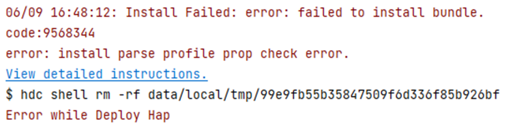

**Error Description:**

During debugging or running the application/service, an error occurred while installing the HAP, displaying the message "error: install parse profile prop check error."

**Possible Causes:**

1. The bundleName in the [app.json5 configuration file](../cj-start/basic-knowledge/app-configuration-file.md) or the name in the [module.json5 configuration file](../cj-start/basic-knowledge/module-configuration-file.md) does not comply with naming rules. <!--Del-->

2. The type field in [extensionAbilities](../cj-start/basic-knowledge/module-configuration-file.md#extensionabilities标签) is configured as service or dataShare.

<!--DelEnd-->

**Resolution Steps:**

1. Adjust the bundleName in the app.json5 configuration file and the name field in the module.json5 file according to naming rules. <!--Del-->

2. If the type field in extensionAbilities is configured as service or dataShare, the application needs to configure the [allowAppUsePrivilegeExtension privilege](https://docs.openharmony.cn/pages/v5.1/en/device-dev/subsystems/subsys-app-privilege-config-guide.md). The configuration steps are as follows:

    1. Obtain a new signature fingerprint.

        a. In the project-level build-profile.json5 file (located in the project root directory), the value of the profile field under signingConfigs is the storage path of the signature file.

        b. Open the signature file (with a .p7b extension), search for "development-certificate," and copy the content between "-----BEGIN CERTIFICATE-----" and "-----END CERTIFICATE-----" into a new text file. Remove line breaks and save it as a new .cer file, e.g., named xxx.cer.

        The format of the new .cer file is as follows (for illustration only; actual content may vary):

        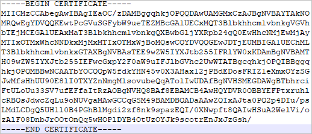

        c. Use the keytool tool (located in the jbr/bin folder of the DevEco Studio installation directory) to execute the following command and obtain the SHA256 value of the certificate fingerprint from the .cer file.

        ```bash
        keytool -printcert -file xxx.cer
        ```

        d. Remove the colons from the SHA256 content of the certificate fingerprint to obtain the final signature fingerprint.

        Example (for illustration only; actual content may vary):

        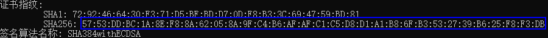

        The signature fingerprint after removing colons is: 5753DDBC1A8EF88A62058A9FC4B6AFAFC1C5D8D1A1B86FB3532739B625F8F3DB.

    2. Obtain the device's privilege control whitelist file, install_list_capability.json.

        a. Connect to the device and enter the shell.

        ```bash
        hdc shell
        ```

        b. Execute the following command to locate the install_list_capability.json file on the device.

        ```bash
        # Query the location of the whitelist file on the device
        find /system -name install_list_capability.json
        ```

        c. Execute the following command to pull the install_list_capability.json file.

        ```bash
        hdc target mount
        hdc file recv /system/etc/app/install_list_capability.json
        ```

    3. Add the signature fingerprint obtained in step 1 to the app_signature field in the install_list_capability.json file, ensuring it is configured under the corresponding bundleName.

        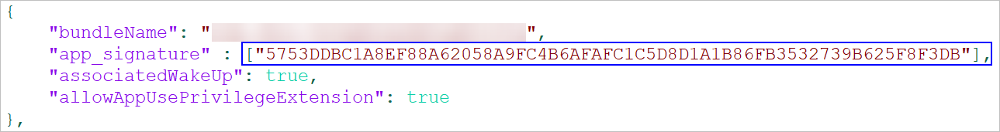

    4. Push the modified install_list_capability.json file back to the device and restart the device.

        ```bash
        hdc target mount
        hdc file send install_list_capability.json /system/etc/app/install_list_capability.json
        hdc shell chmod 644 /system/etc/app/install_list_capability.json
        hdc shell reboot
        ```

    5. After the device restarts, reinstall the new application. <!--DelEnd-->

### 9568305 Dependent Module Does Not Exist

**Error Message:**

error: dependent module does not exist.

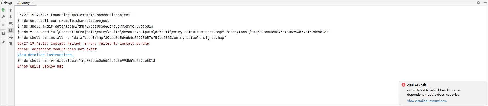

**Error Description:**

During debugging or running the application/service, an error occurred while installing the HAP, displaying the message "error: dependent module does not exist."

**Possible Causes:**

The dynamic shared library (SharedLibrary) module required by the running/debugging application is not installed, causing the installation error.

**Resolution Steps:**

1. First, install the dependent dynamic shared library (SharedLibrary) module. Then, on the application run configuration page, check "Keep Application Data," click OK to save the configuration, and proceed with running/debugging.

    

2. On the run configuration page, select the "Deploy Multi Hap" tab, check "Deploy Multi Hap Packages," select the dependent module, click OK to save the configuration, and proceed with running/debugging.

    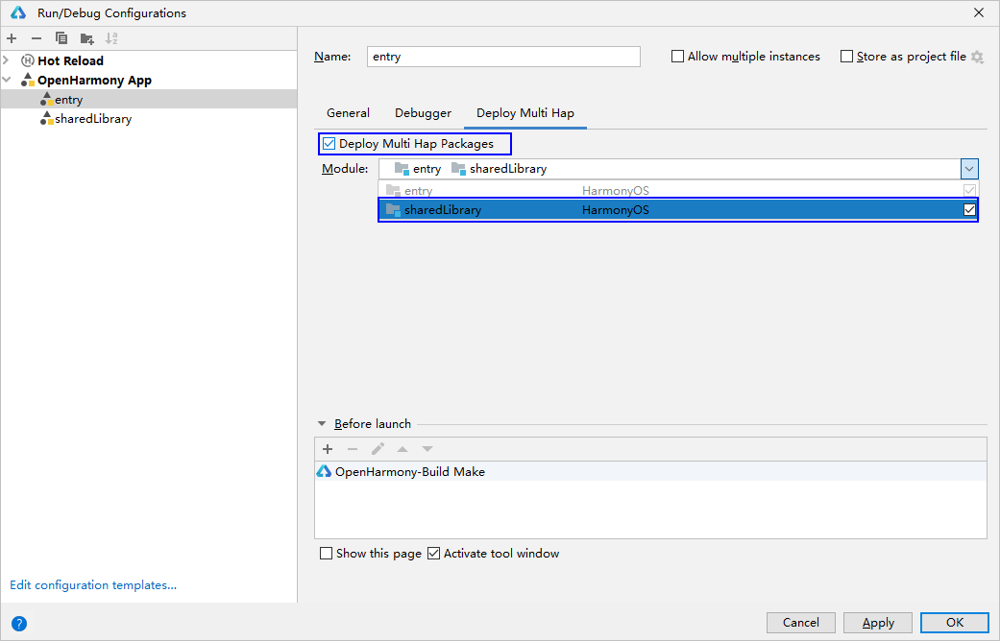

3. Click Run > Edit Configurations, and under General, check "Auto Dependencies." Click OK to save the configuration and proceed with running/debugging.

    

### 9568259 Required Field Missing in Profile During Installation Parsing

**Error Message:**

error: install parse profile missing prop.

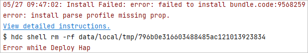

**Error Description:**

During debugging or running the application/service, an error occurred while installing the HAP, displaying the message "error: install parse profile missing prop."

**Possible Causes:**

Required fields are missing in the app.json5 and module.json5 configuration files.

**Resolution Steps:**

- Method 1: Refer to the [app.json5 configuration file](../cj-start/basic-knowledge/app-configuration-file.md) and [module.json5 configuration file](../cj-start/basic-knowledge/module-configuration-file.md) to check and fill in the required fields.
- Method 2: Identify the missing fields through hilog logs.

    Enable log dumping with the following command:

    ```bash
    hilog -w start
    ```

    Log dump location: /data/log/hilog.

    Open the logs and look for "profile prop %{public}s is mission." For example, "profile prop icon is mission" indicates the "icon" field is missing.### 9568258 The releaseType of the installed application does not match that of the application to be installed

**Error Message:**

error: install releaseType target not same.

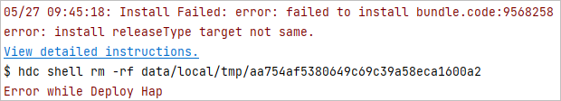

**Error Description:**

When launching debugging or running an application/service, an error occurs during HAP installation, displaying the message "error: install releaseType target not same."

**Possible Causes:**

- Scenario 1: The releaseType value in the SDK used by the old HAP installed on the device differs from that of the new HAP to be installed.
- Scenario 2: When installing a multi-HAP application, the releaseType values in the SDK used by each HAP are inconsistent.

**Resolution Steps:**

- Scenario 1: Uninstall the old HAP from the device before installing the new HAP.
- Scenario 2: Repackage the HAPs using the same SDK version to ensure consistent releaseType values across all HAPs.

### 9568260 Internal Installation Error

**Error Message:**

error: install internal error.

**Error Description:**

An internal error occurred during installation.

**Possible Causes:**

An internal service exception occurred during the installation process.

**Resolution Steps:**

Try restarting the device and reinstalling.

### 9568267 Entry Module Already Exists

**Error Message:**

error: install entry already exist.

**Error Description:**

The entry module of the application to be installed already exists.

**Possible Causes:**

Multi-module applications require the entry module to be unique. The installation fails because the module name of the package to be installed differs from the already installed module, but both are of the entry type, violating the uniqueness requirement.

**Resolution Steps:**

1. Uninstall the existing HAP from the device before installing the new HAP.
2. Ensure the entry module name of the package to be installed matches that of the installed entry module, or change the module type to "feature" and retry.

### 9568268 Installation State Error

**Error Message:**

error: install state error.

**Error Description:**

Failed to update the application installation state.

**Possible Causes:**

The previous installation task for a large application package took too long, causing the installation state update to fail when another installation was attempted.

**Resolution Steps:**

Wait for the previous installation to complete before retrying.

### 9568269 Invalid File Path

**Error Message:**

error: install file path invalid.

**Error Description:**

The installation package path provided during installation is invalid.

**Possible Causes:**

1. The installation package path does not exist (e.g., due to a typo).
2. The installation package path exceeds 256 bytes in length.

**Resolution Steps:**

1. Verify the installation package path exists and has the necessary access permissions.
2. Ensure the installation package path does not exceed 256 bytes.

### 9568322 Signature Verification Failed Due to Untrusted App Source

**Error Message:**

error: signature verification failed due to not trusted app source.

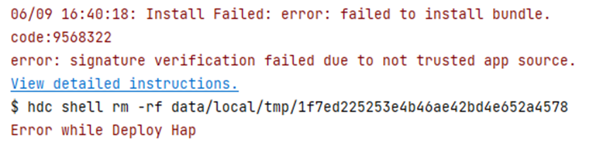

**Error Description:**

When launching debugging or running an application/service, an error occurs during HAP installation, displaying the message "error: signature verification failed due to not trusted app source."

**Possible Causes:**

<!--RP4-->
<!--RP4End-->The signature does not include the UDID of the debugging device.

**Resolution Steps:**

<!--RP5-->
<!--RP5End-->
<!--Del-->
1. Use [automatic signing](https://developer.huawei.com/consumer/en/doc/harmonyos-guides/ide-signing#section18815157237). After connecting the device, re-sign the application.
2. For manual signing of OpenHarmony applications, refer to <!--RP2-->[OpenHarmony Application Manual Signing](https://docs.openharmony.cn/pages/v4.1/en/application-dev/security/hapsigntool-guidelines.md)<!--RP2End--> and add the **UDID** of the debugging device to the UnsgnedDebugProfileTemplate.json file.

    a. Obtain the UDID of the current device.

    ```bash
    # Command to retrieve UDID
    hdc shell bm get -u
    ```

    b. Locate the UnsgnedDebugProfileTemplate.json configuration file in the SDK directory under the IDE installation path.

    ```bash
    IDE installation path\sdk\version number or default\openharmony\toolchains\lib\

    Example: xxxx\Huawei\DevEco Studio\sdk\HarmonyOS-NEXT-DB1\openharmony\toolchains\lib\
    Example: xxxx\Huawei\DevEco Studio\sdk\default\openharmony\toolchains\lib\
    ```

    c. Add the UDID of the current device to the device-ids field in the UnsgnedDebugProfileTemplate.json file.
<!--DelEnd-->

### 9568286 The Provision Type in the Signature Certificate Profile of the Installed Application Does Not Match That of the Application to Be Installed

**Error Message:**

error: install provision type not same.

**Error Description:**

When launching debugging or running an application/service, an error occurs during HAP installation because the <!--RP6-->[Profile signature file](https://gitcode.com/openharmony/docs/blob/master/en/application-dev/security/app-provision-structure.md)<!--RP6End--> type of the application to be installed does not match that of the already installed application.

**Possible Causes:**

The provision type in the signature certificate profile of the installed application differs from that of the application to be installed.

**Resolution Steps:**

1. Ensure the provision type in the signature certificate profile of the installed application matches that of the application to be installed. Use a profile file of the same type for signing before installing the new HAP.
2. Uninstall the installed application before installing the new HAP.

### 9568288 Installation Failed Due to Insufficient Disk Space

**Error Message:**

error: install failed due to insufficient disk memory.

**Error Description:**

During application installation, files or directories are created. If the device storage is insufficient, file or directory creation fails, causing the installation to fail.

**Possible Causes:**

Insufficient device storage prevents file or directory creation, leading to installation failure.

**Resolution Steps:**

Check and free up device storage to meet installation requirements, then retry.

```bash
# Check disk space usage
hdc shell df -h /system
hdc shell df -h /data
```

### 9568289 Installation Failed Due to Permission Request Failure

**Error Message:**

error: install failed due to grant request permissions failed.

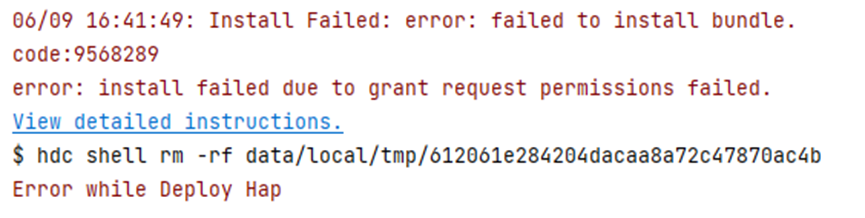

**Error Description:**

When launching debugging or running an application/service, an error occurs during HAP installation, displaying the message "error: install failed due to grant request permissions failed."

**Possible Causes:**

By default, applications at the "normal" level can only use "normal"-level permissions. Using "system_basic" or "system_core"-level permissions will cause this error.

**Resolution Steps:**

Apply for restricted ACL permissions for the application as per the [ACL Signing Guide](https://developer.huawei.com/consumer/en/doc/harmonyos-guides/ide-signing#section157591551175916).

### 9568290 Installation Failed Due to HAP Token Update Failure

**Error Message:**

error: install failed due to update hap token failed.

**Error Description:**

During application installation or update, the token authorization for the HAP update failed.

**Possible Causes:**

When installing or updating an application, the token update interface of the meta-ability service returned a failure.

**Resolution Steps:**

1. Restart the device and retry the installation.
2. If the installation still fails after 3-5 attempts, export the log files and submit an [online ticket](https://developer.huawei.com/consumer/en/support/feedback/#/) for assistance.

```bash
hdc file recv /data/log/hilog/
```

<!--Del-->
### 9568291 Installation Failed Due to Singleton Mismatch

**Error Message**

error: install failed due to singleton not same.

**Error Description**

During application update, the singleton configuration in the app.json5 file of the installed HAP package differs from that of the update package.

**Possible Causes**

The singleton configuration in the app.json5 file of the installed HAP package does not match that of the update package.

**Resolution Steps**

Option 1: Uninstall the installed application package before installing the new one.

Option 2: Adjust the singleton configuration of the update package to match the installed package, repackage, and then update the application.<!--DelEnd-->

<!--Del-->
### 9568294 Installation Failed Due to App Category Mismatch

**Error Message**

error: install failed due to apptype not same.

**Error Description**

During application installation, the [app-feature](https://docs.openharmony.cn/pages/v4.1/en/application-dev/security/app-provision-structure.md) configuration in the signature file of the installed HAP package differs from that of the package to be installed, causing installation failure.

**Possible Causes**

The installed and to-be-installed HAP packages have the same bundle name but inconsistent app-feature configurations in their signature files.

**Resolution Steps**

- Option 1: Uninstall the installed HAP package before installing the new one.
- Option 2: Modify the app-feature field in the signature file of the to-be-installed HAP package to match the installed package, then repackage, [sign](https://developer.huawei.com/consumer/en/doc/harmonyos-guides/ide-signing), and retry installation.<!--DelEnd-->

### 9568297 Installation Failed Due to Older SDK Version on Device

**Error Message:**

error: install failed due to older sdk version in the device.

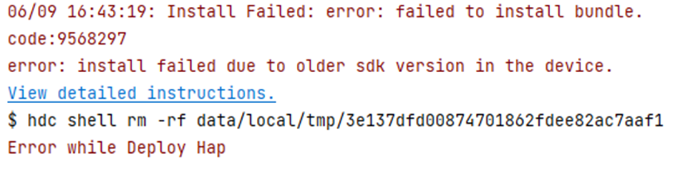

**Error Description:**

When launching debugging or running an application/service, an error occurs during HAP installation, displaying the message "error: install failed due to older sdk version in the device."

**Possible Causes:**

The SDK version used for compilation and packaging does not match the device image version.

**Resolution Steps:**

- Scenario 1: If the device image version is lower than the SDK version used for compilation, update the device image version. Query the device image version using:

  ```bash
  hdc shell param get const.ohos.apiversion
  ```

  If the image provides API version 10 and the application was compiled with SDK version 10, but the error persists, the image version may be too old to support the new SDK validation rules. Update to the latest image version.

- Scenario 2: For applications intended to run on OpenHarmony devices, ensure runtimeOS is set to OpenHarmony.

### 9568300 Installation Failed Due to Non-Unique Module Names

**Error Message:**

error: moduleName is not unique.

**Error Description:**

During multi-module application installation, module name conflicts caused the uniqueness check to fail, leading to installation failure.

**Possible Causes:**

Module name conflicts occurred during multi-module application installation.

**Resolution Steps:**

Compare the names of all modules in the current application with the names in each module's module.json5 file. Ensure uniqueness, repackage, and retry installation.

### 9568332 Installation Failed Due to Signature Mismatch

**Error Message:**

error: install sign info inconsistent.

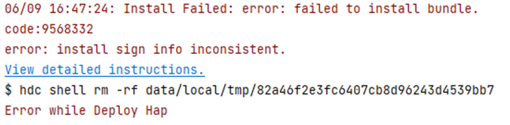

**Error Description:**

When launching debugging or running an application/service, an error occurs during HAP installation, displaying the message "error: install sign info inconsistent."

**Possible Causes:**

1. The signatures of the installed application and the new application differ, or there are signature discrepancies among multiple packages (HAP and HSP). This error occurs if "Keep Application Data" is checked in "Edit Configurations" (i.e., the application is not uninstalled but overwritten) and the application is re-signed.
2. If an application was uninstalled but its data was retained, installing another application with the same bundle name requires identity verification. If the signatures do not match, this error occurs.

**Resolution Steps:**

1. Uninstall the installed application or uncheck "Keep Application Data" before reinstalling.
2. For HSPs provided by different teams with inconsistent signatures, use [integrated HSPs](https://docs.openharmony.cn/pages/v5.1/en/application-dev/quick-start/integrated-hsp.md) to unify HSP provisioning. For multi-HAP packages, ensure all HAPs have consistent signatures.
3. If an application was uninstalled but its data was retained, installing another application with the same bundle name but different signature will fail. In this case, reinstall the previously uninstalled application, then uninstall it without retaining data to allow installation of the new application.

### 9568329 Signature Verification Failed

**Error Message:**

error: verify signature failed.

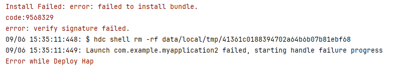

**Error Description:**

The bundle name in the signature does not match the application's bundle name.

**Possible Causes:**

- Scenario 1: A third-party HSP module was imported, which is neither an [integrated HSP](https://docs.openharmony.cn/pages/v5.1/en/application-dev/quick-start/integrated-hsp.md) nor an HSP with the same bundle name, causing a bundle name mismatch.
- Scenario 2: An incorrect signature file (with a .p7b extension) was used for signing, causing a bundle name mismatch.

**Resolution Steps:**

- Scenario 1: HSPs can only be used by applications with the same bundle name, except for integrated HSPs. Confirm with the third-party developer to provide either an integrated HSP or an HSP with the same bundle name.
- Scenario 2: Review the signing process and certificates, referring to [Debug Signing Configuration](https://developer.huawei.com/consumer/en/doc/harmonyos-guides/ide-signing).

### 9568266 Installation Permission Denied

**Error Message:**

error: install permission denied.

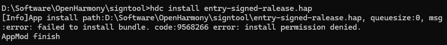

**Error Description:**

An error occurs when using `hdc install` to install an HAP, displaying the message "code:9568266 error: install permission denied."

**Possible Causes:**

`hdc install` cannot install enterprise applications signed with a release signature.

**Resolution Steps:**

Use `hdc install` to install enterprise applications signed with a debug signature.

### 9568337 Installation Parse Error

**Error Message:**

error: install parse unexpected.

**Error Description:**

When pushing an application to the device for installation, the package manager fails to open the HAP file.

**Possible Causes:**

- Scenario 1: The system partition storage is full, causing file corruption after `hdc file send` due to insufficient space.
- Scenario 2: The HAP package was corrupted during transfer to the device.

**Resolution Steps:**

- Scenario 1: Check the system partition storage. If full, free up space to meet installation requirements.

  ```bash
  hdc shell df -h /system
  ```

- Scenario 2: Compare the MD5 values of the local HAP and the HAP pushed to the device. If they differ, the HAP was corrupted during transfer. Retry the transfer.### 9568316 APL Permission Field in Proxy Data Indicates Insufficient Permission Level

**Error Message:**

error: apl of required permission in proxy data is too low.

**Error Description:**

Validation failed for the `requiredReadPermission` and `requiredWritePermission` attributes in the `proxyData` tag.

**Possible Causes:**

In the user project's `module.json`, the validation for the `requiredReadPermission` and `requiredWritePermission` attributes in the `proxyData` tag failed. These attributes require permission levels of either `system_basic` or `system_core`.

**Resolution Steps:**

Verify that the `proxyData` content defined in the application meets the requirements. Refer to the [proxyData Tag](../cj-start/basic-knowledge/module-configuration-file.md#proxydata标签).

---

### 9568315 Incorrect URI in Proxy Data

**Error Message:**

error: uri in proxy data is wrong.

**Error Description:**

Validation failed for the `uri` attribute in the `proxyData` tag.

**Possible Causes:**

In the user project's `module.json`, the validation for the `uri` attribute in the `proxyData` tag failed because it does not meet the URI format requirements.

**Resolution Steps:**

Verify that the `proxyData` content defined in the application meets the requirements. Refer to the [proxyData Tag](../cj-start/basic-knowledge/module-configuration-file.md#proxydata标签).

---

### 9568336 Debug Type Mismatch Between Application and Installed Version

**Error Message:**

error: install debug type not same.

**Error Description:**

The debug type (debug field in `app.json`) of the application does not match the installed version.

**Possible Causes:**

The developer installed the application using the debug button in DevEco Studio and later installed it via `hdc install` after packaging.

**Resolution Steps:**

Uninstall the existing application and reinstall the new version.

---

### 9568296 Incorrect Bundle Type

**Error Message:**

error: install failed due to error bundle type.

**Error Description:**

Application installation failed due to an incorrect `bundleType`.

**Possible Causes:**

The `bundleType` of the newly installed application does not match that of an already installed application with the same `bundleName`.

**Resolution Steps:**

- **Method 1:** Uninstall the existing application and reinstall the new version.
- **Method 2:** Modify the `bundleType` of the application to match the installed version.

---

### 9568292 UserID 0 Can Only Install Singleton Applications

**Error Message:**

error: install failed due to zero user can only install singleton app.

**Error Description:**

UserID 0 is only allowed to install singleton-permission applications, and singleton-permission applications can only be installed by UserID 0.

**Possible Causes:**

The singleton-permission application was not installed with UserID 0 specified.

**Resolution Steps:**

For singleton-permission applications, specify UserID 0 during installation.

```bash
# Command to install with userId
hdc install -p hap_name.hap -u 0
```

---

### 9568263 Downgrade Installation Not Allowed

**Error Message:**

error: install version downgrade.

**Error Description:**

Installation failed because the `VersionCode` of the application being installed is lower than that of the already installed version.

**Possible Causes:**

The `VersionCode` of the application being installed is lower than that of the installed version.

**Resolution Steps:**

Uninstall the existing application and reinstall the new version.

---

### 9568301 Module Type Mismatch

**Error Message:**

error: moduleName is inconsistent.

**Error Description:**

Installation failed because the module name being installed already exists in the system but has a different module type.

**Possible Causes:**

The module name of the application being installed already exists in the system, but the module types are inconsistent.

**Resolution Steps:**

Check if the module name of the installed application conflicts with the module being installed. If the module names are the same but the types differ, modify the `type` attribute in the corresponding module's `module.json5`.

---

### 9568302 Installation Failed Due to Inconsistent Singleton Configuration Across Modules

**Error Message:**

error: install failed due to singleton not same.

**Error Description:**

Installation failed because the singleton configurations across multiple modules of the application are inconsistent.

**Possible Causes:**

During multi-module installation, the singleton configurations are not identical, causing validation to fail.

**Resolution Steps:**

Adjust the singleton configurations of all modules to ensure consistency before reinstalling.

---

### 9568303 Installation Blocked by Enterprise Device Management

**Error Message:**

error: Failed to install the HAP because the installation is forbidden by enterprise device management.

**Error Description:**

Installation failed due to application control policies.

**Possible Causes:**

Application control policies are in place.

**Resolution Steps:**

No immediate solution is available due to enterprise restrictions. Submit an [online ticket](https://developer.huawei.com/consumer/en/support/feedback/#/) for assistance.

---

### 9568304 Application Does Not Support Current Device Type

**Error Message:**

error: device type is not supported.

**Error Description:**

Installation failed because the application does not support the current device type.

**Possible Causes:**

The application being installed does not support the current device type.

**Resolution Steps:**

To adapt to the current device, add the device type to the application's configuration. Supported `deviceTypes` include `phone`, `tablet`, `2in1`, `tv`, `wearable`, and `car`.

---

### 9568308 Inconsistent Bundle Types Across Application Packages

**Error Message:**

error: install bundleType not same.

**Error Description:**

Installation failed due to inconsistent `bundleType` across application packages.

**Possible Causes:**

During multi-HAP installation, the `bundleType` attributes of two modules are inconsistent.

**Resolution Steps:**

Ensure the `bundleType` attributes in `app.json5` are consistent across all modules in the multi-HAP application.

---

### 9568309 Installation of Inter-Application HSP Not Permitted

**Error Message:**

error: Failed to install the HSP due to the lack of required permission.

**Error Description:**

Installation of an inter-application HSP failed due to insufficient privileges.

**Possible Causes:**

The required privilege for installing an inter-application HSP is missing.

**Resolution Steps:**

Verify that the application has the `AllowAppShareLibrary` privilege in the device's `install_list_capability.json`. Refer to the [Application Privilege Configuration Guide](https://docs.openharmony.cn/pages/v5.1/en/device-dev/subsystems/subsys-app-privilege-config-guide.md).

---

### 9568311 Specified Inter-Application HSP Does Not Exist During Uninstallation

**Error Message:**

error: shared bundle is not exist.

**Error Description:**

Uninstallation failed because the specified inter-application HSP does not exist.

**Possible Causes:**

The specified inter-application HSP does not exist during uninstallation.

**Resolution Steps:**

Verify the existence of the inter-application HSP to be uninstalled.

```bash
hdc shell bm dump-shared -n com.xxx.xxx.demo
```

---

### 9568312 Specified Inter-Application HSP Is Being Depended On During Uninstallation

**Error Message:**

error: The version of the shared bundle is dependent on other applications.

**Error Description:**

Uninstallation failed because the specified inter-application HSP is being depended on by other applications.

**Possible Causes:**

The specified inter-application HSP is being depended on during uninstallation.

**Resolution Steps:**

Check if the inter-application HSP is being depended on. If so, uninstall the dependent applications first.

---

### 9568317 Application's Multi-Process Configuration Does Not Match System Settings

**Error Message:**

error: isolationMode does not match the system.

**Error Description:**

During installation, the configured `isolationMode` does not match the system's allowed configurations.

**Possible Causes:**

1. **Scenario 1:** The device supports isolation mode (`persist.bms.supportIsolationMode` is `true`), but the HAP's `isolationMode` is set to `nonisolationOnly`.
2. **Scenario 2:** The device does not support isolation mode (`persist.bms.supportIsolationMode` is `false`), but the HAP's `isolationMode` is set to `isolationOnly`.

**Resolution Steps:**

Configure the HAP's `isolationMode` attribute according to the device's isolation mode settings.

```bash
# Query the device's `persist.bms.supportIsolationMode` value. If `errNum is:106` is returned, the setting is not configured.
hdc shell
param get persist.bms.supportIsolationMode
# Configure the device's `persist.bms.supportIsolationMode` value.
hdc shell
param set persist.bms.supportIsolationMode [true|false]
```

---

### 9568315 Incorrect URI Attribute in Proxy Data

**Error Message:**

error: uri in proxy data is wrong.

**Error Description:**

Validation failed for the `uri` attribute in the `proxyData` tag in the application's `module.json`.

**Possible Causes:**

The URI does not meet the format requirements.

**Resolution Steps:**

Ensure the URI complies with the format specifications.

```text
// URI Format Specifications:
URIs for different proxy data must be unique and follow the format: `datashareproxy://current_application_package_name/xxx`
```

---

### 9568310 Incompatible Policies

**Error Message:**

error: compatible policy not same.

**Error Description:**

The new package has a different compatibility policy than the installed package.

**Possible Causes:**

1. An application is already installed, and an inter-application shared library with the same `bundleName` is being installed.
2. An inter-application shared library is already installed, and an application with the same `bundleName` is being installed.

**Resolution Steps:**

Uninstall the existing application or inter-application shared library before installing the new package.

---

### 9568391 Bundle Manager Service Has Stopped

**Error Message:**

error: bundle manager service is died.

**Error Description:**

The bundle manager service has stopped.

**Possible Causes:**

An unknown system exception caused the bundle manager service to stop or exit abnormally.

**Resolution Steps:**

1. Restart the device and attempt installation again.
2. If installation fails after 3–5 attempts, check if crash files containing the word "foundation" exist in `/data/log/faultlog/faultlogger/`.

    ```bash
    hdc shell
    cd /data/log/faultlog/faultlogger/
    ls -ls
    ```
3. Export the crash and log files and submit an [online ticket](https://developer.huawei.com/consumer/en/support/feedback/#/) for assistance.

    ```bash
    hdc file recv /data/log/faultlog/faultlogger/
    hdc file recv /data/log/hilog/
    ```

---

### 9568393 Code Signature Verification Failed

**Error Message:**

error: verify code signature failed.

**Error Description:**

Code signature verification failed.

**Possible Causes:**

The package lacks code signature information.

**Resolution Steps:**

Install the latest version of DevEco Studio and re-sign the package.

---

### 9568399 File Copy Failed

**Error Message:**

error: copy file failed.

**Error Description:**

File copy failed during application installation.

**Possible Causes:**

1. The source or destination file path is invalid.
2. Failed to open the source file.
3. Failed to retrieve the source file's status.
4. The source file size is invalid.
5. Failed to copy the source file.
6. No access permissions for the source file.
7. Failed to modify file permissions.

**Resolution Steps:**

1. Restart the device and attempt installation again.
2. If installation fails after 3–5 attempts, export the log files and submit an [online ticket](https://developer.huawei.com/consumer/en/support/feedback/#/) for assistance.

```bash
hdc file recv /data/log/hilog/
```

### 9568401 Debug Bundle Only Supports Devices in Developer Mode

**Error Message:**

error: debug bundle can only be installed in developer mode.

**Error Description:**

The debug bundle can only run on devices in developer mode.

**Possible Causes:**

The target device does not have "Developer Mode" enabled.

**Resolution Steps:**

1. Check the device's "Settings > System" for the "Developer Options." If it is not present, go to "Settings > About Device" and tap the "Build Number" seven times consecutively until prompted to "Enable Developer Mode." Confirm by entering the PIN (if set), and the device will restart automatically.
2. Connect the device to a PC via USB cable. Under "Settings > System > Developer Options," toggle the "USB Debugging" switch. When the "Allow USB Debugging" prompt appears, click "Allow."
3. Proceed with debugging or running the application.

### 9568404 Failed to Deliver Signature Profile

**Error Message:**

error: delivery sign profile failed.

**Error Description:**

An exception occurred during the delivery of the code signing profile, resulting in installation failure.

**Possible Causes:**

1. The file path does not exist.
2. Failed to create the file path.
3. Failed to change the file directory mode.
4. Failed to write configuration file data.
5. Failed to change the configuration file mode.
6. Failed to add configuration file data.

**Resolution Steps:**

1. Restart the device and attempt to install the application again.
2. If the installation still fails after repeating steps 3–5, export the log file and submit an [online ticket](https://developer.huawei.com/consumer/en/support/feedback/#/) for assistance.

```bash
hdc file recv /data/log/hilog/
```

### 9568405 Failed to Remove Signature Profile

**Error Message:**

error: remove sign profile failed.

**Error Description:**

An exception occurred while deleting the signature profile during application uninstallation, resulting in failure.

**Possible Causes:**

1. The file path does not exist.
2. Failed to load configuration file data.
3. The file does not have write permissions.

**Resolution Steps:**

1. Restart the device and attempt to uninstall the application again.
2. If the uninstallation still fails after repeating steps 3–5, export the log file and submit an [online ticket](https://developer.huawei.com/consumer/en/support/feedback/#/) for assistance.

    ```bash
    hdc file recv /data/log/hilog/
    ```

### 9568386 Application to Uninstall Does Not Exist

**Error Message:**

error: uninstall missing installed bundle.

**Error Description:**

The application to uninstall does not exist.

**Possible Causes:**

The target application is not installed.

**Resolution Steps:**

Verify whether the application to uninstall is already installed.

### 9568388 Enterprise Device Management Prohibits Uninstallation

**Error Message:**

error: Failed to uninstall the HAP because the uninstall is forbidden by enterprise device management.

**Error Description:**

Enterprise device management does not allow uninstalling this application.

**Possible Causes:**

The application is configured to prohibit uninstallation.

**Resolution Steps:**

Request the administrator to lift the uninstallation restriction for this application.

### 9568284 Version Mismatch During Installation

**Error Message:**

error: install version not compatible.

**Error Description:**

Version mismatch during installation.

**Possible Causes:**

The version information of the HSP being installed does not match that of the installed HAP. The following checks are performed during HSP installation:

1. The `bundleName` must match the HAP.
2. The `version` must match the HAP.
3. The signature must match the HAP.

**Resolution Steps:**

1. Uninstall the HAP with mismatched version information and then install the HSP.
2. Modify the HSP version information to match the HAP and then install the HSP.

### 9568287 Invalid Number of Entry Modules in Installation Package

**Error Message:**

error: install invalid number of entry hap.

**Error Description:**

The number of entry modules in the installation package is non-compliant.

**Possible Causes:**

The installation package contains multiple entry modules. An application can have only one entry module but multiple feature modules.

**Resolution Steps:**

Retain one entry module and modify the remaining entry modules to feature modules (by updating the `type` field in `module.json5`).

### 9568281 Vendor Mismatch in Installation Package

**Error Message:**

error: install vendor not same.

**Error Description:**

Vendor mismatch in the installation package.

**Possible Causes:**

The `vendor` field in the `app.json5` file is inconsistent.

**Resolution Steps:**

1. For a single HAP, ensure the `vendor` field matches that of the installed application. Uninstall and reinstall if necessary.
2. For integrated HSPs, ensure the `vendor` field matches that of the dependent HAP.

### 9568272 Invalid Installation Package Size

**Error Message:**

error: install invalid hap size.

**Error Description:**

The installation package size exceeds the limit.

**Possible Causes:**

The installation package size exceeds 4GB.

**Resolution Steps:**

Split the package to ensure each part is under 4GB.

### 9568273 Failed to Generate UID, Resulting in Installation Failure

**Error Message:**

error: install generate uid error.

**Error Description:**

Failed to generate a UID for the application, causing installation failure.

**Possible Causes:**

The device has exceeded the limit of 65,535 installed applications, preventing UID allocation.

**Resolution Steps:**

Uninstall unnecessary applications and retry.

### 9568274 Installation Service Error

**Error Message:**

error: install installd service error.

**Error Description:**

Installation service error.

**Possible Causes:**

The installation service is malfunctioning.

**Resolution Steps:**

Clear the cache and restart the device.

### 9568275 Package Management Service Error

**Error Message:**

error: install bundle mgr service error.

**Error Description:**

Package management service error.

**Possible Causes:**

The package management service is malfunctioning (e.g., null pointer exception).

**Resolution Steps:**

Restart the device or try again later.

### 9568277 Bundle Name Mismatch Causes Installation Failure

**Error Message:**

error: install bundle name not same.

**Error Description:**

Bundle name mismatch causes installation failure.

**Possible Causes:**

The bundle names of multiple installation packages in the target path are inconsistent.

**Resolution Steps:**

Verify the `bundleName` in the `app.json5` files of all installation packages in the target path to ensure consistency.

### 9568279 Version Name Mismatch Causes Installation Failure

**Error Message:**

error: install version name not same.

**Error Description:**

Version name (`versionName` field) mismatch causes installation failure.

**Possible Causes:**

The `versionName` fields of multiple installation packages in the target path are inconsistent.

**Resolution Steps:**

Verify the `versionName` in the `app.json5` files of all installation packages in the target path to ensure consistency.

### 9568280 minCompatibleVersionCode Mismatch Causes Installation Failure

**Error Message:**

error: install min compatible version code not same.

**Error Description:**

`minCompatibleVersionCode` field mismatch causes installation failure.

**Possible Causes:**

The `minCompatibleVersionCode` fields of multiple installation packages in the target path are inconsistent.

**Resolution Steps:**

Verify the `minCompatibleVersionCode` in the `app.json5` files of all installation packages in the target path to ensure consistency.

### 9568282 targetAPIVersion Mismatch Causes Installation Failure

**Error Message:**

error: install releaseType target not same.

**Error Description:**

`targetAPIVersion` field mismatch causes installation failure.

**Possible Causes:**

The `targetAPIVersion` fields of multiple installation packages in the target path are inconsistent.

**Resolution Steps:**

Verify the `targetAPIVersion` in the `app.json5` files of all installation packages in the target path to ensure consistency.

### 9568314 Failed to Install Inter-Application Shared Library

**Error Message:**

error: Failed to install the HSP because installing a shared bundle specified by hapFilePaths is not allowed.

**Error Description:**

Failed to install the inter-application shared library.

**Possible Causes:**

The `hdc app install ***` command was used to install an inter-application HSP.

**Resolution Steps:**

Use the `hdc install -s ***` command to install inter-application HSPs.

### 9568349 Invalid Parameters During File Operation

**Error Message:**

error: installd param error.

**Error Description:**

Invalid parameters during file operation, causing installation failure.

**Possible Causes:**

Invalid parameters or an empty directory path was passed during installation.

**Resolution Steps:**

1. Restart the device and attempt to install the application again.
2. If the installation still fails after repeating steps 3–5, export the log file and submit an [online ticket](https://developer.huawei.com/consumer/en/support/feedback/#/) for assistance.

```bash
# Export log file
hdc file recv /data/log/hilog/
```

### 9568351 Failed to Create Directory, Causing Installation Failure

**Error Message:**

error: installd create dir failed.

**Error Description:**

Failed to create a directory, causing installation failure.

**Possible Causes:**

Lack of write permissions when creating the directory.

**Resolution Steps:**

1. Restart the device and attempt to install the application again.
2. If the installation still fails after repeating steps 3–5, export the log file and submit an [online ticket](https://developer.huawei.com/consumer/en/support/feedback/#/) for assistance.

```bash
# Export log file
hdc file recv /data/log/hilog/
```

### 9568354 Failed to Delete Directory, Causing Installation Failure

**Error Message:**

error: installd remove dir failed.

**Error Description:**

Failed to delete a directory, causing installation failure.

**Possible Causes:**

The directory does not exist or lacks write permissions.

**Resolution Steps:**

1. Restart the device and attempt to install the application again.
2. If the installation still fails after repeating steps 3–5, export the log file and submit an [online ticket](https://developer.huawei.com/consumer/en/support/feedback/#/) for assistance.

```bash
# Export log file
hdc file recv /data/log/hilog/
```

### 9568355 Failed to Extract Files from Installation Package

**Error Message:**

error: installd extract files failed.

**Error Description:**

Failed to extract files from the installation package, resulting in installation failure.

**Possible Causes:**

During installation, the directory for extracting SO files failed to be created, leading to the failure of extracting SO files from the HAP package.

**Resolution Steps:**

1. Restart the phone and attempt to install the application again.
2. If the installation still fails after repeating the above steps 3 to 5 times, export the log file and submit an [online ticket](https://developer.huawei.com/consumer/en/support/feedback/#/) for assistance.

```bash
# Export log file
hdc file recv /data/log/hilog/
```

### 9568356 Failed to Rename Directory During Installation

**Error Message:**

error: installd rename dir failed.

**Error Description:**

Failed to rename the directory, resulting in installation failure.

**Possible Causes:**

During installation, the directory name exceeds 260 characters, or the current directory lacks write permissions.

**Resolution Steps:**

1. Restart the phone and attempt to install the application again.
2. If the installation still fails after repeating the above steps 3 to 5 times, export the log file and submit an [online ticket](https://developer.huawei.com/consumer/en/support/feedback/#/) for assistance.

```bash
# Export log file
hdc file recv /data/log/hilog/
```

### 9568357 Failed to Clean Files

**Error Message:**

error: installd clean dir failed.

**Error Description:**

Failed to clean files, resulting in installation failure.

**Possible Causes:**

During installation, the files to be cleaned lack write permissions, causing the cleaning process to fail.

**Resolution Steps:**

1. Restart the phone and attempt to install the application again.
2. If the installation still fails after repeating the above steps 3 to 5 times, export the log file and submit an [online ticket](https://developer.huawei.com/consumer/en/support/feedback/#/) for assistance.

```bash
# Export log file
hdc file recv /data/log/hilog/
```

### 9568359 Failed to Set SELinux During Installation

**Error Message:**

error: installd set selinux label failed.

**Error Description:**

Failed to set SELinux during installation.

**Possible Causes:**

The APL field in the signing configuration file is incorrect. APL has three levels: "normal," "system_basic," and "system_core."

**Resolution Steps:**

1. Verify if the APL field in the p7b signing file is incorrect.

    

2. If the APL field is incorrect, modify the APL field in the `UnsgnedReleasedProfileTemplate.json` file and re-sign the package.

    

### 9568403 Encryption Verification Failed During Installation

**Error Message:**

error: check encryption failed.

**Error Description:**

Encryption verification failed during installation.

**Possible Causes:**

The image version may be outdated, or non-SO files exist in the HAP package's lib directory.

**Resolution Steps:**

1. Install a newer version of the image.
2. Delete non-SO files in the lib directory of the HAP project and re-sign the package.

### 9568413 Application Device Type Not Supported on Current Device

**Error Message:**

error: check syscap filed and device type is not supported.

**Error Description:**

The configured device type for the application is not supported for installation.

**Possible Causes:**

The configured device type for the application does not match the installation device.

**Resolution Steps:**

Adjust to the correct device type.

### 9568417 Signature Verification Failed

**Error Message:**

error: bundle cannot be installed because the appId is not same with preinstalled bundle.

**Error Description:**

Signature verification failed.

**Possible Causes:**

The signature of the installed application does not match that of the preinstalled application with the same package name.

**Resolution Steps:**

If the installed application is a preinstalled one, ensure its signature matches that of the preinstalled application.

### 9568278 Inconsistent Version Numbers in Installation Package

**Error Message:**

error: install version code not same.

**Possible Causes:**

1. The version code (versionCode) of the application installed on the device does not match that of the installation package.
2. Multiple installation packages have inconsistent version codes (versionCode).

**Resolution Steps:**

1. Adjust the version code of the installation package to match the installed application on the device, or uninstall the existing application before installing the new one.
2. Ensure all installation packages have consistent version codes (versionCode).

### 9568380 Failed to Uninstall System Application

**Error Message:**

error: uninstall system app error.

**Error Description:**

Failed to uninstall a system application.

**Possible Causes:**

Some system applications are set as non-uninstallable and cannot be uninstalled.

**Resolution Steps:**

Non-uninstallable applications cannot be uninstalled.

### 9568387 Failed to Uninstall Uninstalled Module

**Error Message:**

error: uninstall missing installed module.

**Error Description:**

Attempted to uninstall a module that is not installed.

**Possible Causes:**

Attempted to uninstall a module that is not installed.

**Resolution Steps:**

Use the [bm dump -n](#query-application-information-command-dump) command to check the application configuration and confirm the module is installed.

### 9568432 Plugin and Application pluginDistributionIDs Verification Failed

**Error Message:**

error: Check pluginDistributionID between plugin and host application failed.

**Error Description:**

Verification of pluginDistributionIDs between the application and plugin failed.

**Possible Causes:**

The pluginDistributionIDs of the application and plugin have no common values, causing verification to fail.

**Resolution Steps:**

Reconfigure the pluginDistributionIDs in the [signing certificate profile file](https://gitcode.com/openharmony/docs/blob/master/en/application-dev/security/app-provision-structure.md) for the application or plugin.

### 9568433 Application Lacks ohos.permission.SUPPORT_PLUGIN Permission

**Error Message:**

error: Failed to install the plugin because host application check permission failed.

**Error Description:**

Permission verification failed when the application attempted to install a plugin.

**Possible Causes:**

The application lacks the ohos.permission.SUPPORT_PLUGIN permission.

**Resolution Steps:**

1. Refer to the [Permission Application Guide](../security/AccessToken/cj-declare-permissions.md) to apply for the [ohos.permission.kernel.SUPPORT_PLUGIN permission](../security/AccessToken/cj-restricted-permissions.md#ohospermissionkernelsupport_plugin).
2. This permission is at the system_basic level. If the [application APL level](../security/AccessToken/cj-app-permission-mgmt-overview.md#basic-concepts-in-permission-mechanism) is below system_basic, [apply for restricted permissions](../security/AccessToken/cj-declare-permissions-in-acl.md).

### 9568333 Empty Module Name

**Error Message:**

error: Install failed due to hap moduleName is empty.

**Error Description:**

Installation failed due to an empty module name.

**Possible Causes:**

The module name is empty.

**Resolution Steps:**

Check if the name field in [module.json5](../cj-start/basic-knowledge/module-configuration-file.md) is empty.

### 9568331 Inconsistent Signature Information

**Error Message:**

error: Install incompatible signature info.

**Error Description:**

Installation failed due to inconsistent signature information.

**Possible Causes:**

When installing a multi-HAP application, the signature information of the HAP packages is inconsistent.

**Resolution Steps:**

Re-[sign](https://developer.huawei.com/consumer/en/doc/harmonyos-guides/ide-signing) to ensure consistent signature information across multiple HAP packages.

### 9568334 Duplicate Module Name

**Error Message:**

error: Install failed due to hap moduleName duplicate.

**Error Description:**

Installation failed due to duplicate module names.

**Possible Causes:**

When installing multiple modules for an application, module names are duplicated.

**Resolution Steps:**

Ensure module names are unique for the same application.

### 9568340 Missing Configuration File

**Error Message:**

error: Install parse no profile.

**Error Description:**

Installation failed due to missing configuration files in the HAP package.

**Possible Causes:**

Configuration files such as [module.json, pack.info](../cj-start/basic-knowledge/application-package-structure-stage.md) are missing.

**Resolution Steps:**

Rebuild, package, and install using DevEco Studio.

### 9568341 Failed to Parse Configuration File During Installation

**Error Message:**

error: Install parse bad profile.

**Error Description:**

Failed to parse the configuration file during installation.

**Possible Causes:**

Configuration files such as [module.json, pack.info](../cj-start/basic-knowledge/application-package-structure-stage.md) have abnormal formats.

**Resolution Steps:**

Rebuild, package, and install using DevEco Studio.

### 9568342 Incorrect Data Type in Configuration File

**Error Message:**

error: Install parse profile prop type error.

**Error Description:**

Installation failed due to incorrect data types in the configuration file.

**Possible Causes:**

Configuration files such as [module.json, pack.info](../cj-start/basic-knowledge/application-package-structure-stage.md) contain fields with incorrect data types.

**Resolution Steps:**

Rebuild, package, and install using DevEco Studio.

### 9568345 Excessive String Length or Array Size in Configuration File

**Error Message:**

error: Too large size of string or array type element in the profile.

**Error Description:**

Installation failed due to excessive string length or array size in the configuration file.

**Possible Causes:**

Configuration files such as [module.json, pack.info](../cj-start/basic-knowledge/application-package-structure-stage.md) contain fields with excessive string length or array size.

**Resolution Steps:**

Rebuild, package, and install using DevEco Studio.

### 9568347 Failed to Parse Native SO File

**Error Message:**

error: install parse native so failed.

**Error Description:**

An error occurred during the installation of the HAP package when starting or running a C++ application/service, displaying the error message "error: install parse native so failed."

**Possible Causes:**

The ABI types supported by the device do not match those configured in the C++ project.

> **Note:**
>
> If the project depends on HSP or HAR modules, ensure all modules containing C++ code include ABI types supported by the device.
> If the project depends on third-party libraries containing SO files, ensure the oh_modules/third-party/libs directory includes ABI directories supported by the device, such as libs/arm64-v8a or /libs/x86_64.

**Resolution Steps:**

1. Connect the device to DevEco Studio.
2. Execute the following command to query the ABI list supported by the device. The result should include one or more ABI types: default/armeabi-v7a/armeabi/arm64-v8a/x86/x86_64.

    ```bash
    hdc shell
    param get const.product.cpu.abilist
    ```

3. Based on the query results, check the configuration of the ["abiFilters" parameter](https://gitcode.com/openharmony/docs/blob/master/en/application-dev/napi/ohos-abi.md#specifying-abi-in-compilation-architecture) in the [module-level build-profile.json5](https://developer.huawei.com/consumer/en/doc/harmonyos-guides/ide-hvigor-build-profile) file, following these rules:

    - If the result is "default," execute the following command to check if the lib64 folder exists.

        ```bash
        cd /system/
        ls
        ```

        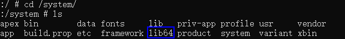

        If the lib64 folder exists: The "abiFilters" parameter must include the arm64-v8a type. If it does not exist: The "abiFilters" parameter must include at least one of armeabi/armeabi-v7a.

    - If the result includes one or more of armeabi-v7a/armeabi/arm64-v8a/x86/x86_64, the "abiFilters" parameter must include at least one of the returned ABI types.

### 9568348 Failed to Parse Ark Native SO File

**Error Message:**

error: Install parse ark native file failed.

**Error Description:**

Failed to parse the Ark Native SO file during installation.

**Possible Causes:**

During multi-HAP installation, ABI types are inconsistent and do not match those supported by the device.

**Resolution Steps:**

Check if the ABI types of multiple HAPs are consistent. Refer to the resolution steps for [Error Code 9568347](#9568347-failed-to-parse-native-so-file).

### 9568350 Failed to Obtain Proxy Object During Installation

**Error Message:**

error: Installd get proxy error.

**Error Description:**

Failed to obtain the proxy object during installation.

**Possible Causes:**

Package management or other services are abnormal, causing the proxy acquisition to fail.

**Resolution Steps:**

1. Restart the phone and attempt to install the application again.
2. If the installation still fails after repeating the above steps 3 to 5 times, export the log file and submit an [online ticket](https://developer.huawei.com/consumer/en/support/feedback/#/) for assistance.

```bash
# Export log file
hdc file recv /data/log/hilog/
```

### 9568434 Device Does Not Support Plugin Capability

**Error Message:**

error: Failed to install the plugin because current device does not support plugin.

**Error Description:**

The current device does not support plugin capability, causing plugin installation to fail.

**Possible Causes:**

The device does not support plugin capability.

**Resolution Steps:**

Use the [param tool](./cj-param-tool.md) to set const.bms.support_plugin to true by executing `hdc shell param set const.bms.support_plugin true`.

### 9568435 Application Package Name Does Not Exist

**Error Message:**

error: Host application is not found.

**Error Description:**

The provided application package name does not exist.

**Possible Causes:**

The application is not installed.

**Resolution Steps:**

Verify if the provided application exists.

### 9568436 Inconsistent Information Among Multiple HSP Packages

**Error Message:**

error: Failed to install the plugin because they have different configuration information.

**Error Description:**

Installation failed due to inconsistent package information among multiple HSPs.

**Possible Causes:**

When installing a plugin as multiple HSPs, the package information of the HSP files is inconsistent.

**Resolution Steps:**

Check if the package information of multiple HSPs is consistent, including the bundleName, bundleType, versionCode, and apiReleaseType fields in the [app.json5 configuration file](../cj-start/basic-knowledge/app-configuration-file.md).

### 9568437 Failed to Parse Plugin pluginDistributionIDs

**Error Message:**

error: Failed to install the plugin because the plugin id failed to be parsed.

**Error Description:**

Installation failed due to the failure to parse the plugin's pluginDistributionIDs.

**Possible Causes:**

The pluginDistributionIDs in the plugin's signing information are not configured correctly, causing parsing to fail.

**Resolution Steps:**

Reconfigure the "app-services-capabilities" field in the plugin's profile signing file as follows:

```json
"app-services-capabilities":{
    "ohos.permission.kernel.SUPPORT_PLUGIN":{
        "pluginDistributionIDs":"value-1|value-2|···"
    }
}
```

### 9568438 Plugin Package Name Does Not Exist

**Error Message:**

error: The plugin is not found.

**Error Description:**

The plugin does not exist.

**Possible Causes:**

The current application does not have the plugin installed.

**Resolution Steps:**

Use the [bm dump -n command](#query-application-information-command-dump) to query the application information and check if the provided plugin is installed.

### 9568439 Plugin and Application Package Names Are Identical

**Error Message:**

error: The plugin name is same as host bundle name.

**Error Description:**

The plugin package name is the same as the application package name.

**Possible Causes:**

The plugin package name matches the application package name, causing plugin installation to fail.

**Resolution Steps:**

Reconfigure the plugin's package name.

### 9568441 Application Cannot Change U1Enabled

**Error Message:**

error: install failed due to U1Enabled can not change.

**Error Description:**

Installation failed due to a change in the U1Enabled field in the signing information.

**Possible Causes:**

The U1Enabled configuration in the allowed-acls field of the application's [Profile signing file](https://gitcode.com/openharmony/docs/blob/master/en/application-dev/security/app-provision-structure.md) has changed, for example:

1. The installed application has U1Enabled configured in allowed-acls, but the installation package does not.
2. The installed application does not have U1Enabled configured in allowed-acls, but the installation package does.

**Resolution Steps:**

Option 1: Re-sign the package. During signing, refer to the [automatic signing](https://developer.huawei.com/consumer/en/doc/harmonyos-guides/ide-signing#section9786111152213) guide for ACL permissions or the [manual signing](https://developer.huawei.com/consumer/en/doc/harmonyos-guides/ide-signing#section157591551175916) guide for ACL configuration to ensure consistency between the installation package and the installed application.

Option 2: Uninstall the installed application on the device before attempting to install the new one.

### 9568442 Inconsistent U1Enabled Configuration

**Error Message:**

error: Install failed due to the U1Enabled is not same in all haps.

**Error Description:**

Installation failed due to inconsistent U1Enabled configurations in the signing information.

**Possible Causes:**

Different [Profile signing files](https://gitcode.com/openharmony/docs/blob/master/en/application-dev/security/app-provision-structure.md) were used for signing multiple HAP packages, resulting in inconsistent U1Enabled configurations in allowed-acls.

**Resolution Steps:**

Re-sign the packages. During signing, refer to the [automatic signing](https://developer.huawei.com/consumer/en/doc/harmonyos-guides/ide-signing#section9786111152213) guide for ACL permissions or the [manual signing](https://developer.huawei.com/consumer/en/doc/harmonyos-guides/ide-signing#section157591551175916) guide for ACL configuration to ensure consistent U1Enabled configurations in allowed-acls across multiple HAP packages.## Frequently Asked Questions

### 1. Preinstalled System App Already Uninstalled: Errors Occur During Reinstallation in Specific Scenarios (Downgrade Installation or Signature Mismatch)

**Issue Description**  
After uninstalling an app, errors about downgrade installation or signature mismatch occur during reinstallation, but the corresponding app icon appears on the desktop and can be launched normally.

**Possible Causes**  
Enhanced security controls have been implemented for uninstalled preinstalled system apps. When installing an app with the same bundleName, the system first restores the preinstalled mirrored version of the app before proceeding with the installation of the incoming app.

**Resolution Steps**  
Handle the issue based on the error message and error code.
<!--DelEnd-->