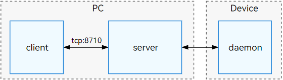
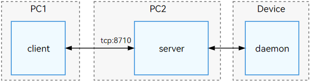

# hdc  

hdc (OpenHarmony Device Connector) is a command-line tool provided for developers to debug and interact with devices across Windows/Linux/macOS systems.  

hdc consists of three components:  

**client:** A process running on the host machine, launched when developers execute hdc commands and terminated upon command completion.  

**server:** A background service process running on the host machine, managing data exchange between client processes and device-side daemon processes, as well as device discovery.  

**daemon:** A daemon process running on the device side, responding to requests from the host-side server.  

The relationship is illustrated below:  

  

> **Note:**  
>  
> When the hdc client starts, it checks by default whether the server is running. If not, it launches a new hdc instance as a background server.  
>  
> The hdc server listens on port 8710 by default. Developers can customize the port by setting the system environment variable `OHOS_HDC_SERVER_PORT`.  

## Environment Setup  

Download and install [DevEco Studio](https://developer.huawei.com/consumer/en/deveco-studio/). The hdc executable can be found in: `DevEco Studio\sdk\default\openharmony\toolchains`.  

### (Optional) Direct Command-Line Execution  

Developers can navigate to the SDK's `toolchains` directory via the command line and execute hdc commands for debugging.  

To enable direct execution of hdc from any command-line path, add the hdc executable's directory to the system's PATH environment variable.  

For example, on Windows, add it to the `Path` system variable.  

### (Optional) Server Port Configuration  

The hdc server listens on port 8710 by default, with clients connecting via TCP. If port 8710 is occupied or an alternate port is preferred, modify the listening port by setting the `OHOS_HDC_SERVER_PORT` environment variable.  

Example: Set `OHOS_HDC_SERVER_PORT` to an available port (e.g., 18710).  

> **Note:**  
>  
> After configuring environment variables, restart the command-line terminal or any software using the OpenHarmony SDK.  

## hdc Command List  

### Global Parameters  

Global parameters are options that follow the `hdc` command. Examples:  

To target a specific device, use the `-t` parameter:  
```shell  
hdc -t connect-key shell echo "Hello world"  
```  

| Parameter | Description |  
|-----------|-------------|  
| -t        | Specifies the target device. Required when multiple devices are connected. |  
| -l        | Optional. Sets the runtime log level (0-6, default: 3 `LOG_INFO`). |  
| -s        | Optional. Specifies the server's network listening parameters (format: `ip:port`). |  
| -p        | Optional. Bypasses server process checks for faster command execution. |  
| -m        | Optional. Starts the server process in foreground mode. |  

### Command List  

| Command | Description |  
|---------|-------------|  
| `list targets` | Lists all connected target devices. |  
| `wait` | Waits for a device to connect. |  
| `tmode usb` | Deprecated. No longer controls USB debugging; use the device settings interface instead. |  
| `tmode port` | Enables network connection mode. |  
| `tmode port close` | Disables network connection mode. |  
| `tconn` | Connects to a device via `IP:port`. |  
| `shell` | Executes a single command on the device. |  
| `install` | Installs an application package. |  
| `uninstall` | Uninstalls an application package. |  
| `file send` | Sends a file from host to device. |  
| `file recv` | Receives a file from device to host. |  
| `fport ls` | Lists all port-forwarding tasks. |  
| `fport` | Sets up forward port forwarding (host port → device port). |  
| `rport` | Sets up reverse port forwarding (device port → host port). |  
| `fport rm` | Removes a port-forwarding task. |  
| `start` | Starts the hdc server process. |  
| `kill` | Terminates the hdc server process. |  
| `hilog` | Prints device-side logs. |  
| `jpid` | Lists PIDs of apps with JDWP debugging enabled. |  
| `track-jpid` | Monitors PIDs and names of JDWP-enabled apps in real time. |  
| `target boot` | Reboots the target device. |  
| `target mount` | Mounts the system partition in read-write mode (requires root). |  
| `smode` | Grants root permissions to the device-side hdc daemon (use `-r` to revoke; requires root). |  
| `keygen` | Generates a new key pair. |  
| `version` | Prints hdc version (also via `hdc -v`). |  
| `checkserver` | Retrieves client and server version information. |  

> **Note:**  
>  
> Global parameters must precede the command.  

## Basic Usage  

Before using hdc, enable USB debugging on the device and connect it to the PC via USB.  

### List Connected Devices  
```shell  
hdc list targets  
```  

### Execute Shell Command  
```shell  
hdc shell echo "Hello world"  
```  

### Get Help  

| Command | Description |  
|---------|-------------|  
| `-h [verbose]` | Displays hdc help. Use `verbose` for detailed help. |  
| `help` | Displays hdc help. |  

Examples:  
```shell  
hdc -h  
hdc help  

// Detailed help  
hdc -h verbose  
```  

**Return Values:**  

| Return Value | Description |  
|--------------|-------------|  
| `OpenHarmony device connector(HDC)...`<br>`------global commands:-------`<br>`-h/help [verbose] - Print hdc help, 'verbose' for more other cmds`<br>`...` *(abbreviated)* | hdc command help information. |  

### Usage Notes  

- For anomalies, try `hdc kill -r` to terminate abnormal processes and restart hdc.  
- If `hdc list targets` returns no devices, refer to [Device Not Recognized](#device-not-recognized).  

## Device Connection Management  

### List Devices  
Use `list targets` to query connected devices. Add `-v` for detailed output.  
```shell  
hdc list targets [-v]  
```  

**Return Values:**  

| Return Value | Description |  
|--------------|-------------|  
| Device identifier list | `connect-key` for `-t` parameter. |  
| `[Empty]` | No devices detected. |  

### Target a Specific Device  
For single-device connections, omit `-t`. For multiple devices, specify `connect-key`:  
```shell  
hdc -t [connect-key] [command]  
```  

**Parameters:**  

| Parameter | Description |  
|-----------|-------------|  
| `connect-key` | Device identifier (from `hdc list targets`). |  
| `command` | Any valid hdc command. |  

> **Note:**  
>  
> For USB connections, `connect-key` is the serial number; for network connections, it's `IP:port`.  

**Return Values:**  

| Return Value | Description |  
|--------------|-------------|  
| Command output | Varies by command. |  
| `[Fail]Not match target founded...` | No device matches `connect-key`. |  
| `[Fail]Device not founded or connected` | Device not found/unconnected. |  
| `[Fail]ExecuteCommand need connect-key?...` | Multi-device connection requires `-t`. |  
| `Unknown operation command...` | Invalid command. |  

**Example:**  
```shell  
hdc list targets  // Get connect-key  
hdc -t [connect-key] shell  
```  

### Wait for Device Connection  
```shell  
hdc wait  // Waits for any device  
hdc -t connect-key wait  // Waits for specific device  
```  

**Return Value:**  
None (command exits upon successful connection).  

### Common Connection Scenarios  

#### USB Connection  

- **Prerequisites:**  

| Check Item | Normal State | Troubleshooting |  
|------------|--------------|-----------------|  
| USB Debugging | Enabled | Restart device if USB debugging won't enable. |  
| USB Cable | Data-capable cable connected to PC. | Replace with official cable if unrecognized. |  
| USB Port | Direct motherboard port (rear for desktops). | Avoid hubs/extenders/front-panel ports. |  
| hdc PATH | `hdc -h` shows help. | See [Environment Setup](#environment-setup). |  
| Driver | Device Manager shows "HDC Device" or "HDC Interface". | See [Device Not Recognized](#device-not-recognized). |  

- **Steps:**  
1. Connect device to PC via USB.  
2. Check devices:  
   ```shell  
   hdc list targets  
   ```  
   A USB serial number indicates success.  
3. Run commands (omit `-t` if only one USB device is connected):  
   ```shell  
   hdc shell  
   ```  

#### TCP Connection  

> **Warning:**  
>  
> TCP debugging is unstable; avoid production use.  

- **Prerequisites:**  

| Check Item | Normal State | Troubleshooting |  
|------------|--------------|-----------------|  
| Network | PC and device on same network. | Connect to same WiFi or use device hotspot. |  
| Network Stability | `telnet IP:port` succeeds. | Ensure stable connection. |  
| hdc PATH | `hdc -h` shows help. | See [Environment Setup](#environment-setup). |  

- **Steps:**  
1. Enable "Wireless Debugging" in device settings.  
2. Note the displayed port (`PORT`).  
3. Connect via TCP:  
   ```shell  
   hdc tconn IP:PORT  
   ```  
   (IP is the device's local IP; PORT is from step 2.)  
4. Verify connection:  
   ```shell  
   hdc list targets  
   ```  
   An `IP:PORT` entry indicates success.  
5. Disable TCP mode by turning off "Wireless Debugging".  

#### Remote Connection  

Remote connection involves a client on PC1 connecting to a server on PC2, which is linked to the device:  

  

1. **Connection Command:**  

   | Parameter | Description |  
   |-----------|-------------|  
   | `-s` | Specifies the server's listening IP and port (temporary). |  

   Example:  
   ```shell  
   hdc -s [ip]:[port] [command]  
   ```  

   **Parameters:**  

   | Parameter | Description |  
   |-----------|-------------|  
   | `ip` | Server IP (IPv4/IPv6). |  
   | `port` | Server port (1-65535). |  
   | `command` | Any hdc command. |  

   **Return Values:**  

   | Return Value | Description |  
   |--------------|-------------|  
   | `Connect server failed` | Server connection failed. |  
   | `-s content port incorrect.` | Invalid port. |  

   **Example:**  
   ```shell  
   hdc -s 127.0.0.1:8710 list targets  
   ```  

   > **Note:**  
   >  
   > The `-s` parameter overrides `OHOS_HDC_SERVER_PORT`.  

2. **Setup Steps:**  

   i. **Server Configuration:**  
   ```shell  
   hdc kill  // Stop local server  
   hdc -s IP:8710 -m  // Start networked server (IP = server's local IP)  
   ```  

   ii. **Client Connection:**  
   ```shell  
   hdc -s IP:8710 [command]  // IP:port must match server  
   ```  

### USB/Wireless Debugging Toggle  

Use these commands to switch modes (prefer device settings for USB/wireless toggling):  

| Command | Description |  
|---------|-------------|  
| `tmode usb` | Deprecated. Use device settings. |  
| `tmode port [port-number]` | Enables network mode (restarts daemon; USB disconnects). |  
| `tmode port close` | Disables network mode (restarts daemon; USB disconnects). |  
| `tconn [IP]:[port] [-remove]` | Connects/disconnects a network device. |  

1. **Enable Network Mode:**  
   ```shell  
   hdc tmode port 1234  
   ```  

   **Parameters:**  

   | Parameter | Description |  
   |-----------|-------------|  
   | `port-number` | Listening port (1-65535). |  

   **Return Values:**  

   | Return Value | Description |  
   |--------------|-------------|  
   | `Set device run mode successful.` | Success. |  
   | `[Fail]ExecuteCommand need connect-key` | No devices found. |  
   | `[Fail]Incorrect port range` | Invalid port. |  

   > **Warning:**  
   >  
   > Ensure PC and device are on the same network.  

2. **Disable Network Mode:**  
   ```shell  
   hdc tmode port close  
   ```  

   **Return Value:**  
   `[Fail]ExecuteCommand need connect-key` if no devices.  

3. **TCP Connect/Disconnect:**  
   ```shell  
   hdc tconn 192.168.0.1:8888  
   hdc tconn 192.168.0.1:8888 -remove  // Disconnects  
   ```  

   **Return Values:**  

   | Return Value | Description |  
   |--------------|-------------|  
   | `Connect OK` | Success. |  
   | `[Info]Target is connected...` | Already connected. |  
   | `[Fail]Connect failed` | Failure. |## Execute Interactive Commands

Command format:

```shell
hdc shell [-b bundlename] [command]
```

**Parameters:**

| Parameter | Description |
| -------- | -------- |
| \[-b _bundlename_] | Specifies the debuggable application package name to execute commands in non-interactive mode within the application's data directory.<br>This parameter currently only supports non-interactive command execution and does not support entering an interactive shell session by omitting the `command` parameter. If this parameter is not configured, the default execution path is the system root directory. |
| \[command] | A single command to be executed on the device side. Supported commands vary by system type or version. Use `hdc shell ls /system/bin` to view the list of supported commands. Many commands are currently provided by [toybox](./cj-toybox.md). Use `hdc shell toybox --help` for command assistance.<br>If this parameter is omitted, hdc will start an interactive shell session where developers can input commands like ls, cd, pwd, etc. |

**Return Values:**

| Return Value | Description |
| -------- | -------- |
| Interactive command output | See other interactive command outputs for details. |
| /bin/sh: XXX : inaccessible or not found | Unsupported interactive command. |
| \[Fail]Specific failure message | Execution failed. Refer to [hdc error codes](#hdc-error-codes). |

**Usage Examples:**

```shell
# Enter interactive mode to execute commands
hdc shell

# Execute commands in non-interactive mode
hdc shell ps -ef

# Query all available commands
hdc shell help -a

# Execute commands in non-interactive mode within the specified application's data directory (supports touch, rm, ls, stat, cat, mkdir commands).
hdc shell -b com.example.myapplication ls data/storage/el2/base/
```

> **Note:**
>
> When using the `[-b bundlename]` parameter to specify a package name, the following condition must be met: The installed application with the specified package name must be "signed with a debug certificate." For details on applying for a debug certificate and signing, refer to: [Apply for Debug Certificate](https://developer.huawei.com/consumer/en/doc/app/agc-help-add-debugcert-0000001914263178).

## Application Management

| Command | Description |
| -------- | -------- |
| install src | Install the specified application file. |
| uninstall packageName | Uninstall the specified application package. |

1. Install an APP package. Command format:

   ```shell
   hdc install [-r|-s] src
   ```

   **Parameters:**

   | Parameter | Description |
   | -------- | -------- |
   | src | Filename of the application installation package. |
   | -r | Replace an existing application (.hap). |
   | -s | Install a shared package (.hsp). |

   **Return Values:**

   | Return Value | Description |
   | -------- | -------- |
   | AppMod finish | Returns installation information and "AppMod finish" on success. |
   | Specific installation failure reason | Returns detailed failure information on failure. |

   **Usage Example:**

   To install the `example.hap` package:

   ```shell
   hdc install E:\example.hap
   ```

2. Uninstall an application. Command format:

   ```shell
   hdc uninstall [-k|-s] packageName
   ```

   **Parameters:**

   | Parameter | Description |
   | -------- | -------- |
   | packageName | Application installation package. |
   | -k | Retain /data and /cache directories. |
   | -s | Uninstall a shared package. |

   **Return Values:**

   | Return Value | Description |
   | -------- | -------- |
   | AppMod finish | Returns uninstallation information and "AppMod finish" on success. |
   | Specific uninstallation failure reason | Returns detailed failure information on failure. |

   **Usage Example:**

   To uninstall the `com.example.hello` package:

   ```shell
   hdc uninstall com.example.hello
   ```

## File Transfer

| Command | Description |
| -------- | -------- |
| file send localpath remotepath | Send a file from local to remote device. |
| file recv remotepath localpath | Receive a file from remote device to local. |

1. Send a file from local to remote device. Command format:

   ```shell
   hdc file send [-a|-sync|-z|-m|-b bundlename] localpath remotepath
   ```

   **Parameters:**

   | Parameter | Description |
   | -------- | -------- |
   | localpath | Local file path to send. |
   | remotepath | Remote file path to receive. |
   | -a | Preserve file timestamps. |
   | -sync | Only transfer files with updated mtime. |
   | -z | Compress transfer using LZ4 format (not yet available; do not use). |
   | -m | Synchronize file DAC permissions, uid, gid, and MAC permissions during transfer. |
   | -b | Transfer files within the specified debuggable application's data directory. |
   | bundlename | Package name of the debuggable application. |

   **Return Values:**

   Returns success information if the file is sent successfully; returns specific failure information if the transfer fails.

   **Usage Examples:**

   ```shell
   hdc file send E:\example.txt /data/local/tmp/example.txt
   hdc file send -b com.example.myapplication a.txt data/storage/el2/base/b.txt
   ```

   > **Note:**
   >
   > In the example `hdc file send -b com.example.myapplication a.txt data/storage/el2/base/b.txt`, the `-b` parameter specifies transferring file `a.txt` from the local current directory to the relative path `data/storage/el2/base/` within the application data directory of `com.example.myapplication`, renaming it to `b.txt`.
   >
   > When using the `[-b bundlename]` parameter, the specified package name must meet the condition: The installed application must be "signed with a debug certificate." For details, refer to: [Apply for Debug Certificate](https://developer.huawei.com/consumer/en/doc/app/agc-help-add-debugcert-0000001914263178).

2. Receive a file from remote device to local. Command format:

   ```shell
   hdc file recv [-a|-sync|-z|-m|-b bundlename] remotepath localpath
   ```

   **Parameters:**

   | Parameter | Description |
   | -------- | -------- |
   | localpath | Local file path to receive. |
   | remotepath | Remote file path to send. |
   | -a | Preserve file timestamps. |
   | -sync | Only transfer files with updated mtime. |
   | -z | Compress transfer using LZ4 format (not yet available; do not use). |
   | -m | Synchronize file DAC permissions, uid, gid, and MAC permissions during transfer. |
   | -b | Transfer files within the specified debuggable application's data directory. |
   | bundlename | Package name of the debuggable application. |

   **Return Values:**

   Returns success information if the file is received successfully; returns specific failure information if the transfer fails.

   **Usage Examples:**

   ```shell
   hdc file recv /data/local/tmp/a.txt ./a.txt
   hdc file recv -b com.example.myapplication data/storage/el2/base/b.txt a.txt
   ```

   > **Note:**
   >
   > In the example `hdc file recv -b com.example.myapplication data/storage/el2/base/b.txt a.txt`, the `-b` parameter specifies transferring file `b.txt` from the relative path `data/storage/el2/base/` within the application data directory of `com.example.myapplication` to the local current directory, renaming it to `a.txt`.
   >
   > When using the `[-b bundlename]` parameter, the specified package name must meet the condition: The installed application must be "signed with a debug certificate." For details, refer to: [Apply for Debug Certificate](https://developer.huawei.com/consumer/en/doc/app/agc-help-add-debugcert-0000001914263178).

## Port Forwarding

| Command | Description |
| -------- | -------- |
| fport ls | List all port forwarding tasks. |
| fport localnode remotenode | Set up a forward port forwarding task: Listen on "host port" and forward requests to "device port." |
| rport remotenode localnode | Set up a reverse port forwarding task: Listen on "device port" and forward requests to "host port." |
| fport rm taskstr | Remove the specified port forwarding task. |

Supported port forwarding types on PC: tcp.

Supported port forwarding types on device: tcp, dev, localabstract, localfilesystem, jdwp, ark.

1. List all port forwarding tasks. Command format:

   ```shell
   hdc fport ls
   ```

   **Return Values:**

   | Return Value | Description |
   | -------- | -------- |
   | tcp:1234 tcp:1080 [Forward] | Forward port forwarding task. |
   | tcp:2080 tcp:2345 [Reverse] | Reverse port forwarding task. |
   | [empty] | No port forwarding tasks. |

   **Usage Example:**

   ```shell
   hdc fport ls
   ```

2. Set up a forward port forwarding task. Executing this command will forward data from the specified "host port" to the "device port." Command format:

   ```shell
   hdc fport localnode remotenode
   ```

   **Return Values:**

   | Return Value | Description |
   | -------- | -------- |
   | Forwardport result:OK | Port forwarding task set up successfully. |
   | [Fail]Incorrect forward command | Port forwarding task setup failed due to incorrect parameters. |
   | [Fail]TCP Port listen failed at XXXX | Port forwarding task setup failed due to local port being occupied. |

   **Usage Example:**

   ```shell
   hdc fport tcp:1234 tcp:1080
   ```

3. Set up a reverse port forwarding task. Executing this command will forward data from the specified "device port" to the "host port." Command format:

   ```shell
   hdc rport remotenode localnode
   ```

   **Return Values:**

   | Return Value | Description |
   | -------- | -------- |
   | Forwardport result:OK | Port forwarding task set up successfully. |
   | [Fail]Incorrect forward command | Port forwarding task setup failed due to incorrect parameters. |
   | [Fail]TCP Port listen failed at XXXX | Port forwarding task setup failed due to local port being occupied. |

   **Usage Example:**

   ```shell
   hdc rport tcp:1234 tcp:1080
   ```

4. Remove a port forwarding task. Executing this command will delete the specified forwarding task. Command format:

   ```shell
   hdc fport rm taskstr
   ```

   **Parameters:**

   | Parameter | Description |
   | -------- | -------- |
   | taskstr | Port forwarding task, e.g., tcp:XXXX tcp:XXXX. |

   **Return Values:**

   | Return Value | Description |
   | -------- | -------- |
   | Remove forward ruler success, ruler:tcp:XXXX tcp:XXXX | Port forwarding task removed successfully. |
   | [Fail]Remove forward ruler failed, ruler is not exist tcp:XXXX tcp:XXXX | Port forwarding task removal failed; the specified task does not exist. |

   **Usage Example:**

   ```shell
   hdc fport rm tcp:1234 tcp:1080
   ```

## Service Process Management

| Command | Description |
| -------- | -------- |
| start [-r] | Start the hdc service process. Use `-r` to trigger a restart. |
| kill [-r] | Terminate the hdc service process. Use `-r` to trigger a restart. |
| -p | Skip the service process query step for faster command execution. |
| -m | Start the service process in foreground mode. |

1. Start the hdc service process. Command format:

   ```shell
   hdc start [-r]
   ```

   **Return Values:**

   | Return Value | Description |
   | -------- | -------- |
   | No return value | Service process started successfully. |

   **Usage Examples:**

   ```shell
   hdc start
   hdc start -r // Restart the service process if it is already running.
   ```

   > **Note:**
   >
   > When starting the hdc service process, the log level priority is as follows: If both the `-l` parameter and the `OHOS_HDC_LOG_LEVEL` environment variable are specified, the environment variable takes precedence. If only `-l` is specified, its log level is used. If neither is specified, the service process starts with the default `LOG_INFO` level.

2. Terminate the hdc service process. Command format:

   ```shell
   hdc kill [-r]
   ```

   **Return Values:**

   | Return Value | Description |
   | -------- | -------- |
   | Kill server finish | Service process terminated successfully. |
   | [Fail]Specific failure message | Service process termination failed. |

   **Usage Examples:**

   ```shell
   hdc kill
   hdc kill -r // Terminate and restart the service process.
   ```

3. Skip the service process query step for faster command execution. Command format:

   ```shell
   hdc -p [command]
   ```

   **Parameters:**

   | Parameter | Description |
   | -------- | -------- |
   | command | Command supported by hdc. |

   **Return Values:**

   | Return Value | Description |
   | -------- | -------- |
   | Connect server failed | Failed to establish a connection with the service process. |

   **Usage Examples:**

   ```shell
   # Start the background service process
   hdc start
   # Skip process query and execute the command directly
   hdc -p list targets
   ```

   > **Note:**
   >
   > When executing a command without the `-p` parameter, the client first checks for a running service process locally. If none is detected, the client automatically starts the service process and establishes a connection to pass the command. If a running service process is detected, the client directly connects to it and issues the command.

4. Start the service process in foreground mode. Command format:

   ```shell
   hdc -m
   ```

   **Return Values:**

   | Return Value | Description |
   | -------- | -------- |
   | Initial failed | Service process initialization failed. |
   | [I][1970-01-01 00:00:00.000][abcd][session.cpp:25] Program running. Ver: X.X.Xa Pid:12345 | Normal log output showing service process activity. |

   **Usage Example:**

   ```shell
   # Specify network listening parameters and start the service process
   hdc -s 127.0.0.1:8710 -m
   ```

   > **Note:**
   >
   > When starting in foreground mode, use the `-s` parameter to specify network listening parameters. If neither `-s` nor the `OHOS_HDC_SERVER_PORT` environment variable is configured, the default listening parameters `127.0.0.1:8710` are used.
   > In foreground mode, the default log level is `LOG_DEBUG`. Use the `-l` parameter to adjust the log level.
   > Only one instance of the service process can run at a time. If a background service process is already active, starting a new instance in foreground mode will fail.

## Device Operations

| Command | Description |
| -------- | -------- |
| hilog [-h] | Print device-side log information. Use `hdc hilog -h` to view supported parameters. |
| jpid | Display PIDs of all applications on the device with JDWP debugging protocol enabled. |
| track-jpid [-a\|-p] | Real-time display of PIDs and application names for applications with JDWP debugging protocol enabled. Without parameters, only debug applications are shown. Use `-a` to show both debug and release applications, or `-p` to hide debug/release labels. |
| target boot [-bootloader\|-recovery] | Reboot the target device. Use `-bootloader` to enter fastboot mode or `-recovery` to enter recovery mode. |
| target boot [MODE] | Reboot the target device into the specified mode, where MODE is a parameter supported by `/bin/begetctl reboot`. |
| <!--DelRow--> target mount | Mount the system partition in read-write mode (requires rooted device). |
| <!--DelRow--> smode [-r] | Grant root permissions to the device-side hdc service process. Use `-r` to revoke permissions (requires rooted device). |

1. Print device-side log information. Command format:

   ```shell
   hdc hilog [-h]
   ```

   **Parameters:**

   | Parameter | Description |
   | -------- | -------- |
   | [-h] | Parameters supported by hilog. Use `hdc hilog -h` to view the list. |

   **Return Values:**

   | Return Value | Description |
   | -------- | -------- |
   | Specific log information | Captured log data. |

   **Usage Example:**

   ```shell
   hdc hilog
   ```

2. Display PIDs of all applications with JDWP debugging protocol enabled. Command format:

   ```shell
   hdc jpid
   ```

   **Return Values:**

   | Return Value | Description |
   | -------- | -------- |
   | List of PIDs | PIDs of applications with JDWP debugging protocol enabled. |
   | [empty] | No applications with JDWP debugging protocol enabled. |

   **Usage Example:**

   ```shell
   hdc jpid
   ```

3. Real-time display of PIDs and application names for applications with JDWP debugging protocol enabled. Command format:

   ```shell
   track-jpid [-a|-p]
   ```

   **Parameters:**

   | Parameter | Description |
   | -------- | -------- |
   | No parameters | Show only PIDs and package/process names of debug applications. |
   | -a | Show PIDs and package/process names of both debug and release applications. |
   | -p | Show PIDs and package/process names without debug/release labels. |

   **Return Values:**

   | Return Value | Description |
   | -------- | -------- |
   | List of PIDs## Security-Related Commands

| Command | Description |
| -------- | -------- |
| keygen FILE | Generate a new key pair and save the private and public keys to FILE and FILE.pub respectively, where FILE can be a custom filename. |

1. Generate a new key pair using the following command format:

   ```shell
   hdc keygen FILE
   ```

   **Parameters:**

   | Parameter | Description |
   | -------- | -------- |
   | FILE | Custom filename for the key pair |

   **Usage:**

   ```shell
   hdc keygen key // Generates key and key.pub files in the current directory
   ```

## Query Version Number

| Command | Description |
| -------- | -------- |
| -v/version | Print hdc version information. |
| checkserver | Retrieve client and server process versions. |

1. Display hdc version information using the following command format:

   ```shell
   hdc -v/version
   ```

   **Return Value:**

   | Return Value | Description |
   | -------- | -------- |
   | Ver:X.X.Xa | Version information of hdc (SDK). |

   **Usage:**

   ```shell
   hdc -v or hdc version
   ```

2. Retrieve client and server process versions using the following command format:

   ```shell
   hdc checkserver
   ```

   **Return Value:**

   | Return Value | Description |
   | -------- | -------- |
   | Client version: Ver:X.X.Xa, Server version: Ver:X.X.Xa | Version numbers of the client and server processes. |

   **Usage:**

   ```shell
   hdc checkserver
   ```

## hdc Debug Logs

### Server-Side Logs

#### Specify Runtime Log Level

The default runtime log level for hdc is LOG_INFO. Use the following command format to specify a different level:

```shell
hdc -l [level] [command]
```

**Parameters:**

| Parameter | Description |
| -------- | -------- |
| [level] | Specify the runtime log level:<br/>0: LOG_OFF<br/>1: LOG_FATAL<br/>2: LOG_WARN<br/>3: LOG_INFO<br/>4: LOG_DEBUG<br/>5: LOG_ALL<br/>6: LOG_LIBUSB. |
| command | Supported hdc command. |

> **Note:**
>
> When the runtime log level is set to 6 (LOG_LIBUSB), incremental logs related to libusb will be activated. These logs are highly detailed and voluminous, aiding in precise diagnosis of USB-related anomalies in the server process. USB operations are primarily handled by the server process, so only the server process can print incremental logs. The client-side logs will contain almost no incremental log information.
> Specifying the runtime log level applies only to the current process (including client and server processes) and cannot change the log level of existing processes.

**Return Value:**

| Return Value | Description |
| -------- | -------- |
| Command execution output | Refer to the return value of the corresponding command. |
| Log information | Logs printed at the specified runtime level. |

**Usage:**

Client prints LOG_DEBUG level logs. Example command for executing `shell ls`:

```shell
hdc -l 5 shell ls
```

Server process starts in foreground mode with LOG_LIBUSB level logs. Example command:

```shell
hdc kill && hdc -l 6 -m
```

> **Note:**
> The `-m` parameter starts the server process in foreground mode, allowing direct observation of log output. Press Ctrl+C to exit the process.

Server process starts in background mode with LOG_LIBUSB level logs. Example command:

```shell
hdc kill && hdc -l 6 start
```

> **Note:**
> In background mode, logs can be observed in hdc.log. The log path can be found in the **Log Retrieval** section.

#### Log Retrieval

Execute the following commands to enable log retrieval:

```shell
hdc kill
hdc -l5 start
```

The complete logs are stored in the following paths:

| Platform | Path | Remarks |
| -------- | -------- | -------- |
| Windows | %temp%\hdc.log | Actual path reference (replace username variable):<br/>C:\Users\Username\AppData\Local\Temp\hdc.log. |
| Linux | /tmp/hdc.log | - |
| macOS | $TMPDIR/hdc.log | - |

Log-related environment variables:

| Environment Variable | Default Value | Description |
|-------|-----|--------|
| OHOS_HDC_LOG_LEVEL | 5 | Configures the server process log level. For details, refer to the [Server-Side Logs](#server-side-logs) section on specifying runtime log levels. |

Environment variable configuration methods:

The following example configures the OHOS_HDC_LOG_LEVEL environment variable to 5:

| OS | Configuration Method |
|---|---|
| Windows | In **This PC > Properties > Advanced System Settings > Advanced > Environment Variables**, add a variable named OHOS_HDC_LOG_LEVEL with value 5. Click OK. After configuration, close and restart the command line or other software using OpenHarmony SDK for the changes to take effect. |
| Linux | Append `export OHOS_HDC_LOG_LEVEL=5` to ~/.bash_profile and save, then run `source ~/.bash_profile` to apply the changes. |
| macOS | Append `export OHOS_HDC_LOG_LEVEL=5` to ~/.zshrc and save, then run `source ~/.zshrc` to apply the changes. After configuration, close and restart the command line or other software using OpenHarmony SDK for the changes to take effect. |

### Device-Side Logs

Enable the hilog tool to retrieve logs using the following commands:

```shell
hdc shell hilog -w start                              // Enable hilog disk logging
hdc shell ls /data/log/hilog                          // View hilog logs saved to disk
hdc file recv /data/log/hilog                         // Retrieve hilog logs (including kernel logs)
```

## Common Issues

### Device Not Recognized

**Symptom:**

Running `hdc list targets` returns `[empty]`.

**Possible Causes & Solutions:**

Check the following scenarios:

- **Scenario 1:** Verify if the HDC device appears in Device Manager.

   Windows:

   Check **Device Manager > Universal Serial Bus devices** for `HDC Device` (single-port) or `HDC Interface` (multi-port).

   Linux:

   Run `lsusb` and check for `HDC Device` (single-port) or `HDC Interface` (multi-port).

   macOS:

   Use **System Information** or **System Overview** to check USB devices:
    1. Hold the Option key and click the Apple menu.
    2. Select **System Information** or **System Overview**.
    3. In the window, select **USB** on the left.
    4. Check for `HDC Device` (single-port) or `HDC Interface` (multi-port).

   **Solutions:**
   - Try a different USB port.
   - Replace the USB cable.
   - Use another computer for debugging.
   - Enable USB debugging on the device.
   - Allow debugging if a pop-up appears.
   - If TCP mode is available, run `hdc tmode usb` to restore USB connection.
   - Factory reset the device.

- **Scenario 2:** USB device exists but driver is corrupted (shows "HDC Device" with a warning icon).

   Common on Windows. Reinstall the driver or replace the USB cable/dock/port.

   **Driver Reinstallation Steps:**
    1. Open **Device Manager**, right-click the warning icon for `HDC Device`.
    2. Click **Update Driver**.
    3. Select **Browse my computer for drivers**.
    4. Select **Let me pick from a list of available drivers**.
    5. Uncheck **Show compatible hardware**, select manufacturer: `WinUSB Device`, model: `WinUSB Device`, then click **Next**.

- **Scenario 3:** `[Fail]Failed to communicate with daemon` when connecting.

   Possible causes:
   - **Version mismatch:** Update hdc or SDK to the latest version.
   - **Port conflict:** Ensure only one hdc or hdc_std is running. Check port usage with:
     - Unix: `netstat -an |grep 8710`
     - Windows: `netstat -an |findstr 8710`
   - **Registry issue:** Clean the registry:
     1. Open `regedit`.
     2. Navigate to:
        ```shell
        Computer\HKEY_LOCAL_MACHINE\SYSTEM\CurrentControlSet\Control\Class\{88bae032-5a81-49f0-bc3d-a4ff138216d6}
        ```
     3. Edit `UpperFilters`, back up and clear its value.
     4. Refresh Device Manager/reconnect USB/restart PC.

### hdc Fails to Run

**Symptom:**

Running hdc.exe/hdc binary fails.

**Possible Causes & Solutions:**

- **Environment issue:**
   - Linux: Use Ubuntu 18.04+ 64-bit. Check library references with `ldd/readelf`.
   - macOS: Use macOS 11+.
   - Windows: Use Windows 10/11 64-bit. For missing WinUSB, use Zadig tool: [Zadig link](https://github.com/pbatard/libwdi/releases).
- **Incorrect execution:** Run hdc via command line, not by double-clicking.

### General Troubleshooting Steps

1. Run `hdc list targets` to check the return value.
2. Verify `HDC Device` in Device Manager.
3. Run `hdc kill`, then `hdc -l5 start` to collect logs (hdc.log is in the TEMP directory; see [Server-Side Logs](#server-side-logs)).
4. Use hdc.log to diagnose issues.

## hdc Error Codes

### E003001 (Command Line) Invalid Bundle Name

**Error Message:**

Invalid bundle name: _bundlename_

**Description:**

The `bundlename` specified in `hdc shell [-b bundlename] [command]` is not an installed debuggable app or the app directory does not exist.

**Possible Causes:**

- **Scenario 1:** The specified app is not installed on the device.
- **Scenario 2:** The app is not built in debug mode.
- **Scenario 3:** The app is not running.

**Steps:**

- **Scenario 1:** Confirm the app is installed:
   ```shell
   hdc shell "bm dump -a | grep bundlename"
   ```
   Install the app with `hdc install [app_path]` if needed.
- **Scenario 2:** Confirm the app is debuggable:
   ```shell
   hdc shell "bm dump -n bundlename | grep debug"
   ```
   Expected output: `"appProvisionType": "debug", "debug": true`.
- **Scenario 3:** Start the app manually or via:
   ```shell
   hdc shell aa start -b bundlename -a EntryAbility
   ```
   For more details, see [aa command documentation](./cj-aa-tool.md).### E003002 Command Line Specified Parameters Do Not Support Interactive Mode

**Error Message:**

Unsupport interactive shell command option

**Error Description:**

The command `hdc shell [-b bundlename] [command]` does not support "interactive mode" command line.

**Possible Causes:**

The command parameter specified in `hdc shell [-b bundlename] [command]` is empty.

**Resolution Steps:**

Ensure the command parameter is not empty. For detailed usage, refer to [Interactive Command Execution Introduction](#Interactive-Command-Execution).

### E003003 Unsupported Command Line Parameter

**Error Message:**

Unsupported shell option: option

**Error Description:**

The command `hdc shell [-b bundlename] [command]` contains an unsupported command line parameter (option).

**Possible Causes:**

The command `hdc shell [-b bundlename] [command]` specifies unsupported parameters such as `-f` or `-B` (parameters are case-sensitive).

**Resolution Steps:**

Use only the command line parameters supported by the current version, such as the `-b` parameter.

### E003004 Device Does Not Support the Specified Command Line Parameter

**Error Message:**

Device does not supported this shell command

**Error Description:**

The command `hdc shell [-b bundlename] [command]` contains a command line parameter not supported by the device.

**Possible Causes:**

The device system version is outdated and does not support the newly added command line parameter functionality.

**Resolution Steps:**

Upgrade the device system to the latest version.

### E003005 Missing Command Line Parameter

**Error Message:**

The parameter is missing, correct your input by referring below: Usage

**Error Description:**

The command `hdc shell [-b bundlename] [command]` is missing required parameters when specifying options.

**Possible Causes:**

When using the `-b` option, the `bundlename` or `command` parameter is missing. For detailed parameter descriptions, refer to [Interactive Command Execution Introduction](#Interactive-Command-Execution).

**Resolution Steps:**

Ensure the `bundlename` and `command` parameters are not empty.

### E005101 Invalid Bundle Name (File Transfer)

**Error Message:**

Invalid bundle name: bundlename

**Error Description:**

The `bundlename` specified in the command `hdc file send/recv [-b bundlename] [localpath] [remotepath]` is not an installed debuggable application bundle name, or the application directory does not exist.

**Possible Causes:**

Same as error code [E003001](#e003001-Invalid-Command-Line-Specified-Bundle-Name).

**Resolution Steps:**

Same as error code [E003001](#e003001-Invalid-Command-Line-Specified-Bundle-Name).

### E005102 Invalid Remote Path

**Error Message:**

Remote path: remotepath is invalid, it is out of the application directory.

**Error Description:**

For the command `hdc file send [-b bundlename] [localpath] [remotepath]`, the specified `remotepath` does not exist or is outside the application data directory.

For the command `hdc file recv [-b bundlename] [remotepath] [localpath]`, the specified `remotepath` does not exist or is outside the application data directory.

**Possible Causes:**

- Scenario 1: The path does not exist.
- Scenario 2: The `remotepath` parameter contains `..` traversal symbols, and the resolved path exceeds the application data root directory.

**Resolution Steps:**

Verify that the relative path specified by the `remotepath` parameter exists within the application data directory.

### E005003 Missing Parameters (File Transfer)

**Error Message:**

The parameter is missing, correct your input by referring below: Usage

**Error Description:**

The command `hdc file send [-b bundlename] [localpath] [remotepath]` is missing required parameters.

The command `hdc file recv [-b bundlename] [remotepath] [localpath]` is missing required parameters.

**Possible Causes:**

When using the `-b` option, the `bundlename`, `localpath`, or `remotepath` parameter is missing. For detailed parameter descriptions, refer to [File Transfer Command Introduction](#File-Transfer).

**Resolution Steps:**

Ensure the `bundlename`, `localpath`, and `remotepath` parameters are not empty.

### E005004 SDK or Device System Version Does Not Support the -b Option

**Error Message:**

SDK/Device ROM doesn't support -b option.

**Error Description:**

When using the `hdc file send/recv` command with the `-b` option, the hdc in the SDK or the device system version does not support this option.

**Possible Causes:**

- Scenario 1: When executing `hdc file send [-b bundlename] [localpath] [remotepath]`, the device system version does not support the `-b` option.
- Scenario 2: When executing `hdc file recv [-b bundlename] [remotepath] [localpath]`, the hdc in the SDK does not support the `-b` option.

**Resolution Steps:**

- Scenario 1: Upgrade to the latest system version.
- Scenario 2: Upgrade to the latest SDK version.