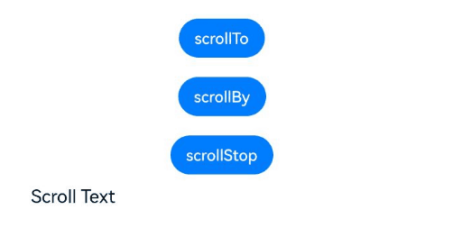

# Web Page Content Scrolling

The Webview.WebviewController in ArkWeb provides the `scrollTo` and `scrollBy` interfaces.

When the displayed content size in Web is significantly larger than the component size, users can scroll the displayed content in the Web page using `scrollTo` and `scrollBy` to reveal hidden portions, with the capability to generate animated scrolling effects. Currently, the animation effect does not support gesture interruption, but it can be forcibly interrupted by executing another animation with a duration of approximately 0.

> **Note:**
>
> Conditions for supporting scrolling: The length or width of the Web page must be greater than that of the display area.

<!-- compile -->

```cangjie
// index.cj
import ohos.arkui.state_macro_manage.*
import kit.ArkWeb.WebviewController
import kit.ArkUI.{Web, Button}
import ohos.business_exception.*
import kit.PerformanceAnalysisKit.Hilog
import ohos.resource.__GenerateResource__

@Entry
@Component
class EntryView {
    let webController = WebviewController()

    func build() {
        Column {
            Button("scrollTo").onClick ({ evt =>
                try {
                    webController.scrollTo(50.0, 50.0, duration: 500)
                    Hilog.info(1, "info", "scrollTo success")
                } catch (e: BusinessException) {
                    Hilog.error(1, "info", "scrollTo ErrorCode: ${e.code},  Message: ${e.message}")
                }
            }).margin(10)
            Button("scrollBy").onClick ({ evt =>
                try {
                    webController.scrollBy(50.0, 50.0, duration: 500)
                    Hilog.info(1, "info", "scrollBy success")
                } catch (e: BusinessException) {
                    Hilog.error(1, "info", "scrollBy ErrorCode: ${e.code},  Message: ${e.message}")
                }
            }).margin(10)
            Button("scrollStop").onClick ({ evt =>
                try {
                    webController.scrollBy(0.0, 0.0, duration: 1)
                    Hilog.info(1, "info", "scrollStop success")
                } catch (e: BusinessException) {
                    Hilog.error(1, "info", "scrollStop ErrorCode: ${e.code},  Message: ${e.message}")
                }
            }).margin(10)
            Web(src: @rawfile("index.html"), controller: webController)
        }
    }
}
```

```html
<!-- resources/rawfile/index.html -->
<html>
<head>
    <title>Demo</title>
    <style>
        body {
            width:2000px;
            height:2000px;
            padding-right:170px;
            padding-left:170px;
            border:25px solid blueviolet
            back
        }
        .scroll-text {
        font-size: 75px;
        }
    </style>
</head>
<body>
<div class="scroll-text">Scroll Text</div>
</body>
</html>
```

