# Debugging Frontend Pages Using DevTools

Web components support debugging frontend pages using DevTools. DevTools is a web frontend development debugging tool that provides the capability to debug mobile device frontend pages on a computer. Developers can use DevTools to debug frontend web pages on mobile devices from a computer. The device must be version 4.1.0 or higher.

## Debugging Steps

### Enable Web Debugging in Application Code

If the Web debugging switch is not enabled, DevTools cannot discover the webpage to be debugged.

1. Enable the Web debugging switch in the application code as follows:

    <!-- compile -->

    ```cangjie
    // xxx.cj
    import ohos.arkui.state_macro_manage.*
    import kit.PerformanceAnalysisKit.Hilog
    import ohos.web.webview.WebviewController
    import kit.ArkUI.Web
    import ohos.business_exception.*

    func loggerError(str: String) {
        Hilog.error(0, "CangjieTest", str)
    }

    @Entry
    @Component
    class EntryView {
        let webController = WebviewController()

        public func aboutToAppear(): Unit {
            try {
                // Configure Web to enable debugging mode
                WebviewController.setWebDebuggingAccess(true)
            } catch (e: BusinessException) {
                loggerError("ErrorCode: ${e.code},  Message: ${e.message}")
            }
        }

        func build() {
            Column {
                Web(src: 'www.example.com', controller: this.webController)
            }
        }
    }
    ```

2. To enable debugging, add the following permission to the module.json5 file of the DevEco Studio application project's hap module. For the method to add permissions, refer to [Declaring Permissions in the Configuration File](../security/AccessToken/cj-declare-permissions.md).

    ```json
    "requestPermissions":[
      {
        "name" : "ohos.permission.INTERNET"
      }
    ]
    ```

### Connect the Device to the Computer

Connect the device to the computer and enable Developer Mode to prepare for subsequent port forwarding operations.

1. Enable Developer Mode on the device and turn on USB debugging.

    (1) Check if "Developer Options" exists under "Settings > System" on the device. If not, go to "Settings > About" and tap "Version Number" seven times consecutively until prompted to "Enable Developer Mode." Click "Confirm" and enter the PIN (if set). The device will restart automatically.

    (2) Connect the device to the computer using a USB cable. Under "Settings > System > Developer Options," enable the "USB Debugging" switch. In the "Allow USB Debugging" pop-up, click "Allow."

2. Use the hdc command to connect to the device.

    Open the command line and execute the following command to check if hdc can discover the device.

    ```shell
    hdc list targets
    ```

    - If the command returns the device ID, hdc has successfully connected to the device.

        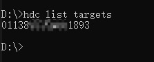

    - If the command returns `[Empty]`, hdc has not discovered the device.

        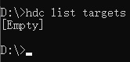

3. Enter hdc shell.

    Once hdc is connected to the device, execute the following command to enter hdc shell.

    ```shell
    hdc shell
    ```

### Port Forwarding

When the application code calls the `setWebDebuggingAccess` interface to enable Web debugging, the ArkWeb kernel starts a domain socket listener to implement DevTools' webpage debugging functionality.

However, Chrome browsers cannot directly access the domain socket on the device, so the domain socket on the device must be forwarded to the computer.

1. First, execute the following command in hdc shell to query the domain socket created by ArkWeb on the device.

    ```shell
    cat /proc/net/unix | grep devtools
    ```

    - If the previous steps were performed correctly, the command will display the domain socket port for querying.

        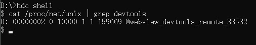

    - If no results are found, verify the following:

        (1) The application has enabled the Web debugging switch.

        (2) The application has loaded a webpage using the Web component.

2. Forward the discovered domain socket to the computer's TCP port 9222.

    Execute `exit` to leave hdc shell.

    ```shell
    exit
    ```

    Execute the following command in the command line to forward the port.

    ```shell
    hdc fport tcp:9222 localabstract:webview_devtools_remote_38532
    ```

    > **Note:**
    >
    > - The number following "webview_devtools_remote_" represents the process ID of the ArkWeb application. This number is not fixed. Replace it with the value you queried.
    > - If the application's process ID changes (e.g., the application restarts), port forwarding must be performed again.

    Successful execution of the command:

    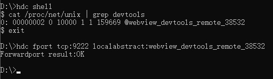

3. Execute the following command in the command line to check if port forwarding was successful.

    ```shell
    hdc fport ls
    ```

    - If the port forwarding task is listed, port forwarding was successful.

        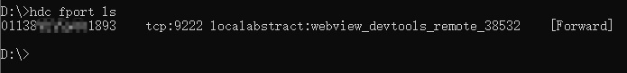

    - If `[Empty]` is returned, port forwarding failed.

        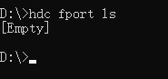

### Open the Debugging Tool Page in Chrome Browser

1. Enter the debugging tool address `chrome://inspect/#devices` in the Chrome browser's address bar on the computer and open the page.

2. Configure Chrome's debugging tool.

    To discover the webpage to be debugged from the local TCP port 9222, ensure "Discover network targets" is checked. Then proceed with network configuration.

    (1) Click the "Configure" button.

    (2) Add the local port `localhost:9222` to "Target discovery settings."

    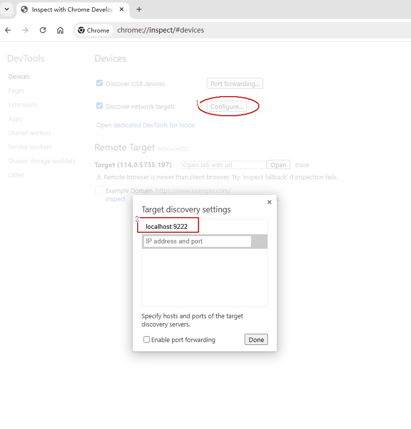

3. To debug multiple applications simultaneously, add multiple port numbers in the "configure" section under "Devices" in Chrome's debugging tool page.

    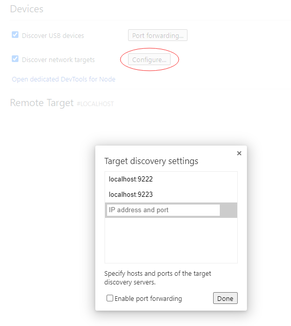

### Wait for the Debugging Page to Be Discovered

If the previous steps were executed successfully, Chrome's debugging page will soon display the webpage to be debugged.

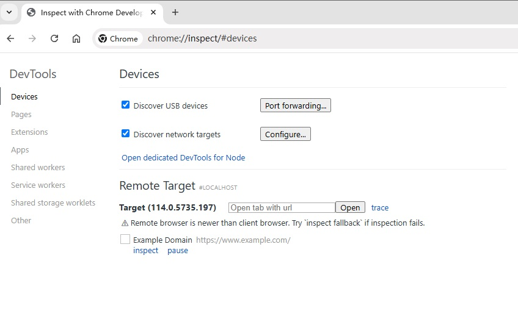

### Start Webpage Debugging

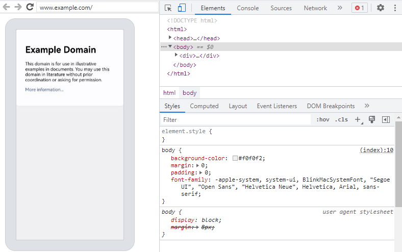

## Convenience Scripts

### Windows Platform

Copy the following information to create a .bat file and execute it after enabling the debugging application.

```bat
@echo off
setlocal enabledelayedexpansion

:: Initialize port number and PID list
set PORT=9222
set PID_LIST=

:: Get the list of all forwarded ports and PIDs
for /f "tokens=2,5 delims=:_" %%a in ('hdc fport ls') do (
    if %%a gtr !PORT! (
        set PORT=%%a
    )
    for /f "tokens=1 delims= " %%c in ("%%b") do (
        set PID_LIST=!PID_LIST! %%c
    )
)

:: Increment port number for next application
set temp_PORT=!PORT!
set /a temp_PORT+=1
set PORT=!temp_PORT!

:: Get the domain socket name of devtools
for /f "tokens=*" %%a in ('hdc shell "cat /proc/net/unix | grep devtools"') do (
    set SOCKET_NAME=%%a

    :: Extract process ID
    for /f "delims=_ tokens=4" %%b in ("!SOCKET_NAME!") do set PID=%%b

    :: Check if PID already has a mapping
    echo !PID_LIST! | findstr /C:" !PID! " >nul
    if errorlevel 1 (
        :: Add mapping
        hdc fport tcp:!PORT! localabstract:webview_devtools_remote_!PID!
        if errorlevel 1 (
            echo Error: Failed to add mapping.
            pause
            exit /b
        )

        :: Add PID to list and increment port number for next application
        set PID_LIST=!PID_LIST! !PID!
        set temp_PORT=!PORT!
        set /a temp_PORT+=1
        set PORT=!temp_PORT!
    )
)

:: If no process ID was found, prompt the user to open debugging in their application code and provide the documentation link
if "!SOCKET_NAME!"=="" (
    echo No process ID was found. Please open debugging in your application code using the corresponding interface.
    pause
    exit /b
)

:: Check mapping
hdc fport ls

echo.
echo Script executed successfully. Press any key to exit...
pause >nul

:: Try to open the page in Edge
start msedge chrome://inspect/#devices.com

:: If Edge is not available, then open the page in Chrome
if errorlevel 1 (
    start chrome chrome://inspect/#devices.com
)

endlocal
```

### Linux or Mac Platform

Copy the following information to create a .sh file. Note `chmod` and format conversion, and execute it after enabling the debugging application.

This script will first delete all port forwarding. If other tools (e.g., DevEco Studio) are also using port forwarding, they will be affected.

```shell
#!/bin/bash

# Get current fport rule list
CURRENT_FPORT_LIST=$(hdc fport ls)

# Delete the existing fport rule one by one
while IFS= read -r line; do
    # Extract the taskline
    IFS=' ' read -ra parts <<< "$line"
    taskline="${parts[1]} ${parts[2]}"

    # Delete the corresponding fport rule
    echo "Removing forward rule for $taskline"
    hdc fport rm $taskline
    result=$?

    if [ $result -eq 0 ]; then
        echo "Remove forward rule success, taskline:$taskline"
    else
        echo "Failed to remove forward rule, taskline:$taskline"
    fi

done <<< "$CURRENT_FPORT_LIST"

# Initial port number
INITIAL_PORT=9222

# Get the current port number, use initial port number if not set previously
CURRENT_PORT=${PORT:-$INITIAL_PORT}

# Get the list of all PIDs that match the condition
PID_LIST=$(hdc shell cat /proc/net/unix | grep webview_devtools_remote_ | awk -F '_' '{print $NF}')

if [ -z "$PID_LIST" ]; then
    echo "Failed to retrieve PID from the device"
    exit 1
fi

# Increment the port number
PORT=$CURRENT_PORT

# Forward ports for each application one by one
for PID in $PID_LIST; do
    # Increment the port number
    PORT=$((PORT + 1))

    # Execute the hdc fport command
    hdc fport tcp:$PORT localabstract:webview_devtools_remote_$PID

    # Check if the command executed successfully
    if [ $? -ne 0 ]; then
        echo "Failed to execute hdc fport command"
        exit 1
    fi
done

# List all forwarded ports
hdc fport ls
```

## Common Issues and Solutions

### hdc Cannot Discover the Device

**Issue**

After executing the following command in the command line, no device ID is listed.

```shell
hdc list targets
```

**Solution**

- Ensure the USB debugging switch is enabled on the device.
- Ensure the device is connected to the computer.

### hdc Command Shows Device as "Unauthorized"

**Issue**

When executing the hdc command, the device is shown as "unauthorized."

**Cause**

The device has not authorized the computer for debugging.

**Solution**

When a device with USB debugging enabled is connected to an unauthorized computer, a pop-up will prompt "Allow USB debugging?" Select "Allow."

### Cannot Find DevTools' Domain Socket

**Issue**

After executing the following command in hdc shell, no results are returned.

```shell
cat /proc/net/unix | grep devtools
```

**Solution**

- Ensure the application has [enabled the Web debugging switch](#enable-web-debugging-in-application-code).
- Ensure the application has loaded a webpage using the Web component.

### Port Forwarding Fails

**Issue**

After executing the following command in the command line, no previously set forwarding tasks are listed.

```shell
hdc fport ls
```

**Solution**

- Ensure the domain socket exists on the device.
- Ensure the computer's TCP port 9222 is not occupied.

    - If TCP port 9222 is occupied, forward the domain socket to another unused TCP port, such as 9223.
    - If forwarding to a new TCP port, update the port number in Chrome's "Target discovery settings" on the computer.

### After Successful Port Forwarding, Chrome Cannot Discover the Debugging Page

**Issue**

Chrome browser on the computer cannot discover the webpage to be debugged.

**Cause**

Port forwarding may fail due to:

- The device disconnecting from the computer, which clears all forwarding tasks in hdc.
- Restarting the hdc service, which also clears all forwarding tasks in hdc.- The process ID of the application in the device has changed (e.g., due to application restart), which may cause the old forwarding tasks in hdc to become invalid.  
- Abnormal configurations such as multiple forwarding tasks targeting the same port may lead to forwarding failures.  

**Solutions**  

- Ensure the local TCP port (e.g., `tcp:9222` or other configured TCP ports) on the computer is not occupied.  
- Verify that the domain socket on the device still exists.  
- Confirm that the process ID in the domain socket name matches the process ID of the debugged application.  
- Remove unnecessary forwarding tasks in hdc.  
- After successful forwarding, open the URL <http://localhost:9222/json> in the Chrome browser on the computer, replacing `9222` with the actual configured TCP port.  

    - If the webpage displays content, the port forwarding is successful. Proceed to [wait for the debug target to appear](#waiting-for-the-debug-target-to-appear) in Chrome's debugging interface.  

      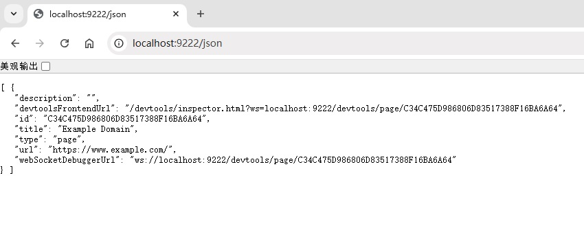  

    - If an error page is displayed, the port forwarding has failed. Refer to the solutions above under [Port Forwarding Failure](#port-forwarding-failure).  

      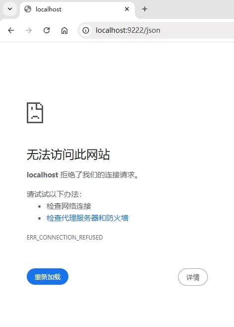  

- The <http://localhost:9222/json> page in Chrome on the computer displays content, but the debug target is still not detected in Chrome's debugging tool interface.  
    - Ensure the port number configured in the "Configure" section of Chrome's debugging tool matches the TCP port number specified in the forwarding task.  
    - In this document, the default TCP port is `9222`.  
      If developers use a different TCP port (e.g., `9223`), update both the TCP port in [Port Forwarding](#port-forwarding) and the port number in [Chrome Debugging Tool "Configure" Settings](#opening-the-debugging-tool-interface-in-chrome).