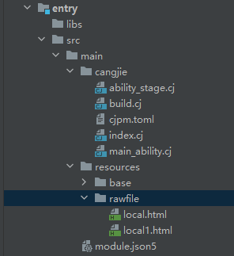

# Loading Pages with Web Components

Page loading is a fundamental feature of Web components. Based on the data source, page loading can be categorized into three common scenarios: loading network pages, loading local pages, and loading HTML-formatted rich text data.

During the page loading process, if network resource acquisition is involved, please configure network access permissions in module.json5. For adding methods, refer to [Declaring Permissions in Configuration Files](../security/AccessToken/cj-declare-permissions.md).

```json
"requestPermissions":[
  {
    "name" : "ohos.permission.INTERNET"
  }
]
```

## Loading Network Pages

Developers can specify the default network page to load when creating a Web component. The first parameter variable `src` of the [Web component](../reference/arkui-cj/cj-web-web.md#web) cannot be dynamically changed via state variables (e.g., `@State`).

In the following example, after the Web component loads the "www.example.com" page, developers can use the `loadUrl` interface to change the displayed page to "www.example1.com".

<!-- compile -->

```cangjie
// index.cj
import ohos.arkui.state_macro_manage.*
import ohos.web.webview.WebviewController
import kit.ArkUI.{Web, Button}
import ohos.business_exception.*
import kit.PerformanceAnalysisKit.Hilog

func loggerError(str: String) {
    Hilog.error(0, "CangjieTest", str)
}

@Entry
@Component
class EntryView {
    let webController = WebviewController()

    func build() {
        Column {
            Button("loadUrl").onClick ({ evt =>
                try {
                    // When the button is clicked, use loadUrl to navigate to www.example1.com
                    webController.loadUrl('www.example1.com')
                } catch (e: BusinessException) {
                    loggerError("loadUrl ErrorCode: ${e.code},  Message: ${e.message}")
                }
            })
            // Load www.example.com when the component is created
            Web(src: 'www.example.com', controller: webController)
        }
    }
}
```

## Loading Local Pages

The following example demonstrates how to load local page files:

Place the local page files in the application's `rawfile` directory. Developers can specify the default local page to load when creating the Web component.

When loading local HTML files, referencing local CSS style files can be achieved using the following methods:

```html
<link rel="stylesheet" href="resource://rawfile/xxx.css">
<link rel="stylesheet" href="file:///data/storage/el2/base/haps/entry/cache/xxx.css"> // Load local CSS files under the sandbox path.
```

- Place resource files in the application's `resources/rawfile` directory:

    **Figure 1** Resource File Path

     <!--ToBeReviewed-->

- Application-side code:

    <!-- compile -->

    ```cangjie
    // index.cj
    import ohos.arkui.state_macro_manage.*
    import kit.LocalizationKit.*
    import ohos.web.webview.WebviewController
    import ohos.business_exception.*
    import kit.ArkUI.{Web, Button}
    import ohos.resource.__GenerateResource__
    import kit.PerformanceAnalysisKit.Hilog

    func loggerError(str: String) {
        Hilog.error(0, "CangjieTest", str)
    }

    @Entry
    @Component
    class EntryView {
        let webController = WebviewController()

        func build() {
            Column {
                Button("loadUrl").onClick ({ evt =>
                    try {
                        // When the button is clicked, use loadUrl to navigate to local1.html
                        webController.loadUrl(@rawfile("local1.html"))
                    } catch (e: BusinessException) {
                        loggerError("loadUrl ErrorCode: ${e.code},  Message: ${e.message}")
                    }
                })
                // Load the local file local.html via $rawfile when the component is created
                Web(src: @rawfile("local.html"), controller: webController)
            }
        }
    }
    ```

- local.html page code:

    ```html
    <!-- resources/rawfile/local.html -->
    <!DOCTYPE html>
    <html>
        <body>
        <p>Hello World</p>
        </body>
    </html>
    ```

- local1.html page code:

    ```html
    <!-- resources/rawfile/local1.html -->
    <!DOCTYPE html>
    <html>
        <body>
        <p>This is local1 page</p>
        </body>
    </html>
    ```

Example of loading local page files under the sandbox path:

1. Obtain the sandbox path via the singleton object `GlobalContext`. File system access permissions ([fileAccess](../reference/arkui-cj/cj-web-web.md#func-fileaccessbool)) must be enabled in the application.

    <!-- compile -->

    ```cangjie
    // global_context.cj
    import std.collection.HashMap

    public class GlobalContext {
        private GlobalContext(){}
        private static var instance: GlobalContext = GlobalContext()
        private let _objects = HashMap<String, String>()

        static func getInstance(): GlobalContext {
          return GlobalContext.instance
        }

        func getValue(key: String): String {
            return match (this._objects.get(key)) {
                case Some(v) => v
                case _ => ""
            }
        }

        func setValue(key: String, value: String): Unit {
          this._objects.add(key, value)
        }
    }
    ```

    <!-- compile -->

    ```cangjie
    // index.cj
    import ohos.arkui.state_macro_manage.*
    import ohos.web.webview.WebviewController
    import kit.ArkUI.Web

    @Entry
    @Component
    class EntryView {
        let webController = WebviewController()
        let url = 'file://' + GlobalContext.getInstance().getValue("filesDir") + '/index.html'

        func build() {
            Column {
                Web(src: url, controller: webController)
                    .fileAccess(true)
            }
        }
    }
    ```

    HTML file to load:

    ```html
    <!-- resources/rawfile/index.html -->
    <!DOCTYPE html>
    <html>
        <body>
            <p>Hello World</p>
        </body>
    </html>
    ```

2. Modify `main_ability.cj`.

   Take `filesDir` as an example to obtain the sandbox path.

    <!-- compile -->

   ```cangjie
    // main_ability.cj
    import kit.PerformanceAnalysisKit.Hilog

    func loggerInfo(str: String) {
        Hilog.info(0, "CangjieTest", str)
    }

    class MainAbility <: UIAbility {
        public init() {
            super()
            registerSelf()
        }

        public override func onCreate(want: Want, launchParam: LaunchParam): Unit {
            loggerInfo("MainAbility OnCreated.${want.abilityName}")
            // Binding filesDir to the GlobalContext object enables data synchronization between the Ability component and the UI.
            GlobalContext.getInstance().setValue("filesDir", this.context.filesDir)
            match (launchParam.launchReason) {
                case LaunchReason.START_ABILITY => loggerInfo("START_ABILITY")
                case _ => ()
            }
        }

        public override func onWindowStageCreate(windowStage: WindowStage): Unit {
            loggerInfo("MainAbility onWindowStageCreate.")
            windowStage.loadContent("EntryView")
        }
        // ...
    }
   ```

## Loading HTML-Formatted Text Data

Web components can directly load HTML strings via the `data url` method.

<!-- compile -->

```cangjie
// index.cj
import ohos.arkui.state_macro_manage.*
import ohos.web.webview.WebviewController
import kit.ArkUI.Web

@Entry
@Component
class EntryView {
    let webController = WebviewController()
    let htmlStr: String = "data:text/html, <html><body bgcolor=\"white\">Source:<pre>source</pre></body></html>"

    func build() {
        Column {
            // Load www.example.com when the component is created
            Web(src: htmlStr, controller: webController)
        }
    }
}
```